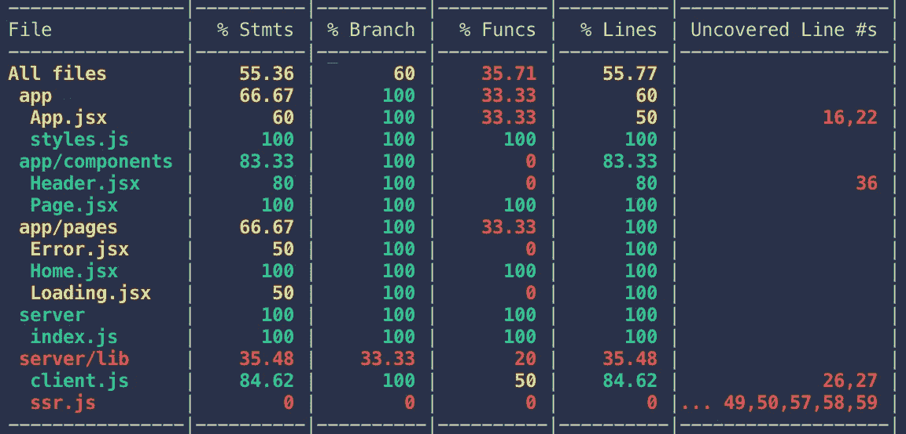

# 强制 Node.js 的代码质量

> 原文：<https://medium.com/hackernoon/enforcing-code-quality-for-node-js-c3b837d7ae17>

## 使用林挺、格式化和带有代码覆盖的单元测试来实施质量标准


Licensed from Adobe Stock Photo

如果你要编写代码并交付生产，代码的高质量是很重要的。

在我的上一篇文章中，我向您展示了如何使用 docker-compose 来利用标准化的、已经存在的 docker 文件进行开发。让我们的应用程序为部署做好准备的下一步是生产它。

我将继续使用我之前教程中的 React/Parcel 示例:[移到 Next.js 和 Webpack 上！](https://hackernoon.com/move-over-next-js-and-webpack-ba367f07545)

下面是源代码:[https://github . com/Patrick let/streaming-SSR-react-styled-components](https://github.com/patrickleet/streaming-ssr-react-styled-components)

我还没有做任何与让应用程序“生产就绪”相关的事情，所以我也将谈谈这需要什么，尽管这可能需要另一篇文章来完成…我们将看到它如何进行。我是即兴创作的。

让我们从一些质量控制开始。

在这篇文章中，我们将探索林挺、格式化、单元测试和代码覆盖率，并实施一些质量标准。

# 林挺和格式

根据维基百科，to " **Lint** ，或 **linter** ，是一种分析源代码以标记编程错误、bug、风格错误和可疑结构的工具。

这意味着它会强制执行一些事情，比如使用空格还是制表符，或者确保您的代码使用分号是否一致。

目前在我的项目中可能有很多林挺错误。

到目前为止，我的目标是演示特定的概念，而过多的关于不同事物的边栏确实会影响手头的概念。因此，我选择放弃林挺，以保持前几篇文章的重点。

现在是时候“生产”我们的应用程序了，质量是重中之重。

我更喜欢的 linter 格式是 [StandardJS](https://standardjs.com/) ，这是一个非常简单的设置。但是在我们设置它之前，让我们也讨论一下格式化。

**格式化**类似于林挺，但更少关注语法错误，更多关注的是让代码看起来更漂亮，因此这个流行的包被命名为`prettier`。

感谢 Github 上几个令人敬畏的开源贡献者，我们可以在一个包中使用它们。感谢[亚当·斯坦凯维奇](http://sheerun.net/)、[肯特·c·多兹](https://medium.com/u/db72389e89d8?source=post_page-----c3b837d7ae17--------------------------------)、[亚当·加勒特-哈里斯](https://github.com/agarrharr)和[伯努瓦·阿威提](https://github.com/BenoitAverty)！

在过去，我写过关于使用 husky 来确保规则在每次提交之前运行。漂亮标准包也建议这样做，所以现在让我们添加漂亮标准、健壮和 lint-staged。

## 配置更漂亮-标准

首先安装所需的软件包:

```
npm i --save-dev prettier-standard husky lint-staged
```

在 **package.json** 中添加以下“格式”脚本和新的“lint-staged”和“husky”部分:

```
{
  //...
  "scripts": {
    // ...
    **"format": "prettier-standard 'app/**/*.js' 'app/**/*.jsx' 'server/**/*.js'"
  },
  "lint-staged": {
    "linters": {
      "**/*.js": [
        "prettier-standard",
        "git add"
      ],
      "**/*.jsx": [
        "prettier-standard",
        "git add"
      ]
    }
  },**
  // ...
}
```

我无法让 RegExp 工作，所以在没有查看源代码的情况下，我假设它使用的是 glob 而不是 RegExp。

现在你可以运行`npm run format`来格式化你的代码并检查林挺错误。此外，每当您尝试提交时，将调用 husky 的`pre-commit`挂钩，这将确保任何暂存文件(`git add`暂存文件)在允许提交之前被正确地链接。

让我们看看我第一遍做得怎么样。

```
➜  npm run format> stream-all-the-things@1.0.0 format /Users/patrick.scottgroup1001.com/dev/patrickleet/open-source-metarepo/stream-all-the-things
> prettier-standard 'app/**/*.js' 'app/**/*.jsx' 'server/**/*.js'app/client.js 52ms
app/imported.js 11ms
app/styles.js 7ms
app/App.jsx 11ms
app/components/Header.jsx 76ms
app/components/Page.jsx 7ms
app/pages/About.jsx 6ms
app/pages/Error.jsx 5ms
app/pages/Home.jsx 6ms
app/pages/Loading.jsx 6ms
server/index.js 8ms
server/lib/client.js 11ms
server/lib/ssr.js 17ms
```

基本上每个文件除了`styles.js`都有林挺错误或者看起来不够漂亮！

## 忽略文件的林挺和格式

有一个小问题是这个项目特有的——`app/imported.js`是一个生成的文件，linter 应该忽略它。

虽然 is 在文件顶端有`eslint-disabled`，但是 prettier 不知道执行林挺规则。别担心，让我们撤销对该文件的更改，然后创建一个`.prettierignore`文件和一个`.eslintignore`文件，以便在以后的运行中显式忽略该文件的格式化。

```
git checkout -- ./app/imported.js
```

将撤消对该文件的更改。

现在用下面的代码行创建`.prettierignore`和`.eslintignore`:

```
app/imported.js
dist
coverage
node_modules
```

现在当运行`npm run format`时，文件`app/imported.js`保持不变。由于文件是生成的，不解决这个问题可能会有问题。

最后，我提到提交也应该作为一个`pre-commit`钩子运行`npm run format`。让我们试一试。

```
➜  git commit -m 'feat: prettier-standard'
husky > pre-commit (node v11.6.0)
  ↓ Stashing changes... [skipped]
    → No partially staged files found...
  ✔ Running linters...
```

下面是 Github 上的提交。

# 单元测试和代码覆盖率

作为生产我们的应用程序的一部分，我们真的应该确保我们的代码是经过充分测试的。理想情况下，你应该这样做，但我是一个坏人，在这个项目中忽略了这一点。

让我们解决这个问题。

## 安装和配置 Jest

首先，让我们安装 Jest 来编写单元测试。

```
npm i --save-dev jest babel-jest
```

接下来，让我们添加一个 jest 配置文件，这样我们就可以配置 jest 来知道在哪里可以找到我们的文件，并且能够使用漂亮的路径。

添加以下`jest.json`文件:

```
{
  "roots": ["<rootDir>/__tests__/unit"],
  "modulePaths": [
    "<rootDir>",
    "/node_modules/"
  ],
  "moduleFileExtensions": [
    "js",
    "jsx"
  ],
  "transform": {
    "^.+\\.jsx?$": "babel-jest"
  },
  "transformIgnorePatterns": ["/node_modules/"],
  "coverageThreshold": {
    "global": {
      "branches": 10,
      "functions": 10,
      "lines": 10,
      "statements": 10
    }
  },
  "collectCoverage": true,
  "collectCoverageFrom" : [
    "**/*.{js,jsx}"
  ]
}
```

好吧，让我们打开它。首先，我们将`roots`设置为`<rootDir>/__tests__/unit`。我喜欢将阶段测试放在`__tests__/staging`中，所以将根设置为`__tests__/unit`将允许我以后这样做。

接下来，我们将`modulePaths`设置为根目录，并将`node_modules`设置为。这样，在我们的测试中，我们可以只导入`app/*`或`server/*`，而不是使用像`../../`这样的相对路径。

接下来的两个键告诉 jest 使用 babel 来加载我们的文件，这样像`import`这样的东西就可以正常工作了。

最后，最后三个部分定义了覆盖率设置——最低阈值，都是 10%,以及从哪里收集覆盖率。在本文中，我的目标只是配置好各个部分。在下一篇文章中，我将把覆盖率阈值增加到 100%,并逐步完成这个过程。

为了运行，我们可以在`package.json`的脚本部分定义一个`test`脚本。因为我们正在使用 babel-jest，所以我们也需要提供一些 babel 设置，所以我们可以将`BABEL_ENV`设置为`test`，我们将在下一节中解决这个问题。

```
"scripts": {
  // ...
  **"test": "cross-env BABEL_ENV=test jest --config jest.json",
  "test:watch": "cross-env BABEL_ENV=test jest --config jest.json --watch"**
}
```

## 用巴别塔配置 Jest

首先，为了让测试工作，我们需要配置一些巴别塔设置。在您的`.babelrc`文件的`env`键中添加以下部分:

```
{
  "env": {
    **"test": {
      "presets":[
        ["@babel/preset-env"],
        ["@babel/preset-react"],
      ],
      "plugins": [
        ["@babel/plugin-syntax-dynamic-import"]
      ]
    },**
    // ...
  }
}
```

让我们安装我们提到的插件和预置:

```
npm i --save-dev @babel/core @babel/preset-env @babel/preset-react @babel/plugin-syntax-dynamic-import babel-jest
```

我们目前的覆盖率为 0%，让我们为应用程序添加一个测试，并为服务器添加一个测试，这将使我们超过 10%的低阈值。

## 用 Enzyme 测试客户端应用

首先，我们来测试一下`app`中的一个文件。我们将希望在应用程序中浅层渲染我们的组件来测试它们。为此，我们将使用`enzyme`。

```
npm i --save-dev enzyme enzyme-adapter-react-16
```

Enzyme 有一个设置步骤，我们必须在测试中使用它之前添加这个步骤。在我们的`jest.json`文件中，添加一个新的键:

```
{
//other settings
"setupTestFrameworkScriptFile": "<rootDir>/__tests__/setup.js"
}
```

以及`__tests__/unit/setup.js`处的设置文件:

```
import { configure } from 'enzyme';
import Adapter from 'enzyme-adapter-react-16';configure({ adapter: new Adapter() });
```

现在配置好酶，我们可以创建`__tests__/unit/app/pages/Home.jsx`:

```
import React from 'react'
import { shallow } from 'enzyme'
import Home from 'app/pages/Home.jsx'describe('app/pages/Home.jsx', () => {
  it('renders style component', () => {
    expect(Home).toBeDefined()
    const tree = shallow(<Home />)
    expect(tree.find('Page')).toBeDefined()
    expect(tree.find('Helmet').find('title').text()).toEqual('Home Page')
    expect(tree.find('div').text()).toEqual('Follow me at [@patrickleet](http://twitter.com/patrickleet)')
    expect(tree.find('div').find('a').text()).toEqual('[@patrickleet](http://twitter.com/patrickleet)')
  })
})
```

似乎我们的组件只是一个单一的功能，这就是我们需要达到这个文件 100%的覆盖率。

## 服务器端测试

为了更好地衡量，让我们也创建一个服务器端测试。

我想测试`server/index.js`，但在此之前，有几个重构会让我们的生活变得稍微轻松一些。

单元测试意味着测试单个单元。这意味着即使我们的应用程序使用 express，我们也不会在单元测试中测试 express。我们正在测试我们的服务器是否配置了适当的路由、中间件，以及是否调用了 listen 来启动服务器。express 的单元测试属于 express 项目。

为了只测试我们关心的单个单元，我们可以使用 mocking 来创建轻量级接口，我们可以使用`jest.mock`来跟踪这些接口。如果我们将服务器实例从索引中提取到它自己的文件中，我们将能够更容易地模拟服务器。

创建包含以下内容的文件`server/lib/server.js`:

```
import express from 'express'export const server = express()
export const serveStatic = express.static
```

还有更新`server/index.js`像这样:

```
import path from 'path'
import log from 'llog'
**import { server, serveStatic } from './lib/server'**
import ssr from './lib/ssr'// Expose the public directory as /dist and point to the browser version
**server**.use(
  '/dist/client',
  **serveStatic**(path.resolve(process.cwd(), 'dist', 'client'))
)// Anything unresolved is serving the application and let
// react-router do the routing!
**server**.get('/*', ssr)// Check for PORT environment variable, otherwise fallback on Parcel default port
const port = process.env.PORT || 1234
**server**.listen(port, () => {
  log.info(`Listening on port ${port}...`)
})
```

现在在我们的测试中，我们可以简单地模仿`server/lib/server.js`，而不是更复杂的模仿`express`。

让我们在`__tests__/unit/server/index.js`创建测试:

```
import 'server/index'jest.mock('llog')
jest.mock('server/lib/server', () => ({
  server: {
    use: jest.fn(),
    get: jest.fn(),
    listen: jest.fn()
  },
  serveStatic: jest.fn(() => "static/path")
}))
jest.mock('server/lib/ssr')describe('server/index.js', () => {
  it('main', () => {
    const { server, serveStatic } = require('server/lib/server')
    expect(server.use).toBeCalledWith('/dist/client', "static/path")
   expect(serveStatic).toBeCalledWith(`${process.cwd()}/dist/client`)
    expect(server.get).toBeCalledWith('/*', expect.any(Function))
    expect(server.listen).toBeCalledWith(1234, expect.any(Function))
  })
})
```

如果我们现在运行覆盖率，我们会注意到`server/index.js`的覆盖率不是 100%。我们有一个匿名函数传递给 listen，这个函数很难获取。这需要一些小的重构。

重构 listen 调用以提取匿名函数。

```
export const onListen = port => () => {
  log.info(`Listening on port ${port}...`)
}
server.listen(port, onListen(port))
```

现在我们可以轻松测试`onListen`。

让我们向我们的`server/index.js`套件添加另一个测试来解释它。

```
import **{ onListen } from** 'server/index'// ...describe('server/index.js', () => {
  // ... **it('onListen', () => {
    const log = require('llog')
    onListen(4000)()
    expect(log.info).toBeCalledWith('Listening on port 4000...')
  })**
})
```

有了这些，我们对`server/index.js`和`app/pages/Home.jsx`有了 100%的覆盖率。

通过我们的两次测试，我们成功地将覆盖率从 0%提高到了 35–60 %,具体取决于指标:



Current Coverage

## 向预提交挂钩添加测试

最后，我们只希望确保测试作为一个预提交挂钩，以防止中断的测试进入代码，以及以后任何未测试的代码。

在`package.json`中，将`pre-commit`改为:

```
"pre-commit": "lint-staged && npm run test"
```

现在，当有人试图提交项目时，它将强制执行 Jest 配置中定义的覆盖标准，并确保所有测试都通过！

# 结论

当您的应用程序生产准备就绪时，以自动化的方式执行质量标准是非常必要的。在本文中，我向您展示了如何设置和配置林挺工具和格式化您的代码，以及如何配置您的项目，以便使用 enzyme 和 jest 进行测试和强制代码覆盖。

在下一部分中，我们将在继续创建生产就绪 Dockerfile 文件之前将覆盖率提高到 100%。

和往常一样，如果你觉得这很有帮助，请点击并按住拍手按钮，最多拍 50 次，跟我来，并与他人分享！

最好，
[李雅达·斯科特](https://twitter.com/pat_scott)

查看本系列的其他文章！这是第三部分。

[](https://hackernoon.com/move-over-next-js-and-webpack-ba367f07545) [## 第 1 部分:讨论 Next.js 和 Webpack🤯

### 简单流服务器端渲染(SSR)反应+样式-组件与包裹

hackernoon.com](https://hackernoon.com/move-over-next-js-and-webpack-ba367f07545) [](https://hackernoon.com/a-better-way-to-develop-node-js-with-docker-cd29d3a0093) [## 第 2 部分:用 Docker 开发 Node.js 的更好方法

### 并保持您的热代码重载

hackernoon.com](https://hackernoon.com/a-better-way-to-develop-node-js-with-docker-cd29d3a0093) [](https://hackernoon.com/the-100-code-coverage-myth-900b83d20d3d) [## 第 4 部分:100%代码覆盖率的神话

### 现在互联网上有很多建议说 100%的覆盖率不是一个有价值的目标。是吗？

hackernoon.com](https://hackernoon.com/the-100-code-coverage-myth-900b83d20d3d) [](https://hackernoon.com/a-tale-of-two-docker-multi-stage-build-layers-85348a409c84) [## 第 5 部分:两层(Docker 多阶段构建)的故事

### Node.js 的生产就绪 docker 文件

hackernoon.com](https://hackernoon.com/a-tale-of-two-docker-multi-stage-build-layers-85348a409c84)