# 吸引人的产品设计

> 原文：<https://medium.com/hackernoon/engaging-product-design-588ad9f84bcb>

## 构建产品故事

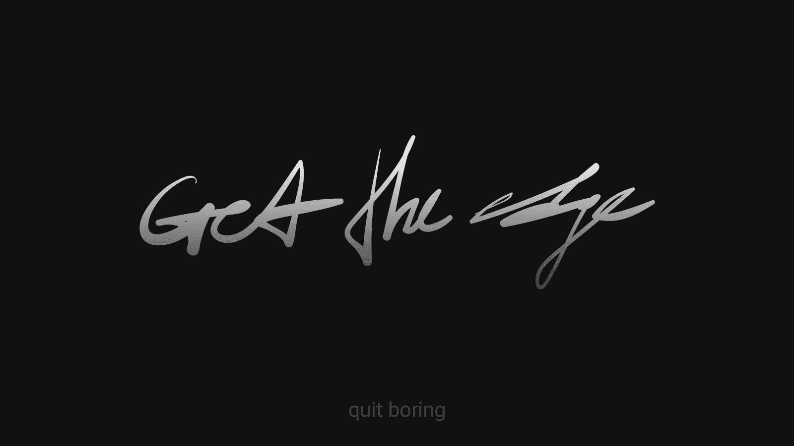

Get the edge. Quit boring.

# 关于作者

> Pavel Pekanov 是一位经验丰富的创意总监、艺术总监和设计师*(也是一名开发人员，但 tss-s 没有告诉任何人)。*2004 年开始创作生涯，随后于 2008 年成立了自己的创作公司。2013 年在 Upwork(前 Elance)上被评为收入最高的自由职业者。创办了几个自己的公司。CSS 设计奖上的特写。QUOINE 的前创意总监。Pavel 在品牌、产品设计、用户界面/UX 和品牌体验方面帮助初创公司、创始人和运营良好的企业超过 14 年。
> 
> 个人网站:【pekanov.com 

# 是什么造就了产品？

让我们从一个令人大开眼界的例子开始——你甚至可能手头都没有产品。你可能有一个服务，一个应用程序，一个网站。拥有一个产品不同于仅仅拥有一个网站。

> 价值+团队+ UX +社区=产品。

我列出了一个清单，基于一些代价高昂的错误、我的大量设计和创业实践(联合创始人/创始人)。

**[]价值主张。**产品带来价值。

****拥有共同目标的团队。除了你一个人，还得有人相信你的产品。****

****[]用户体验。**与产品互动是有意义的。**

****[]社区。除了你的朋友和家人之外，还需要有人支持你的产品。****

**你的产品必须检查所有这些。**

# **选择合适的时间**

**我们沿着产品的生命周期逐步改进产品。当我们这样做的时候，我们遇到了两个决定性的里程碑，它们改变了我们的视角、方向和期望。**

## **1.实现市场契合**

**MVP 的成功或失败。您仍在测试概念，但您已经发现了销售功能。**你的产品正在与早期用户建立牢固的关系。****

**重点:产品。**

## **2.建立关系**

**这是一个对比鲜明的里程碑，因为需要几个月到几年才能到达那里。从技术上来说，你已经有了一个脱离社区的可靠产品。它缺乏情商。**贵公司正着手用公司愿景塑造产品。****

**重点:公司。**

> **一些产品从一开始就用大图、使命和公司愿景来塑造自己。结果是异常的，就像运输它们所需的时间和精力一样。很少有企业能玩这么久。**

**这两者之间的区别并不微妙。关注和期望也是如此。**

# **焦点五期望**

**我见过很多公司在拥有可行的产品和实现市场适应之前就试图引导他们的愿景。见鬼，我是用我自己的项目做的！这本身可能不是一个错误，但它消耗了创造力、情感和财力。**

**我们仍然处于无人问津的状态。我们在这里，他们在这里，我们之间是一个冷酷的无底洞。**

> **没有合适的市场就等于没有社区。没有一个产品社区，你就把你的视野引向了深渊。**

**我也看到许多团队充满激情、孜孜不倦地改进他们的技术。他们重构代码，解决瓶颈，提高平台性能，引入新的数据库架构，等等。很少或根本不考虑他们的产品品牌。这是一大禁忌。**

**你的技术人员可能会取得奇迹般的胜利(Nginx 的例子)。这可能会发生在运气和多年的奉献上。你愿意赌运气，花上几年时间去做一些结果可能不那么好的事情吗？**

> **我告诉你忘记技术，专注于你的品牌。**

**我经历过硬币的两面，我开始欣赏的是产品开始获得动力的那一刻。这是时候提高标准，明白一个简单的事实了——**技术不是国王。****

**是的，你的技术带你去了那里。但是环境在变，环境在变，你的工程师也不是万能的。少关注技术本身，你的产品可能会更好。**

**我是说我自己有工程师/开发人员的背景。我喜欢将 API 的延迟从 10ms 提高到 1ms，尽管没有人会注意到这种改进。我知道这很酷，这是一种内部竞争。让我们就此打住——改进技术是一场与自己的赛跑。相反，后退一步。**

**让我重复我自己的话——**技术不是国王。**技术不是推动产品发展的不可阻挡的力量，也不应该是。连一个*单个*力都算不上。**

> **“驱动力”是产品背后的角色(基础团队)、公司愿景和 CEO 的立场。一旦你的产品被认可，是时候去做了。**

**除非。**

> **除非你向太空发射火箭。在这种情况下，忘记你到目前为止读到的一切，请上帝关注技术。**

**你在为人们制造产品。人们期望什么？更好的体验。**

# **产品再评估**

**在过去的几年里，我做了相当多的重新设计。我经历过不同的产品阶段，我非常喜欢重新设计。我认为自己是一个经验丰富的专业人士，能够为任何类型的产品提供最佳设计。**

> **我那些年所做的工作现在看起来充其量只是粗略的。**

**我要带着它去哪里？**

**我相信公司的愿景和价值观、使命宣言、团队背后的人、社区的声音——所有这些应该结合在一起，形成一个更好的产品，然后*可以被称为真正的重新设计。值得骄傲的事情。***

***数据也在那里——漏斗、跳出率、用户旅程点击率、ltv——这些数据我们在开始时没有。它对开发更好的 UX、用户界面、构建更高水平的产品体验以及简单地做更好的整体设计有很大的帮助。***

***有趣的是，分析改进了设计，直到它真的改进了。拥有可靠的数据有助于您发现(或可靠地解释):***

*   *****弹跳。**衡量某件事是否已经坏得无法修复的首要指标。一个足够高的反弹率可以给任何企业带来致命一击。***
*   *****破碎的任务流。**一个中断的任务流意味着你的用户根本没有达到目标。例如，他们无法到达最后的注册步骤，因此他们无法创建帐户。糟透了。***
*   *****断了用户流量。**用户迷失方向，永远无法完成流量，跳流量，你说吧。换句话说，有一个*凸起。****
*   *****破碎的用户旅程。用户并没有按照设计的方式前进。换句话说，一个设计缺陷——你的产品没有按照预期的方式使用。可以是*“不是 bug，是特性”，*虽然很少。*****

# ***理解原因***

***为什么要重新设计一个没坏的东西？你看到了改进的空间，你就采取行动。如果你的产品可以变得更好，你让它发生。就这么简单。***

1.  *****支点。你的产品销售特色是另一回事。*****
2.  *****转换。你的产品没有改变人们。*****
3.  *****影响。你的产品很无聊。*****
4.  *****故事。**你的产品是无菌的。***

# ***构建故事***

***你开始重新设计，首先 1)确定原因，2)评估产品指标，3)了解产品的发展方向。***

***这些是重新设计的先决条件。以下是四个高层次的支柱，它们是伟大的重新设计的基础。***

## ***1.有很好的标识***

***你的产品必须有一个伟大的标志。伟大的标志看起来很好，他们讲述一个故事，他们脱颖而出。他们让人们对你的产品感到好奇。***

***你的产品故事从标志开始，你的公司愿景也是如此。一个好的标志传达了你最深刻的信息，而不需要你去解释。***

***你应该追求具有巨大营销潜力的标志，并有能力提供一个强大的开放自己。***

***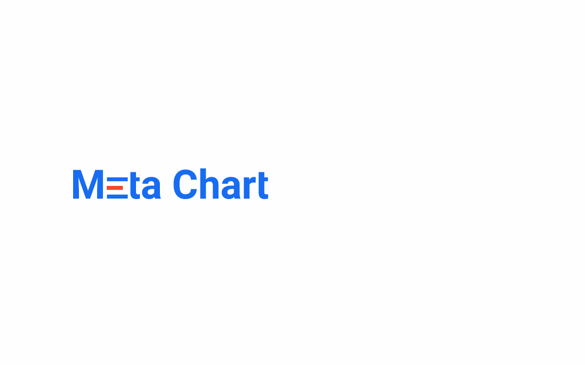***

***The most popular chart types visualized in the logo animation. The emphasis is put on the Product, features and services.***

***图表创建平台标识讲述了一个创建图表的故事。简单、直接、赏心悦目。***

*********

The logotype is supported by various animations that can be used on the website (or in app) to further solidify the Product Experience.*** 

***这是一个非常不同的讲故事的例子:***

***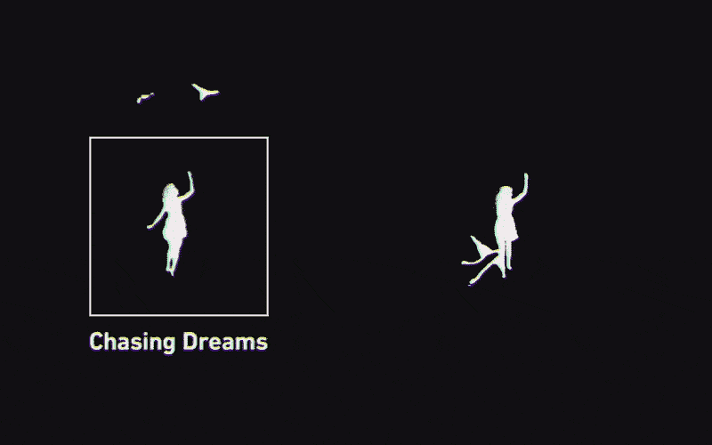***

***Flying kite, a couple of seagulls and running into the sunset to chase the dream. The emphasis is put on the Product vision, company mission and Product expectations.***

***游戏开发和出版工作室通过迷人的标识动画来传达他们的公司愿景。这是一个故事中的故事，一个梦中的梦。***

***开篇是一个女孩追着自己的风筝变成海鸥的故事。比喻*“追梦”。****

***结尾的故事是在最后几帧讲述的——海鸥离开盒子。*“跳出框框思考”*的信息随着他们飞出框框的轮廓而传递，而女孩则一直盯着*【前】*风筝。***

***标识是产品故事的完美切入点。我们使用徽标来传递各种信息:***

*   *****产品愿景。我们这样做是为了从太空海盗手中拯救地球。*****
*   *****公司愿景和使命。让地球成为一个更安全的星球。*****
*   *****期望。**儿童友好，简单易用，功能单一。***
*   *****创新。**扁、细、红色。提供颜色选择。***
*   *****服务介绍。你按下一个按钮，一切都没了。*****
*   *****公司价值观介绍。被保护的空间是安全的空间。*****
*   *****产品介绍。**一种多用途的袖珍装置。***

> ***你的标识就是你的故事。最好的标识推动了整个公司的故事，更不用说产品本身了。***

*****2。第一印象*****

***第一印象自然是通过产品登陆页面或公司网站建立起来的，通常是前者，在那里你会遇到你未来的客户。***

***会见顾客从“嗨”开始，然后提出建议，号召行动。***

***您最有可能最终使用的几个经过验证的 CTA:***

*   ***注册开始使用该产品。***
*   ***尝试一个产品演示。***
*   *****订阅**提前获取产品。***

***值得一提的是，最后一个 CTA 主要在测试概念时使用，即*当你根本没有任何产品的时候。记住这一点，不要辜负客户的信任。****

***一旦你决定使用 CTA，你就应该决定登陆页面的方法。你打算在那里展示什么？你的产品，你的团队，还是两者都有？感觉是友好的欢迎，还是推销？***

***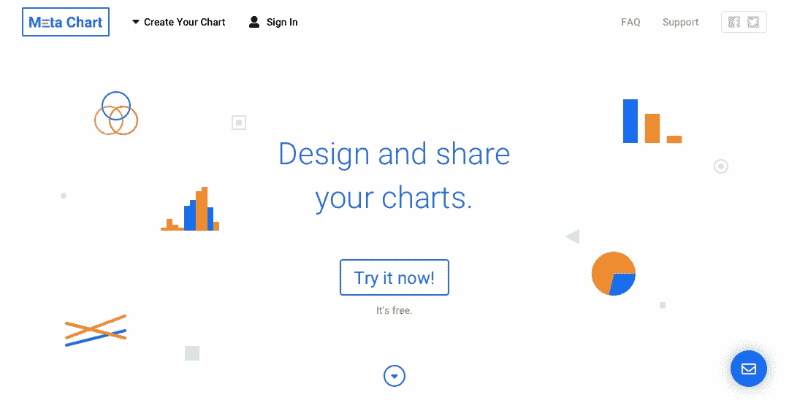***

***The above the fold for online charting platform. It doesn’t show the Product or the team, but instead it builds up the Product connection with showing essential charts icons. Clean Product message and a visible CTA to try the actual Product right away. Everything about the Product, pricing plans, features, etc — that goes below the fold.***

***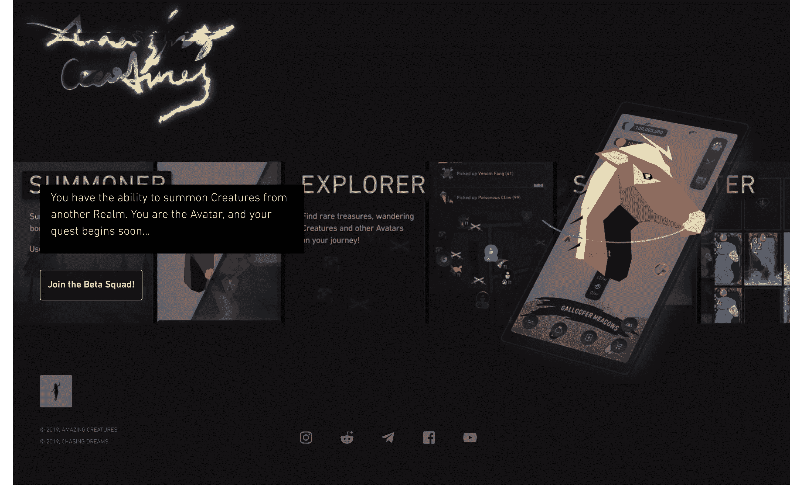***

***A very different example, a mobile game. The landing page builds a connection with the Product by showing the actual game, game art and concept. The right-hand visual is fully animated, using the very animations one would see in the game. This one-pager delivers the end-product feel.***

> ***登陆页面的圣杯总是关于展示产品。***

***然而，我们现在进入了人性化设计的时代。以人为本的设计就是要与产品建立关系，建立独特的公司体验，并找到与客户的正确情感联系。***

***提前展示产品可能没有你想象的那么有效。***

> ***一般来说，人们对产品不太感兴趣，因为他们关心的是某个特定产品能给他们的生活带来的变化。***

## ***3.注册时销售***

***这是我最喜欢的支柱之一，因为它是最容易被忽视的一个。***

***你会在注册流程中戏弄你的产品吗？你向你的团队成员展示了吗？你的 CEO 会发自内心地欢迎你吗？***

***通常，注册页面是一个简单的表格，上面有你的名字、电子邮件、密码，或者你可以完全绕过它，注册脸书或推特。注册流程的唯一目的是获取您的凭证。***

*****这听起来绝对不像是你在充分利用这种流动的潜力。*****

***想象一下，你看到一个非常有前途的产品，于是你有了创建账户的冲动。你想了解更多关于产品的信息吗？你想了解它背后的人吗？***

> ***你想知道并看看这个产品对像你一样的人来说有多棒吗？***

***当然，你会的！这就是你在顾客和产品价值之间建立联系的时刻。它是感性的，它是强烈的。这是你的客户与公司愿景和使命建立联系的时间点。***

***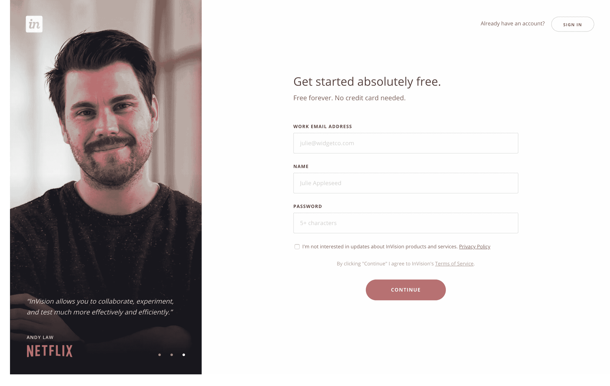***

***Absolutely stunning InVision’s approach to delivering their existing Customers Stories and hooking you up early with their Product. It’s all about building trust and positive experience, and they nailed it.***

***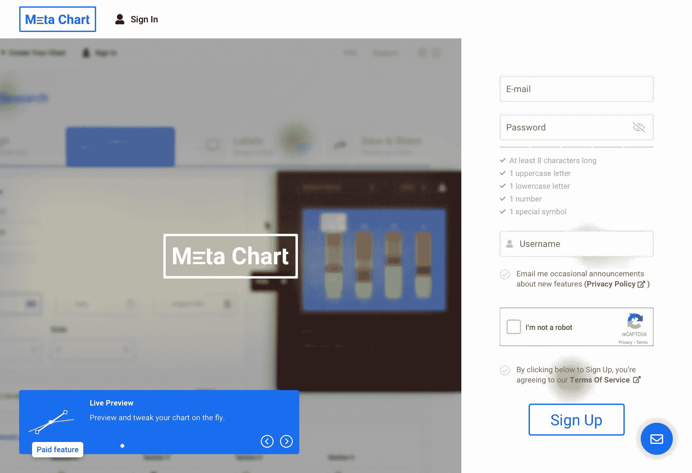***

***Core Product video tour at Sign Up page. Keeping the tour on-point and fast-paced ensures the customer stays here and isn’t too distracted from filling in the actual Sign Up form. Paid features are discovered early on — a transparent, healthy and trustworthy Product relationship.***

***注册时销售并不意味着是实际的“销售”。以不同的方式销售。出售你的愿景，出售大局。有时候，只需要这么一点点就能把顾客转化成产品粉丝。***

## ***4.始终在船上***

***好吧，这和我的另一个观点相吻合——一个好的产品需要解释。事实上，产品越好，可能就越需要解释。***

***我的意思是，产品背后有一个伟大的故事，许多有用的功能，各种相互关联的服务——这应该以某种方式解释，对不对？除非你给你的潜在客户提供一份挖掘所有这些信息的日常工作。***

***我说的解释并不是指大量的常见问题解答、教程、旅游等等。相反，你应该始终吸引客户。参与是好玩的，参与是有趣的，而且感觉更自然(就像人类的对话)。***

***那么，登机是怎么回事？这应该是一个快速的游戏般的体验，快速连续完成几个步骤，一次闲聊。在入职培训结束时获得奖励也不是什么坏事。把它游戏化。***

***入职培训让您有机会更好地了解您的客户，并简化相关流程。启动流程简化了实际的产品体验，让您的客户体验更加有趣。***

> ***登机流程是您和您的客户之间的友好聊天。你忘记告诉他们什么了吗？你需要知道他们的名字吗？在登机流程中这样做。简化其余部分，创造积极的客户体验。***

***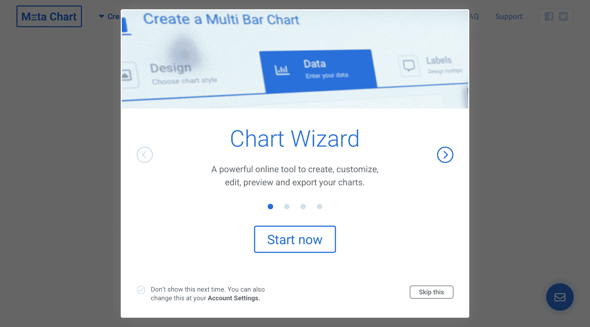***

***Going over the Product features one more time, in case our customers signed up in a hurry.***

***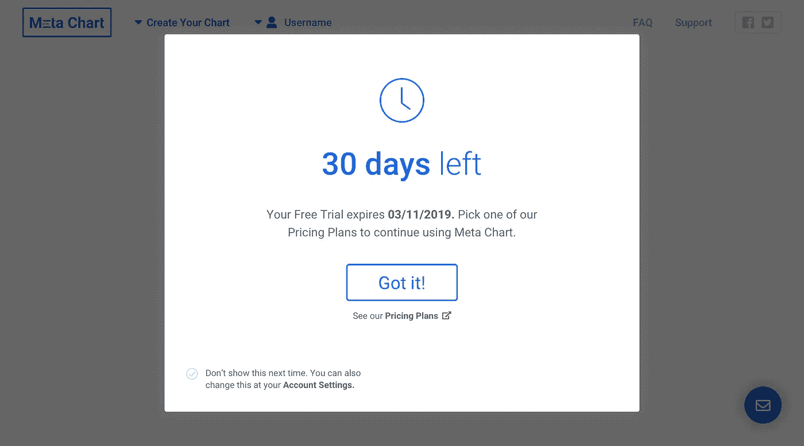***

***On-board trial users and try to convert them right then and there.***

***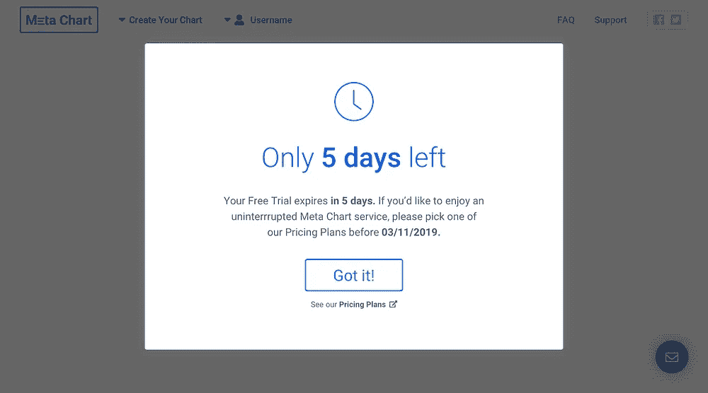******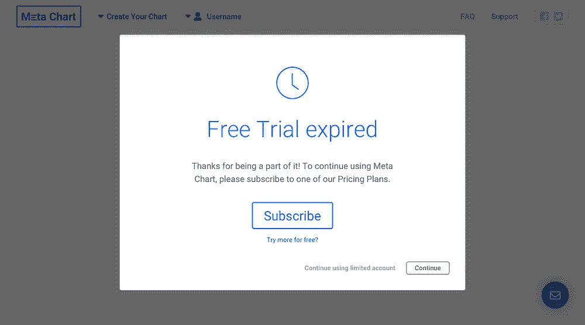***

***Different scenarios require different approaches.***

***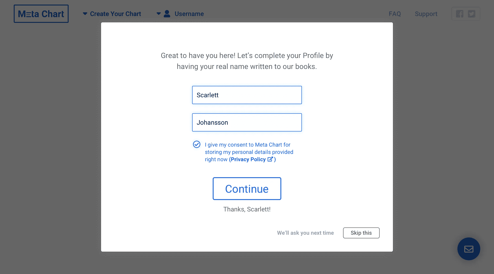***

***Simplifying the Sign Up flow means moving personal data entry to one of the optional On-Boarding screens.***

# ***注意最后一局***

***最后，你应该注意你努力的最终结果。***

***我怎么强调选择正确的重新设计方法和选择正确的重新设计目标的重要性都不为过。一旦做出决定，我们就不能改变，也不能不冒不必要地消耗大量资源的风险。***

***有不同的重新设计方法可供选择，这取决于您所追求的改进类型:***

*   *****转化和销售。**重新设计围绕用户界面和 UX，与任务流和用户流一起工作。我们可能会重新思考用户之旅，尽管这通常意味着有点超出范围。目标是增加注册和销售数量，降低每用户购买成本。***
*   *****入职和留职。**重新设计围绕 UX 和用户之旅展开。我们甚至可以创建新的用户流来消除发现的瓶颈。目标是提高平均成绩。会话时间和减少的支持请求数量。***
*   *****五官端正。**重新设计围绕用户界面和 UX，与任务流和用户流一起工作。目标是拥有一个具有新特性的产品 2.0。***
*   *****以产品为中心的故事(功能、团队、路线图)。*****
*   *****以公司为中心的故事(愿景、使命、领导力)。*****

# ***未完待续？***

***如果你想了解更多关于公司体验、衡量和跟踪它的方法、改善和设计优秀公司体验的方法，请留下你的评论。我错过什么了吗？请在评论中告诉我。***

# ***你在追求最好的公司体验吗？***

***如果你在追求你的客户所能拥有的最好的公司体验，或者如果你在追求终极的产品体验，我很想听听你的意见。给我发封邮件。***