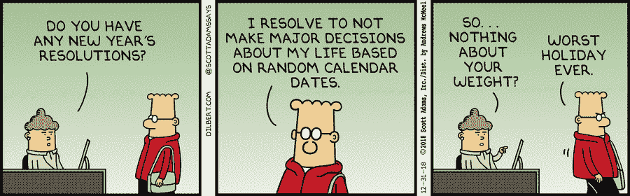
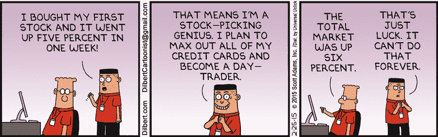
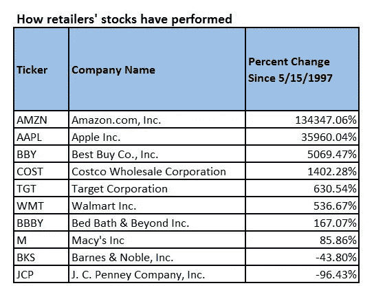
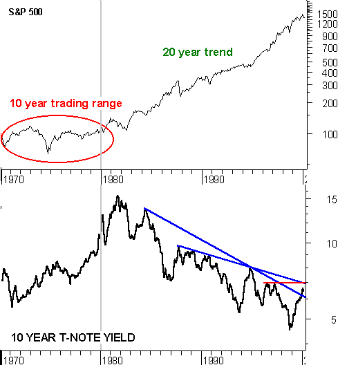
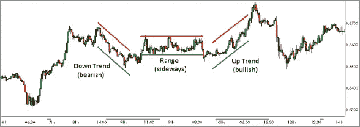
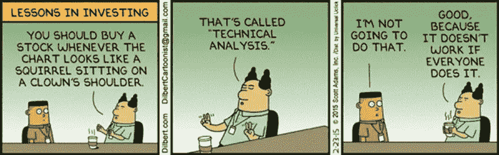
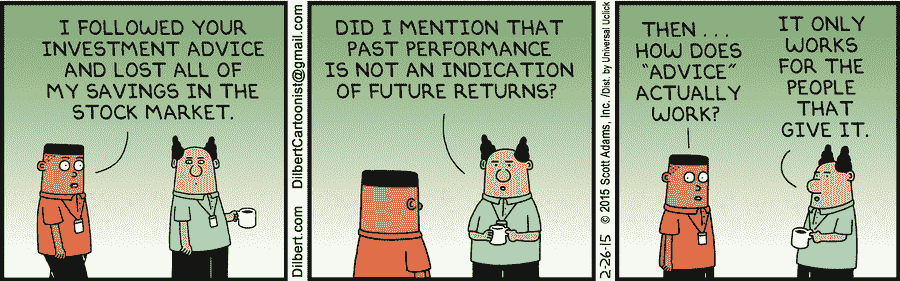
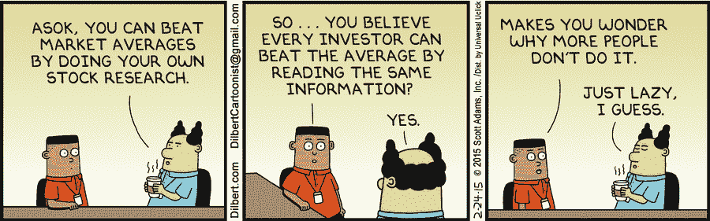
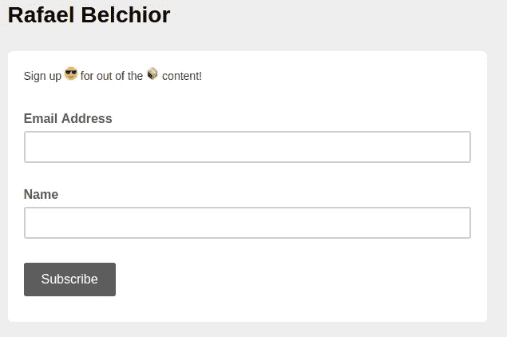

# 为什么大家都要投资(注意，工程师们)

> 原文：<https://medium.com/hackernoon/engineer-invest-2019-ac0794469c31>

由于我们刚刚开始 2019 年，🎉我们又有了一个绝佳的机会来审视我们的生活、机遇、价值观和期望。

Source: [https://dilbert.com/strip/2018-12-31](https://dilbert.com/strip/2018-12-31)

尽管我是一个技术迷( [DevOps](https://hackernoon.com/devops101-how-to-provide-infrastructure-to-your-startup-in-6-easy-steps-563b53e77281) 、[区块链](https://hackernoon.com/blockchain-for-students-101-the-basics-part-1-f39b8201a7d5))，但我的道路向我展示了几种接近生活的方式和我所获得的知识。在某个时候，我注意到我们大学的教授没有教一些东西，这些东西会让我们成为更独立的人。钱。特别是，我变得对投资世界非常感兴趣，因为它允许你用钱来赚钱。如果你不投资你的钱，它永远不会增加。你可能会花钱、送人或存钱(可能会在短期内花掉)。**现在，你可能会问自己**:

我们为什么要关心投资和金钱？有哪些机会？我们不应该只是省钱吗？怎么开始好？如何避免被假古鲁诈骗？我们应该意识到的大局是什么？难道我们不应该把自己局限在对这个美丽宇宙的秘密奥秘的观察上吗？🌌

好吧，为什么每个人，尤其是工程师，都应该在 2019 年投资的原因考虑到了所有这些甚至更多。

相信大家都应该明白钱是怎么运作的，为了不被控制。建立财务独立是构建你生活的一个很好的方式，它会给你提供实现梦想的自由。这些梦想可能是建立你的项目，旅行，或教学，仅举几例。如果你有一份低但稳定的被动收入，你将有时间关注重要的事情。如何实现这一点？要做到这一点，你必须知道钱是如何运作的。有很多解决这个问题的好的起点。查看本文末尾的一些参考资料。

理论上，工程师能够有趣地处理投资。首先，工程师倾向于有条不紊地、有逻辑地处理问题。我们想直奔主题；我们不想去读一本 600 页的书，去核实最后只有 50 页是关于投资的。第二，工程师可能认为他们可以选择股票(举例来说)，因为他们习惯于观察那些具有智能和正确理解的系统，这些系统可以被操纵为对他们有利。虽然这可能是一个好主意，有时也会奏效，但要小心:市场会自我修正，可能会出现不可预测的行为。此外，熟悉编程的工程师还有一个额外的优势:他们可以创建自己的工具来实现他们应对市场的方式。

# 介绍谈够了，言归正传。

赚钱最安全的方法之一是投资金融产品，例如股票。股票是介绍和接近这一主题的最佳方式。

Source: [https://dilbert.com/strip/2015-02-25](https://dilbert.com/strip/2015-02-25)

在我看来，最难的是第一次进入股市。基本指导所需的开销是相当大的，这足以打击大多数想投资但从未进一步投资的人的士气。有很多“借口”:“我太年轻”、“我没有很多钱”、“市场不健康”等等。最后一个是一个好理由，而其他的就没那么好了。你越早开始投资(一开始投资金额越小越好)，你就越早开始直接了解它是如何运作的。如果你还没有开始，2019 年是这样做的合适的一年。如果你有一个长期的观点，由经纪人提供的模拟账户不会很好，因为人们过去常常忽略一个重要的事实:

> 驱动市场(尤其是股市)的是人的情感，而不是逻辑。

😨!

当你使用模拟账户时，你不是在投资自己的钱，因此，你可能不会像在真实情况下那样行动。这就是为什么我相信你应该尽快进入市场，即使你缺乏知识。你不仅会了解市场，还会了解作为投资者的自己。第一天你就开始获得实践经验。这很重要。

如果你的目标是长期游戏，我相信你应该尽快开始。首先，你需要学习基础知识。记住，你能做的最好的投资是:

> 你自己。投资知识。学习。购买你认为值得你花费金钱、时间和精力的书籍和课程。

学完基础知识后，慢慢进入市场是必不可少的，以获得宝贵的经验。之后，你可以找一个导师，巩固你的知识，建立一个投资的框架(主要是你的做事方式)。

# 问与答(Question and Answer)📈

**我应该投资什么？**

这个问题很难在这篇文章中充分涉及。在这篇文章中，我们将把重点放在股票市场的基础上，因为它是一种稳定的和统计上安全的获取回报的方式。

请记住，你不一定要投资股票，甚至传统的金融产品(如股票、债券、外汇、存款、债券)。你还有其他形式的投资，比如加密货币和房地产。它们是合适的、有风险的还是好的选择？我们将在另一篇文章中讨论这个问题。

**什么是股票？**

公司将他们的财产和金融资本分成股票。股票是代表这种财产的所有权。当你拥有一只股票时，你就拥有了公司的一部分。一些公司如苹果和谷歌的股票可以在一个交易所交易。任何想买的人都可以通过银行或经纪人买到。

股票是如何交易的？

通过经纪人或银行，人们下卖出或买入订单。当卖出值等于买入值时，匹配就发生了。因此，交易发生了。最后一次出售的价格就是股票的价格。

股票的价格是由什么决定的？

公司发行股票，因此对其初始价格有重大影响。之后，最后一笔交易的价值就是股票报价或估值。股票报价在交易期间会有变化。供求关系决定了它的价格。

**我应该投资多少？**

我建议你逐步投资收入的 10%-20%，即使不是很多。这个问题提到了一个非常著名的投资原则:首先支付自己。

让我们假设你是一名刚毕业的大学生，住在里斯本。你的收入是 1000 美元。你决定拿走总数的 10%，100 美元。500 美元很快就消失在房租、食物和交通费用中。你还有 400 美元可以存或花。下个月，你做同样的事情。在一年内，你会有 1200 美元的投资，而不会牺牲你的生活方式。

不要投资，你输不起。投资不是赌博，但有些情况是我们控制不了的。你不仅能准确预测一切。

**如何用股票赚钱？**

通过利用股票价格的变化，人们可以通过低价买入并高价卖出来赚钱。请记住，经纪人对买卖订单收取佣金。

股票价格如何变化？

如果一家公司表现良好(声誉好，利润高)，投资者就会看好它并购买股票。如果更多的人购买股票，需求就会上升，价格也会随之上涨。相反，如果一家公司表现不佳，更多的人可能会出售他们的股票，使其价值下降。

如果购买少量低价值股票，佣金会增加一笔可观的开销(很难用利润来支付佣金)。

**公司价值与发行的股票有什么关系？**

公司价值由股票价值乘以公司发行的股票总数得出。因此，直接比较一种商品的价格是没有意义的，而是比较一家公司的市值。

股票的价值在首次公开发行时是固定的。之后就由供求关系决定了。

**如何选择合适的公司进行投资？**

首先，你要投资公司，不要只投资一家公司。投资组合中的一个关键因素是多样化。多元化的投资组合更加稳健，在压力下反应更快。

简单地说，作为第一种方法，价值更高的公司是那些利润更高、平衡最好的公司。但这往往是不够的。

一个理性的投资者会根据公司的状况和指标进行事前评估(在以后的文章中讨论)。像沃伦·巴菲特这样的投资者大多投资于蓝筹公司或他认为长期表现良好的公司(例如 10 年)。换句话说，对他来说，股市关乎耐心，知道你买的是什么，并着眼于长远。

对我来说，这是一个特别有用的方法，因为你不必担心你的股票一天中每一秒钟的表现。你从一家你知道是好公司的公司购买股票。你等着。你会得到正收益。教学是购买安全的股票。你应该把你的大部分资金投资到这类公司。

冒险有错吗？

投资股票可能有风险，就像生活中的所有事情一样。没有金融教育和良好的信息来源，投资并不比赌博好。一个理性的投资者理解这个系统。最终，投资就是要利用现有信息，将风险最小化，同时将回报最大化。

更大的风险往往伴随着更大的回报。[如果你投资一家初创公司，它很可能会失败](https://www.forbes.com/sites/neilpatel/2015/01/16/90-of-startups-will-fail-heres-what-you-need-to-know-about-the-10/)，但如果你选择 10%的公司，你可能会获得相当可观的结果。例如，亚马逊:

如果你在 1997 年投资 1000 美元，到 2017 年，你会有大约 50 万美元。

Source: [https://www.pinterest.pt/pin/8936899244240004](https://www.pinterest.pt/pin/8936899244240004)

很神奇，对吧？当然这个游戏和耐心有很大关系。这种回报是在大约 20 年的等待之后给出的。以下是一些有趣的场景:

Source: [https://www.cnbc.com/2018/08/31/if-you-put-1000-dollars-in-amazon-in-1997-heres-how-much-youd-have-now.html](https://www.cnbc.com/2018/08/31/if-you-put-1000-dollars-in-amazon-in-1997-heres-how-much-youd-have-now.html)

你可能选了十家公司。这九家公司都有可能破产。但是如果你选择了亚马逊，你仍然会有不错的收益。

从一个简单的角度来看，销售最多、回报较高、被动程度较低的公司是最有价值的。

**如何预测给定公司股票的未来价值？**

通过分析一家公司的趋势，你可能会得到它的发展方向的提示。分析股票的方法主要有两种:技术分析和基本面分析。

基本面分析技术包括分析一些被称为“基本面”的公司指标这些基本面可以是定量的，如利润和每股收益价格，也可以是定性的。定性指标包括与公司分析、行业分析、宏观经济指标和未来利润前景相关的方面。

Example of fundamental analysis. Source: [https://stockcharts.com/school/doku.php?id=chart_school:overview:fundamental_analysis](https://stockcharts.com/school/doku.php?id=chart_school:overview:fundamental_analysis)

技术分析技术认为，研究股票过去的交易活动和价格变化是预测其未来价格的更好方法。技术交易用相对强弱指数(RSI)和移动平均线(MACD)等指标分析短期价格变动。

Example of technical analysis. Source: [https://www.forex.com/en-us/education/education-themes/technical-analysis/understanding-technical-analysis/](https://www.forex.com/en-us/education/education-themes/technical-analysis/understanding-technical-analysis/)

**基本面分析&技术分析**

基本面分析研究企业的内在价值，也考虑宏观经济因素，而技术分析则分析过去的市场表现。一般来说，技术人员通常是短线交易者，而基本面分析者通常着眼于长期。

因此，基本面分析意味着在更长的时间内战略性地应用。没有低风险的快速赚钱者。技术分析通过避免高买低卖，使交易者在正确的时刻做出正确的行动。

这可能是一个好主意，从两个角度进行教学。有了这两者，你可以根据一家公司的基本面建仓，同时避免买入被高估的股票。当然，有时候💩会发生。

Source: [https://gotmoneygothoney.blogspot.com/2015/03/technical-vs-fundamental-analysis.html](https://gotmoneygothoney.blogspot.com/2015/03/technical-vs-fundamental-analysis.html)

**如何防止损失？**

有多种方法可以防止损失，或者换句话说，加强你的投资组合。为了简单起见，我向您提供一个快速列表(在以后的文章中，将对每个列表进行更深入的解释):

1.  多样化
2.  只投资你熟悉的金融产品
3.  只有当你有高质量的信息时才投资
4.  当心杠杆

远离投机和快钱承诺(如果一个尼日利亚王子给你发了一封希望让你发财的电子邮件，要小心了)。

**当**时会发生什么💩**会发生什么？**

最终，困难的情况会出现。然后，你将不得不做出艰难的决定。让我们假设发生了熊市。熊市是市场周期的一部分，当股票的整体趋势下降(通常在 20%左右)时就会出现熊市。在这种情况下，我们至少有两种选择:

1)如果你认为市场将会正常化，并且你认为你正在收回你的钱(从长期来看)，保持强势。换句话说，紧守不卖。

2)如果你认为这不仅仅是暂时的情况，卖出，从而减少损失。

在熊市中，并非一切都是负面的。通常，它是绝佳机会的同义词。就像葡萄牙人说的，“暴风雨过后是好天气。”在市场大幅下跌后，它将自愈并增长。大多数投资者建议在情绪消极时买入股票。

> 购买股票的最佳时机是当每个人都陷入恐慌，并以更便宜的价格出售股票的时候。

如何选择最佳决策？这取决于你的经验。如果你觉得一个人表演不舒服，找个导师很重要。

**为什么找导师很重要？**

本质上，你的导师就是你的榜样。如果你缺乏时间或知识去深入了解公司，拥有导师并接受他们的建议可能是成功的绝佳捷径。如果有人愿意教你，你就不必犯同样的错误，失去平等的机会或花更长的时间去学习。也不是说，你不必花钱就能得到建议。

我对此的五分看法是:好的导师是那些有益于健康的人。为此，重要的是你的价值观与他们的一致。必须是你信任的人，否则你很可能会信任他。你想与之共事的人。

Careful about choosing the person you follow. Source: [https://dilbert.com/strip/2015-02-26](https://dilbert.com/strip/2015-02-26)

**如何找到他们？**

这个美丽的世界上有成千上万的导师。**伸手可及。询问他们是否可以帮助/指导你。**可能就这么简单！有些可能收费很高，而有些则不然。也许你可以向那个人提供一些具体的东西(工程技能是有用的),并建立一种关系。有时候你需要不断鞭策自己，走出自己的舒适区。

**能分享一些好的起点/参考吗？** ⬅️

还好你问了！接下来，列出适合初学者的良好起点(用英语和葡萄牙语编写)。

[ **英语** ]

*   投资者的维基百科。广泛的材料，从初学者到高级主题。它还有一个顾问区。
*   罗伯特·清崎的《富爸爸，穷爸爸》
*   乔治·克拉森著《巴比伦最富有的人》
*   [钱胡子先生](http://www.mrmoneymustache.com) —感谢推荐，[若昂·纳拜斯](https://www.linkedin.com/in/joao-nabais/)。
*   大流士·弗鲁的博客。几个话题，不仅仅是投资。他的作品中我认为最好的是这个。还有一个非常好的播客，讨论生产力、个人发展和企业家精神。
*   你可以随意使用大量的博客——一些列表:[这里](https://thecollegeinvestor.com/15601/the-best-investing-blogs/)，这里[这里](https://blog.feedspot.com/investment_blogs/)，这里[这里](https://www.forbes.com/sites/alapshah/2018/08/22/top-17-value-investing-blogs-you-should-be-reading/#1003de636000)。这些列表包含了由不同领域的专家撰写的各种主题。

【**葡萄牙语**】:

*   [O labrinto da Bolsa—20 camin hos SEM saída e um método para um retorno elevado](https://goo.gl/FxF4Jr)，作者 [Cesar Borja](https://medium.com/u/5aa18de0a986?source=post_page-----ac0794469c31--------------------------------) 。对于考虑投资股市的人来说，这是绝对必要的。包含塞萨尔的经验教训和建议，该公司在该领域已有 20 多年的经验。更好的是，他非正式地授课，同时仍然保持客观。
*   我推荐[这个由](https://goo.gl/3P9HJj) [Cesar Borja](https://medium.com/u/5aa18de0a986?source=post_page-----ac0794469c31--------------------------------) 和 [Catarina Borja](https://medium.com/u/2fa260d6d908?source=post_page-----ac0794469c31--------------------------------) 教授的关于股票市场的免费在线课程(大约 30 分钟)。伟大而简单的介绍。
*   费尔南多·布拉加·德·马托斯。提供在股票交易中赚钱的工具和框架。
*   Ariana Nunes 著 [Renda Maior](https://goo.gl/TbZraa) 虽然它还处于早期阶段，但她可以提供令人难以置信的内容——这是一个非常好的学习起点。Ariana 通过她的视频帮助我开始研究和投资。她完全不带偏见，直奔主题——这是必须的。
*   佩德罗·安德森的博客。指导如何省钱。没有钱，你不能投资。佩德罗给了你很多关于如何省钱的有用建议。他的名著《Contas-pou pana—Poupe ainda Mais，Invista Mel hor》提供了几十个省钱小窍门(其中一些确实是现成的)。
*   同样是为了储蓄。
*   [博客 Investidor](https://investidor.pt) ，作者努诺·凯斯米罗。Nuno 分享投资理念，因此它是其他资源的一个很好的补充。

这些应该会给你一个很好的起点。如果你认为某个项目值得列入清单(尤其是如果它不流行)，**请发表评论，这样我们就可以与他人分享了**。**尽早开始投资。从今天开始学习。**

当我们快要结束的时候，我会留给你一些东西让你思考:

Source: [https://dilbert.com/strip/2015-02-24](https://dilbert.com/strip/2015-02-24)

# 我们到达了第一部分的结尾。很快，对吗？

**确保与需要介绍的人分享这个故事**😁

## -———————
干杯，继续摇滚💪如果你喜欢这篇文章，请订阅我的邮件列表。
这里👇。这对我意义重大。

