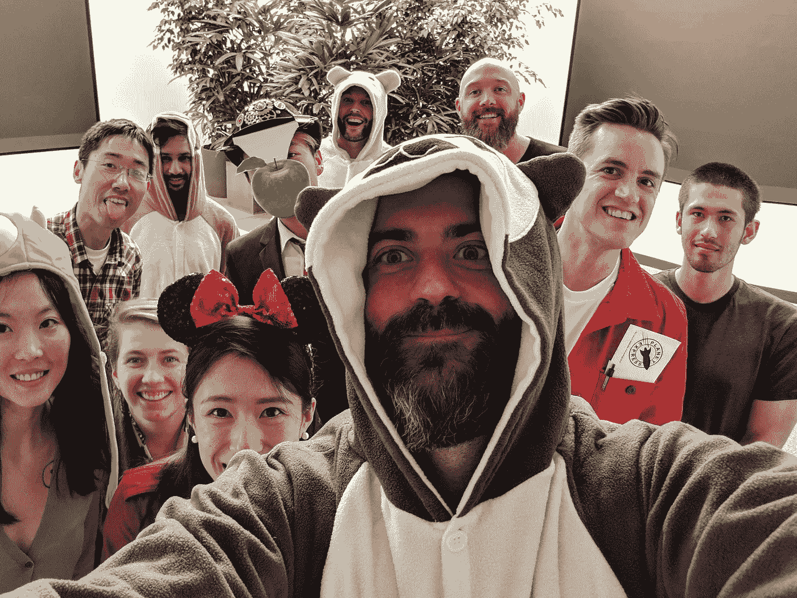

# 领导哲学:授权给内部团队

> 原文：<https://medium.com/hackernoon/engineering-management-philosophies-and-why-they-matter-even-if-you-are-not-a-manager-254561cbeea1>

Annie 是一名软件工程经理，在 Square 的平台基础设施工程组织中领导一个平台团队。在 Square 之前，她曾在多个行业的初创公司工作过，从消费产品到企业解决方案，以及从销售到工程的各种团队。与许多不同的经理共事过，她形成了自己的领导哲学。

# **“你的管理哲学是什么？”**

这个问题在管理讨论中经常被问到，每个回答的人都会给出不同的答案。作为一名工程经理，我很难回答这个问题，主要是因为不清楚这个问题到底是关于什么的。有时可以理解为*“作为一名经理，你优先考虑的是什么？”*或*“你对某个情境或话题有什么看法？—但请随意描述想到的任何一个"*

工程经理(EM)的角色因公司而异。一些经理没有技术背景，一些经理是超级技术领导，一些经理觉得需要保持高度的技术，而另一些经理觉得不太需要。一般来说，管理哲学是一套指导原则，管理者用它们来决定如何运作的框架。

**为什么这对你很重要？**近期(或永远)你可能没有进入管理层的计划。你应该关心的原因是因为你的经理可以是你的教练，你的大使，你的支持者，你的导师，你在公司的代表。她可以帮助你发展事业，将你团队的需求与你自己的需求结合起来，并代表你向更广泛的受众推广你的想法。找到一个愿意花时间理解你并与你有相同的优先考虑和价值观的经理是很重要的。

> 人们很少离开公司；人们离开经理。

很重要的一点是，你的工作偏好与你经理的工作偏好相匹配，而你经理的哲学与公司的运营原则相匹配。这并不是说只有一种工作方式符合公司的运营原则。这整个系统的美妙之处在于，个人和团队可以以许多不同的方式工作，并且都是有效的，并遵循相同的原则。为了举例说明什么是管理哲学，我将分享我对工程经理角色的理解，以及指导我如何支持我的团队的一些管理哲学。

工程经理的角色可能很模糊，比如**为团队成功做任何需要做的事情**。

我将角色划分为三个主要关注领域，以及每个领域包含的职责类型的一些示例(并非包罗万象):
*-内部团队成功:*培养和支持团队成员，并使用流程、团队结构和其他策略来确保团队在合理的时间内执行正确的目标。
- *外部团队协作:*跨职能沟通协作。在组织内横向和纵向代表团队。
- *公司范围内的责任&文化*:为公司范围内的文化做出贡献，以维护哲学和经营原则。雇佣具有合适技能的新人才，包括硬技能和软技能，并确保我们组织牢记多样性并保持健康的工作环境。

我有意将第四个责任领域与其他三个区分开来，那就是战略方向和影响。这是个人贡献者(IC)和经理之间的共同责任。在一天结束时，我们都需要牢记产品/公司战略和影响。我不会将此归类为具体的工程管理责任，而是所有个人的共同操作原则。

在这第一篇文章中，我将关注第一个方面:内部团队的成功。

# **内部团队成功:建立和发展内部团队**

这个范围很广，包括保持团队生产力和有效执行所必需的一切。这可以包括但不限于:授权和发展团队成员，帮助他们保持快乐和积极性，培养健康的团队活力，以可扩展的方式构建团队，使用流程和沟通保持正轨，以及消除障碍。

## 建立信任和沟通

信任和沟通是任何关系中最重要的两个方面。作为一名新经理，我继承了我的团队，并从头开始建立信任。在同一个团队中，从 IC 角色转变为经理角色会稍微容易一些，因为你已经获得了团队的信任和尊重。

以下是我用来与团队建立信任的一些指导原则:

不要凡事都从表面看
在之前的公司，我参与了一个范围很小的项目。这在我(工程师)和 QA 团队之间造成了很多混乱和误解。我的经理几乎不在，他把我拉到一边，告诉我他对我的表现很失望。我没有机会解释我在这个项目中经历的挫折，我觉得他把整个问题都归咎于我。这大大伤害了我们之间的信任。从这次经历中我意识到，我的经理被拉向许多方向，他没有时间完全诊断每个问题。为了帮助他理解我的观点，我学会了过度沟通。

现在，作为一名经理，我也收到了关于我团队中被认为“表现不佳”的人的反馈。在没有亲自调查和了解所有观点的情况下，我从不提供负面反馈。有时，问题超出了个人的控制范围，我可以直接解决。即使问题出在个人身上，我也会以建设性的方式提供反馈，提供步骤和建议来消除缺点。提供没有解决方案的反馈充其量是无用的，而且大多是有害的和贬低的。

**了解团队中的每一个人，不仅仅是工程师，更是一个人和朋友。我认为我的团队是一个家庭。我们不仅仅是一群一起写代码的人——我们在工作日的大部分时间都在一起，这是我们生活中重要的一部分。工作之外发生的事情会影响我们的工作质量，反之亦然，工作中发生的事情会影响我们日常生活中的情绪和心理健康。我希望我的团队中的每个人都感到足够舒适，能够彼此分享他们的爱好、兴趣、奋斗和随机的想法。我们不是在短跑。我们甚至不只是跑一场马拉松。我们是一个会一起跑很多马拉松的团队。我鼓励每个人优先考虑自己的健康和心理健康。**

通过在扮演支持角色和有效领导之间找到正确的平衡，抵制成为权威人物

> 一个糟糕的经理会让自己觉得很重要。一个好的经理会让团队感到重要。

我鼓励我的团队不要把我视为权威，而要把我视为团队的支持者。我非常重视他们在决策和讨论权衡时的观点，并且我总是乐于接受关于如何更好地支持他们的反馈。

这里需要注意的重要一点是，我必须在支持和偏向行动之间取得平衡。一个有效的领导者帮助团队做决定；一位权威人士为团队做决策。在大多数情况下，不可能让每个人都达成共识。如果我太倾向于支持的方向，不愿意让任何一方不高兴，那么整个团队就无法前进。

## 常见管理风格

在我的职业生涯中，我遇到过许多采用不同管理风格的经理。经历了与他们单独共事的积极和消极因素后，我形成了自己的管理风格。

我的管理风格用两个字来概括:灵活。

**爱管闲事的人**。微观管理的人非常关心团队及其成功，因为微观管理需要大量的时间和精力。当她没有与团队成员建立足够的信任时，当她对自己或团队没有足够的信心以可接受的速度执行时，微观管理就会发生。

**缺席经理**。有一大群经理属于这一类。这种类型的经理给他们的团队充分的自主权，这听起来很棒，但是当团队需要帮助时，他们也不在场。这种管理风格适用于完全自主的个人，但这些管理者无法帮助需要更多指导和指引的个人。由于他们的缺席，他们没有花时间去充分了解每个人和他们不同的需求是什么。因此，这些经理无法发掘出与自己不同的个人的潜力。

**啦啦队长。有些缺席的经理是啦啦队经理。当我第一次进入职业世界时，我的一个经理声称他是团队中最响亮的啦啦队长。他相信团队的完全自主权，并奖励他最强的队员。就像一个啦啦队长，他忽略了他较弱的球员。当时我刚毕业，不可否认，我需要一些关于职场运作的指导。因为那个经理，我离开了那家公司。**

一个好的经理不是啦啦队长。一个好的经理是一个教练。团队不能只由“四分卫”球员组成。他们应该是多样化的，包括那些有不同经历、背景和观点的人。教练能够和团队中的每个人一起工作，发挥每个人的潜力。

**海鸥经理。**有些缺席的管理者也是海鸥管理者。海鸥经理是那些大部分时间缺席的人，但偶尔会来放弃一个可能与团队愿景一致或不一致的决定。例如，他可能会突然进来，停止一个项目的开发，或者在没有警告的情况下重组团队，就像一只海鸥突然袭击一群鱼一样。人们可以看到为什么这种行为会产生不信任并挫伤团队的积极性。

## 为个人量身定制管理风格

最好的经理是那些知道如何变得灵活的人。例如，每个人都会普遍认为微观管理者是糟糕的管理者。然而，在某些情况下，微观管理是最好的做法。一个项目可能会失败，因为范围对于工程师来说太大了。一个知道如何微观管理情况的经理可以通过识别障碍、帮助工程师解决问题以及帮助他们区分工作的优先级来增加很多价值。这位经理也可以利用这个机会通过例子来教导团队，帮助他们理解如何分解复杂的问题。

灵活性也意味着经理不会对团队中的所有人使用相同类型的管理风格。不同的人有不同的工作方式、不同的交流方式、不同的目标、兴趣和激励因素。一个经理，就像一个朋友，需要花时间去学习和建立与每一个报告的关系。只有这样，她才能做需要做的事情，让个人与团队的其他成员保持一致，并对自己的进步和成就感到满意。

## 团队结构的重要性

当建立一个有效的团队时，人们会陷入一个常见的陷阱，那就是用高级工程师来填充团队。让我提供一些替代方案。类似于我对人员管理灵活性的理念，我相信*最有效的*团队结构是不同的，取决于团队当前的使命和章程。然而，很少为一项任务或一架包机组建团队。建立一个可持续发展的团队意味着一个可以接受多种不同章程并在许多变化中生存下来的团队。

我建立团队的基本理念是**保持一个平衡的团队**。

不管你的产品或章程有多复杂，优先项目的列表不会有同样的困难。这就是为什么拥有一个不同水平和不同技能的团队是很重要的。为了确保我的团队中每个人都感到积极和快乐，我必须了解每个人的优点、缺点、兴趣、喜欢、不喜欢，以及他们想要的职业发展方向。有了这种理解，我就能把新来的项目和合适的人匹配起来。这使得每个人都可以推动一个适合他们的水平和兴趣的项目，尤其是允许更高级的成员有额外的机会指导和教授初级成员。

我的团队还为我们工作范围的不同部分指定了负责人。这样既给了大家领导机会，又传播了知识，把公车因素降到最低。想象一下，如果团队中只有一名技术负责人，他将负责所有项目的所有决策以及处理所有火灾。在这种情况下，团队有一个单点失败，决策成为瓶颈，个人风险会非常快地耗尽。

除了强大的技术专业知识，我们还有团队成员，他们的强项是沟通和将人们聚集在一起。他们积极地影响文化，激励内部和外部的开发人员。这些软技能经常被忽视，但它们对于改善团队协作、保持凝聚力和建立团队幸福感至关重要。快乐的工程师更快地构建高质量的软件。

## 执行和沟通

我想谈的最后一个领域是执行和沟通。在较大的公司，除了工程经理之外，还有许多辅助角色在这方面提供帮助，例如:产品经理、项目经理和项目经理。我们可以在不同的帖子中讨论所有这些角色的区别。如果没有额外的支持，所有这些责任都落在工程经理身上。

在高层次上，执行需要将长期战略分解成更小的里程碑，并保持团队有效地执行这些目标。在整个过程中，与上级领导的沟通以及与公司其他人的横向沟通使团队与更广泛的组织保持同步。

我在这方面的指导原则是:( 1)尽可能细化计划,( 2)始终保持透明并经常沟通,( 3)始终保持灵活性。

**尽可能细化计划，但要能适应变化** 在我目前的团队中，我们使用*要做的工作(JTBD)* 框架来捕捉客户的需求。在此基础上，我们用它来制定我们的年度路线图。每个季度，我们都会使用年度路线图来制定季度目标和*目标关键成果(OKRs)* 。在每个季度，我们将项目与特定的 okr 联系起来，并形成可实现的 sprint 里程碑。这些具体的里程碑提供了可见性，并帮助我们保持正轨。一旦出现障碍或计划外的工作，我们就会注意到，并能够立即调整和重新安排优先级。这为我们的团队作为一个整体与更广泛的组织建立了信任和责任。

**始终保持透明并经常沟通** 我有两种方法帮助我的团队与公司分享信息:
(1) **使用邮件列表、公告和谈话推送**信息。
(2)使用文档中心、团队页面和有组织的文件，让其他人在需要时能够轻松地**获取**关于我们团队的信息。

进入这两种沟通方法的细节与 EM 职责的第二部分重叠:团队代表和与外部团队合作。如果你感兴趣，请在下面留下评论，我会确保在后续的帖子中更深入地讨论。

**让我们分享想法**

现在，我已经与您分享了我对工程经理角色的人员管理方面的一些想法，以及我如何履行我的角色的一些哲学，我很想听听您的看法。

如果你是一名经理，你在你的角色的不同领域的管理哲学是什么？

如果你是个人贡献者，你希望你的经理拥有什么样的管理理念？