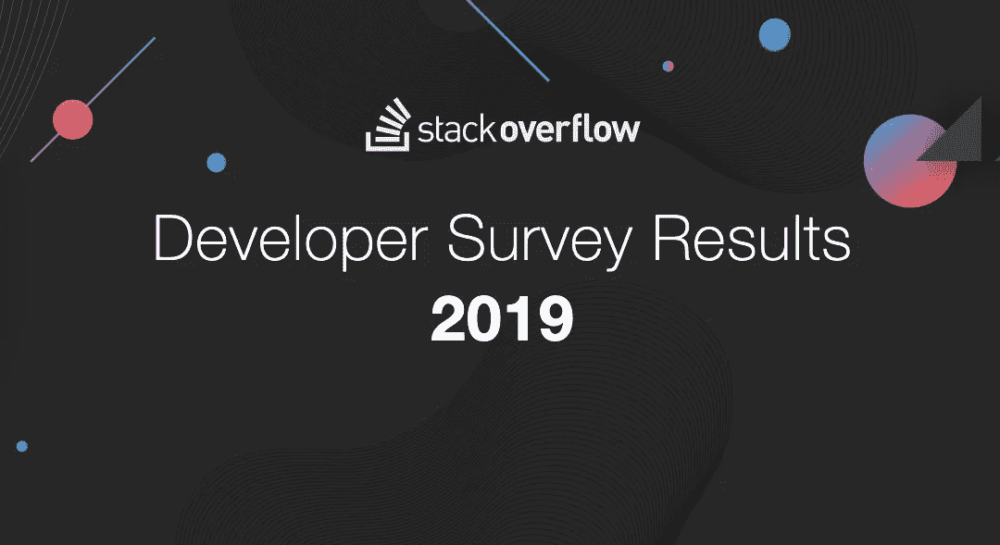
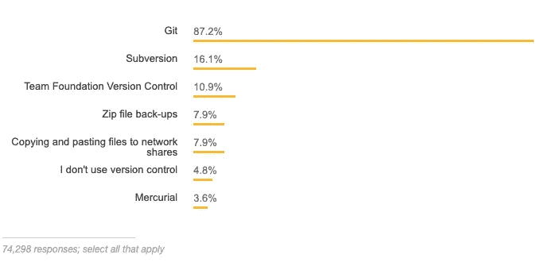
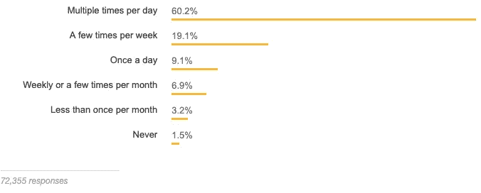
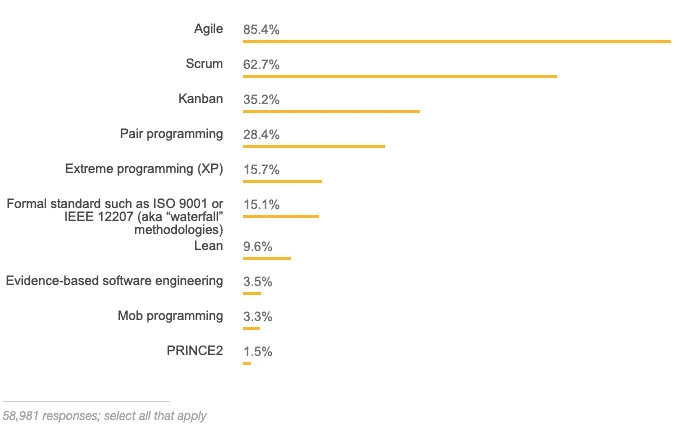
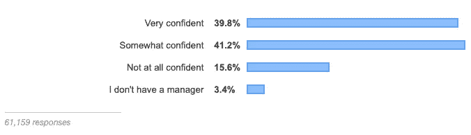
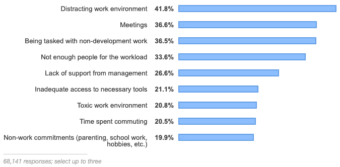

# 烟囱溢出的 2019 年工程测量结果

> 原文：<https://medium.com/hackernoon/engineering-survey-results-2019-from-stack-overflow-6c57206a752>

Stack Overflow 的年度工程调查是对全世界编码人员进行的最大、最全面的调查。每年，他们都会进行一项调查，涵盖从工程师们最喜欢的技术在内的所有内容。今年是他们发布年度工程师调查结果的第九个年头，近 90，000 名工程师参加了这次 20 分钟的调查。

与去年的调查相比，他们有更多关于工程师的[生产力的问题，并确认了我们在 Waydev 看到的情况，如最常用的版本控制和团队的动态，今年的调查更加简化，直接提问如下:](https://waydev.co)

*   工程师的工作结构如何？
*   生产力面临的最大挑战
*   权衡美国的生产率挑战
*   代码审查
*   单元测试
*   编码时的音乐聚焦

但是，让我们用去年的勘测工程勘测结果做一个展示总结。

> **你用的是什么版本控制？**

Git 是当今工程师版本控制的主要选择，几乎 90%的工程师通过 Git 检入他们的代码。

> 工程师多久签入一次代码？

大多数工程师每天都会多次签入代码。专业工程师很少或从不签入代码。

> **工程师使用哪些方法论？**

敏捷和 Scrum 是工程师保持项目正常进行的流行方法。

但是，让我们看看 2019 年的数据，这里是今年结果的几个要点。

*   在我们的调查中，增长最快的主要编程语言 Python 再次在编程语言中排名上升，今年超过 Java，成为第二大最受欢迎的语言(仅次于 Rust)。
*   超过一半的受访者在他们 16 岁的时候就已经写了他们的第一行代码，尽管这种经历因国家和性别而异。
*   DevOps 专家和现场可靠性工程师是收入最高、经验最丰富、对自己的工作最满意的工程师，他们正在寻找最低级别的新工作。
*   在我们调查的前几个国家中，中国的工程师是最乐观的，他们相信今天出生的人会比他们的父母过得更好。法国和德国等西欧国家的工程师对未来最不乐观。
*   当考虑生产率的阻碍因素时，不同类型的工程师报告了不同的挑战。男性更有可能说承担非发展工作的任务对他们来说是一个问题，而性别少数群体受访者更有可能说有毒的工作环境是一个问题。
*   我们要求回答者想一想他们最近一次使用或不使用我们的网站解决编码问题的情况。数据表明堆栈溢出每周为开发人员节省 30 到 90 分钟的时间！

## 开发者类型

约 50%的受访者认为自己是全栈工程师，约 17%认为自己是移动工程师。今年每位受访者的开发人员类型标识的中位数是 3，最常见的是后端、前端和全栈开发人员的组合。高度相关的配对包括数据库管理员和系统管理员、DevOps 专家和站点可靠性工程师、学术研究员和科学家以及设计师和前端开发人员。

调查权重是一种用于在调查样本与基础人群不匹配时分析调查数据的方法。例如，在我们今年的调查中，11%的美国受访者认为自己是女性，但美国劳工统计局的数据估计，女性在软件开发人员中的比例约为两倍，更像是 20%。我们可以使用调查权重来调整我们的调查样本和工程师群体之间的不匹配。我们知道不同性别的开发人员类型存在差异，所以让我们将美国原始结果中的总体比例与加权比例进行比较，假设我们以 BLS 报告所示的比率对少数性别进行了欠采样。当我们使用权重时，我们看到女性比例最高的开发人员角色(如设计师)的比例略有增加，而女性比例较低的其他角色(如开发人员)的比例则有所下降。

我们知道，除了唯一的性别(包括堆栈溢出的使用频率)，我们的调查样本在更多方面与潜在的工程师群体不匹配，而且美国不是我们预计会出现这种不匹配的唯一国家。我们在这里使用这个加权的具体例子的原因是，我们知道我们有系统的抽样问题，我们有一个关于预期人口比例的估计。我们可以证明我们的调查样本在方向和数量上对我们的结果的影响。

> **性别**

我们询问了受访者的性别认同，发现全球约 90%的受访者是男性。在包括美国、印度和英国在内的一些地区，女性在学生中的比例高于专业工程师。

今年，11%的美国受访者是女性，高于去年的 9%。这代表了该领域的逐步改善，但持续的低比例表明了技术行业普遍存在的问题，特别是堆栈溢出问题。

今年，1.2%的受访者认为自己是跨性别者，比去年增加了一倍。性别认同问题允许回答者选择所有适用的问题，关于跨性别认同的问题与关于性别认同的问题是分开的。

> **社交媒体使用**

我们今年问我们的受访者他们最常用的社交媒体网站是什么，Reddit 和 YouTube 是最常见的答案。工程师的偏好并没有反映出世界上最受欢迎的社交媒体平台，脸书排名第一，Reddit 甚至没有进入前十。(Reddit 拥有约 3.3 亿活跃用户，而脸书的月活跃用户为 23.2 亿。)

当我们看美国时，情况有点不同。推特和脸书排名更高。请注意，按性别加权的美国结果与未加权的结果显示出一些有趣的差异；Instagram 甚至获得了完整的排名。

> **今年，哪一个人将对科技行业产生最大的影响？**

我们问受访者，他们认为 2019 年在自由文本领域最有影响力的人是谁。除了特斯拉、亚马逊、微软、谷歌、脸书和苹果等公司的首席执行官，受访者还提到了构建和维护 React.js 和 Vue.js(今年最受欢迎的 web 框架)的工程师，以及 Linux 世界和其他技术领域的领导者。一些世界领导人收到了回答者的提及，还有相当数量的谦逊的回答者提名…他们自己！这里提到的一些人可能不会受到那些将他们列入名单的人的好评，例如美国联邦通信委员会(FCC)现任主席。只有一位女性进入了榜单的前 25 名:AMD 的首席执行官苏姿丰。

> **最受欢迎的工程师环境**

Visual Studio 代码是今年开发人员环境工具中的主导者。开发人员类型和角色在工具选择上有所不同，但是 Visual Studio 代码是最受欢迎的选择。为移动应用编写代码的工程师更有可能选择 Android Studio 和 Xcode。DevOps 和 SREs 的一个流行选择是 Vim，数据科学家更有可能在 IPython/Jupyter、PyCharm 和 RStudio 中工作。

> **工程师的主要操作系统**

我们询问受访者他们在工作中使用什么操作系统。大约一半的人说他们主要使用 Windows，其余的人大约一半使用 MacOS，一半使用 Linux。

> **工程师对他们的管理者有多自信？**

工程管理是一门影响工程师及其日常工作的技术学科。幸运的是，超过 80%的受访者多少或非常确信他们的经理知道他们在做什么。

工程师将来想成为管理者吗？

受访者对这种职业转变的计划各占一半，没有一个单一的回答占主导地位。那些说不想当经理的人比那些想当经理的人有更多的经验，专业编码经验是他们的两倍。今天对进入管理道路感兴趣的工程师可能会有这样的职业道路摆在他们面前，或者也许有些人会改变主意！

> **工程师想去哪里工作？**

几乎 60%的开发人员说他们更喜欢在办公室工作，而超过 30%(在美国接近 40%)的人更喜欢在自己家里工作。

> **生产力面临的最大挑战**

当被问及生产率面临的最大挑战是什么时，工程师最常见的回答包括令人分心的工作环境和会议。性别少数的受访者不太可能说承担非发展工作的任务对他们来说是个问题，而更可能说有毒的工作环境是个问题。

> *调查于一月二十三日至二月十四日进行。
> 
> *用于合格回答调查的平均时间为 23.3 分钟。
> 
> 来源:[https://insights.stackoverflow.com/survey/2019](https://insights.stackoverflow.com/survey/2019)