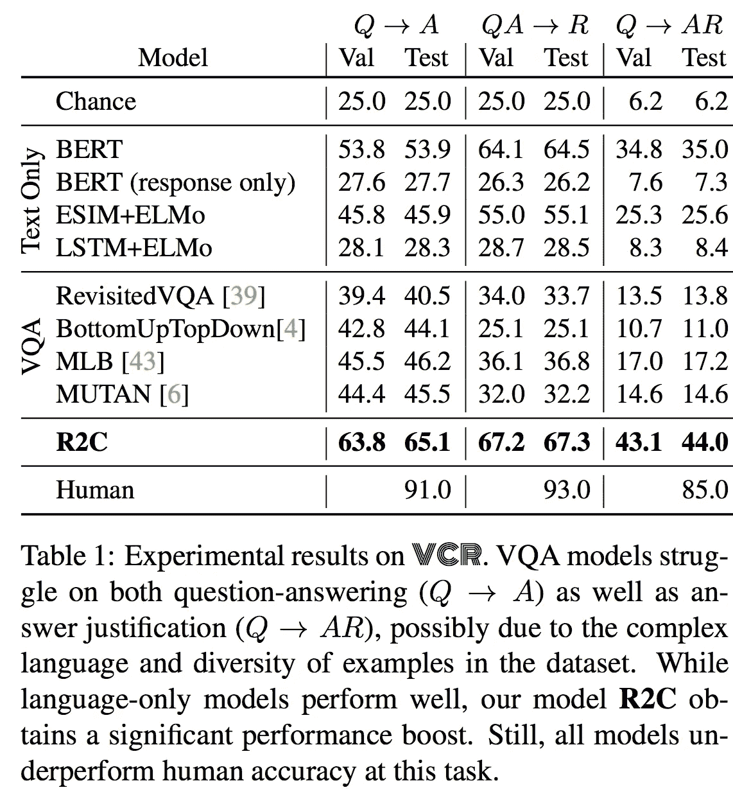
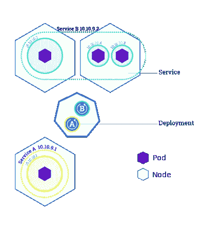
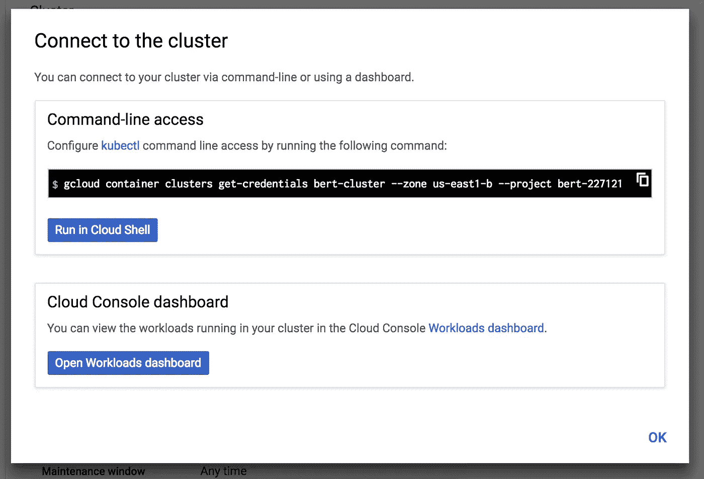

# 用于文本分类的 enterprise AF 解决方案(使用 BERT)

> 原文：<https://medium.com/hackernoon/enterprise-af-solution-for-text-classification-using-bert-9fe2b7234c46>

## 伯特是什么？如何使用 BERT 解决问题？Google Cloud 上的 Google Colab、Tensorflow、Kubernetes

# 概观

这是为那些想要使用由 BERT 构建的模型来创建 REST 服务的人准备的，这是最好的 NLP 基础模型。我花了很多时间想出如何将一个解决方案放在一起，所以我想我应该写下如何部署一个解决方案并分享！

# 你为什么要读这个？

今天，我们有机器学习工程师、软件工程师和数据科学家。深度学习的趋势是，模型变得如此强大，以至于几乎不需要了解特定算法的细节，并且可以立即应用于定制用例。这种趋势将把机器学习工程师的工作变成软件工程师拥有的技能。仍然会有数据科学家，因为将需要应用传统的机器学习方法，并在“小”数据上整合领域知识，以解决问题并获得所需的性能。

# 什么是[伯特](https://github.com/google-research/bert)？

> BERT，即来自变压器的双向编码器表示，是一种预训练语言表示的新方法，它在各种自然语言处理(NLP)任务上获得了最先进的结果。— Github 项目页面

# 为什么[伯特](https://github.com/google-research/bert)很重要？

## 当[发布时，第一名](https://ai.googleblog.com/2018/11/open-sourcing-bert-state-of-art-pre.html)在 11 个 NLP 任务中执行了最先进的技术。

> 在 [SQuAD v1.1](https://rajpurkar.github.io/SQuAD-explorer/) 上，BERT 获得了 93.2%的 F1 分数(一种准确性衡量标准)，超过了之前 91.6%的最高水平分数和 91.2%的人类水平分数
> 
> BERT 还在极具挑战性的 [GLUE benchmark](https://gluebenchmark.com/) 上提高了 7.6%的绝对值，这是一组 9 个不同的自然语言理解(NLU)任务。

## # 2[视觉常识](https://visualcommonsense.com/)性能的主要驱动因素

> 深度纯文本模型的性能要好得多:最值得注意的是，BERT [17]获得了 35.0%的准确率。[……]我们的模型 R2C 比 BERT 的精度提高了 9%,最终性能提高了 44%。[……]当使用手套表示代替 BERT 时，模型损失最大:损失 24%。



Image Credit: [https://arxiv.org/abs/1811.10830](https://arxiv.org/abs/1811.10830)

在不同领域的不同任务中使用 BERT 的经验证据给出了尝试 BERT 的充分理由。让我们用 BERT 来解决一个分类问题！

# 找到要解决的问题

[塞巴斯蒂安·鲁德](http://ruder.io/)启动了[一个跟踪自然语言处理任务](https://github.com/sebastianruder/NLP-progress)进展的项目。

本演练将解决文本分类问题。为简单起见，我们将选择 [AG 新闻数据集](https://github.com/sebastianruder/NLP-progress/blob/master/english/text_classification.md#ag-news)，因为该数据集大小合理，并且与传统的分类问题密切相关。

> *参考* [*本文*](/@lapolonio/parse-the-ags-corpus-of-news-articles-8c99a794310a) *获取 AG 新闻数据集准备训练。*

# 第 1 部分:使用 AG 新闻数据集微调 BERT

遵循这整个教程的结果就是 [**这里**](https://github.com/lapolonio/bert) 。Google Colab 笔记本处理数据集、训练和导出模型可以在 [**这里找到**](https://colab.research.google.com/gist/lapolonio/5ac6552fa4d58ea1419cc444d42ff5ff/bert-finetuning-with-cloud-tpu-sentence-and-sentence-pair-classification-tasks.ipynb#scrollTo=uu2dQ_TId-uH) 。下面将在较高的层次上回顾为 REST 服务重新创建所需的资源。

**首先**，克隆 [BERT repo](https://github.com/google-research/bert) 以便我们扩展项目来满足我们的需求。

**第二个**，`run_classifier.py`是用于句子分类扩展的文件。要添加新的数据源，请添加一个扩展 DataProcessor 的类。DataProcessor 类指定了要实现的方法，您可以参考扩展 DataProcessor 的其他类来找出合理的实现。

```
class AgnewsProcessor(DataProcessor):
  """Processor for the MultiNLI data set (GLUE version)."""def get_train_examples(self, data_dir):
    """See base class."""
    return self._create_examples(
      self._read_tsv(os.path.join(data_dir, "train.tsv")), "train")def get_dev_examples(self, data_dir):
    """See base class."""
    return self._create_examples(
      self._read_tsv(os.path.join(data_dir, "dev.tsv")),
      "dev_matched")def get_test_examples(self, data_dir):
    """See base class."""
    return self._create_examples(
      self._read_tsv(os.path.join(data_dir, "test.tsv")), "test")def get_labels(self):
    """See base class."""
    return [
      "World",
      "Entertainment",
      "Sports",
      "Business",
    ]def _create_examples(self, lines, set_type):
    """Creates examples for the training and dev sets."""
    examples = []
    for (i, line) in enumerate(lines):
      if i == 0:  # for header
        continue
      single_example = self._create_example(line, set_type)
      examples.append(single_example)
    return examplesdef _create_example(self, line, set_type):
    guid = "%s-%s" % (set_type, tokenization.convert_to_unicode(line[0]))
    text_a = tokenization.convert_to_unicode(line[1])
    if set_type == "test":
      label = "World"
    else:
      label = tokenization.convert_to_unicode(line[-1])
    single_example = InputExample(guid=guid, text_a=text_a, label=label)
    return single_example
```

**第三个**，复制这个 [**笔记本**](https://colab.research.google.com/gist/lapolonio/5ac6552fa4d58ea1419cc444d42ff5ff/bert-finetuning-with-cloud-tpu-sentence-and-sentence-pair-classification-tasks.ipynb#scrollTo=5U_c8s2AvhgL) 到训练，评估并导出模型。对于培训，本教程将使用谷歌 Colab 笔记本。要按设计使用笔记本，创建一个 Google 存储桶来存储基本模型和训练模型。

为什么要用谷歌 Colab 笔记本？它们是免费计算资源，易于共享。

初步评估结果不太乐观。更深入的分析请看这里的**[**。**](https://colab.research.google.com/gist/lapolonio/07c1ef27e850452b6b4951dac515ed6f/bert-fine-tuned-model-analysis-sentence-classification-tasks.ipynb#scrollTo=OcUyCka9HblV&uniqifier=1)**

```
***** Eval results *****   
eval_accuracy = 0.25   
eval_loss = 7.6698585   
global_step = 12000   
loss = 7.3534603
```

在第 1 部分结束时，您应该已经导出了一个根据您选择的数据训练的微调过的 BERT 模型。本教程将模型保存到 Google 云存储中。

# 第 2 部分:编写为客户服务的 Tenorflow

现在我们有了一个保存的模型。我们需要创建一些代码来调用 Tensorflow 模型并获得预测。代码需要在服务器上运行，最容易使用的轻量级代码是 [Flask](http://flask.pocoo.org/) 。

**首先是**，通过调用`_create_example`使用 FullTokenizer 解析和处理输入，输出 BERT 模型期望的`InputExample`。

```
inputExample = processor._create_example([request_id, content['description']], 'test')
```

**其次，**使用`from_record_to_tf_example`将`InputExample`转换为`tf.train.Example`

```
tf_example = classifiers.from_record_to_tf_example(3, inputExample, label_list, 64, tokenizer)
```

**第三，**现在将格式化的输入发送到 Tensorflow 服务容器。

```
### create predict request object
model_request = predict_pb2.PredictRequest()### specify name of model
model_request.model_spec.name = 'bert'### specify name of function to call
model_request.model_spec.signature_name = 'serving_default'### specify dimetion of request
dims = [tensor_shape_pb2.TensorShapeProto.Dim(size=1)]
tensor_shape_proto = tensor_shape_pb2.TensorShapeProto(dim=dims)### create model input object
tensor_proto = tensor_pb2.TensorProto(
  dtype=types_pb2.DT_STRING,
  tensor_shape=tensor_shape_proto,
  string_val=[model_input])### actually send request to model and wait for output
model_request.inputs['examples'].CopyFrom(tensor_proto)
result = stub.Predict(model_request, 10.0)  # 10 secs timeout
result = tf.make_ndarray(result.outputs["probabilities"])
pretty_result = "Predicted Label: " + label_list[result[0].argmax(axis=0)]
app.logger.info("Predicted Label: %s", label_list[result[0].argmax(axis=0)])
```

# 第 3 部分:为 Tensorflow 服务和 Tenorflow 服务客户端构建 Docker 容器

使用 flask 应用程序和 Tensorflow 模型，我们可以创建 docker 容器并使用 Kubernetes 部署它们。

> Kubernetes(k8s)是一个开源系统，用于自动化部署、扩展和管理容器化的应用程序。—项目页面

如果你对 Kubernetes 一无所知，我建议你浏览一下这套[教程](https://kubernetes.io/docs/tutorials/kubernetes-basics/)。

使用 Kubernetes 的真正好处之一是网络的抽象。您可以将应用程序的不同部分部署在不同节点上的不同 pod 中，并在内部无缝地相互通信，同时公开一个称为“服务”的单一入口点。



Image Credit: [https://kubernetes.io/docs/tutorials/kubernetes-basics/expose/expose-intro/](https://kubernetes.io/docs/tutorials/kubernetes-basics/expose/expose-intro/)

## 构建 Docker 容器并将容器推送到 Dockerhub

先决条件:创建一个 Dockerhub 帐户

```
# Create Tensorflow Serving Container and host on Dockerhub
IMAGE_NAME=tf_serving_bert_agnews
VER=1547919083_v2
MODEL_NAME=bert
DOCKER_USER=lapolonio
*cd* ~
*docker* run -d --name $IMAGE_NAME tensorflow/serving
*mkdir* ~/models
*gsutil* cp -r  gs://bert-finetuning-ag-news/bert/export/AGNE/1547919083 ~/models
*docker* cp ~/models/1547919083/ $IMAGE_NAME:/models/$MODEL_NAME*### the* MODEL_NAME is an internal convention in Tensorflow Serving used to refer to the model and create/name the corresponding model REST endpoint *docker* commit --change "ENV MODEL_NAME $MODEL_NAME" $IMAGE_NAME $USER/$IMAGE_NAME*docker* tag $USER/$IMAGE_NAME $DOCKER_USER/$IMAGE_NAME:$VER
*docker* push $DOCKER_USER/$IMAGE_NAME:$VER

# Create client to call Bert Model
*git* clone https://github.com/lapolonio/bert.git
*cd* ~/bert

CLIENT_IMAGE_NAME=bert_agnews_client
CLIENT_VER=v3
DOCKER_USER=lapolonio
*mkdir* asset
*gsutil* cp gs://cloud-tpu-checkpoints/bert/uncased_L-12_H-768_A-12/vocab.txt asset/
*docker* build -t $USER/$CLIENT_IMAGE_NAME .
*docker* tag $USER/$CLIENT_IMAGE_NAME $DOCKER_USER/$CLIENT_IMAGE_NAME:$CLIENT_VER
*docker* push $DOCKER_USER/$CLIENT_IMAGE_NAME:$CLIENT_VER
```

## 创建一个 Kubernetes 集群，在 Google Cloud 中将容器部署到 Kubernetes

```
*### create k8s cluster
gcloud* container clusters create bert-cluster*### set the target cluster to the created cluter
gcloud* config set container/cluster bert-cluster*### get credentials from google cloud to allow deployment
gcloud* container clusters get-credentials bert-cluster --zone us-east1-b --project bert-227121*### deploy containers
kompose* convert --stdout | *kubectl* apply -f -
```

在 Google Cloud 控制台中，有一个连接到 Google Cloud 的选项，当您选择该选项时，会打开以下提示:



Image Credit: Google Cloud Console Interface

# 结论:企业就绪与生产就绪

本教程介绍了如何在 Google Cloud 上的 Kubernetes 中部署使用 BERT 构建的 Tensorflow 模型。我们使用 BERT 作为基本模型来解决 NLP 分类任务。这个解决方案模式创建了一个概念验证生态系统，以测试 Kubernetes 是否是一个在云中提供 Tensorflow 生产模型的可行解决方案。使用 Kubernetes / Tensorflow 服务可能存在障碍，例如网络或性能限制。

如果 Kubernetes 是可行的，那么要使该解决方案投入生产还需要很多步骤:

*   自动扩展(处理不同的工作负载)
*   记录
*   CNAMES(除非您同意提及可能更改 IP)
*   警报(在服务中断时发出通知)
*   自动构建和部署(CI/CD)
*   不同的测试环境

Kubernetes 是大规模服务无状态应用程序的优秀解决方案。Tensorflow Serving 是为 Tensorflow 模型提供服务的强大平台。Tensorflow 服务提供了模型版本控制功能和模型状态端点，这些功能和端点非常适合心跳，并随时可用于警报。

__________

# 其他资源:

 [## 有插图的伯特、埃尔莫等人(NLP 如何破解迁移学习)

### 2018 年是机器学习模型处理文本(或者更准确地说，自然…

jalammar.github.io](http://jalammar.github.io/illustrated-bert/) 

[https://github . com/Google-research/Bert # sentence-and-sentence-pair-class ification-task](https://github.com/google-research/bert#sentence-and-sentence-pair-classification-tasks)

[](https://www.tensorflow.org/guide/saved_model#cli_to_inspect_and_execute_savedmodel) [## 保存和恢复|张量流

### 张量流变量是表示由程序操纵的共享、持久状态的最佳方式…

www.tensorflow.org](https://www.tensorflow.org/guide/saved_model#cli_to_inspect_and_execute_savedmodel)  [## RESTful API | TensorFlow 服务| TensorFlow

### RESTful APIs 支持 JSON 中的规范编码，这使得在系统之间共享数据变得更加容易。对于受支持的…

www.tensorflow.org](https://www.tensorflow.org/serving/api_rest)  [## 将 TensorFlow 服务与 Docker | TensorFlow 服务| TensorFlow 一起使用

### 这将运行 docker 容器并启动 TensorFlow 服务模型服务器，绑定 REST API 端口 8501，并映射…

www.tensorflow.org](https://www.tensorflow.org/serving/docker) [](https://kubernetes.io/docs/tutorials/kubernetes-basics/deploy-app/deploy-interactive/) [## 互动教程-部署应用程序

### 要与终端交互，请使用台式机/平板电脑版本继续学习模块 3

kubernetes.io](https://kubernetes.io/docs/tutorials/kubernetes-basics/deploy-app/deploy-interactive/)  [## 部署容器化的 web 应用程序| Kubernetes 引擎教程|谷歌云

### 谷歌云提供安全、开放、智能和变革性的工具，帮助企业实现现代化，以适应当今的…

cloud.google.com](https://cloud.google.com/kubernetes-engine/docs/tutorials/hello-app) [](https://scotch.io/tutorials/google-cloud-platform-i-deploy-a-docker-app-to-google-container-engine-with-kubernetes) [## Google 云平台 I:使用 Kubernetes 将 Docker 应用部署到 Google 容器引擎

### 谷歌云平台(GCP)是谷歌的云计算服务，提供一套企业云服务…

scotch.io](https://scotch.io/tutorials/google-cloud-platform-i-deploy-a-docker-app-to-google-container-engine-with-kubernetes)  [## 使用服务公开应用程序| Kubernetes 引擎|谷歌云

### 谷歌云提供安全、开放、智能和变革性的工具，帮助企业实现现代化，以适应当今的…

cloud.google.com](https://cloud.google.com/kubernetes-engine/docs/how-to/exposing-apps#creating_a_service_of_type_loadbalancer)