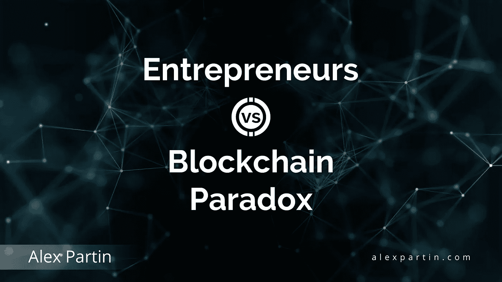
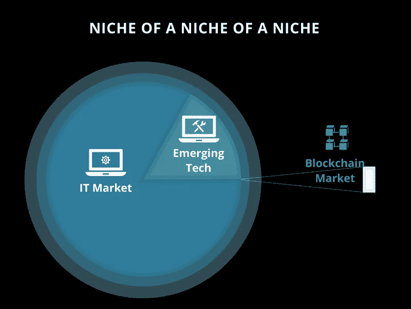
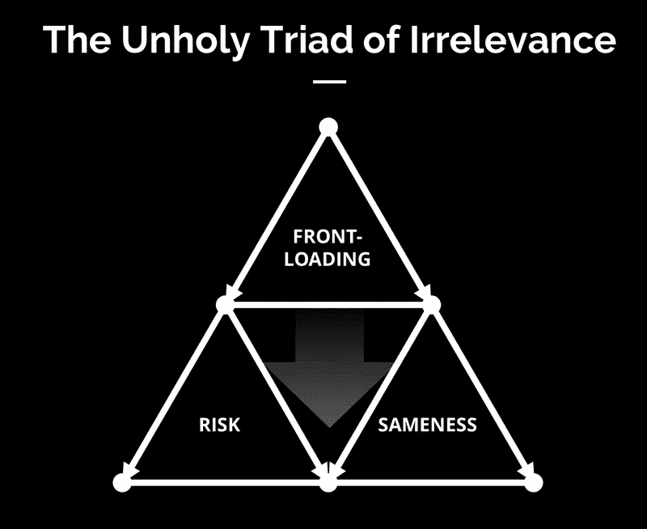
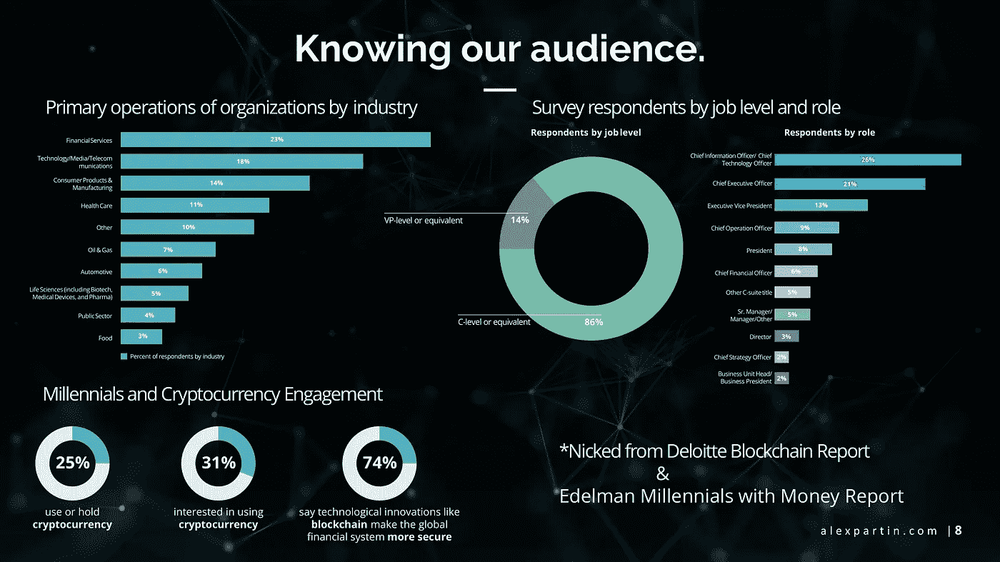

# 创业者 vs 区块链悖论

> 原文：<https://medium.com/hackernoon/entrepreneurs-vs-the-blockchain-paradox-60a277f6239c>

## 为什么革命不是不可避免的

每个人都在谈论这项技术应该如何“ ***消除等式*** 中的信任”。在理论上，这些系统可以做到这一点，几乎任何人类的努力现在都可以完成，而没有欺诈或剥落的风险。

但是，该领域的领导者需要了解一些重要的事情:

*   公众不关心使用基于区块链的东西来取代现有的系统。这只是企业和政府之间的争论。
*   秘密企业家的新动力将解决方案置于问题之前，歌颂没有铁证价值主张的技术，并迷惑普通人。
*   这就是为什么尽管已经存在了 12 年，这个市场仍然是一个利基市场的利基市场。

也就是说，我们是 5%中的 7%中的 1%，如果你想了解技术的话。

说到漂亮的视觉教具，这里的一个像素就是市场:

## **你们知道古希腊人实际上发明了蒸汽机吗？**

是的，他们做了，它被称为 Aeolipile。维特鲁威当时是这样描述的:

> *-”..因此，从这个微小而短暂的实验中，我们可以理解和判断天空和风的性质的强大而奇妙的规律*

仅仅是好奇去判断天堂的法则。这就是区块链今天的状态，如果我们关注并保持它在“短期实验”水平上，它将保持这种状态。奇怪的是，我对戴着比特币帽子、拄着金手杖的福音传道者更为尊重，而不是害怕在他们的营销中咬上一口的安全企业项目。

继续我写这篇文章的原因:

## **区块链悖论**

我们开发的技术可能是客观的，但人类的决策绝非如此。说到这里，我们就不是有逻辑的生物了。

所以尽管你很想消除信任这个因素？

你的项目、团队、公司的存在仍然依赖于公共和私人的支持。这就是为什么监管是一个如此热门的话题，为什么我们尝试各种形式的融资，为什么大多数这些项目背后都聘请了七位数的机构。我们本能地理解这个世界的不合理性。

**于是悖论:**我们需要在实践中产生信任，才能在理论上摆脱它。

## **那么，这种信任是如何产生的呢？**

在找到正确的做事方法之前，我喜欢观察失败和失误。所以我想出了这个漂亮的东西:

**前装**——我们倾向于在事情的解释方面搞砸。这包括描述某些技术/项目/平台如何工作的失败——我们倾向于预先进行解释，并在介绍它们的前五分钟就把所有东西和厨房水槽都扔了。

这就是为什么大多数人认为科技世界有很高的准入门槛。这是软件企业家的错。

风险——这是你的观众感受到的风险，而不是你承担的风险。直截了当地说，我们让事情变得比原本应该的更可怕。低感知风险也是像房地产这样的东西对人们有吸引力的原因，即使它实际上客观上是比软件更糟糕的投资。

我肯定会为此受到批评。一不做，二不休。跟上时代吧，老人们。

**相同性**——那是不言自明的。科技公司因使用通用的未来美学和互相窃取股票营销子弹而臭名昭著。真实性是大多数不直接专注于娱乐的科技公司的敌人(尽管一些游戏公司在这方面很糟糕)。在区块链领域，相同之处*尤其可怕*，每个乔·施莫(Joe Schmo)都可以花 300 美元购买资产，开始他的众筹运动。

我为此写了一整本简短的电子书，名为《活着的 ICOs 之夜》。事情就是这么糟糕。

## **挑战邪恶三重奏**

我将为每个类别列出 3 件你可以做的事情。我不会深入探讨，每一个都可能是一篇文章。这个主题可以写满无数本书——所以让我们保持专注。

1. ***卸载前端负载***

- *在*潜水前赚取项目介绍权。与痛苦、恐惧和不确定性联系起来很容易。把抽象的想法和蓝图联系起来是困难的。这就是为什么约会网站的表现比我们大多数人都要好——这就是生活的现实。

——*抵消教育。一口气解释所有事情似乎是件容易的事，但短期记忆是有限的。一致性把东西带回家。这就是为什么我在这里谈论的大部分事情在我早期的作品中就已经确立了。如果你是新来的，你会很容易得到它。*

- *一次一转。*不间断的福利列表将焦点分开。脑子里有太多的问题，人们会感到沮丧，并找到更好的事情去做。简单来说，**它能与你的**大相径庭。提出一个大的要求，把它带回家，然后进行下一个。一个接一个的快速射击会让你被当成傻瓜。

2. ***冒险的生意。***

——*大声说出来*。企业家淡化对他们项目的担忧。问题是，这些已经在每个人的脑海里。沉默让他们溃烂。在你得到好的东西之前，先把坏的东西处理掉。

- *间接索赔可能是一个问题。看到我在那里做了什么吗？我很可爱。我们倾向于怀疑所有旁边有限定词的事物。潜在用户和可能的结果增加了感知风险。少说或什么都不说总比信口开河好。*

- *骗局让我们走到一起。如果你想在秘密社区交朋友，揭露一些黑幕。谢天谢地，这些东西并不缺乏。*

3. ***千篇一律是魔鬼***

- *拆封(拆封？)你的消息*。颠覆和革命已经不够了。我们大多数人都取笑这一点，但当被问及我们有什么不同时，却很难用语言表达。你的答案是什么？

- *路线图成为笑点是有原因的。*未来的期望和预测很像闲聊。他们可能会建立基本的融洽关系，但绝不会有助于建立持久的关系。如果你想脱颖而出，用现在时谈论你的项目。

- *这不是你的故事。*新兴市场难以为客户或投资者提供即时激励。所以很容易忽略这一点，而把重点放在你和产品上。这就是为什么大多数白皮书读起来都一样。转移你的注意力。

## **我做的一个主题演讲中也有这个简洁的观众图表**

这是两篇很棒的报道，你可以下载并完整阅读。它们是免费的。[德勤区块链报告](https://www2.deloitte.com/content/dam/Deloitte/us/Documents/financial-services/us-fsi-2018-global-blockchain-survey-report.pdf) & [爱德曼千年带钱](https://www.edelman.com/sites/g/files/aatuss191/files/2018-10/Millennials-With-Money-2018.pdf)

(我知道他们 2019 年的报告出来了。它有不同的亮点)

最上面的内容只是德勤调查受访者的分类。也就是说，那些认为自己有资格谈论这个话题的人。恰好也是和区块链最有关系的人。

你想开始交谈的人，如果你是在利基。

与其追逐不存在的"*更广泛的受众*"为你的"*大众* *收养*"

…但我今天可能喝得太多了。那是另一个时间的主题。

Unrelated illustration of the Aeolipile

现在，让我们专注于在制定价值主张的基础上不要让自己尴尬。这种差异化的失败伤害了整个行业。

看不到这些项目的实际价值让我们更接近 Aeolipile 领域。我们不希望出现另一种不稳定的情况。

Alex Partin 为新兴行业的企业家提供帮助，并在 https://alexpartin.com 每天讨论像这样具有挑战性的话题