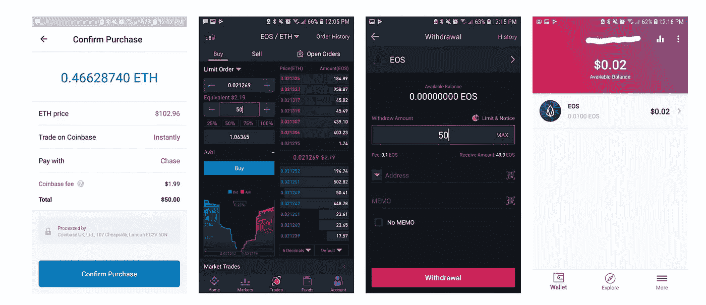
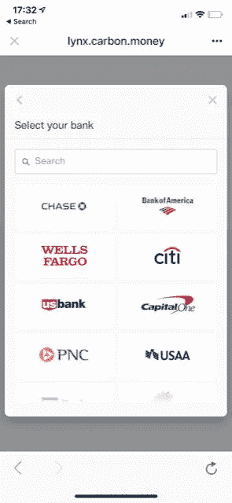

# 消除摩擦

> 原文：<https://medium.com/hackernoon/eradicating-friction-2d4ddc4c3596>

web 开发的一个经验法则是，网站上的每个页面都应该在登录页面的三次点击范围内。虽然这一规则，像所有任意数字的任意规则一样，是任意的，但它重申了用户在摩擦中迷失。

我相信你们很多人都知道，两个月前，Carbon 首次也是唯一一次推出 EOS stablecoin 。除此之外，[我们悄悄地在 EOS Lynx 上直接增加了一个菲亚特坡道，](/@dotkrueger/announcing-the-first-live-fully-integrated-usd-stablecoin-solution-lynx-carbon-332cf4973844)EOS 上最无摩擦的钱包，作为测试我们新产品碳纤维的一种方式。

# 预纤维

在光纤被集成到 Lynx 之前，用户必须通过比特币基地才能开始购买 EOS。只有当用户的身份在注册时被比特币基地验证，他们才能购买 ETH。然后，在他们将驾照上传到币安并验证身份后，他们必须手动输入币安的以太坊钱包，并将以太坊或 BTC 从比特币基地转移到币安。无论是比特币基地还是币安，资金都不在用户的监管之下。在币安，用户可以购买 EOS。一旦他们购买了 EOS，他们可以键入他们的 EOS 钱包地址，并将 EOS 转移到他们的 EOS 钱包。

Coinbase to Binance to Lynx

时间(从资金结算开始):30 分钟

成本:2.05 美元 **≈** 4%

网站/安全确认:5

# 邮政纤维

有了光纤，用户只需要上传一次他们的文件，就可以在他们选择的钱包里完成。发行和转移过程是非托管的，这意味着他们需要信任的唯一一方是 Carbon 的银行合作伙伴。欢迎来到分散化的未来！

时间(从资金结算开始):0

成本:0

网站/安全确认:1

用户可以直接在 Lynx 内部将资金转入和转出 EOS。在光纤出现之前，最简单的选择是清算成 EOS，转移到币安，转换成比特币基地支持的硬币，然后发送到比特币基地。这是缓慢的、有风险的，并且在技术上具有挑战性。现在只需点击一下。而且是免费的！

我们想要一个摩擦更少的世界，因为归根结底，摩擦就是浪费。转移价值的时间、风险和成本伤害了除寻租者之外的所有人。就像软件正在吞噬世界一样，碳正在吞噬摩擦。

但我们并没有就此止步。电汇，作为一种支付和资金转移的手段，已经成为加密游戏的名称。也就是说，在加入 Carbon 之前，我们团队中只有 20%的人使用过电线！电线是这个空间的标准，因为它们很简单:有(通常)固定的费用，而且它们是不可逆的。这些相同的特征使得它们对于日常用户来说很不方便。[因此，我们实施了自动化票据交换所(ACH)支持](/carbon-money/carbon-now-supports-ach-payments-76a6cc33ef55)。即使你不知道 ACH 是什么，你也很可能用过。如果你曾经被付款，在银行之间转账，或支付信用卡账单(在线)，你就使用过 ACH。我们是第一个这样做的 stablecoin。这也是 ACH 第一次被用于将钱直接转移到非托管加密货币钱包中。

我们设想未来没有围墙，也没有强大的看门人，价值可以在所有系统之间自由流动。我们相信光纤是迈向这一未来的一步。

我们将一个艰巨、昂贵的过程整合到一次点击中，并利用大多数人日常使用的技术，让点击直接将钱转移到用户的支票账户中。我们正在与以太坊和 EOS 领域的许多团体合作，将支付轨道直接构建到他们的平台中。所以如果你太讨厌摩擦，[伸出](https://docs.google.com/forms/d/e/1FAIpQLScVbsXAdpVx1nqzzIixEfZEsfmWbjF1wFy-6Xe4OfjI9ZJoIg/viewform)！

我们坚信纤维会为很多人减少很多摩擦。简而言之，这是碳的主要使命。