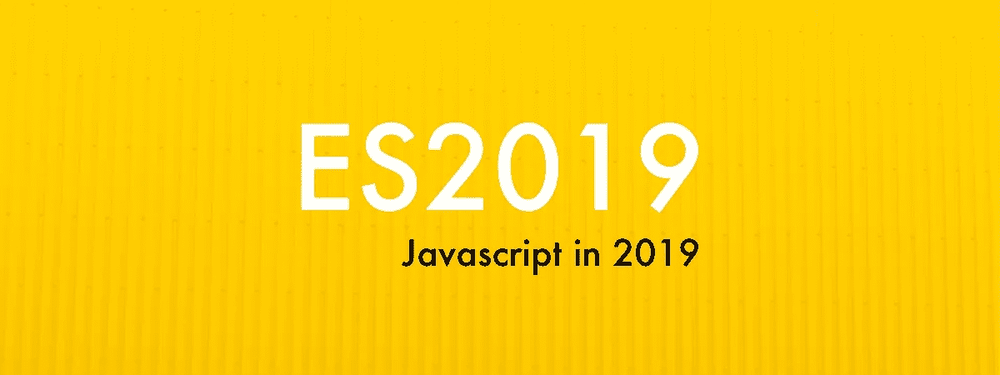

# ES2019: Javascript 在 2019 年的新特性🎉

> 原文：<https://medium.com/hackernoon/es2019-javascripts-new-features-in-2019-3427026af799>

## 我们钟爱的 ECMAScript，也就是 Javascript，有了更多惊人的变化。TC39(技术委员会)*刚刚发布了*第十版规范。如果你觉得自己很勇敢，想看几百页的原始说明书[这是链接](https://www.ecma-international.org/ecma-262/10.0/index.html#Title)。



你有最新版本的 Chrome 吗？打开 Javascript 控制台，让我们一起编码。

# 1.可选 catch 绑定

忘记写`catch(err) {}`和不处理`err`参数。现在它是可选的:

```
try {
  // some crazy code
} catch {
  // take an action
}
```

# 2.包含 JSON

ECMAScript 声称 JSON 是`[JSON.parse](https://www.ecma-international.org/ecma-262/10.0/index.html#sec-json.parse)`中的超集(在数学中，JSON ⊂ ECMAScript):

> 解析后，JSON 对象被实现为 ECMAScript 对象。JSON 数组被实现为 ECMAScript 数组实例。JSON 字符串、数字、布尔值和 null 被实现为 ECMAScript 字符串、数字、布尔值和 null

但这不是真的(直到现在)。有些字符可以包含在 JSON 中，但不能包含在 ECMAScript 字符串中，比如行分隔符(U+2028)和段落分隔符(U+2029)。

```
// before you would receive SyntaxError
JSON.parse('"\u2028"')
```

# `3\. Symbol.prototype.description`

现在你可以访问一个`Symbol`的`description`，而不需要调用`toString():`

```
const sym = Symbol('Hello')
sym.description // 'Hello'
```

# `4\. Function.prototype.toString` 修订

调用函数的`toString()`返回其源代码。通过这一更改，返回值将不会像以前那样删除空格、注释和换行符。

```
function /* some comment here */ foo () {}// before
foo.toString() // function foo() {}// now
foo.toString() // function /* some comment here */ foo () {}
```

# `5\. Object.fromEntries`

`Object.fromEntries`与`Object.entries`相反。让我们看看:

```
const obj = { color: 'yellow', size: 20 }Object.entries(obj)
// [[“color”,”yellow”],[“size”,20]]Object.fromEntries([[“color”,”yellow”],[“size”,20]])
// { color: ‘yellow’, size: 20 }
```

# 6.格式良好的`JSON.stringify`

我们现在有了一种更友好、更安全的方式来使用 UTF-8 代码点(U+D800 到 U+DFFF)。

```
// before
JSON.stringify('\uD800') // “�”// now
JSON.stringify('\uD800') // “"\ud800"”
```

现在可以使用`JSON.stringify()`将这些代码点表示为字符串，并使用`JSON.parse()`将其转换回原始表示。

# `7\. String.prototype.{trimStart,trimEnd}`

我们可以从字符串的开头(`trimStart`)或结尾(`trimEnd`)删除空格。

```
const text = '     hello     'text.trimStart() // 'hello     '
text.trimEnd()   // '     hello'
```

# `8\. Array.prototype.{flat}`

`Array.prototype.flat(depth)`递归展平数组直到指定的`depth`并返回一个新数组。默认值`depth`为 1。

```
const array = ['🍇', ['🍉', ['🍌', ['🍒']]]]array.flat()         // ['🍇', '🍉', ['🍌', ['🍒']]]
array.flat(2)        // ['🍇', '🍉', '🍌', ['🍒']]
array.flat(Infinity) // ['🍇', '🍉', '🍌', '🍒']
```

# `9\. Array.prototype.{flatMap}`

`Array.prototype.flatMap(depth)`映射数组中的每个元素，并将结果平铺到一个新的数组中。类似于`map().flat()`

```
const phrases = ['I like', 'rock music']// with map and flat:
const words = phrases.map(x => x.split(' '))
// [['I', 'like'], ['rock', 'music']]
words.flat()
// ['I', 'like', 'rock', 'music']// with flatMap: 
phrases.flatMap(x => x.split(' '))
// ['I', 'like', 'rock', 'music']
```

仅此而已。就这么简单。

[*关注我*](/@flaviohfreitas) *如果你想看更多我的文章*😘如果你喜欢这篇文章，一定要喜欢它，给我很多掌声——它对作者来说意味着整个世界。

**Flávio H. de Freitas** 是一名企业家、工程师、技术爱好者、梦想家和旅行家。曾在**巴西**、**硅谷、欧洲**担任 **CTO** 。