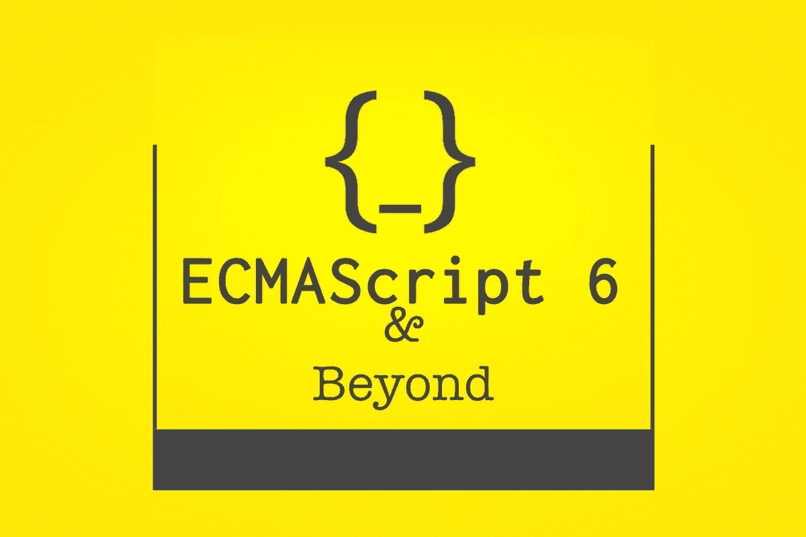

# ES6 及以后>第 1 部分

> 原文：<https://medium.com/hackernoon/es6-and-beyond-28aed8574e00>



大家好，

ES6，这几天在前端世界里非常热门的话题。

所以，学习一下 **ES6 和超越** *(like，ES7，ES8)* 的一些很酷的功能怎么样。

首先要做的事。

> *ES 是什么意思？*

`ES`代表`ECMAScript`。

> 那么,“ECMAScript”和“JavaScript”有什么不同呢？

*   `ECMAScript`是标准，而`JavaScript`也是标准。 ***而是*** ，
*   `ECMAScript`是规范，`JavaScript`是`ECMAScript`规范的实现。

那么，我们开始吧。

## 我们要学什么？

*   `let`
*   `const`
*   对象静止/扩散属性
*   箭头功能
*   字符串插值
*   指数`**`
*   `Array.prototype.includes`
*   `String.prototype.padStart`
*   `String.prototype.padEnd`
*   `Object.values`
*   `Object.entries`

## 让

`let`是新的`var`，但优点是它是可访问的&仅在范围内可用。让我们看一个例子。

```
function let_n_var() {
    console.log(foo);
    if(true) {
        let foo = 'foo';
    }
}
let_n_var();// Output: Uncaught ReferenceError: foo is not defined
```

在上面的例子中，如果你用`var`替换`let`，输出将是`undefined`并且没有错误。因此，如你所见，`let`帮助我们捕捉早期错误，避免范围混乱。

## 常数

这又是一种声明`var`的新方法，但是不同之处在于一旦定义了`const`，我们就不能给它重新赋值。

```
const baz = 'baz';
console.log('baz: ', baz);
// Output: baz
baz = 'baaz'
// Output: Uncaught TypeError: Assignment to constant variable.
```

正如我们所知，JavaScript 是一种动态语言，我们在用不同的数据类型或数据更新变量时容易出错，`const`有助于我们不覆盖已设置的值。

## 对象静止/扩散属性

让我们来看一个例子。

```
// Rest
const vowels = ['A', 'E', 'I', 'O', 'U'];
const [firstVowel, secondVowel, ...restVowels] = vowels;
console.log(firstVowel); // Output: 'A'
console.log(secondVowel);// Output: 'E'
console.log(restVowels); // Output: ['I', 'O', 'U']
```

在上面的代码片段中，我试图将变量`vowels`的值放入前两个元音的独立变量中，并保留在 rest 变量中。下面是实现同样目标的步骤。

*   用数组符号创建一个变量:`[firstVowel, secondVowel]`。将变量`vowels`赋给它。这将给出相应变量中的前两个元音(基于索引)
*   现在，数组符号中第三个值的一部分，使用带有变量名的`...`。`restVowels`如。所以，变量看起来会像`const [firstVowel, secondVowel, ...restVowels]=vowels;`
*   当代码执行时，它将创建具有上述值的变量。实现相同结果的替代方法可以是:

```
const firstVowel = vowels[0];
const secondVowel = vowels[1];
const restVowels = vowels.slice(2); // all remaining values
```

但是，rest 方法使代码更具可读性和可管理性。

以下是考虑到上述代码块的**扩展**的代码示例(用于 rest)

```
// Rest
const vowels = ['A', 'E', 'I', 'O', 'U'];
const [firstVowel, secondVowel, ...restVowels] = vowels;// Spread
const vowelsWithOneConsonant = ['B', ...vowels];
console.log(vowelsWithOneConsonant); // Output: ['B', 'A', 'E', 'I', 'O', 'U']
```

正如你在上面看到的，很容易扩展变量`vowels`来创建一个具有相同和一个附加值的新变量。

这些相同的概念也可以应用在物体上。继续做一些练习。一旦你学会并习惯了，使用起来会很有趣。

## 箭头功能

这是`function`的简写符号，但是`this`的绑定方式不同。

我们先来了解一下语法。

```
// standard way of defining function
function getName() {
   console.log('getName function');
}
// converted to arrow function
const getName = () => {
   console.log('getName function');
}
```

当从函数返回值时，这变得更加有趣和简单。

```
const getName = (name) => 'Hello' + name;
console.log(getName('Anand')); // Output: Hello Anand
```

乍一看，它可能看起来令人困惑，但是让我们稍微分解一下代码。

1.  我们创建了一个名为`getName`的`const`变量
2.  为箭头功能`() => {//function body}`指定了一个功能简写
3.  默认情况下，如果我们的代码不需要多于一行，那么 arrow 函数不需要任何括号。如果需要，使用花括号。如果没有花括号，arrow 函数返回执行的代码行。在上面的例子中，它返回`Hello Anand`

因此，上面的代码也可以写成如下所示，输出也是一样的。

```
const getName = (name) => {
     return 'Hello' + name;
}
console.log(getName('Anand')); // Output: Hello Anand
```

经过一些练习，你就会明白了。继续，启动浏览器控制台并做一些练习。你要做的一个练习是，与普通函数相比，检查箭头函数的“this”行为。

## 字符串插值

在 javascript 的早期，如果我们需要创建带有一些动态值的字符串，我们通常使用`+`。如果真的变大了，迟早会变得更混乱。

所以，字符串插值来拯救。语法是用反勾(`)代替单引号/双引号。而且，`${}`有助于我们输入动态数据，而不用担心打开/关闭引用或因缺少`+`或单引号/双引号而出错。

让我们看看下面的例子:

```
// Old approach
var guest = 'all';
var name = 'Anand';
var age = 32;
var hobby1= "listening to music";
var hobby2 = "mobiles games";
const sayHello = "Hello " + guest + "! My name is " + name + ". My age is " + age + " years. My hobbies are " + hobby1 + ", "+ hobby2 + '.';
console.log(sayHello); // Output: Hello all! My name is Anand. My age is 32 years. My hobbies are listening to music, mobiles games.
```

我敢肯定，这对你们来说已经很困惑了。现在看看下面的例子

```
// New approach
const guest = 'all';
const name = 'Anand';
const age = 32;
const hobby1= "listening to music";
const hobby2 = "mobiles games";
const sayHello = `Hello ${guest}! My name is ${name}. My age is ${age} years. My hobbies are ${hobby1}, ${hobby2}.`;
console.log(sayHello); // Output: Hello all! My name is Anand. My age is 32 years. My hobbies are listening to music, mobiles games.
```

很酷吧。😎

## 指数的

我相信你们都知道数学。在 Javascript 中，我们曾经使用`Math.pow(5, 6); // Output: 15625`来获取指数。

现在，我们有一个捷径，通过做`3 ** 4; // Output: 15625`得到同样的结果。
所以，我们可以这样说:

```
Math.pow(5, 6) == 5 ** 6;
```

## 数组.原型.包含

顾名思义，我们可以使用`includes`通过检查值是否包含来获得`true`或`false`结果值。
举例:

```
[1, 2].includes(1); // true
[1, 3].includes(2); // false
var foo = 'foo';
foo.includes('f'); // true
foo.includes('F'); // false
// So, it is case sensitive too. Please take care.
```

## String.prototype.padStart/String.prototype.padEnd

这个挺有意思的。让我们先定义它。

`padStart`和`padEnd`用于用另一个字符串填充当前字符串，直到达到给定的字符串长度。
`padStart`从字符串的开始(左侧)应用填充。另一方面，`padEnd`从字符串的末端(右侧)应用填充。

> 如果需要的话，这些函数也可以用另一个字符串多次填充当前字符串。

让我们来看一个例子

```
// padStart
const cardNumber = '1234567812345678';
const last3Digit = cardNumber.slice(-3);
const maskedCardNumber = last3Digit.padStart(16, 'X');
console.log(maskedCardNumber); // Output: "XXXXXXXXXXXXX678"// padEnd
const loremIpsum = "Lorem Ipsum is simply dummy text of the printing and";
const loremIpsumWithDots = loremIpsum.padEnd(loremIpsum.length+3, '.');
console.log(loremIpsumWithDots);
// Output: Lorem Ipsum is simply dummy text of the printing and...
```

多酷啊。它非常有趣和有用。但是一定要练习。

## 对象.值

之前，如果我们需要迭代一个对象，我们会使用`Object.keys`。但是现在，我们可以根据需要使用`values`或`entries`来代替`keys`。

因此，对于`Object.values`，它将所有的*可枚举的*属性值作为一个数组返回。然后，就很容易直接消费掉这些价值。
举例:

```
const objectFoo = {
   name: 'foo',
   isAvailable: false
};
Object.values(objectFoo);
// Output: ['foo', false]
```

## 对象.条目

另一方面，`Object.entries`也给出了一个数组，但是它包含对象的*自己的可枚举的*字符串键属性`[key, value]`对。顺序与`for...in`提供的顺序相同。
举例:

```
const objectFoo = {
   name: 'foo',
   isAvailable: false
};
Object.entries(objectFoo);
// Output: [['name', 'foo'], ['isAvailable', false]]
```

## 摘要

这个帖子到此为止。

我们学习了 ES6+的一些关键和有用的特性。一定要自己练习。写下评论作为反馈。也请给予一些掌声，不要忘记分享。