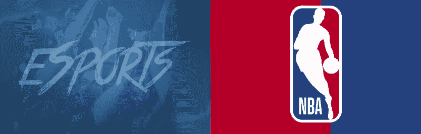
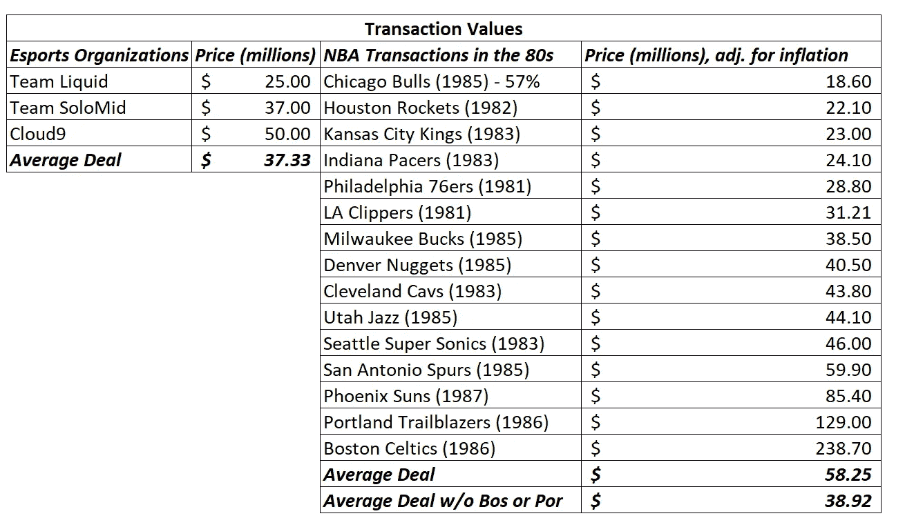
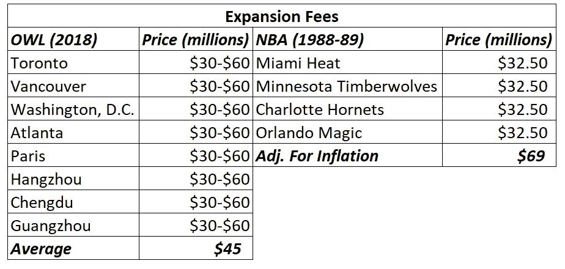
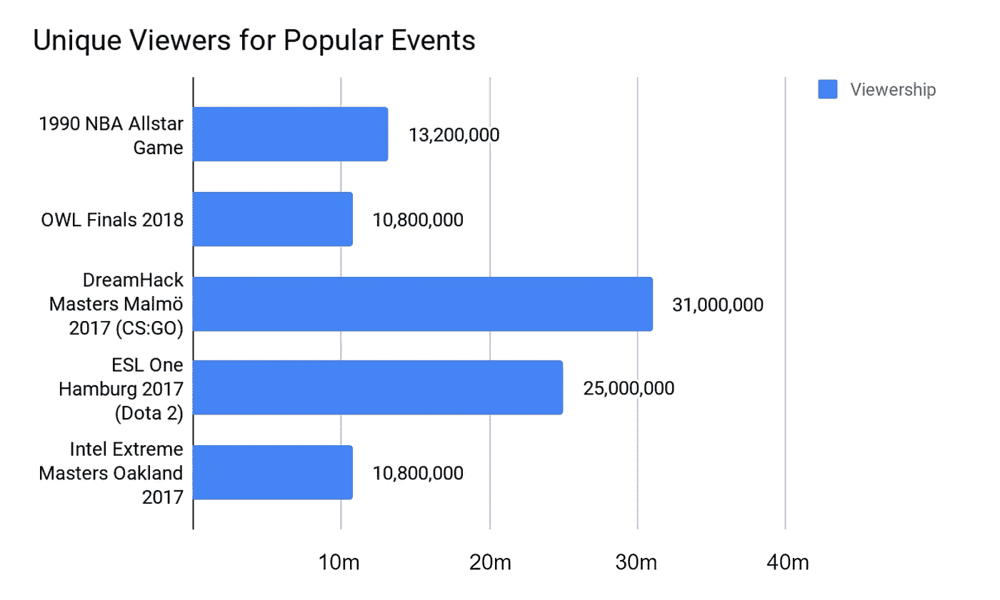
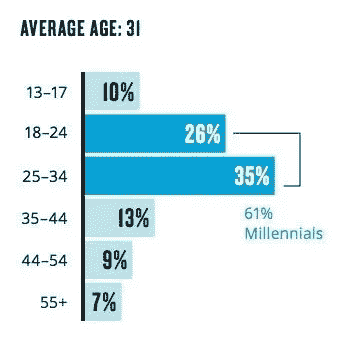
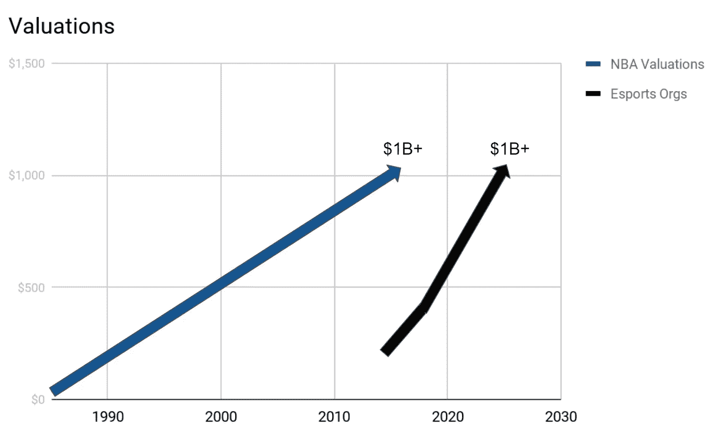

# 电子竞技:$1B 团队？(80 年代的 NBA)

> 原文：<https://medium.com/hackernoon/esports-1b-teams-nba-in-the-1980s-b3ffcb54c4f7>

今天，每支 NBA 球队的价值都超过了 1B 美元，我们相信在不久的将来，电子竞技组织的价值会与此持平，甚至更高。历史正在重演，但这次要快得多。

在注意到 Cloud9 筹集了 5000 万美元、TSM 筹集了 3700 万美元、Team Liquid 筹集了 2500 万美元以及 OWL 特许经营权的利润丰厚的扩张费等电子竞技团队的交易后，它让我们想起了 20 世纪 80 年代 NBA 发生的事情。对这些电子竞技团队和特许经营权的投资与 20 世纪 80 年代支付给 NBA 特许经营权的价格非常相似。

> 对于电子竞技组织来说，1B 的估值之路会比 NBA 走得更快。

# 主要要点:

> 1)团队交易值相似
> 
> 2)扩展费也差不多
> 
> 3)电子竞技的全球观众将推动比 NBA 专营权更高的估值
> 
> 4)资产价值增值时间表将比 NBA 估值快得多

# 1)交易价值:NBA(3800 万美元)，电子竞技(3700 万美元)

在 20 世纪 80 年代，15 支 NBA 球队被全部或部分收购，交易价值从 980 万美元(1982 年休斯顿火箭队)到 1.2 亿美元(1986 年波士顿凯尔特人队)不等。与电子竞技领域最近的主要融资相比，这与顶级电子竞技组织 3700 万美元的平均水平非常相似:

显然，你会注意到波特兰和波士顿这两个显著的局外者。仅它们一项就使平均值增加了近 50%。然而，真正有趣的是，当你调整通货膨胀并从表格中删除这两项时，平均 **NBA 特许经营投资与最近对电子竞技组织**的 3 笔最引人注目的&投资相差不到 5%。

购买 NBA 特许经营权和投资电子竞技团队/组织之间的一个显著区别是交易的结构。当这些 NBA 特许经营权交易达成时，它们通常是为了**完全拥有一支球队的所有权**，而电子竞技交易通常是围绕这些组织的部分所有权**的风险投资交易定价。然而，这并没有消除这样一个事实，即交易价值在所有情况下都非常相似。**结论:如今的电竞机构比 80 年代的 NBA 球队值钱多了。****

> 对于电子竞技组织来说，1B 的估值将比 NBA 来得更快

当这些 NBA 交易完成时，球队的估值在 1000 万美元到 1.2 亿美元之间，今天每个 NBA 球队的价值都超过了 1B。这种价值增值的大部分可以归因于技术进步，它允许更广泛的观众，这反过来又为 NBA 及其球队创造了有利可图的媒体转播权交易。这很重要，因为电子竞技特许经营已经有了收视率，而收视率带来了媒体交易。

> 我们今天生活的数字时代有可能成倍地加快特许经营权增值过程…

# 2)扩张费用:NBA(6900 万美元)，OWL(3000 万至 6000 万美元)

在 1988 年和 1989 年，我们看到了 NBA 的扩张，出现了四支新球队:迈阿密热火队、明尼苏达森林狼队、夏洛特黄蜂队和奥兰多魔术队。1989 年，每支球队都支付了 3250 万美元的扩张费(经通货膨胀调整后为 6900 万美元)。

据 ESPN 称，OWL 的扩张费用在 3000 万至 6000 万美元之间。有趣的是，NBA 要求类似的费用(6900 万美元)，只扩大了 4 支球队，而猫头鹰增加了 8 支球队。

另外值得注意的是，NBA 成立于 20 世纪 40 年代，2016 年 5 月 24 日推出的 Overwatch 游戏。NBA 花了 40 年达到这些数字和估值，而电子竞技只花了 24 个月就为猫头鹰创造了同样的需求和价值。(哇)——无论你是不是猫头鹰、游戏本身的粉丝，或者相信它作为一个标题的悠久历史，这确实是一项令人印象深刻的成就，它说明了电子竞技背后的内在价值、它的观众以及全球竞技娱乐的不断发展。

NBA 和 OWL 的一个关键区别是，在 NBA，所有四个扩展团队都在美国，但在 OWL，扩展团队在北美(多伦多、温哥华、亚特兰大)、欧洲(巴黎)和亚洲(杭州、成都和广州)。

值得注意的是，对电子竞技组织的投资也是对多个游戏名称和联盟的多元化押注，而不是仅仅一个。这使得电子竞技组织的价值大大增加。

> 投资一个电子竞技组织可能会有与拥有爱国者队、骑士队和扬基队类似的回报…所有这些都在一个专营权下。

# 3)受众:电子竞技/猫头鹰(全球)，NBA(美国)

这些 OWL 特许经营本质上更有利可图的是，他们的观众是全球数字观众，而不是以美国为中心的观众(就像 20 世纪 80 年代的 NBA)。

这允许更广泛的粉丝群参与到所制作的内容中，并且允许发展更广泛的忠实粉丝群。从理论上讲，这将使这些球队的价值比 1980 年代的 NBA 球队增值更快，即使他们的起价基本相同。

## 收视率比较:猫头鹰(1080 万)，NBA(1320 万)

当试图评估一个电子竞技组织的未来价值时，另一个需要注意的点是将现在的观众人数与 1990 年 NBA 全明星赛的观众人数进行比较(你可以找到任何观众数据的最早时间):

1990 年，当交易和扩张价值与电子竞技组织和猫头鹰相当时，电子竞技的观众人数已经超过了 NBA 的观众人数。

今天，NBA 球队的价值都在 1B 美元以上，自 1985 年以来，他们的 CAGR 约为 12%，NBA 在 2018 年远远没有我们今天看到的技术进步。

想象一下，如果在 80 年代和 90 年代，来自世界各地的 NBA 球迷可以收看他们想看的任何比赛，这会对这些球队的价值产生什么影响。

电子竞技团队大幅升值的另一个原因是他们粉丝的年龄。NBA 观众的平均年龄是 42 岁，但根据尼尔森的数据，电子竞技观众的平均年龄是 31 岁，61%的观众是千禧一代:

Average Age of Esports Viewers (Credit: Nielsen)

这应该会推动估值的升值，因为这些观众不仅是看电子竞技长大的，而且随着年龄的增长还会继续玩。对于传统体育，许多观众只是粉丝，如果他们年轻时玩过，他们可能不会再玩了。

千禧一代(以及即将到来的几代人)对他们从小玩到大(今天仍在玩)的视频游戏有着持久的亲和力，因为他们能够在高水平的竞争中享受完全相同的游戏。这种动力将让他们保持多年的参与度(类似于高尔夫，你可以打很长时间)。世界上大约有 450 名职业 NBA 运动员可以享受 NBA 的竞争力，但数百万人有能力在与职业电子竞技运动员类似的比赛水平上比赛。

# 结论:历史正在重演…但速度更快

NBA 和电竞/ OWL 的对比出奇的相似。随着数字时代的兴起，电子竞技的人口数量远远超过篮球，更年轻的年龄组，以及世界各地仍未货币化的电子竞技粉丝群，我们相信我们可以看到电子竞技组织的估值与今天的 NBA 特许经营相当…

> …关键区别:电子竞技可以在 5-10 年内完成 NBA 花了 30 多年才完成的事情。

> →接下来:[电子竞技团队:被视为科技公司](/konvoy/esports-teams-valued-as-tech-companies-79d134a3e00d)
> 
> →关注我们的出版物: [Konvoy(中)](https://medium.com/konvoy)

