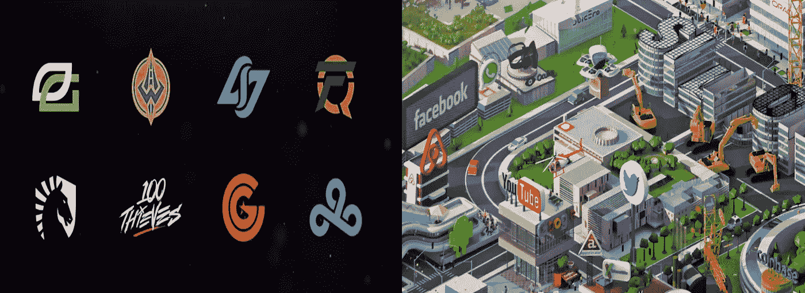
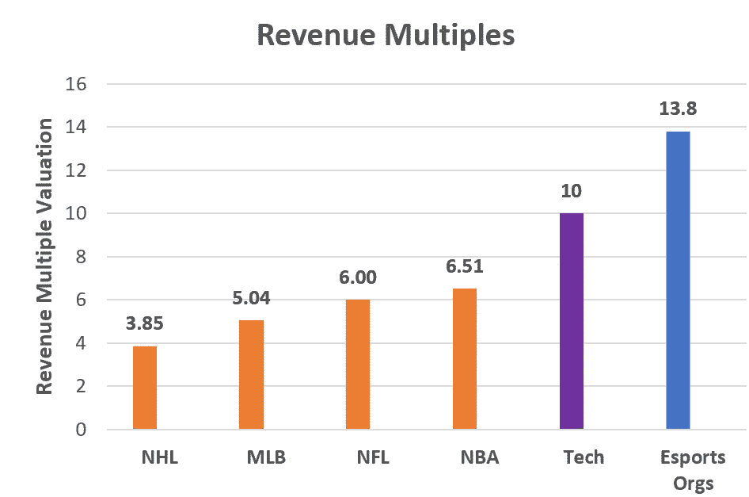
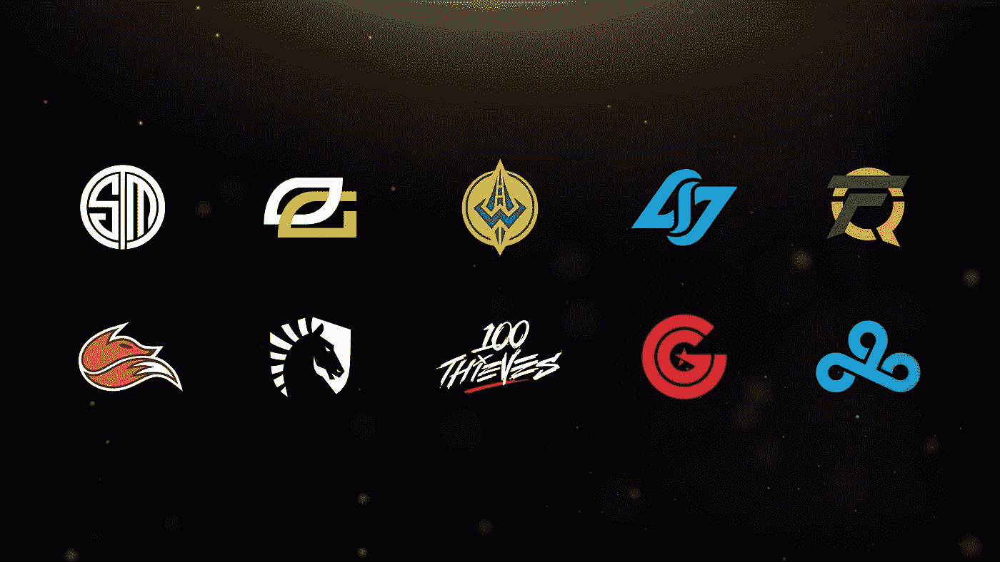
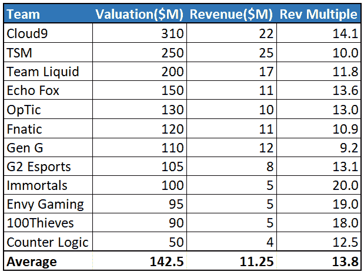
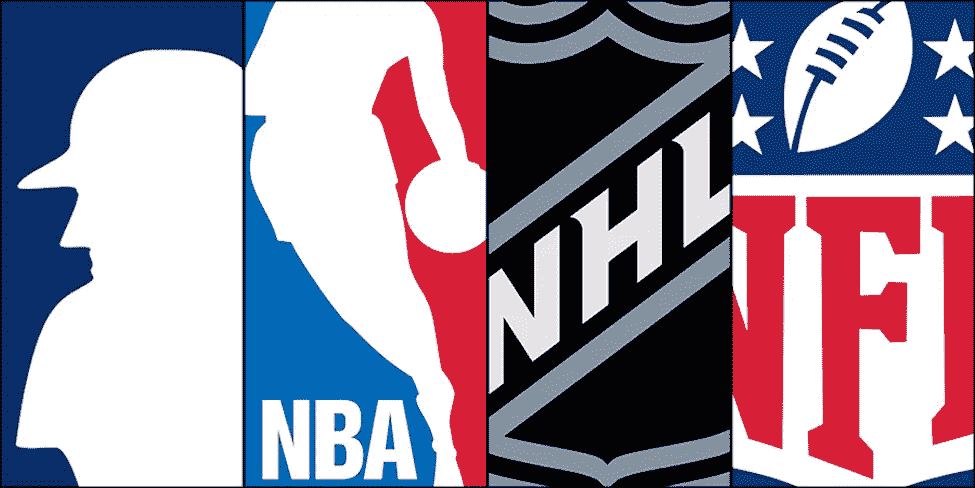
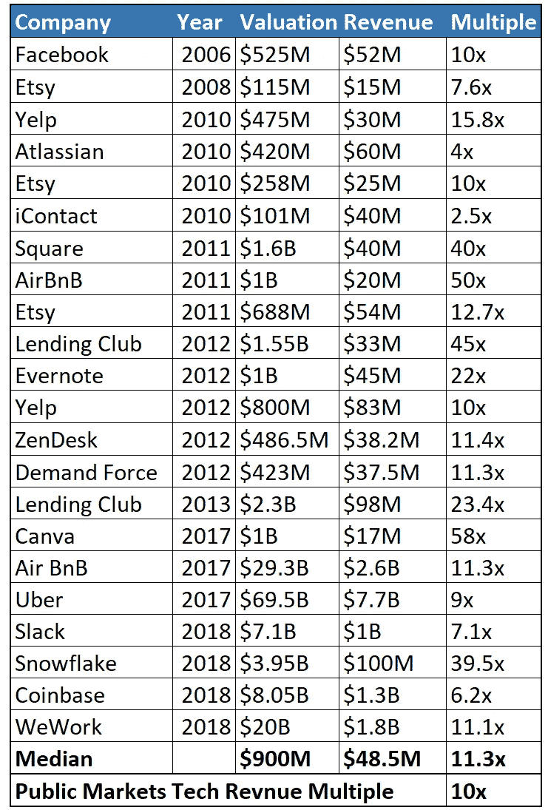
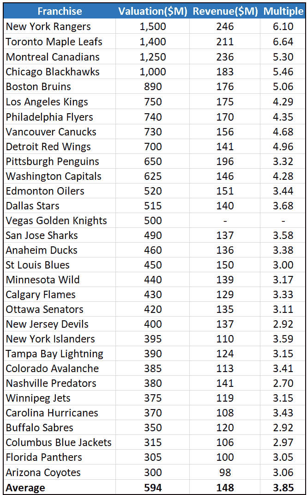
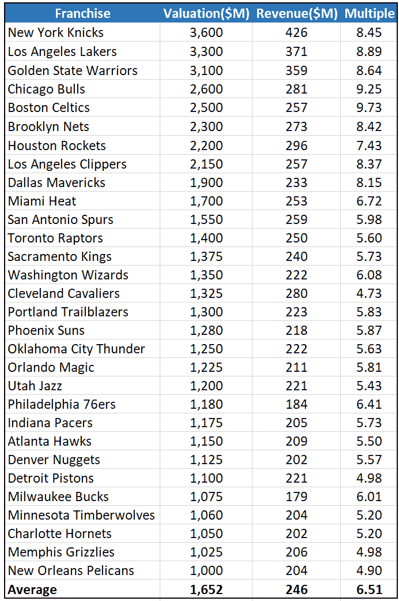
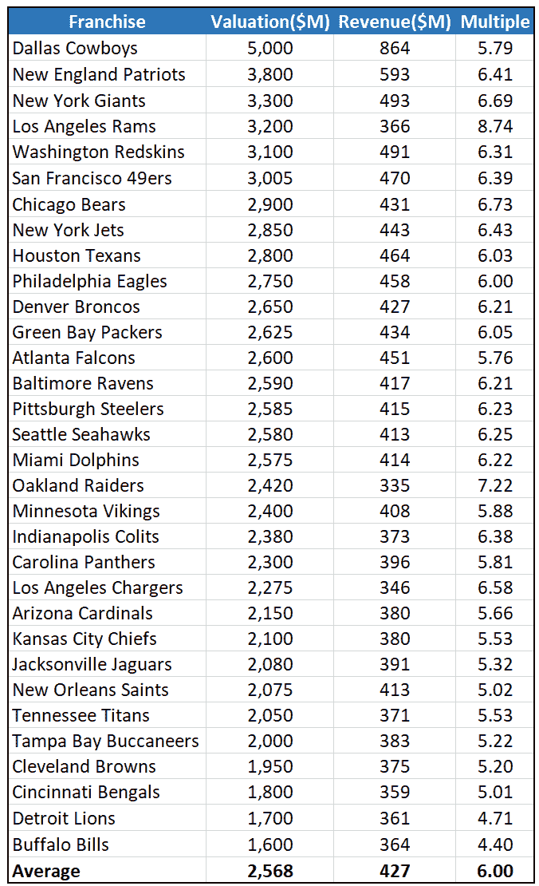
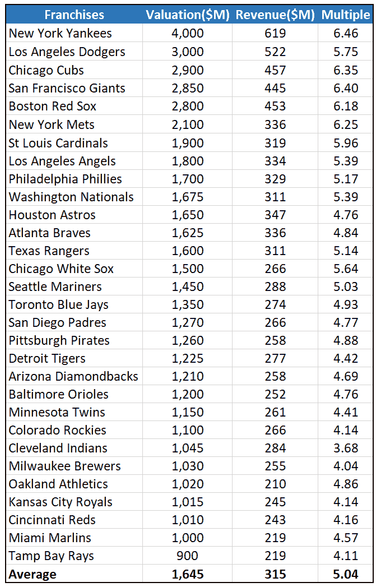

# 电子竞技团队:被视为科技公司

> 原文：<https://medium.com/hackernoon/esports-teams-valued-as-tech-companies-a2df287e02ee>

职业电子竞技团队在过去几年中获得了大量投资。这些职业团队通常被称为“**电子竞技组织**”，它们的估值在过去 36 个月中持续攀升。《福布斯》最近发表了一篇文章，展示了排名前 12 位的电子竞技组织的估值和收入，其中许多组织现在的价值超过 1 亿美元。

> 我们认为，投资者押注电子竞技组织将像科技公司一样成长，而不是运动队。

仔细看看这些电子竞技组织，它们当前的商业模式模仿了传统体育组织的商业模式(估值约为 5 倍收入)，然而电子竞技组织当前的估值(估值约为 13 倍收入)更接近于模仿科技公司(估值超过 10 倍收入)。

> 电子竞技组织= ~ 13 倍收入
> 科技公司= ~ 10 倍收入
> 体育特许经营= ~ 5 倍收入

**简而言之，我们认为，为了维持这些倍数，电子竞技组织将不得不改变其基础商业模式，从传统的体育盈利战略转向可扩展和技术驱动的收入流。**

如果他们能够实现这一转变，那么顶级电子竞技组织的价值将超过 1B，最终超过许多传统体育特许经营权的估值，并证明他们从最新一波投资者那里获得的高估值是合理的。如果他们做不到，那么我们认为在未来 2-3 年内，估值最终会回落。

Source: Forbes + Pitchbook

下面，我们将深入探讨电子竞技、传统体育和科技公司的估值。

# 电子竞技估价

根据最近的一份《福布斯》报告，目前最高的估值属于 [Cloud9](http://cloud9.gg/) ，收入 2200 万美元，价值 3.1 亿美元。这意味着 14.1 倍的收入倍数。作为价值最高的电子竞技组织，他们的收入排名第二，仅次于 SoloMid 团队，为 2500 万美元(2018e)。如下图所示，如今顶级电子竞技组织的平均估值是收入的 13.8 倍。

*Source:* [*Forbes (2018)*](https://www.forbes.com/sites/mikeozanian/2018/10/23/the-worlds-most-valuable-esports-companies-1/#6f7188d56a6e)

根据投资者为这些团队支付的估值，这表明对这些资产的溢价需求很高。这在价值低于 1 亿美元的组织中尤为明显，在这些组织中，收入倍数分别为 20 倍(不朽)、19 倍(嫉妒游戏)和 18 倍(100 个小偷)。

**为了避免投资者疲劳&最终失望，这些电子竞技组织的门槛非常高，以产生能够证明当前&未来估值的收入&利润。**

但是他们的基准是什么呢？

> 目前的投资估值表明，投资者正在寻找这些电子竞技机构与科技公司具有类似的增长轨迹(10 倍以上)。

然而，我们今天没有看到证据表明他们目前的潜在收入来自可扩展的技术。

迄今为止，**他们的商业模式更接近于模仿传统运动队的收入流**(赞助商、广告、商品、奖金池、特许经营收入等)，后者的交易收入接近 5 倍(运动队)，而不是 13.8 倍(电子竞技组织)。

因此，为了避免投资者试图退出电子竞技组织或阻止未来投资进入的情况，我们认为:

> 电子竞技组织需要找到一种方式来建立他们的业务，使其在全球范围内可扩展，并由经常性收入流驱动。

在今天的电子竞技市场中，有各种各样的收入来源为整个行业的收入做出贡献，其中包括:赞助、广告、媒体权利、游戏发行费、商品、门票等等。电子竞技组织目前不公开他们的收入结构，尽管我们相信他们目前的收入来源与传统职业运动队类似。

Source: [Forbes](https://www.forbes.com/sites/mattperez/2018/02/21/report-esports-to-grow-substantially-and-near-a-billion-dollar-revenues-in-2018/)

*(免责声明:我们知道每一个电子竞技组织都是独一无二的，但他们迄今为止的收入来源与传统体育团队并无太大不同。我们在这里的目标是指出，电子竞技组织需要发展成为科技公司，以证明其估值溢价的合理性。我们并不是说它们没有价值或者不值几十亿美元(事实上恰恰相反)。从我们的角度来看，我们相信，如果电子竞技组织能够建立成可扩展的科技公司，它们的价值将远远超过任何传统的体育团队(这非常令人兴奋)。*

# 传统体育特许经营

像传统的体育特许经营一样(NBA、NHL、NFL、MLB)，电子竞技组织通过建立吸引忠实粉丝的团队来创收。主要区别在于，电子竞技组织建立了跨多个游戏头衔的团队，不像传统的特许经营那样通过单一运动赚钱。此外，电子竞技组织在全球众多地区(亚洲、北美、欧洲、拉丁美洲等)吸引了大量追随者，这在美国体育特许经营中很少见。

传统体育特许经营通过几个不同的垂直领域赚钱:门票收入、食品和饮料、媒体权利、赞助和商品销售。这模仿了电子竞技组织目前使用的商业模式，但传统体育特许经营的交易收入不到电子竞技组织目前交易收入的 50%。

今天的投资者肯定是在为潜在的增长付费，鉴于市场的轨迹，这是可以理解的，但这给这些电子竞技组织设置了相当高的门槛。为了在未来几年证明这些倍数的合理性，我们从根本上认为，电子竞技组织将不得不采用更类似于可扩展科技公司的商业模式，而不是传统体育特许经营商的商业模式。

## 国家曲棍球联盟

在北美主要职业体育联盟中，NHL 的平均估值最低，很可能是电子竞技组织在未来 3-5 年内超越的第一个联盟。NHL 团队的平均估值为 5.49 亿美元，而顶级电子竞技组织的平均估值为 1.43 亿美元。在电子竞技领域，cloud 9(3.1 亿美元)已经比两家 NHL 特许经营公司(佛罗里达黑豹队和亚利桑那郊狼队)更有价值，其他几家电子竞技组织如 TSM(2.5 亿美元)和 Team Liquid(2 亿美元)紧随其后(来源:[福布斯](https://www.forbes.com/nhl-valuations/list/))。

## 美国国家篮球协会

在 NBA 的最低端(密尔沃基雄鹿队)，他们的 1.7 亿美元收入比 TSM 的 2500 万美元高出 7 倍，TSM 是收入最高的电子竞技组织。然而，密尔沃基雄鹿队(10.7 亿美元)的市值仅是 TSM(2.5 亿美元)的 4.3 倍。所有 NBA 球队的平均收入倍数为 6.5 倍，最高为 9.7 倍，最低为 4.7 倍(来源:[福布斯](https://www.forbes.com/sites/kurtbadenhausen/2018/02/07/nba-team-values-2018-every-club-now-worth-at-least-1-billion/#7471f90e7155))。

## 国家橄榄球联盟

NFL 球队的估值在所有体育球队中遥遥领先，水牛城队(16 亿美元)的估值最低，仍高于 NHL 最有价值的球队纽约流浪者队(15 亿美元)。虽然 NFL 特许经营产生了数亿美元的收入，但所有 NFL 特许经营的收入倍数都低于顶级电子竞技组织的最低倍数(G 代为 9.2 倍的收入倍数)。NFL 可以说是粉丝群、收入和长期媒体权利交易方面最成熟的联盟，但与电子竞技组织相比，特许经营权的估价要保守得多(来源:[《福布斯》](https://www.forbes.com/sites/forbespr/2018/09/20/forbes-releases-21st-annual-nfl-team-valuations/#32d4b4c07af4))。

## MLB(美国职业棒球大联盟)

作为美国的娱乐项目，MLB 的平均收入倍数仅为 5.04 倍。MLB 每个赛季举办 5460 场常规赛，并拥有许多超过一个世纪的专营权。棒球已经被证明通过了时间的考验，但仍然只有 5.04 倍的收入倍数，比顶级电子竞技组织 13.8 倍的平均收入倍数低 64%(来源:[福布斯](https://www.forbes.com/mlb-valuations/list/))。

# 科技公司倍数

这就是有趣的地方。

电子竞技组织的估值似乎越来越接近科技公司的收入倍数(10 倍及以上)。

> 尽管它们在 2018 年的收入流方面几乎没有共同点，但投资估值表明，投资者似乎认为它们的增长轨迹与科技公司相似。

在寻找与科技公司估值的对比时，首先引起我们注意的是:用户数量(科技公司)、观众数量/关注度(电子竞技组织)、全球影响力(视频游戏观众)和可扩展的商业模式(订阅等)。

顶级电子竞技组织的粉丝群货币化不足，与早期的科技公司类似，需要迅速转向订阅模式和替代的循环创收方法，这些方法基于优质内容和粉丝对他们喜爱的球队的体验。

> 我们认为，投资者押注电子竞技组织将像科技公司一样成长，而不是运动队。

以下是收入在 1500 万美元至 26 亿美元之间的公司的科技收入倍数的一些例子。虽然这些交易中的许多都存在时间稍长，但这种类型的数据是私有数据，获取起来相对困难:

Source: Pitchbook

*(注:收入、估值及其各自的倍数代表当年各轮融资/退出中使用的估算值)*

> →下一个:[电竞:$1B 战队？(80 年代的 NBA)](/konvoy/esports-1b-teams-nba-in-the-1980s-71e66c23cfe6)
> 
> →接下来:[电竞联赛:停止特许经营](/konvoy/esports-leagues-stop-franchising-2c3ae29c16e9)
> 
> →关注我们的出版物: [Konvoy (Medium)](https://medium.com/konvoy)

*(以下是我们的图表附录&各传统体育联盟的数据)*

# 附录——运动队估价

## 国家曲棍球联盟

NHL 特许经营权的估价和收入(来源:[福布斯](https://www.forbes.com/nhl-valuations/list/)

## 美国国家篮球协会

NBA 球队的估价和收入(来源:[福布斯](https://www.forbes.com/sites/kurtbadenhausen/2018/02/07/nba-team-values-2018-every-club-now-worth-at-least-1-billion/#7471f90e7155)

## 国家橄榄球联盟

NFL 球队的估价和收入(来源:[福布斯](https://www.forbes.com/sites/forbespr/2018/09/20/forbes-releases-21st-annual-nfl-team-valuations/#32d4b4c07af4)

## MLB(美国职业棒球大联盟)

MLB 特许经营权的估价和收入(来源:[福布斯](https://www.forbes.com/mlb-valuations/list/)

如果您有任何问题，请联系我们的团队:general@konvoy.co

访问我们的网站了解更多关于我们的信息: [Konvoy](https://www.konvoy.co/)

