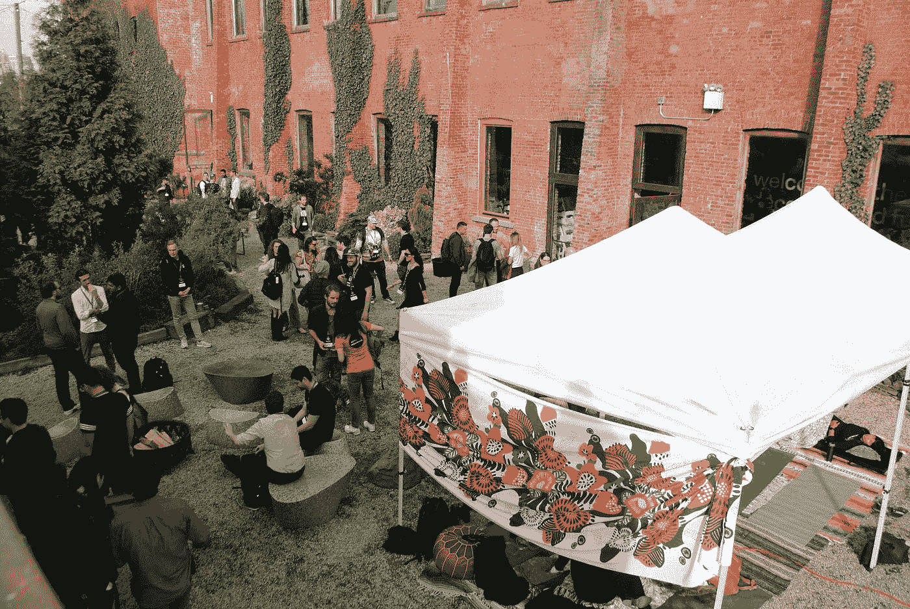
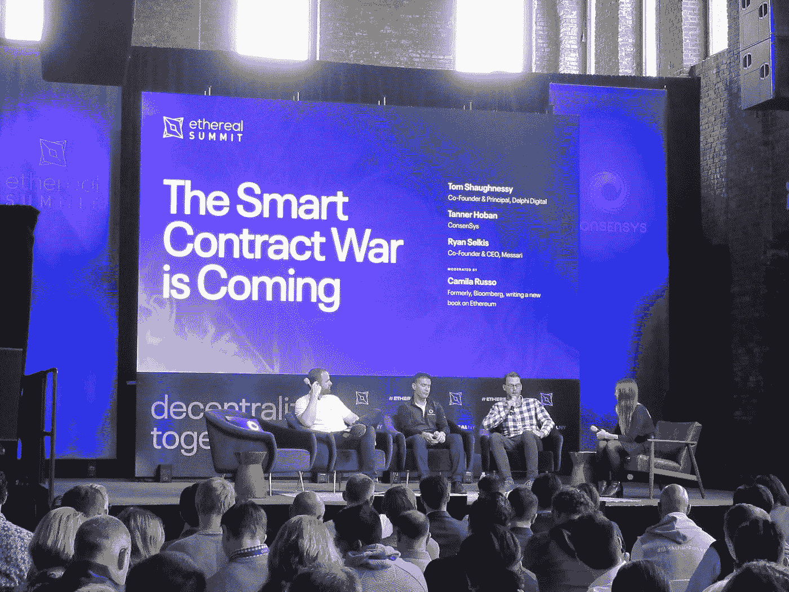
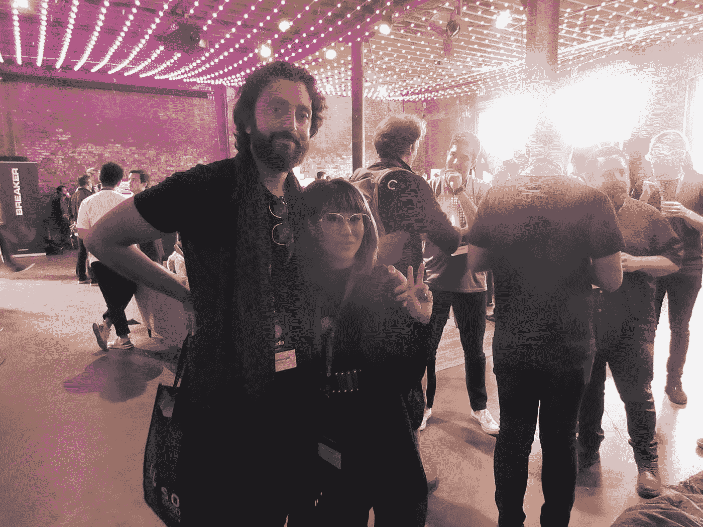

# 2019 年以太峰会:独家概述和报道

> 原文：<https://medium.com/hackernoon/ethereal-summit-2019-exclusive-overview-and-coverage-c58e44711b6e>

区块链纽约周期间将举办数百场活动，世界各地成千上万的人聚集在一起，观看最新的加密货币和区块链项目和开发。其中 Ethereal Summit 是 2019 纽约区块链周**的关键事件。**

每年都有数百名参与者聚集在布鲁克林参加 Ethereal。

这是一个更加轻松和良好氛围的活动，而不是更正式的活动，如流动性或共识。五颜六色的衬衫、头发和休闲服装比比皆是，以太峰会于周五开幕，一系列与以太坊相关的项目接踵而至。

关于可扩展性、互操作性和人工智能的讨论是大讨论的一部分。在“智能合约战争即将到来”的小组讨论中，Mesari 的 Ryan Selkis 提出了一个观点，即以太坊离互联网 3.0 还很远，如果它抓住了去中心化金融(Defi)，以太坊就可以满足了。这一事件是超级增压与大量的伟大小组和发言者。我们为你挑选了一些更值得纪念的。

以下是来自不同演讲者的一些语录，涵盖了此次活动的感受。许多发言人都看好这个领域的发展和演变。

> “任何加密钱包都将能够容纳世界上的所有资产，所有资产都将被令牌化”

> 克里斯·伯恩斯克合伙人
> 
> 占位符 VC

> “有了智能合同，你没有理由每分钟都拿不到钱，而政府却拿到了税……这将改变我们做事的方式”

> 亚伦·赖特，首席执行官
> 
> Openlaw

> “未来十年，法律协议将全部由人工智能分析的软件实现”

> 首席执行官查理·摩尔
> 
> 火箭律师

> “今年在 ethereal 有更好的项目建筑，更先进的机构桥梁…这一代最优秀的人正在搬到区块链空间”

> 迈克·诺沃格拉茨，首席执行官
> 
> 银河数码

在为期两天的活动中，也有许多人参与了旨在解决各行业问题的项目。从人工智能到金融或艺术，区块链上有各种针对人工智能的应用。

ArtProject.io 计划在艺术家和开发商之间架起一座桥梁的同时，促进区块链的艺术创作。他们参加了一场名为 Ethereal Summit 的拍卖会，其中有一场人工智能创造的艺术展览，在拍卖会上获得了 7000 美元的价格。

区块链上的人工智能似乎是一个新的方向，你会发现像 Ronin Ai 这样的项目，一个加密的人工智能预测平台，为你提供关于加密货币运动或奇点的甲骨文般的分析，这是一个全球人工智能网络项目，它加入了人工智能创造者，让他们分享并大规模货币化他们的服务。

可扩展性是讨论的另一个重要部分，以太坊的 pos 推出时间表显然仍悬而未决。根据约瑟夫·卢宾的说法，“当然，今年的某个时候”。而分片和其他 2 级扩展解决方案似乎将在未来 18-24 个月内出现。

空气中弥漫着“春天”的感觉，人群感觉到希望和成长，在去年的秘密冬天之后，你可以感觉到能量回到了空间。