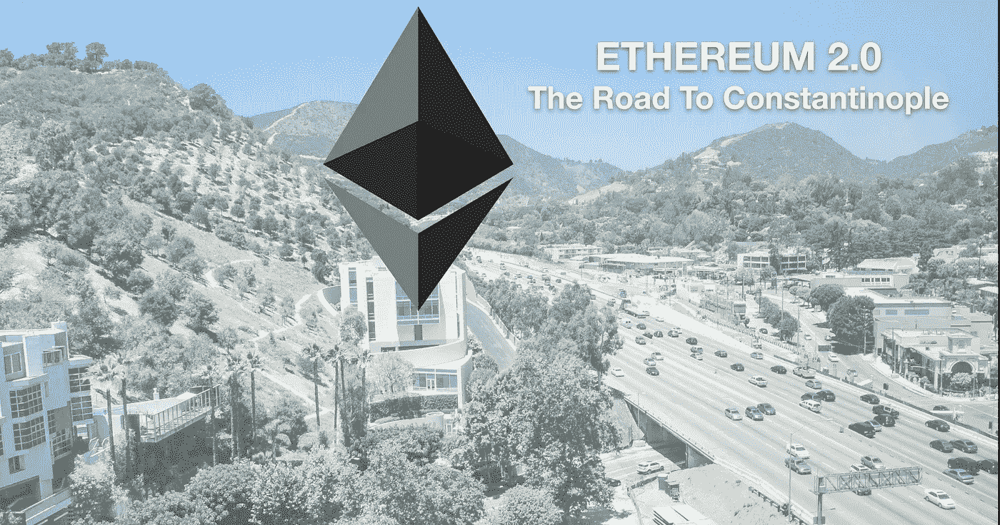
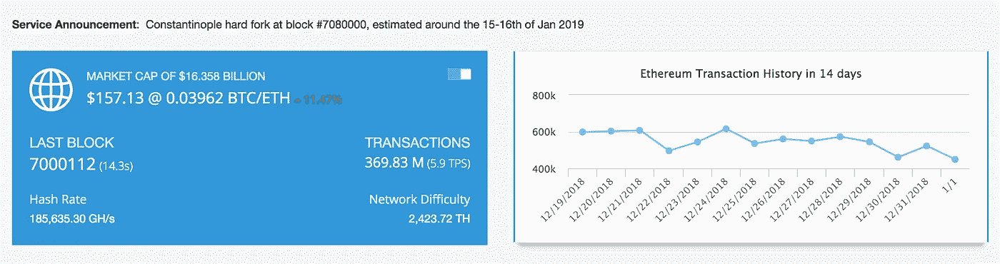
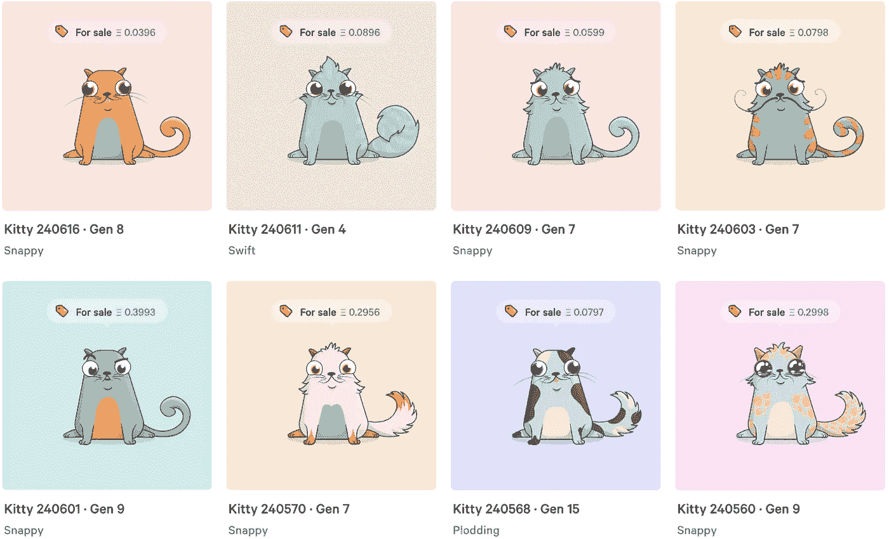
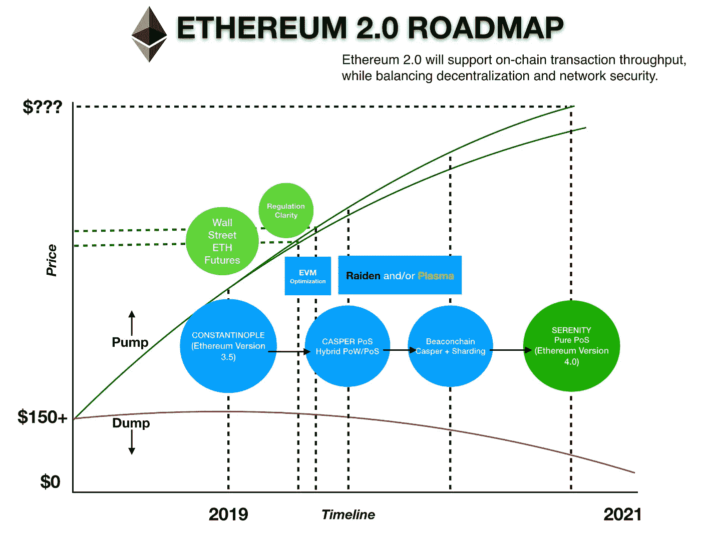

# 以太坊 2.0——君士坦丁堡之路

> 原文：<https://medium.com/hackernoon/ethereum-2-0-the-road-to-constantinople-and-beyond-44f8876ef748>

***更新 2019 年 1 月 14 日。小心以太坊上的新“叉子”。他们可能是一个骗局，如果他们要求你的私人钥匙或支付赎回。***

***更新 2019 年 1 月 19 日。出于安全考虑，君士坦丁堡以太坊被推迟了。预计激活将发生在块号#7280000*** 处。

名为 ***君士坦丁堡*** 的**以太坊**网络的下一次全系统升级将于 2019 年实施(原定于 2018 年)。它也被称为“以太坊 2.0”或“新以太坊”，软件版本为 3.5，部分版本名为 ***Metropolis*** 。以太坊项目的成功关系到很多事情，这些都是扩大网络规模的升级。君士坦丁堡升级计划在#7080000 区块进行。实际上在 2019 年初将会有三个*分叉*，这包括君士坦丁堡。另外两个分叉是“硬分叉”，意味着它们将创造一种新的加密货币。这是*经典视觉*和*以太坊 Nowa。如果钱包或数字交易所支持，ETH 持有人应该在叉子之后在他们的数字钱包中获得这些硬币的等价物。*

You can keep track of the block number on Etherscan.io

## “待解决”的问题

商业通用区块链的主要问题是缩放。比特币每秒最多可以进行 3-7 次交易。以太坊每秒可以处理 15-30 次交易。与主流金融机构相比，这还不够。根据 Visa 的说法，他们的 VisaNet 每天可以处理 1 . 5 亿笔交易，每秒能够处理超过 24，000 笔交易。以太坊网络需要在可扩展性、安全性和去中心化的“区块链三难困境”中找到平衡。

以太坊的“失败”并不像一些批评家所说的那样是真正的失败。以太坊仍然是一个正在进行的工作，所以它还没有失败。许多人将以太坊的失败建立在市场价格的基础上，但是在推测的价格和它背后的技术发展之间确实有很大的脱节。决定项目成功的是即将到来的网络升级。如果他们最终能够实现以太坊开发者的提议，那么这将是一个突破。以太坊的理论概念即将被测试，我们将在未来几个月看到这一点。

## EIP 五大建议

以太坊 2.0 中会有 **5 主 EIP(以太坊改进建议)**推出。

**#1。EIP 145** :这引入了 EVM 操作码的按位移位。这种更有效的编码方式可以减少 gas 的成本和所需的指令数量。

**#2。EIP 1052** :大规模代码执行的优化。

**#3。EIP 1283** :这是基于 EIP 1087，向开发者介绍了一种存储的定价方法。

**#4。EIP 1014** :这是 Vitalik Buterin 的升级方案，基于国家渠道和“链外”交易。

**#5。EIP 1234** :这将区块采矿奖励从 3 点降低到 2 点。这也将使“难度炸弹”推迟 12 个月。

以太坊正被开发为 DApp(去中心化应用)的平台，它将为智能合约提供一个生态系统。这是 Vitalik 对可编程货币的愿景，这在最初的比特币协议中是不可能的。以太坊的网速问题一直是 DApp 开发者的一个限制因素。费用和缺乏正在开发的商业应用进一步加剧了这一问题。人们正在使用 ETH 转移价值，2019 年之前唯一的主要 DApp 是 C *ryptoKitties* 。

C*ryptoKitties, a popular DApp on the Ethereum network (Source: cryptoKitties.co)*

为了让以太坊作为加密货币取得成功，它需要流动性和实用性。人们不得不消费 ETH，企业不得不接受它作为一种支付方式。许多公司对 ETH 三思而行的一个原因是网络速度慢。非加密货币的当前电子支付系统处理支付的速度要快得多，因此区块链在默认情况下不会更快。区块链支付系统的理想之处在于，它是一个加密保护的点对点电子支付系统，可以即时转移价值。

在 2018 年末，有很多关于以太坊的 FUD。这导致持有者失去信心，我们看到价格大幅下跌。2019 年初，随着价格从 83 美元的低点升至 150 美元(截至 2019 年 1 月 2 日)，ETH 出现了反弹。现在你可能已经知道 EIP 1234 将会减少 ETH 的格挡奖励。街区奖励将从 3 减少到 2，这将减少新的 ETH 供应。从长期来看，分析师认为这是一个看涨的趋势。在 2018 年下半年出现大量负面消息后，这是一些好消息。

## 前方的路

A visual graph of my view on the Ethereum roadmap.

君士坦丁堡将是 2019 年以太坊路线图的一个重要开端。升级将引入 Casper 协议，将以太坊从 PoW(工作证明)转换到 PoS(利益证明)。这不会立即取代 PoW，而是我们将看到两者同时运行的混合系统。这将允许矿工有时间从 PoW 移动到 PoS，并延迟难度炸弹。一旦被激活，以太坊的 PoW 采矿将变得更加困难，以便将激励转移到 PoS。

以太坊开发者将走向一个“灯塔链”。这意味着是一个协调层与现有的主要网络和网络的新功能，但尚未建成。这将把 PoS 区块链作为新的共识协议引入以太网。信标链被设计来管理的一件事是以太坊伸缩的一个新特性，叫做“分片”。

分片会将网络分成独立的节点组，称为*分片*。这将分担网络负载，使主网络不必承担所有事务的负载。相反，碎片将重新分配以太坊网络的计算负载，使其能够扩展。然而，这样做的缺点是网络安全，因为它也可能导致对每个碎片的攻击。这就是为什么实现对于维护安全性与去中心化和可伸缩性之间的平衡至关重要。作为信标链的功能，保持碎片协调也很重要，以便保持区块链的一致性状态。

EIP 145 和 1052 中规定的 EVM(以太坊虚拟机)的代码优化也在进行中。优化向我们介绍了按位移位，这意味着提高网络效率。按位移位就像字节码中的一个快捷方式，不依赖于复杂的算术运算。这将允许更快地处理分散的应用程序。正如我们在过去看到的，当很多用户在以太坊网络上时，它很容易慢下来。代码优化将允许更有效地使用计算资源。这反过来也可以节省开发者和用户在以太网上的计算成本。

用 eWASM 替换 EVM 也是计划的一部分。这种优势的原因之一是智能合约的代码执行速度更快。EVM 使用 256 字节的字长，这在实际应用中效率不高。WASM 也被用于其他加密货币项目，如 EOS 和 Cardano。

对于开发商来说，调整后的天然气价格结构是受欢迎的。EIP 1283 将为智能合同实现更低的成本。这将通过分解已经写入以太坊的记忆存储器中的合同变更来完成。由于这不会影响区块链的任何状态变化，因此不会消耗天然气，从而降低了开发商的成本。

还有其他扩展以太网的提议，称为第二层或“链外”解决方案。我们有 Plasma，这是一个第 2 层解决方案，基于在子链上实施的智能合约。还有雷电，就是相当于以太坊的雷电网。这些解决方案被设计用于以太坊框架。如果这些证明是可行的，那么对投资者来说也是好事。

工作证明为区块链提供了保障。使用“离链”解决方案，用户将承担更多的责任，因为他们不再拥有主网络提供的共识机制。由于这种转变是朝着股权证明的方向发展，现在需要通过锁定一定数量的 ETH(他们的股权)来保证块验证者之间的诚信。如果他们有恶意，他们所赌的 ETH 将会失去，所以这有点像他们在一个不信任的系统中的信任存款。

The perfect use case for ETH “off-chain” solutions are for micro-transactions, like buying a cup of coffee. (Photo Credit Vicente Tabora Photography)

在其他相关新闻中，已经有关于以太坊期货合约的讨论。机构投资者将推动以太坊生态系统，但监管机构正在审查像以太坊这样的数字资产与 BTC 有何不同。这是一个关于这些资产是证券还是商品的问题。一旦确定了这一点，就应该有明确的方向。

如果以太坊项目成功实现了这些升级功能，那么接下来就是 ***宁静*** 了。这是以太坊下一个版本的另一个名字，这次它将运行在一个纯粹的 PoS 共识协议上。这些都是以太坊成为更快的分散计算平台的一部分。实施是重要的一步。希望这不会是“君士坦丁堡的陷落”，因为那将是以太坊的失败。成功或有利的结果引导我们从君士坦丁堡走向宁静。还没那么快，还有很长的路要走。

***注:君士坦丁堡预计于 2019 年 1 月 16 日至 2019 年 1 月 18 日在#7080000 地块实施。***