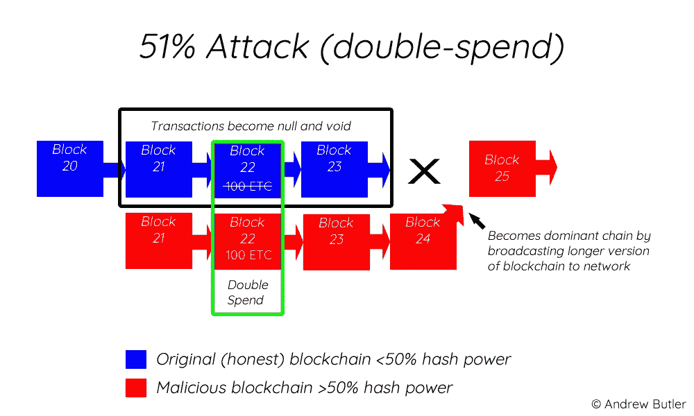

# 以太坊经典来袭！51%的攻击是如何发生的？

> 原文：<https://medium.com/hackernoon/ethereum-classic-attacked-how-does-the-51-attack-occur-a5f3fa5d852e>

## 2019 年 1 月 5 日，报道开始浮出水面，以太坊经典(ETC)区块链已经成为 51%攻击的目标。如果你不熟悉什么是 51%攻击，让我尽可能简单地解释一下(包括图片)。

为了使 51%的攻击发生，恶意方必须控制区块链上 51%或更多的挖掘能力(散列率)处理事务。一旦一个群体拥有了这种多数，他们就有可能决定哪些交易被验证或不被验证。

发生在以太坊经典上的恶意攻击被称为双重花费攻击。例如，假设我们有一个恶意用户，他们有 100 个等等。当恶意用户向一个用户发送 100 ETC 的交易，同时向另一个用户发送他们余额中相同的 100 ETC 时，就会发生双重花费。当在现有区块链上确认第一笔交易时，恶意用户利用他们的多数散列优势(50%+)开始秘密确认第二笔交易。一旦在现有的区块链分支上确认了第一个事务，恶意用户就释放包含第二个事务的已确认块，由于较高的散列能力，第二个事务将区块链扩展得比原始链更远。这里有一个图表，可以帮助你想象它是如何发生的:

51% Attack (double spend)

最长的链总是被认为是“真正的”链，因此第一个事务被认为是无效的。问题是，第一次交易和第二次交易之间的时间间隔可能足够长，以至于第一次交易的接收方在意识到他们的交易在区块链上是无效的之前，可能已经释放了所商定的任何货物或资产。因此，他们从未收到付款。

比特币基地暂停了所有 ETC 交易，有报道称，以太坊经典版的工作证明系统可能存在漏洞，导致了此次攻击。2019 年 1 月 7 日，以太坊经典开发者对任何 51%的攻击发生提出质疑，称从单个池中测试新的 ethash 机器是奇怪行为的来源。

一般来说，51%的攻击自然不被鼓励，因为稳定因素与价格共生。如果攻击者不断地制造双重花费的情况，那么对密码的信心将会降低，价格将会下跌。矿工网络越大，有人有资源发动 51%攻击的机会就越小。由于其巨大的散列率，比特币对于恶意攻击者来说更难颠覆。然而以太坊经典仍然是排名前 20 的加密货币，这使得这次所谓的攻击有些令人担忧。

*感谢阅读*。我管理着一家即将在澳大利亚推出的数字货币交易所。在 www.easycrypto.com.au 的[查看我们，或者如果你在新西兰，我们已经在](http://www.easycrypto.com.au) [www.easycrypto.nz](http://www.easycrypto.nz) 运行。