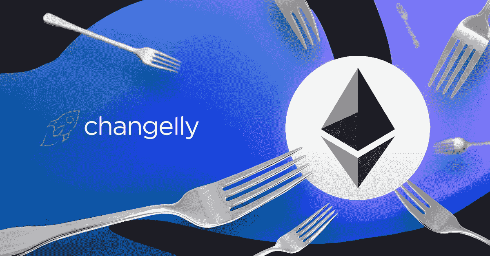
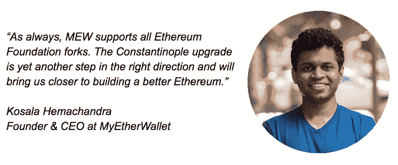
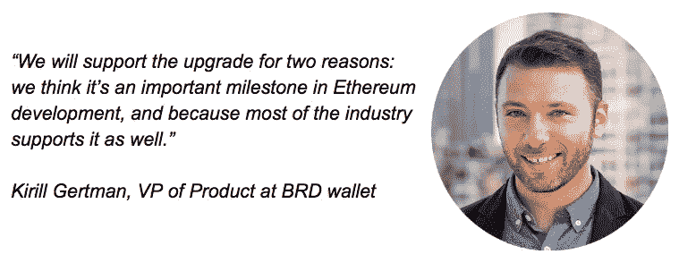

# 君士坦丁堡&圣彼得堡升级:以太坊帝国的新首都？

> 原文：<https://medium.com/hackernoon/ethereum-constantinople-st-petersburg-upgrade-9d8c380367c5>

*我们都记得 2018 年 11 月的 BCH 硬分叉，伴随着两种意识形态的激烈对抗，最终导致区块链彻底分裂为 ABC 和 SV 两个版本。那是艰难的。随着 2019 年的到来，以太坊区块链的另一个岔口已经到来。然而，在这种情况下，ETH Vitalik Buterin 的创始人更喜欢使用“升级”一词，而不是“分叉”，“分裂”一词在这一事件的背景下被认为是不恰当的。*

> *“不太可能出现有争议的硬叉子，”—以太坊基金会的哈德逊·詹姆森*

围绕这一事件的另一个谜团是[君士坦丁堡](https://blog.ethereum.org/2019/01/15/security-alert-ethereum-constantinople-postponement/)的延期，这在全球加密社区引起了许多正面和负面的谣言。最后，尽管所有的等待，根据以太坊官方博客的信息，明天将有不止一次升级，2 月 28 日— [君士坦丁堡和圣彼得堡](https://blog.ethereum.org/2019/02/22/ethereum-constantinople-st-petersburg-upgrade-announcement/)。

毕竟，为什么茶这么热，我们真的需要了解这两个秘密城市吗(因为我们都是秘密公民，你知道)？

[changely](https://changelly.com/)询问加密先驱们的意见，他们最依赖即将到来的场合，因为他们的项目最初建立在区块链以太坊上。

第一个阐明这个问题的人是 Kosala Hemachandra，MyEtherWallet 的首席执行官，也是 Changelly 的新合伙人。

**嘿科萨拉！作为一个真正的以太坊爱好者，你能说出即将到来的升级的三个确实令人心动的主要优势吗？**

#1 EIP 1014 Skinny CREATE2:我相信这个以太坊改进提案(EIP)是一个急需的升级。本质上，它将让用户与尚未存在于链上的合同进行交互。这就是说，可以证明，某些地址可以并将存在于具有特定预定代码的链上。这有很多用例，其中主要的一个是使用状态通道的微交易。

#2 炸弹(EIP 1234):最好的最后——这个 EIP 将延迟以太坊难度炸弹，这种情况下开采区块将变得更加困难。实现这一点是为了确保所有用户都将切换到利益证明(POS)挖掘算法。然而，由于 POS 实施需要更长的时间，这将使难度炸弹延迟大约 12 个月。此外，这将有助于将 ETH 发行减少到每块 2 个 ETH，这将使以太坊通胀率降至 4.25%。

另一个基于以太坊的著名加密项目是 BRD 加密钱包。BRD 产品副总裁 Kirill Gertman 也分享了他对以太坊升级的专业意见。

基里尔，作为一个真正的以太坊爱好者，你能说出即将到来的升级的三个确实令人心动的主要优点吗？

实际上，我将避免谈论 EIP 1234，因为关于它已经说得太多了:微微 _ 微笑 _ 脸:相反，我将提到其他两个变化

EIP 1014 —这是 CREATE2，开发人员无需实际部署合同即可创建智能合同地址，使用户能够进行离线交易。这对于 onboarding 非常重要，因为用户不需要密钥来执行事务。它将通过允许更简单的用例来帮助推动采用。

EIP 145 —提高以太坊的速度和效率，这两个问题一直是影响扩展的痛点

正如我们所看到的，没有什么可担心的，很可能不会发生分叉。所以，不要把时间浪费在谣言上。相反，注意事实和合理的声音。订阅 Changelly 博客并在社交媒体上关注我们:

[推特](https://twitter.com/Changelly_team)
[脸书](https://m.facebook.com/changellyteam)
[电报](https://t.me/join_changelly)
[Reddit](https://www.reddit.com/r/Changelly)
[Youtube](https://www.youtube.com/channel/UCDEC0Iw44JxM7cwf4VKFIyA)

不错的交换，#Changellions！

*原载于 2019 年 2 月 27 日*[*changelly.com*](https://changelly.com/blog/ethereum-constantinople-st-petersburg-upgrade/)*。*