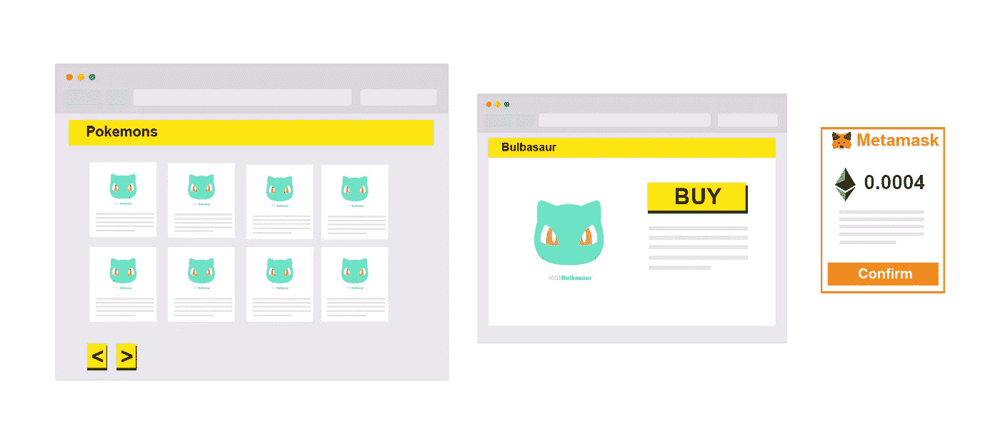
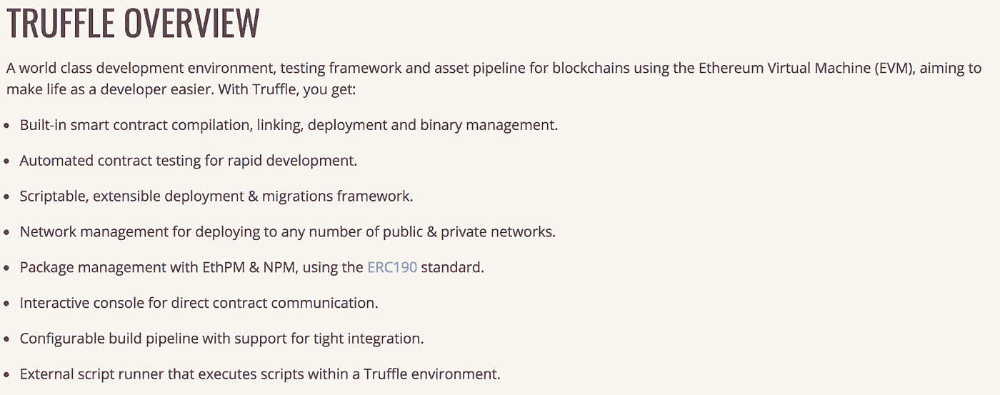
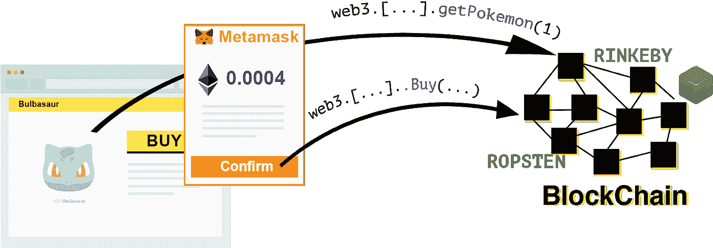
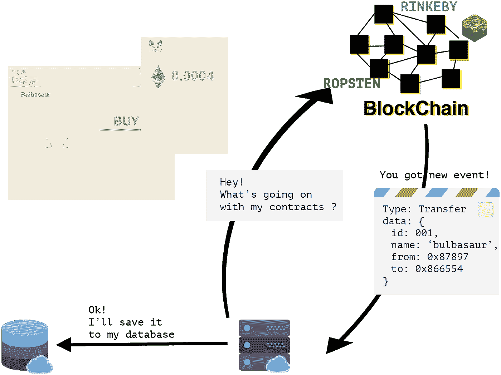
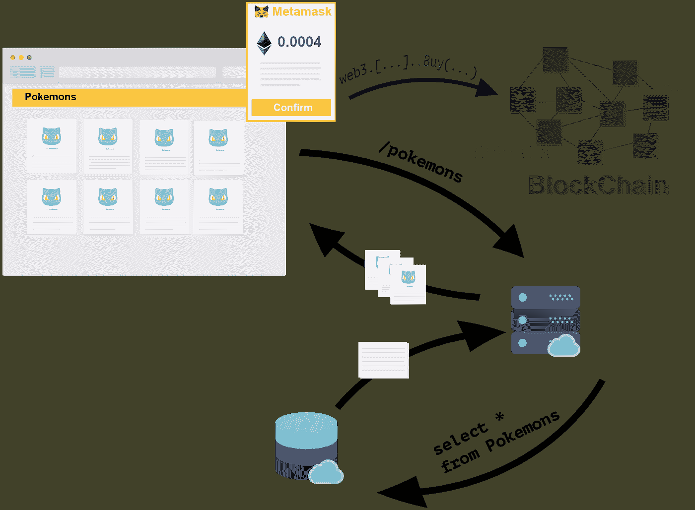

# 以太坊加密收藏品市场架构

> 原文：<https://medium.com/hackernoon/ethereum-crypto-collectibles-marketplace-architecture-fe0c6cdb2ce7>

你可能听说过 [0xgame](https://0xgame.io/) 、 [Cryptokitties](https://cryptokitties.co/) 、 [MLB 密码棒球](https://mlbcryptobaseball.com/)、[分散地](https://decentraland.org/)、[隐珊瑚](http://cryptocorals.co/)等，想知道这些平台是如何工作的？

也许你有一个伟大的想法，想开发自己的平台，但不知道从哪里开始？或者你只是好奇，想了解区块链上分散应用(dapp)的潜力？

我们去过 cryptocorals.co[和 frenchbureau.co](http://cryptocorals.co/)和[了，我想和你们分享我们学到的东西，并回答你们的一些问题。](http://frenchbureau.com/)

这篇文章是献给那些有 web 开发经验并且理解智能合约基本工作原理的开发人员的。

我主要关注以太坊加密收藏品市场所需的架构。我的例子将是一个口袋妖怪市场，你可以从以太坊区块链购买和出售口袋妖怪。目标是有一个网页界面，你可以看到不同的口袋妖怪，并购买/出售它们。

我不会在本文中讨论构建加密收藏品市场所需的 ERC721 不可替换令牌标准实现，但可能会在未来的出版物中讨论。

# 创建、发布智能合同并与之互动

所以你需要做的是在 **solidity** 中创建你的智能合约。

我强烈建议你使用 [**松露**框架](https://truffleframework.com/docs)。

[https://truffleframework.com/docs/truffle/overview](https://truffleframework.com/docs/truffle/overview)

有了松露，你就把你所有的。求解`/contract`文件夹中的智能合同，并使用:

*   将它们整理成一个 JSON 文件，其中包含合同 ABI 和一堆其他数据
*   `truffle migrate`将你的合同发布到区块链。

这是一个非常简短和肮脏的非真实的概述你的合同可能看起来像什么。

# 我可以在哪里发布我的智能合同？

*   Ganache 是本地机器的私有区块链，你可以用它来进行本地开发。
*   **Rinkeby** 、 **Ropsten** 等等都是测试网络:就像你的团队的私人测试环境或者一个 staging 环境。你用的是假乙醚，所以不会花你一分钱。
*   **以太坊 Mainnet** :是真以太，真钱，是量产宝贝！

在 truffle 配置文件`truffle-config.js`中，你可以设置你的不同环境。

然后你可以做一些类似于`truffle migrate —network ropsten`的事情，在 Ropsten 上发布你的合同。

# 我如何与我的智能合同进行交互？

*在开始之前，您需要将 web3.js 库添加到脚本中。(如果使用 react，* [*毛毛雨*](https://truffleframework.com/drizzle) *是一个极好的选项)。*

当你想和区块链通话时，你需要和一个节点通话。所有的区块链数据都存储在每个单独的节点中，所以您只需要与其中一个节点进行交互。你可以使用 **web3.js** 与一个节点对话，做类似`web3.myPokemonContract.getPokemon(1)`的事情

在开发环境中，您可以轻松地托管您的区块链和 Ganache，它将提供您与区块链交互所需的一切。

对于 Rinkeby、Ropsten 或以太坊来说，这有点不同，因为你不是区块链网络的一部分。如果您不拥有节点，您有两种选择:

*   例如，您可以使用 geth 创建自己的节点，并将其连接到您选择的网络(ropsten、mainnet 等)。然后，你必须安装、配置并使其可从外部访问，管理安全事务，这是一项繁重的工作，尤其是如果你只想尽快推出你的产品。
*   或者你可以使用像 [Infura](https://infura.io/) 这样的基础设施即服务(IaaS)。它们维护自己的节点，并为您提供所需的一切，如 api，以便轻松地与区块链交互。

有许多详细的教程可以帮助您创建一个可以与区块链广泛互动的网页，所以我不会在这里涵盖这些细节。

# 创建您的 web 应用程序！

请记住，使用智能合约和区块链可以做两件事:

*   **阅读**:通过 Id 获得一个口袋妖怪，获得自己拥有的口袋妖怪数量等。
*   **写**:创建一个口袋妖怪→将新的口袋妖怪写入你的智能合约，将一个口袋妖怪转移到另一个地址→在智能合约上写新的主人等。

在这个例子中，我们想要调用`getPokemon()`和`buy()`函数。

在我们的口袋妖怪市场中，我们现在有一个从你的智能合同中收集口袋妖怪 XXX 信息的单一页面，显示数据并允许最终用户购买这个口袋妖怪(假设他是可购买的)。

建筑基本上会是这样的。

使用区块链时也要考虑利弊。

# 区块链很慢

虽然使用区块链很简单，但是需要考虑一些基本的挑战。正如你已经知道的，区块链慢得令人沮丧！获取口袋妖怪 001 的信息可能需要几秒钟。所以如果你想获得第一个 25，那么从 25 到 50，建立一个良好的用户体验是有挑战性的。每次刷新你的时间都浪费在加载上。

# 阅读区块链是免费的

它基本上是免费的。多亏了 web3.js，你可以从 javascript 中读取区块链并调用函数`getPokemon()`,但它不包括任何额外的更新。

# 编写、更新智能合同数据是有成本的

根据您更新区块链的操作所需的计算，您将需要支付以太网的燃气费。

如果你购买一件物品，你也将支付物品的价格。

要发送以太并支付费用，你需要拥有以太，因此有一个装有以太的钱包。

您的以太钱包没有信用卡，但您可以使用 Metamask 支付！

# 有人如何从您的网站向您的智能合同支付以太网？

Metamask 是一个安全管理以太坊钱包的 chrome 扩展。通过 web3.js，你可以让 Metamask 从你的钱包里拿出 0.0004 以太来购买一个口袋妖怪，Metamask 然后会要求用户批准并完成交易。

元掩码还可以用于一键式密码安全登录流程(如社交登录)。这里有来自 Toptal 的很好的教程。

# 但是用户真的需要 Metamask 来支付你网站的交易吗？

是啊！但是请记住，元掩码并不是一个有保证的系统。你的终端用户，我们必须了解、理解和信任元掩码这个系统；这引起了拥有以太网或比特币的加密爱好者的警惕，他们以前没有使用元掩码的经验。

# 集中分散应用程序

正如我们刚刚看到的，最终用户将需要元掩码在区块链上执行写入操作，但读取是免费的。

因此，一个解决方案是集中一个分散的应用程序(我知道这是胡说八道)，它将读取智能合同数据并将其保存到数据库中。您将(缓慢地)从区块链获取数据，并通过扩展的 API(快速地)提供给用户。

使用智能合同的好处是它可以[发出事件](https://solidity.readthedocs.io/en/v0.4.21/contracts.html#events)，比如:`emit Pokemon Transfer({ from: 0XO67465, to: 0x43546})`或`emit Pokemon Birth({name: Nidoran })`。

所以当你收到一个`Birth`事件(意思是某人被称为`createPokemon()`功能)，你可以添加一个新的口袋妖怪到你的数据库，以更好地服务你的用户。

当你收到一个`Transfert`事件时，(意味着有人调用了`buy()`函数)，你可以在你的数据库中更新给定口袋妖怪的主人。你可以通过 web3.js 收听这些事件！

为此，您需要一台专用服务器来监听您的智能合同。

它可以是一个 CRON 作业，托管在一个谷歌云功能上，一个 AWS lambda 甚至你自己的服务器上，用 Node.js、Go 或 Python 编码，由你决定。

# 确保您的交易得到确认

当您收到一个事件时，您将得到该事务的块号。

块号是指与已添加到区块链的事务相关联的块。如您所知，在区块链，您的交易仍然可以恢复，因此您需要等待至少 12 个街区，以确保交易不会恢复。(更多信息[在此](https://blog.ethereum.org/2015/09/14/on-slow-and-fast-block-times/))

在此期间，您需要将交易设置为“待处理”,直到您确定交易已被确认。

例如，当一个口袋妖怪被创建时，你可以将它设置到一个挂起状态的数据库中，这样你的访问者就可以看到它，但不能购买它。添加口袋妖怪时，您可以在卡片上覆盖一层，告诉您的用户它要来了。

# 服务器体系结构

现在，您已经集中了应用程序，您可以使用 API 更快地为用户提供 dapp 数据。您的数据库就像您的智能合同的一面镜子。

# 结论

如果您想在以太网博物馆创建一个加密收藏品市场，您需要知道:

区块链很慢，你不能要求你的前端应用程序为每一个请求获取和处理数据。一个解决方案是创建一个事件处理器来监听您的智能合同事件，并将数据填充到一个数据库中，该数据库将是区块链的镜像。然后，您将能够通过 API 提供数据。

元掩码是强制性的，对您的用户来说可能很可怕。确保提供良好的用户体验，并向用户介绍元掩码的用法。