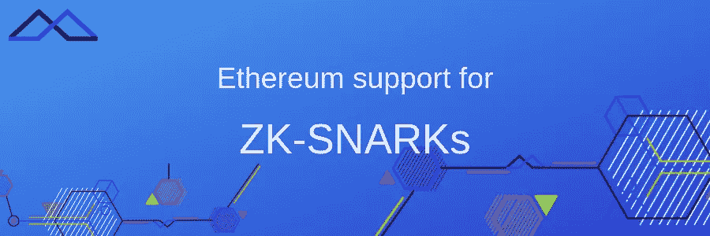

# 以太坊对 ZK-SNARKs 的支持

> 原文：<https://medium.com/hackernoon/ethereum-support-for-zk-snarks-ce103bd6ac89>



ZK-SNARKs

ZK-斯纳克系列继续我们的区块链专家亚历山大的另一篇文章。我们祝大家周五快乐！

我有难得的特权能够在工作中做研究。由于我的职业生涯一半是工业，一半是学术，我很高兴有机会在同一天同时从事这两种工作。有编写产品代码的动力和紧迫性，但也有不知道某些东西是否可行的兴奋和不确定性。

从很多方面来说，研究就像一次冒险:你或多或少有一个明确的目标，并且可能有几种方式去实现它。你沿着一条路走下去，战胜你的障碍或找到聪明的方法来避免它们，直到你到达一个不可逾越的墙。你回去，重复，再重复，直到你退出或实现你的圣杯。

在过去的几个月里，我的冒险一直是 ZK-斯纳克。它开始是测试一项技术，看看它是否可行，然后演变成用它来制造一个实际的产品。它让我走上了许多有趣的道路，这些道路本身可能值得一个帖子。偶尔，我会在岩石下发现一块小小的知识宝石。其他时候，在道路的转弯处，我会不可避免地陷入一个话题，这个话题我已经回避了很长时间，现在不得不认真面对或深入探讨。

这篇文章是关于第一种情况的一个例子。对于第二种情况，我希望在将来的某个时候写一些关于椭圆曲线配对的东西。

正如我在上一篇[](http://coders-errand.com/practical-zk-snarks-for-ethereum/)*中所述，我已经用 [*ZoKrates*](https://github.com/Zokrates/ZoKrates) 产生了 ZK-斯纳克。ZoKrates 的端到端体验从指定一个我们想要向其他人证明的语句，到为该语句生成一个可靠的验证器。ZK-斯纳克法的神奇之处在于一些基于椭圆曲线配对的加密技术。当你仔细观察时，令人印象深刻的是，一份智能合约可以在以太坊交易的天然气成本限制内执行必要的数学运算。那么，秘诀是什么呢？*

# *以太坊预编译合同*

*答案就在你从 ZoKrates 那里得到的合同中。你可以在 这里找到 [*的模板。我不会在这篇文章中详细讨论这些，但是基本上，它们提供了在椭圆曲线上执行双线性配对的能力。我知道这有点拗口:这是相当硬核的加密技术，正如你所料，计算量很大。我们来看看镜头下的相关方法:*](https://github.com/Zokrates/ZoKrates/blob/master/zokrates_core/src/proof_system/utils.rs)*

```
*/// @return the result of computing the pairing check
    /// e(p1[0], p2[0]) *  .... * e(p1[n], p2[n]) == 1
    /// For example pairing([P1(), P1().negate()], [P2(), P2()]) should
    /// return true.
    function pairing(G1Point[] p1, G2Point[] p2) internal returns (bool) {
        require(p1.length == p2.length);
        uint elements = p1.length;
        uint inputSize = elements * 6;
        uint[] memory input = new uint[](inputSize);
        for (uint i = 0; i < elements; i++)
        {
            input[i * 6 + 0] = p1[i].X;
            input[i * 6 + 1] = p1[i].Y;
            input[i * 6 + 2] = p2[i].X[0];
            input[i * 6 + 3] = p2[i].X[1];
            input[i * 6 + 4] = p2[i].Y[0];
            input[i * 6 + 5] = p2[i].Y[1];
        }
        uint[1] memory out;emit LogDebug("P1.X", p1[0].X);
        emit LogDebug("P1.Y", p1[0].Y);
        emit LogDebug("P2.X0", p2[0].X[0]);
        emit LogDebug("P2.X1", p2[0].X[1]);
        emit LogDebug("P2.Y0", p2[0].Y[0]);
        emit LogDebug("P2.Y1", p2[0].Y[1]);bool success;assembly {
            success := call(sub(gas, 2000), 8, 0, add(input, 0x20), mul(inputSize, 0x20), out, 0x20)
            // Use invalid to make gas estimation work
            switch success case 0 { invalid() }
        }require(success);
        return out[0] != 0;
    }*
```

*一旦你仔细观察，这个方法并没有什么特别之处。它接收两个长度相同的数组，分别表示两条椭圆曲线上的点。每一对点都可以用 6 个 256 位的字来表示，因此该函数将它们存储在所需大小的数组中。它还为方法的返回分配一个数组，这个数组是一个单词。然后我们到达突出显示的部分，这是一段进行函数调用的汇编代码。你能看出它是干什么的吗？*

*这是 [*文档*](https://solidity.readthedocs.io/en/v0.4.24/assembly.html) 对该函数的描述:*

```
*call(g, a, v, in, insize, out, outsize)*
```

> *使用输入 mem[in 调用地址 a 处的合同..(in+insize))提供 g 气体和 v wei 和输出面积 mem[out..(out+超大))出错时返回 0(例如，汽油用完)，成功时返回 1*

*这将调用地址 8，而不发送任何以太网。考虑到调用本身和一些其他工作的开销，减少了 gas 限制，并将两个数组作为输入数据和输出缓冲区传入。*

*如果你熟悉以太坊地址，你会知道这些通常是看起来随机的 160 位字符串，所以`8`肯定是*而不是*一个正常的地址。此外，这种模式还会重复两次，地址分别是`6`和`7`。*

*地址 1 到 8 确实是保留的，并且对应于预编译契约的概念，如 [*以太坊黄皮书*](https://ethereum.github.io/yellowpaper/paper.pdf) 中所规定的。最初只有 4 个，它们的数量已经被以太坊改进提案[*198*](https://github.com/ethereum/EIPs/blob/master/EIPS/eip-198.md)[*196*](https://github.com/ethereum/EIPs/blob/master/EIPS/eip-196.md)和 [*197*](https://github.com/ethereum/EIPs/blob/master/EIPS/eip-197.md) 专门增加到支持一些密码操作。*

# *什么是预编译合同？*

*让我们看一下黄皮书，了解更多关于这些合同的信息。我在推荐这一点时有点犹豫，因为黄皮书在许多方面似乎是一种混淆，用沉重的数学符号模糊概念，分散读者的注意力，使概念难以记住。对于《T2》*黄皮书* 所做的真正有价值的工作，我怎么称赞都不为过。然而，这是它们第一次被定义的地方，所以让我们来看看:*

> *这是八个所谓的“预编译”契约，意味着作为一个初步的架构，以后可能成为本机扩展。地址 1 到 8 中的八个契约分别执行椭圆曲线公钥恢复函数、SHA2 256 位哈希方案、RIPEMD 160 位哈希方案、恒等函数、任意精度模幂运算、椭圆曲线加法、椭圆曲线标量乘法和椭圆曲线配对校验。*

*然后在附录 E 中有一个正式的规范，对他们的理解没有太多帮助，我将忽略它。*

*除了身份功能之外，所有其他契约都执行加密操作，这本质上很难使用 EVM 字节码来实现。请记住，EVM 是每个契约最终运行的环境:契约的代码被简化为类似汇编的操作码，这些操作码是非常基本的微小操作，比如将数据从堆栈移动到内存，或者对 256 位字进行一些算术计算。计算中的每个操作码都会增加 gas 成本，因此像这样的硬计算会变得非常昂贵。出于这个原因，预编译的契约不会在 EVM 中执行。*

*相反，它们由以太坊客户端执行，因此用客户端的高级语言实现，如 Rust 或 Javascript。这些甚至可以调用低级优化库。其优点是，与在 EVM 中运行相同的算法相比，执行速度更快，并且汽油成本更低。*

*据我所知，上面的前四份合同从一开始就是以太坊的一部分。它们实现了构造区块链本身所必需的基本功能:散列和签名验证。*

*其他 4 份合同于 2017 年 10 月 16 日作为拜占庭分叉的一部分发布。地址为 5 的合同`EXPMOD`是为了在 EVM 内部实现高效的 RSA 验证而创建的，但是这种特定的操作在密码学中非常普遍。其他 3 份合同被故意包括在内以支持 SNARKs。这些是:*

*   *`BN_ADD`:在椭圆曲线 ALT_BN_128 上增加两点*
*   *`BN_MUL`:将同一椭圆曲线上的一点乘以一个标量*
*   *`SNARKV`:用于验证一个 Snark。这将一系列配对相乘，并检查结果是否为 1，也就是说，它们相互抵消。*

*作为一个例子，目前， [*Geth 实现*](https://github.com/ethereum/go-ethereum/blob/master/core/vm/contracts.go) 如下所示。调度员:*

```
*// PrecompiledContractsByzantium contains the default set of pre-compiled Ethereum// contracts used in the Byzantium release.var PrecompiledContractsByzantium = map[common.Address]PrecompiledContract{common.BytesToAddress([]byte{1}): &ecrecover{},common.BytesToAddress([]byte{2}): &sha256hash{},common.BytesToAddress([]byte{3}): &ripemd160hash{},common.BytesToAddress([]byte{4}): &dataCopy{},common.BytesToAddress([]byte{5}): &bigModExp{},common.BytesToAddress([]byte{6}): &bn256Add{},common.BytesToAddress([]byte{7}): &bn256ScalarMul{},common.BytesToAddress([]byte{8}): &bn256Pairing{},}*
```

*以及配对检查( [*此处*](https://github.com/ethereum/go-ethereum/blob/master/core/vm/contracts.go) 和 [*此处*](https://github.com/ethereum/go-ethereum/blob/master/crypto/bn256/google/bn256.go) ):*

```
*// RequiredGas returns the gas required to execute the pre-compiled contract.
func (c *bn256Pairing) RequiredGas(input []byte) uint64 {
	return params.Bn256PairingBaseGas + uint64(len(input)/192)*params.Bn256PairingPerPointGas
}func (c *bn256Pairing) Run(input []byte) ([]byte, error) {
	// Handle some corner cases cheaply
	if len(input)%192 > 0 {
		return nil, errBadPairingInput
	}
	// Convert the input into a set of coordinates
	var (
		cs []*bn256.G1
		ts []*bn256.G2
	)
	for i := 0; i < len(input); i += 192 {
		c, err := newCurvePoint(input[i : i+64])
		if err != nil {
			return nil, err
		}
		t, err := newTwistPoint(input[i+64 : i+192])
		if err != nil {
			return nil, err
		}
		cs = append(cs, c)
		ts = append(ts, t)
	}
	// Execute the pairing checks and return the results
	if bn256.PairingCheck(cs, ts) {
		return true32Byte, nil
	}
	return false32Byte, nil
}// PairingCheck calculates the Optimal Ate pairing for a set of points.
func PairingCheck(a []*G1, b []*G2) bool {
    pool := new(bnPool)acc := newGFp12(pool)
    acc.SetOne()for i := 0; i < len(a); i++ {
        if a[i].p.IsInfinity() || b[i].p.IsInfinity() {
            continue
        }
        acc.Mul(acc, miller(b[i].p, a[i].p, pool), pool)
    }
    ret := finalExponentiation(acc, pool)
    acc.Put(pool)return ret.IsOne()
}*
```

*当我看上面的时候，感觉就像在看一个隐藏在雾中的风景。我能感知它的作用，但我必须相信它。即使作为一名密码学家，我也将椭圆曲线作为黑盒来处理，这给了我一些功能，但是我从来不需要钻研如何对它们进行运算的细节(尤其是配对)。大多数用户不需要深入了解这些代码的细节，但是如果你需要，至少现在你知道在哪里搜索它。*

*无论如何，这是执行摘要:外部函数仅仅将输入打包在两个列表中，代表配对的两个源组上的点。内部函数有效地计算一批中所有配对的乘积。*

# *结论*

*这篇文章的目的是解释什么是预编译契约，它们在哪里实现，以及它们如何被用来支持以太坊中的 SNARKs。在这篇文章中，我没有涉及任何数学，因为这已经足够在将来的一篇或多篇文章中讨论了。我希望以上内容有助于您理解预编译契约的概念，以及如果您需要在智能契约中使用加密技术，如何利用这些功能。*

*如果这种帖子对你有帮助，如果你需要更多的细节或者喜欢更轻松的方法，请让我知道你的想法。你可以写在下面的评论中，或者给我发邮件，如果你喜欢这个帖子，请给我们鼓掌并分享它。*

*感谢您的阅读，在以后的帖子中再见。*

**

*Alexandre Pinto — Blockchain developer at Artos (Aventus Ecosystem Party)*

*Alex 是我们生态系统合作伙伴 Artos 的软件工程师，在区块链工程团队工作。他拥有 20 年的技术工作经验，完成了计算机科学博士学位和密码学博士后学位。作为研究的一部分，Alex [发表了关于 Kolmogorov 复杂性、密码学、数据库匿名化和代码混淆的论文](https://www.researchgate.net/profile/Alexandre_Pinto2)。*

*Pinto 还花了七年时间在 Maia 大学学院讲课，包括指导计算机科学和信息系统与软件学士学位课程。*

*这篇文章最初发表在他的博客上。另外，你可以关注亚历克斯的推特账户——[@ alexMirPinto](https://twitter.com/alexMirPinto)。*

*既然你在这里，我们希望你能在 [**【电报】**](http://bit.ly/2A343qG)**[**Reddit**](http://bit.ly/2MExLop)**[**Twitter**](http://bit.ly/2Rlv5Nf)**[](http://bit.ly/2WrJLhH)****[**Youtube**](http://bit.ly/2HE6fZw)***********

*******我们还为开源开发人员/票务开发人员和票务专业人员创建了一个小组，并邀请您在此加入— [区块链上的票务](http://bit.ly/2G65ohO)。*******