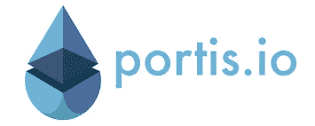
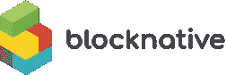
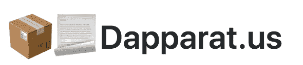
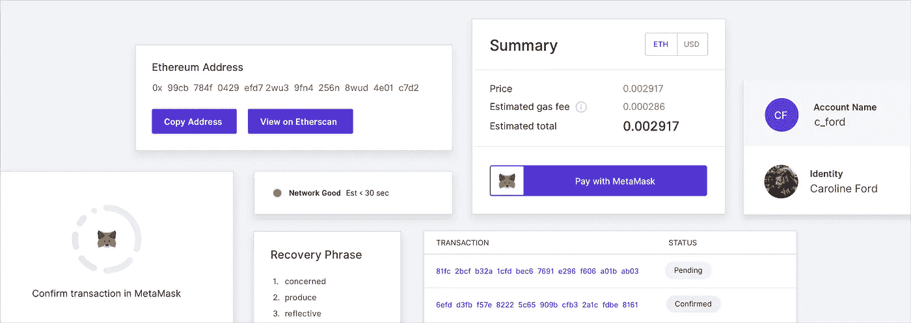
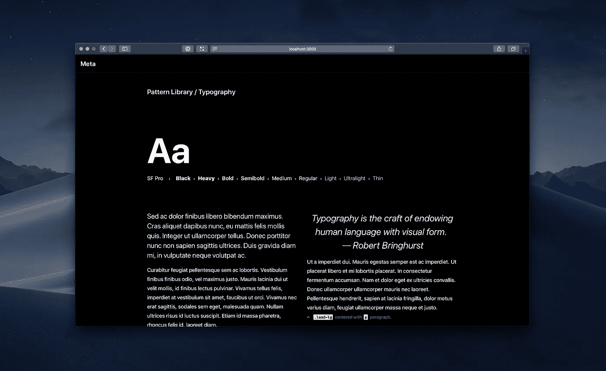

# 以太坊 UX 工具:终极指南

> 原文：<https://medium.com/hackernoon/ethereum-ux-tools-the-ultimate-guide-aad1cd2c128>

# 让我们开始吧:

对于第一次尝试进入分散式应用程序(dapps)世界的任何有经验的开发人员来说，都有一个巨大的学习曲线。

与区块链一起构建是困难的——从决定在哪个平台上构建到学习每个智能签约协议的复杂性……对于新开发人员来说，有很多地方需要学习。

而且即使在学习了核心以太坊工具的来龙去脉——**、* [*松露*](https://truffleframework.com/boxes) *、*[*infura*](https://infura.io/)——你还是要解决可用性的障碍。*

*幸运的是，在过去的几个月中，已经发布了许多工具来帮助您应对这些挑战。我们编辑了这个列表，以帮助您了解哪些项目正在解决不同的 web 3 UX 挑战。*

*希望这能让你对以太坊生态系统中的可用性有一个更好的了解，并使你能够创建一个普通网络消费者容易使用的 dapp！*

# *让我们开始吧:*

# *1.钱包:*

*虽然我们都熟悉像 [MetaMask](https://metamask.io/) 、 [EQL](https://equal.tech/) 、 [Balance](https://balance.io) 和[比特币基地钱包](https://wallet.coinbase.com/)这样的钱包，但围绕钱包正在发生许多新的创新，以提高用户的参与度。*

**

## *波蒂斯*

*[https://www.portis.io](https://www.portis.io/)*

*Portis 有一个 javascript SDK，使 dapps 能够为用户提供本地无墙体验。Portis 负责设置钱包、签署交易和汽油费。Portis 让与 dapp 的互动感觉像是 web 2.0 体验。用户仍然控制着他们的密钥——Portis 只是安全地存储它们。*

**

## *Fortmatic*

*[https://fortmatic.com](https://fortmatic.com/)*

*Fortmatic 是一个兼容 Web 3 的 JavaScript SDK，它使最终用户能够在任何现代桌面或移动浏览器上只需他们的电话号码就可以与任何 dapp 进行交互。*

# *🔥👛*

## *一次性钱包*

*[https://github.com/austintgriffith/burner-wallet](https://github.com/austintgriffith/burner-wallet)*

*一次性钱包使新用户能够直接在浏览器上快速交易。奥斯汀·格里菲斯一直在领导社区开发这种方法——这种方法在丹佛联邦理工学院发挥了完美的作用。*

# *2.现成的工具:*

**

## *按身份上船*

*[https://embark.status.im](https://embark.status.im/)*

*Embark 是一个开发者环境，旨在帮助您尽快建立并运行 dapp。它自带一些非常强大的功能:*

*   ***自动智能合约部署** — Embark 负责部署您的智能合约，并在您更改代码时重新部署它们。*
*   ***客户端开发** —在 Embark 中使用您选择的框架构建您的应用程序。*
*   ***测试** —使用 JavaScript 通过 Web 3 测试您的应用程序和智能合约。*
*   ***分散式应用分发** — Embark 集成了 IPFS 等分散式存储，帮助你在网络中分发应用。*
*   ***点对点消息传递** —通过类似耳语的通信协议发送和接收消息。*

**

## *Blocknative 辅助*

*[https://blocknative.com](http://blocknative.com)*

****披露*** *:我正在与 Blocknative 合作，是该工具的超级粉丝。**

*Assist.js 帮助 dapp 开发团队轻松接纳新用户——使他们能够更清晰、更自信地进行交易。*

*怎么会？通过以编程方式确定和概述最终用户要遵循的明确步骤。这有助于用户克服常见的障碍，并防止常见的陷阱。*

***辅助分为四个部分:***

1.  ***就绪性评估** —以编程方式检测每个用户使用您的 dapp 的技术就绪性。*
2.  ***Onboarding Assistance** —一个开箱即用的组件化 UI，指导用户完成使用 dapp 所需的操作。*
3.  ***事务感知** —向机载用户提供关于他们正在进行的事务的实时反馈，包括如何处理常见的陷阱和错误。*
4.  ***性能分析** —让开发人员对您的 dapp 的“交易就绪性”和“交易体验”有一个基本的了解，这样您就可以了解用户的困难所在。*

**

## *Dapparat.us*

*[https://github.com/austintgriffith/dapparatus](https://github.com/austintgriffith/dapparatus)*

*[Austin Griffith](https://twitter.com/austingriffith) 为 dapps 创建了一套可重用的 react 组件。包括的一些组件有:契约加载器、元掩码、gas、事务 ui、事件准备器等。对于那些希望拥有完整代码库的人来说，这是一个很好的起点。*

## ***边注:**查看丹佛联邦理工学院的 UX 和可用性小组，深入探究当今生态系统面临的一些 UX 挑战。*

*Featuring: Jeff Vier (Ideas by Nature), Tom Teman (Portis), Taylor Monahan (MyCrypto), Matt Cutler (Blocknative), Sean Li (Fortmatic). Moderated by Gustavo Esquinca (ConsenSys Design)*

# *3.设计系统:*

**

*An overview of Rimble, from ConsenSys Design*

*设计系统是一系列可以在不同组合中重用的组件。它们旨在使设计人员和开发人员能够在大型项目中推广最佳实践和一致的设计。把 [bootstrap](https://getbootstrap.com/) 看作 OG 设计系统之一。*

***对于 Web 3 设计系统，请查看:***

*   *林布尔(ConsenSys 设计公司)——[https://rimble.consensys.design/](https://rimble.consensys.design/)*
*   *洛瑞基特(阿拉贡)——[https://lorikeet.design/](https://lorikeet.design/)*

****披露:*** *我以前在 ConsenSys 工作。**

# *4.开源用户界面:*

**

*Meta is an open source blockchain UI framework from Universe Labs*

*一些项目开放了部分设计，供社区构建:*

*   *分散式用户界面—[https://github.com/decentraland/ui](https://github.com/decentraland/ui)*
*   *奖金 UI—[https://components . bounts . network/](https://components.bounties.network/)*
*   *阿拉贡 UI—[https://ui.aragon.org/](https://ui.aragon.org/)*
*   *元用户界面—[https://github.com/universelabs/meta](https://github.com/universelabs/meta)*
*   *meta mask UI—[https://github . com/meta mask/meta mask-extension/tree/develop/UI/app/components](https://github.com/MetaMask/metamask-extension/tree/develop/ui/app/components)*

# *5.流行的前端以太坊 API:*

*这些是库的集合，允许已经熟悉 JS 或 react 的开发人员构建 dapps 和/或集成以太坊智能合约。*

*   *web 3 JS—[https://github.com/ethereum/web3.js/](https://github.com/ethereum/web3.js/)*
*   *Web 3 反应—[https://github.com/NoahZinsmeister/web3-react](https://github.com/NoahZinsmeister/web3-react)*
*   *涡旋(反应)——[https://github.com/Horyus/vortex](https://github.com/Horyus/vortex)*
*   *tasit(react native)——[https://github.com/tasitlabs/tasitsdk](https://github.com/tasitlabs/tasitsdk)*
*   *毛毛雨(反应过来)——【https://github.com/truffle-box/drizzle-box *
*   *以太 JS—【https://github.com/ethers-io/ethers.js/ *

# *打造用户想要的东西…*

*我的好朋友 Ryan 最近做了一个题为“dapp 很酷… dapp 用户更酷”的演讲。他的观点是，如果我们不能让人们开始使用它们，去中心化的应用程序就不能改变世界，如果我们不改善 UX，我们也不会让人们开始使用它们。*

*希望这能激励你建立一个人性化的 dapp。祝你好运！*

## *如果你觉得这篇文章有用或有趣，请👏或者分享。对您希望添加到列表中的任何反馈或工具发表评论。*

*[肖恩·奥康纳](http://twitter.com/aseoconnor)是 [Saffron Solutions](https://www.saffronsolutions.io/) 的产品和设计主管，负责连接商业和区块链。如果你正在建立一个 dapp，并且需要 UX 或产品开发方面的帮助，请联系我们！*