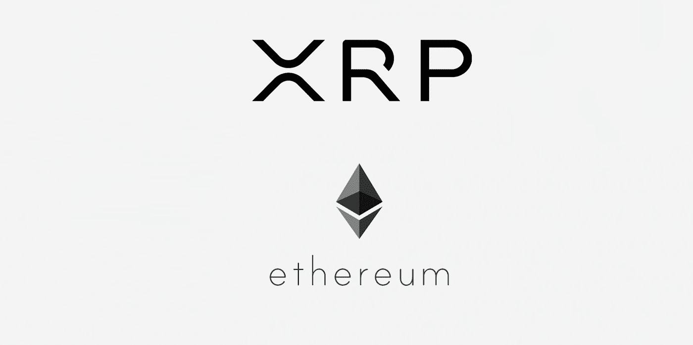
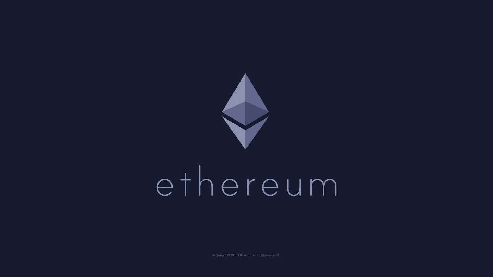
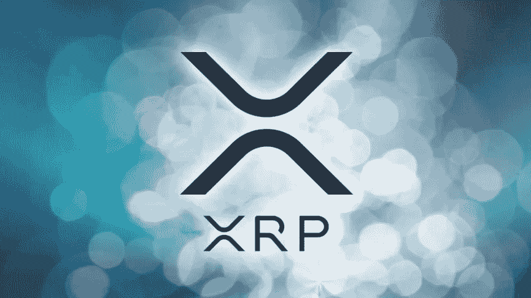
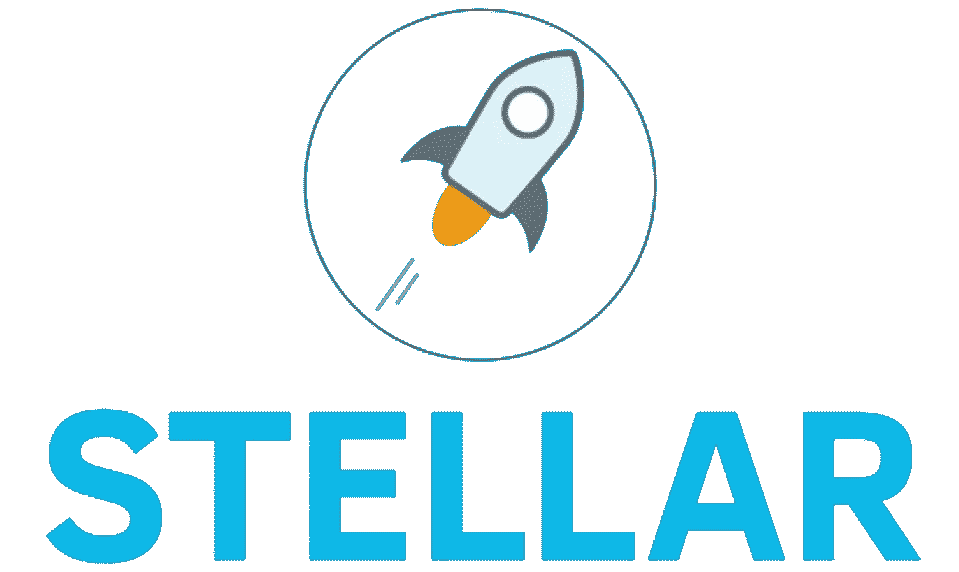

# 以太坊 vs 瑞波/XRP 哪个是 2019 年更好的投资？

> 原文：<https://medium.com/hackernoon/ethereum-vs-ripple-xrp-which-one-is-a-better-investment-for-2019-7d02f03febd1>

以太坊和 Ripple/XRP 都是很好的投资，就市值而言，它们都是仅次于比特币的第二名，而且它们也有可用的产品。

现在，要回答哪种产品更好的问题，首先我们需要看看这两种加密货币的优势，以及第三种选择。

# 以太坊/以太/以太

以太坊是一个基于区块链的开发平台，支持分散应用(dApps)和智能合约的部署。

以太坊智能合约功能最广为人知的用途是通过初始硬币发行(ICO)进行众筹，在以太坊区块链发生了数百起数百万美元的 ICO。

这些 ICO 导致了使用以太(ETH)支付交易费用的新加密货币的诞生，提高了对以太坊加密货币的需求。

分散的应用程序是另一个可以影响以太价值的因素，因为应用程序内或游戏内的项目将在以太中进行估价，例如 CryptoKitties dapp 允许人们购买价值一定数量以太的虚拟小猫。

## 所以你当你有:

*   执行智能合同的公司(需要 ETH)
*   人们使用建立在以太坊上的加密货币进行交易(需要以太坊支付交易费用)
*   购买应用内/游戏内物品的人(使用 ETH 购买)

你有一个广泛采用和需求 ETH 加密货币的配方，除此之外，以太坊在其用例中具有先发优势，它是最知名和最值得信赖的区块链开发平台。

以太坊=区块链

Ether/ETH =加密货币

# **涟漪/XRP**

Ripple 加密货币(XRP)的独特之处在于:

*   它不能被开采
*   既然不能开采，就不需要向矿工支付交易费
*   由于矿工不需要支付交易速度和成本已大幅降低
*   完成交易需要 2-3 秒钟
*   交易成本 0.00001 **XRP** (10 降)。我甚至懒得把它转换成美元或英镑，因为成本很低，不值得花时间。基本上就是**零头。**

除了上述好处，Ripple 还有**两款使用 XRP 的工作产品**:

## **xRapid**

一种商业产品，允许银行利用 XRP 的低成本和高速度，通过 XRP 在全球范围内转移资金。

有了 xRapid，银行将无需通过交易所和个人钱包来获得 XRP 的好处。

## **x 电流**

使银行能够在全球范围内转移资金，同时能够跟踪资金转移的方式和地点。

Ripple/XRP 的寿命也超过了数千枚替代硬币，**自 2013 年发布以来一直保持着前 5 名的位置**(在 marketcap)。

想想看，XRP 自从发行以来一直是排名前五的硬币，并且保持这个位置超过 5 年。

2013 年，Ripple 是市值第三高的加密货币(3.3 万美元)，仅次于排名第二的莱特币(5.2 万美元)和排名第一的比特币(110 万美元)。

Ripple Labs =公司

Ripple =区块链

XRP =加密货币

# **恒星流明/XLM**

我们已经研究了以太坊(区块链开发/ICO 平台)和 XRP(超便宜、超快速的交易)，现在我们有了一种加密货币，这两者都做**。**

Stellar Lumens 是由 Ripple/XRP 的联合创始人杰德·麦卡勒创建的，这可能解释了为什么 XLM (Stellar 的货币)可以自夸:

*   平均 3 秒的交易时间
*   0.00001 XLM 的交易费用，这也是一美分的零头
*   交易费的存在只是为了防止 DDoS/Spam 攻击，除此之外，交易实际上是免费的

因此，恒星/XLM 在功能上类似于瑞波/XRP，但它也是一个区块链开发平台，开发人员可以:

*   部署分散的应用程序
*   部署智能合同
*   通过 ICO 众筹

Stellar 网络还可以作为一个分散的、分布式的交易所，任何类型的资产都可以在这里交易，只要它已经被添加到 Stelalr 网络中。

例如，如果 John 想将英镑转给 Amy，但是 John 只有美元，则提交一个报价，在分布式交换中卖出美元兑换英镑。然后，该报价形成一个订单簿。

恒星网络使用订单簿来寻找这笔交易的最佳汇率，这将减少一个用户支付的费用。

恒星流明=区块链

流明/XLM =加密货币

## **最终想法**

以太坊和 Ripple 都是很好的投资选择，都有工作产品，都有很强的团队，都有很强的合作关系，都有联盟，都有各自的基础。

它们也比许多加密货币寿命长，并在总市值(或加密货币的总价值)方面占据前五名的位置。

就哪一项投资更好而言？我建议投资这两种货币，这是两种非常不同的加密货币，有不同的目标，不同的团队和不同的合作伙伴。

如果你可以在余生吃苹果或橘子或者两者都吃之间做出选择，你会选择什么？

最后，我还想推荐 Stellar Lumens，因为它结合了两种加密技术的优势，并且拥有自己的分布式交换。

如果你决定投资以太坊(ETH)、瑞波(XRP)或恒星流明(XLM)，你可以使用**直接投资。**

## **我希望你喜欢我的故事，请随意查看下面这些有用的资源:**

**[**免费下载勇敢浏览器，观看广告赚取$ BAT**](https://brave.com/kxh360)**