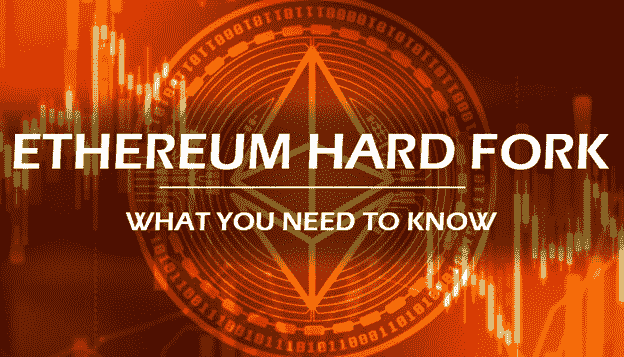
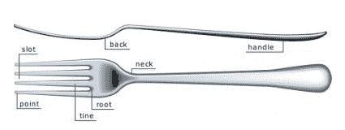
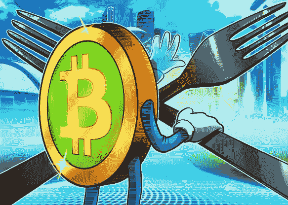
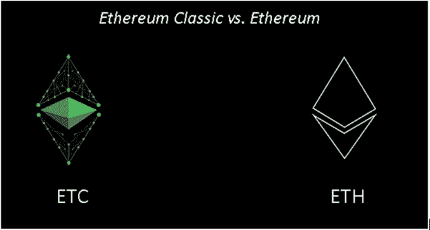
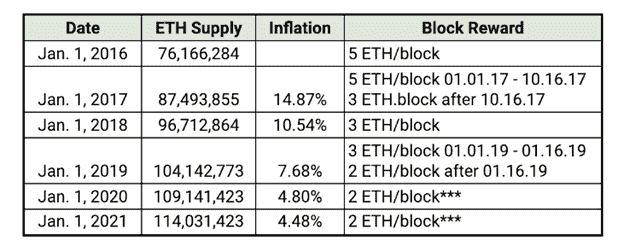

# 以太坊期待已久的君士坦丁堡升级——期待什么和你需要知道什么

> 原文：<https://medium.com/hackernoon/ethereums-long-awaited-constantinople-upgrade-what-to-expect-and-what-you-need-to-know-965c57f0535c>

以太坊期待已久的君士坦丁堡升级计划在#7080000 街区进行。在这个期待已久的升级开始前几个小时，核心开发人员发布了另一个延期，原因是与升级的一个组件相关的潜在安全漏洞。

***作为代币持有者，没有什么需要做的，既有升级的，也有延期的。已经升级的完整节点操作员需要再次升级到紧急版本的 Etherum 软件客户端，或者降级到先前的版本。***

***分叉的新发布日期还没有公开。但是这就引出了一个问题，如果这是一个分散的网络，那么谁有权决定延迟？***

自从区块链成为现实，就有了硬分叉。有时，由于在代码中发现了一个漏洞，其他时候是为了响应涉众之间在进度更新上未解决的分歧，甚至偶尔是由于计划的升级。

**什么是叉子？**

我相信你已经猜到了，这不是用来吃饭的器具，也不是用来收集干草的。在这方面，分叉本质上是区块链代码的变化；把它想象成对你的微软办公软件的升级。

有两种叉子，硬叉子和软叉子。简而言之，硬分叉是对不向后兼容的区块链代码的升级，因此，没有升级的节点将不能验证由升级的节点创建的块。软分支是对代码的向后兼容升级，它接受来自升级和未升级节点的块。无论哪个节点达到多数，无论是升级的还是未升级的，都将导致更改停滞或被“洗掉”。

注意:不要将这些分支与软件分支相混淆，在软件分支中，新产品是通过获取原始代码并对其进行调整而创建的，例如从比特币代码创建莱特币就是这种情况。

在以太坊君士坦丁堡升级的情况下，我们说的是硬分叉。

**过去值得注意的分叉**

多年来，由于升级版与非升级版之间没有足够明显的多数，出现了一些明显的硬分叉，导致了硬币的完全分裂。

**2017 年 8 月— BCH**

在比特币链上整合了有争议的 SegWit 功能后，比特币现金就是这一功能的产物，并一直持续到今天，拥有相当强大的追随者。从那以后，又出现了 44 种其他的叉子，大多数都导致了被不恰当采用的硬币很快消亡。

**2016 年 7 月— ETC**

2016 年 6 月，360 万以太(约 5000 万美元)从 DAO 的帐户中被盗，利用了同年 5 月提出的关于以太坊网络的漏洞之一。在此之后，道和以太坊社区就如何解决这一盗窃资金的问题展开了激烈的辩论。一个硬分叉被决定，允许回滚发生和被盗的资金被移回到原来的所有者的帐户。社区的一部分人拒绝了这个分叉，前提是区块链不能被改变，并决定保留原始的区块链版本，从而产生了以太坊经典。

【2018 年末— ETH

这种即将到来的分叉最初计划在 2018 年下半年进行。但是由于在 Ropsten Testnet 硬分叉中遇到了 T2 问题，导致了一个 3 路分叉，所以被以太坊开发团队取消了。在此之后，新的 Testnet fork 计划于 2019 年 1 月 9 日在 Rinkeby Testnet 上发布。以太坊核心开发者彼得·齐拉吉宣布，拆分成功。就在分叉发生的前几个小时，以太网核心开发者又一次推迟了。

这一次，他们陈述了另一个已确定的漏洞是导致这一新延迟的原因。根据一份声明，尽管他们找不到任何漏洞的案例，但他们仍然不能保证零风险。该漏洞与 [EIP-1283](https://eips.ethereum.org/EIPS/eip-1283) 有关，导致某些智能合约容易受到[重入攻击](/chainsecurity/constantinople-enables-new-reentrancy-attack-ace4088297d9)。

区块链安全研究员 Chainsecurity 描述了关于这一特定漏洞的更多细节。

**这个叉子是讲什么的？**

该硬分叉计划发生在#7080000 区块，估计发生在 1 月 16-17 日左右，但由于延迟，没有确切的替换区块编号或日期。升级将包括新代码调整的五个主要实现，也称为 EIP(以太坊改进协议)。

**EIP 145**:EVM 按位移位指令

*   作者:Alex Beregszaszi 和 pawebylica
*   由于在协议中添加了本地功能，有效地削减了链上某些活动的成本。

**EIP 1014** :瘦创 2

*   作者:维塔利克·布特林
*   允许与链上尚不存在的地址进行交互。

**EIP 1052** : EXTCODEHASH 操作码

*   由尼克·约翰逊和帕韦·拜利卡撰写
*   将确保返回合同代码的 keccak256 哈希。降低网络上某些活动的成本。

**EIP 1283** :无脏图商场净气计量

*   汤唯写的
*   实现合同存储的新用途，降低商场的燃气成本。

**EIP 1234** :君士坦丁堡难度炸弹延迟和格挡奖励调整

*   由 Afri Schoedon 撰写
*   将格挡奖励从 3 次/格挡减少到 2 次/格挡。延迟难度炸弹 12 个月。

需要注意的一个关键链接是这个 [Github 页面](https://github.com/ethereum/pm/wiki/Constantinople-Progress-Tracker)，它将允许你跟踪所有与君士坦丁堡升级相关的进程。

EIP 1234 被认为是(如果不是的话)最重要的升级之一，因为这将使新 ETH 的总供应量减少约三分之一，从而将乙醚的膨胀率从 7.7%降低到 4.8%。

Source: ConsenSys

在此分叉之后，预计块确认时间将保持在 15 秒。当一个单独的分叉，将以太坊共识从 PoW 移动到 PoS 时，这个时间可能会改善。有一些希望，与发行智能合约相关的交易费用可能会通过这种分叉减少，但尚不清楚它是否会减少，以及会减少到什么程度。

**需要做什么？**

受影响最大的将是币安、比特币基地、北海巨妖等交易所。我们需要更新他们的节点以及其他与加密相关的服务，例如 Trust Wallet、MetaMask & Etherscan。实质上，任何完整节点运营商都需要将其软件升级到最新版本。然而，由于延迟，他们现在需要对他们的以太坊软件客户端的紧急版本进行另一次升级，或者降级到先前的版本。

这么说的话，以太坊将不会被要求做任何准备叉子的事情，也没有任何需要，现在有一个延迟。此外，一旦升级发生，它很可能不会对硬分叉的实现产生任何明显的影响。值得指出的是，在这一变化过程中，价格经常会出现大幅波动。通常，投资者会在硬分叉之前买入一枚硬币，希望从另一端出来的新硬币数量相等。这通常是一个大的下降，因为所有的硬币持有者将出售他们不想要的硬币，从他们不支持的版本。但由于这是常识，也有其他投资者试图利用这些预期的价格波动，并实施“高卖低买”过程，导致升级前后的整体不稳定波动。

通常建议将这种硬币的交易保持在最低限度，以确保用户在硬分叉过程中不会陷入任何潜在的灾难、错误或漏洞，正如最近的延迟所示。

没有宣布重新安排此分叉的新日期。

如上所示，叉子并不总是坏的，许多人会说，为了让区块链技术进入下一个时代，叉子是必要的。当考虑到这是一个简单的软件升级，它似乎是一个很自然的事情，任何软件相关的网络。事实上，许多用户都非常兴奋地看到这一新的升级将如何改善以太坊网络的整体功能，为这一技术在其他行业的未来改进和实施铺平道路。

***·*** *aelf Telegram community:* [*English*](https://t.me/aelfcommunity)*,* [Türkçe](https://t.me/aelf_turkish)*,* [*Español*](https://t.me/aelf_spanish), [한국](https://t.me/aelfkorean), [日本語](https://t.me/aelfjapan),[*中文*](https://t.me/aelf_chs)*，*[*русский*](https://t.me/aelf_russian)*,* [*العربية*](https://t.me/aelf_arabic)*,* [*Deutsch*](https://t.me/aelfgerman)*,* [*Italiano*](https://t.me/aelfitalian)*,* [*Français*](https://t.me/aelf_french)*,* [*हिन्दी*](https://t.me/aelfindia)*, and* [*Tiếng Việt*](https://t.me/aelf_vietnam)*,*

**aelf*[*推特*](https://twitter.com/aelfblockchain)*

***aelf*[脸书](https://www.facebook.com/aelfofficial/)**

****aelf*[*YouTube*](https://www.youtube.com/c/aelfblockchain)***

****aelf*[*Instagram*](https://www.instagram.com/aelfblockchain/)***

****aelf*[*Reddit*](https://www.reddit.com/r/aelfofficial/)***

****aelf*[*中等*](https://medium.com/aelfblockchain)***

****aelf*[*Github*](https://github.com/aelfProject)*(完整 aelf 项目代码)****

****欲了解更多信息，请访问** [**aelf.io**](http://aelf.io/)**