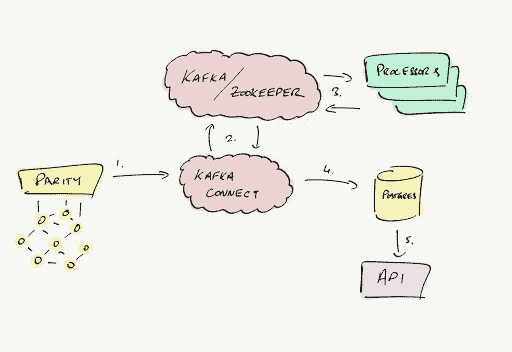
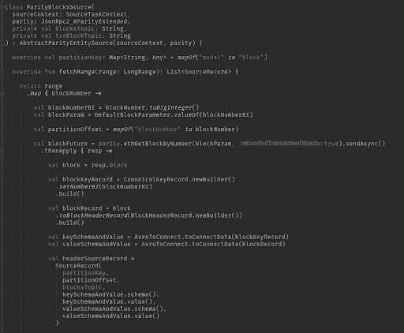

# EthVM:由 Kafka 支持的第一个开源块浏览器

> 原文：<https://medium.com/hackernoon/ethvm-first-open-source-block-explorer-powered-by-kafka-e1639fc93e8e>

## 实现 Apache Kafka 生态系统以处理以太坊区块链数据

自比特币将加密货币引入世界以来的十年里，该行业的发展方式可能连 Satoshi 都无法想象。2015 年 7 月出现的以太坊区块链，由于以太坊虚拟机(EVM)——一个开发和执行智能合同的环境，打开了一个新的可能性世界。

EVM 使得以太坊网络不仅仅是一个货币交易历史的存储库——它是一个邀请探索、互动和合作创新的生态系统。

延续了 MEW (MyEtherWallet)开源产品的传统，使用户和开发人员能够探索区块链的可能性，我们引入了 EthVM:第一个基于 Apache Kafka 的以太坊开源块浏览器和数据处理引擎。

# EthVM 的起源:一个导航 EVM 的指南针

块浏览器是一个不可或缺的工具，区块链审计和决策，使用方便的浏览器格式。探索者帮助用户验证交易和智能合同的执行情况，检查余额，并监控天然气价格。

对于开发人员来说，块探索者揭示了为 dapps 和开源钱包检索区块链数据的新可能性，激发了整个不断增长的以太坊生态系统的创新，同时提供了在去中心化网络中至关重要的透明度。

当我们的团队首次开始开发 EthVM Alpha 时，最初的想法是创建一个易于使用的区块链浏览器，其特点是前端由 [VueJS](https://vuejs.org/) 构建，后端由 [RethinkDB](https://www.rethinkdb.com/) 提供实时更新。

作为一名开发者，你真的只需要三个基本的东西来构建一个浏览器，这就是我们开始做的:

1.  与网络同步的以太坊节点
2.  存储信息的数据库
3.  一个展示这些信息的网站

然而，这些并不是需要考虑的唯一因素。通常，当区块链增长到一定规模时，您需要处理的信息量是巨大的。不仅如此，运行完全同步的节点可能是一个复杂的过程。这可能需要大量的时间和资源，并对 CPU 和磁盘提出相当高的要求。

# **满足对开源以太坊资源管理器的需求**

在我们努力应对这些挑战时，我们的团队意识到，不仅现有的 block explorer 选项有限，而且它们大多是闭源的，这意味着只有一小部分开发人员可以为这一重要工具的创新做出贡献。

我们发现，该领域的其他人正在通过一项由 [Giveth.io](https://giveth.io/) 的创始人[格里夫·格林](https://twitter.com/thegrifft)发起的精彩倡议来解决这个问题。他 2018 年 4 月在 [Ethresearch](https://ethresear.ch/) 上的帖子——一个允许你参与以太坊研究工作的社区——强调了开源方法对阻止探索者的重要性。它与我们自己的愿景产生了共鸣，并加强了我们的信念，即以太坊生态系统需要一个直观的开源浏览器，可以在世界各地许多人的帮助下发展。

# **意外的灵感**

在技术进步的协作本质的另一个证明中，EthVM 最重要特性的灵感来自一个意想不到的来源。由 [Boerge Svingen](https://twitter.com/bsvingen?lang=en) 在 Confluent 博客上写的一篇名为“ [*与 Apache Kafka 一起在纽约时报*](https://www.confluent.io/blog/publishing-apache-kafka-new-york-times/) 出版”的帖子，描述了标志性的纽约时报如何从一堆 API、服务、生产者和消费者过渡到由 Apache Kafka 驱动的基于日志的架构。

要突出显示某个段落:

> 传统上，数据库被用作许多系统的真实来源。尽管有很多明显的好处，但从长远来看，数据库可能很难管理。
> 
> …基于日志的体系结构通过将日志作为事实的来源来解决这个问题。数据库通常存储某个事件的结果，而日志存储事件本身，因此日志成为系统中发生的所有事件的有序表示。使用此日志，您可以创建任意数量的自定义数据存储。这些存储成为日志的物化视图—它们包含派生的内容，而不是原始的内容。如果您想要更改这种数据存储中的模式，您可以创建一个新的模式，让它从头开始使用日志，直到它跟上，然后丢弃旧的模式。

区块链本质上是一个不断增长的记录列表，合并成使用加密技术链接的块——用程序员的术语来说就是一个[链表](https://en.wikipedia.org/wiki/Linked_list)。在 Kafka 术语中，以太坊客户端将是我们的[生产者](https://docs.confluent.io/current/clients/producer.html)——负责创建我们的‘日志’的新条目。

Boerge 以上解释的含义是巨大的:

*   如果架构是基于日志的，您可以使用和处理 Kafka 日志，并将信息输出到其他地方——例如，数据库或 PDF 报告。
*   另外，根据主题的建模和配置方式，您可以多次重放日志。这意味着您可以随时“回到过去”并重新处理数据。

# **EthVM 和卡夫卡生态系统**

那么，这在 EthVM 中是如何应用的呢？通过完全拥抱完整的 Apache Kafka 生态系统，由以下工具组成:[**【Kafka Connect】**](https://docs.confluent.io/current/connect/index.html)**[**Kafka Streams**](https://kafka.apache.org/documentation/streams/)**和**[**Kafka Schema Registry**](https://docs.confluent.io/current/schema-registry/index.html)**。********

****让我们看看如何在 EthVM 环境中使用这些工具:****

## ******卡夫卡连接******

****官方项目将 [Kafka Connect](https://docs.confluent.io/current/connect/index.html) 描述为:****

> ****…一个用于在 Apache Kafka 和其他系统之间可扩展且可靠地传输数据的工具。它使得快速定义将大量数据移入和移出 Kafka 的连接器变得简单。Kafka Connect 可以接收整个数据库或从所有应用服务器收集指标到 Kafka 主题中，使数据可用于低延迟的流处理。导出作业可以将 Kafka 主题中的数据传送到二级存储和查询系统中，或者传送到批处理系统中进行离线分析。****

********

****This is how we capture a block (simplified for the purposes of this article)****

****对于 EthVM，我们创建了一个 *ParitySource* 连接器，它允许我们从一个*RPC*/*web socket*端点读取所有需要的信息，并将数据转储到特定的主题。****

****有了 Kafka Connect，我们有了一套标准化的 API 来将数据接收到 Kafka。这种方法的美妙之处在于，未来我们将能够创建更多基于相同原理的连接器(以支持 Geth 和其他客户端)。****

## ******卡夫卡溪流******

****一旦重要数据出现在 Kafka 主题中，第二步是解释数据以获得有意义的信息。这就是[卡夫卡溪流](https://kafka.apache.org/documentation/streams/)的用武之地:****

> ****Kafka Streams 是一个用于构建应用程序和微服务的客户端库，其中的输入和输出数据存储在 Kafka 集群中。它结合了在客户端编写和部署标准 Java 和 Scala 应用程序的简单性和 Kafka 服务器端集群技术的优势。****

****在 EthVM 上，我们创建了专门的“处理器”,利用 Kafka Streams 实用程序来执行聚合、归约、过滤和其他有用的操作。****

****例如，一个专用处理器分析并提取可替换的令牌传输，如 ETH 或 ERC20。另一个专门研究不可替代的，像 ERC721 上的那些。其他处理器关注有用的区块指标，包括与平均油价、成功或失败交易数量以及交易费用相关的信息。事实上，我们可以根据需要创建任意多的处理器来“挂钩”具体主题，以接收最相关的数据。****

****我们正在使用 Kafka Connect 创建一个接收器，用于存储处理器输出的数据。目前，我们正在转向 [Postgres](https://www.postgresql.org/) / [时标](https://www.timescale.com/)，但我们最初是从 [MongoDB](https://docs.mongodb.com/) 开始的。****

## ******Kafka 模式注册表******

****那么[模式注册中心](https://docs.confluent.io/current/schema-registry/index.html)呢？****

> ****Schema Registry 为您的元数据提供了一个服务层。它为存储和检索 Avro 模式提供了一个 RESTful 接口。它存储所有模式的版本化历史，提供多种兼容性设置，并允许根据配置的兼容性设置和扩展的 Avro 支持来演进模式。****

****基本上，它是一个存储 Avro 模式的地方。但是什么是 [Avro](https://avro.apache.org/docs/current/) ？****

> ****Avro 是在 Apache 的 Hadoop 项目中开发的远程过程调用和数据序列化框架。它使用 JSON 来定义数据类型和协议，并以紧凑的二进制格式序列化数据。****

****Avro 是阿帕奇卡夫卡生态系统中的一等公民。我们已经在 EthVM 中使用它来创建自定义实体，这些实体不知道以太坊的任何具体实现。作为一个额外的好处，它的格式非常紧凑，允许我们节省磁盘空间。****

# ******帮助我们塑造 EthVM 的未来******

****我们很高兴地分享，生态系统的 Alpha 版本目前正在[上线](https://ropsten.ethvm.com/)——初始处理器设置，使用 Mongo 作为主存储数据库。展望 Beta 版，我们希望使 EthVM 更加稳定，并实现一些功能，包括:****

*   ****迁移到 NestJS API****
*   ****从 MongoDB 迁移到 Postgres /时标****
*   ****改进了 Kafka 上的处理(挤压 bug 并提高速度)****
*   ****带一个 Terraform 提供者来正确地在 AWS 上部署代码****

****我们的首要目标是尽可能快地同时处理以太坊链，最终增加更多的链。有了一个好的 Kafka 集群，我们将能够同时处理多个链。此外，块浏览器只是查看区块链数据的众多方式之一[！](https://github.com/EthVM/ethvm/wiki/Inspecting-Kafka)****

****EthVM 由 MyEtherWallet 提供支持，这是一家致力于生产开源项目的公司，这些项目将使整个以太坊生态系统受益。我们共同设想了一个全球金融的未来，在这个未来中，加密将在为已经建立的市场带来新的机会方面发挥重要作用。****

****如果你喜欢处理数据，分享我们对以太坊的热情，我们希望你能加入。我们的代码库在 [Github](https://github.com/EthVM/EthVM) 上。此外，我们还有一个公共的[*et hvm—Devs*](https://myetherwallet.slack.com/)Slack 频道，在那里你可以和核心开发者一起玩([邀请链接](https://join.slack.com/t/myetherwallet/shared_invite/enQtNTc2MjAxMzUxOTc0LWQwNzMzOWEzOGE0NzU2YjcwMDFhMjdlY2YwOWJhMWQ2YzNjZTU5MmFkMTZmYjllZTU1OWVmMmIxM2RkMTgwN2M))。****

****因为我们真的很喜欢进入社区的细节和听到各种各样的反馈，我们期待着发布更多深入这个项目的一些很酷的技术方面的文章。敬请关注，保持联系！****

*****由 EthVM 技术主管 Aldo Borrero 撰写。*****

*****有关 MEW 和 EthVM 的更多内容，请参见**[***MEW 出版物***](https://medium.com/myetherwallet) ***。*** *欲了解更多详情并投稿，请前往*[***Github***](https://github.com/EthVM/EthVM)***。********