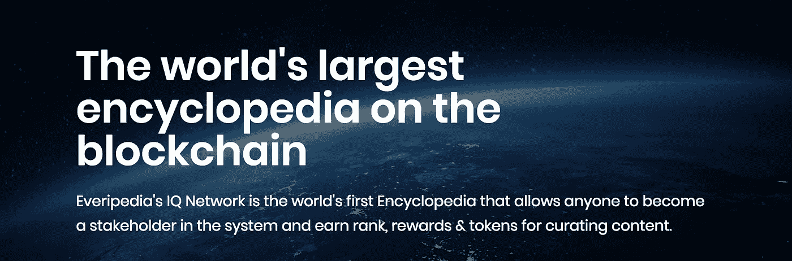
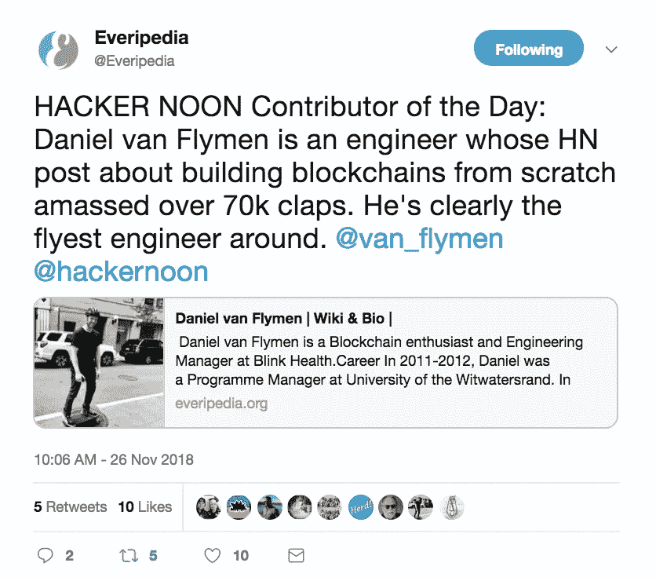
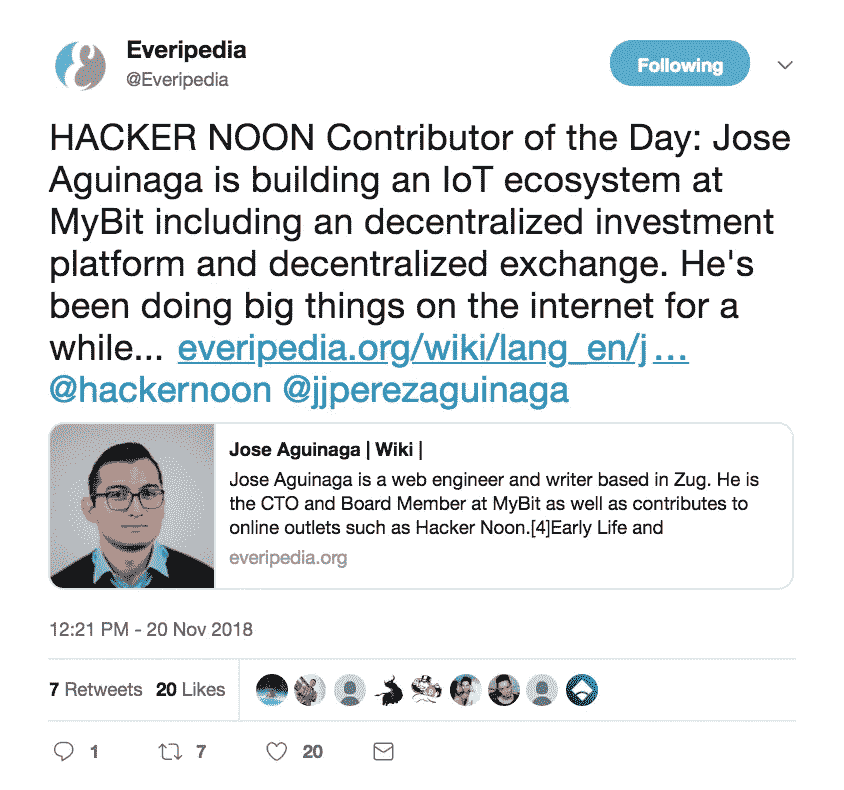

# Everipedia +黑客正午合作伙伴关系

> 原文：<https://medium.com/hackernoon/everipedia-hacker-noon-partnership-bd6632ba23aa>

## 亲爱的好奇黑客，

互联网如何最好地组织人类的所有知识？我没有答案，但下一代数字百科全书可能是解决方案的一部分。Everipedia 的目标是制作世界上最好的数字百科全书。一个是由 EOS 区块链驱动的。他们会达到目的吗？我不知道——区块链上的百科全书可能是杀手级区块链应用程序的圣杯——我确实相信，如果由区块链驱动，维基百科将是一个更受信任、功能更强的世界知识网站。**我非常兴奋地宣布，我们已经与 Everipedia 合作，以更好地推广和引用 Hacker Noon 贡献者和故事。**

## Everipedia 上的黑客正午贡献者

Everipedia 及其社区将为顶级黑客正午贡献者建立个人页面。这些页面将增加我们的贡献者和他们的故事的数字足迹。以下是黑客正午贡献者的 60 个[早期页面:](https://everipedia.org/wiki/lang_en/list-of-hacker-noon-contributing-writers/)

*   [梅格·亚当斯](https://everipedia.org/wiki/lang_en/meg-adams/) ( [故事](https://hackernoon.com/@megkadams))
*   [何塞·阿吉纳加](https://everipedia.org/wiki/lang_en/jose-aguinaga/) ( [故事](https://hackernoon.com/@jjperezaguinaga))
*   海伦·安德森
*   [尼玛·阿斯加里](https://everipedia.org/wiki/lang_en/nima-asghari/) ( [故事](https://hackernoon.com/@insideNiMA))
*   阿齐姆·阿兹哈尔 ( [故事](https://hackernoon.com/@azeem))
*   米莎·贝诺利尔
*   [索菲亚·布鲁克](https://everipedia.org/wiki/lang_en/sophia-brooke/) ( [故事](https://hackernoon.com/@sophia.m.brooke))
*   [尼克·考德威尔](https://everipedia.org/wiki/lang_en/nick-caldwell/) ( [故事](https://hackernoon.com/@nickcaldwell))
*   [琥珀卡塞尔](https://everipedia.org/wiki/lang_en/amber-cazzell/) ( [故事](https://hackernoon.com/@ambercazzell))
*   [特里·克劳利](https://everipedia.org/wiki/lang_en/terry-crowley/) ( [故事](https://hackernoon.com/@terrycrowley))
*   [Nir Eyal](https://everipedia.org/wiki/QmWyMgWsvibX1UHJ2CeYQsmMYb5e6buWQMC5gNuurzHXab/)**([故事](https://hackernoon.com/@nireyal))**
*   **塞尔日·法盖**
*   **[莉莉·费耶阿本德](https://everipedia.org/wiki/lang_en/lili-feyerabend/) ( [故事](https://hackernoon.com/@Lililashka))**
*   **[娜塔丽·弗莱特](https://everipedia.org/wiki/lang_en/natalie-fratto/) ( [故事](https://hackernoon.com/@nataliefratto))**
*   **[卡森·吉本斯](https://everipedia.org/wiki/lang_en/carson-gibbons/) ( [故事](https://hackernoon.com/@carsoncgibbons))**
*   **[伊塔马尔吉拉德](https://everipedia.org/wiki/QmTNCAmNLPiisYrwt3pBkB26DB7DnY1R5mUgeMBQ7KcdZw/) [(故事](https://hackernoon.com/@itamargilad))**
*   **[奥默·戈德堡](https://everipedia.org/wiki/QmVs1LW1qiMWFqQ6f6XLpgquxgw7MbxTQ9Me56ij2V7ShK/) ( [故事](https://hackernoon.com/@omergoldberg))**
*   **[约翰·豪斯特](https://everipedia.org/wiki/QmYywmeenJBCAdgYtXCiTYTn4rcJRudcawtzimLDWK5QDM/) [(故事](https://hackernoon.com/@johngreathouse))**
*   **[阿德里亚·埃尔南德斯](https://everipedia.org/wiki/lang_en/adri%C3%A0-hern%C3%A1ndez/) ( [故事](https://hackernoon.com/@hc_adria))**
*   **[克里斯·赫德](https://everipedia.org/wiki/QmPP8dvsb6brHkPVD8ZbRJBF22XYTsNrEppJC9SM8zkXNS/) [(故事](https://hackernoon.com/@ChrisHerd))**
*   **杰夫·霍兰 ( [故事](https://hackernoon.com/@jeffhollan))**
*   **[伊森·贾雷尔](https://everipedia.org/wiki/QmRA16R5nver8yhspjevUqHuCWTtNqyqEq1CiFXpTppjir/) [(故事](https://hackernoon.com/@ethan.jarrell))**
*   **丹·杰弗里斯**
*   **[塔尔科尔](https://everipedia.org/wiki/lang_en/tal-kol/) ( [故事](https://hackernoon.com/@talkol))**
*   **凯西·科济尔科夫**
*   **[杰西·劳勒](https://everipedia.org/wiki/QmaAaD4oWsi7ZVmWpdUDNkRGeYoKeXoN2y9CSbxD9FjwWB/) [(故事](https://hackernoon.com/@Lawlerpalooza))**
*   **[莫希特·马莫里亚](https://everipedia.org/wiki/QmYZSg7FFfadXbcniAg7DHNARW7hPybUtDEBzZQHvwjZnS/) ( [故事](https://hackernoon.com/@mohitmamoria))**
*   **[威尔马尼迪斯](https://everipedia.org/wiki/QmbBuTej2Wq7q8rKC9mZZZaAreCCirFiDRnU16QPrXS14M/) [(故事](https://hackernoon.com/@willmanidis))**
*   **[赞曼吉](https://everipedia.org/wiki/Qmd4LEJsKqHmifrUedzCGAipX6iyNsop3KyWznn2sxActG/) [(故事](https://hackernoon.com/@zainmanji))**
*   **[惠特尼·米尔斯](https://everipedia.org/wiki/QmZ4SdDKA71EFQN6Mjso9gqnibFCtSJe5Ln9FfvL8YmFRV/) [(故事](https://everipedia.org/wiki/lang_en/whitney-meers/))**
*   **[贾丝汀·摩尔](https://everipedia.org/wiki/QmPoNYhW1tNtFZ4C2HE6p23VCfpu7BeQKZGHuKXUDkEZmN/) ( [故事](https://hackernoon.com/@justinemoore_85088))**
*   **[奥利维亚·摩尔](https://everipedia.org/wiki/QmcinfpU3iqMfA2FtrG16hJridyXnbAsB1HRFfRrib81Qo/) [(故事](https://hackernoon.com/@justinemoore_85088))**
*   **伯恩哈德·穆勒**
*   **伊莎贝尔·尼奥 ( [故事](https://hackernoon.com/@eisabai))**
*   **[阿波罗·奥诺](https://everipedia.org/wiki/QmVUshUoaf1MrgP8qkomSwpGrdDP2rJVKyPEuUCA4wFSds/) [(故事](https://hackernoon.com/@AAO888))**
*   **杰奎琳·奥尼尔**
*   **[戈加·帕塔尔卡季什维利](https://everipedia.org/wiki/QmV623P6a3NJSALMxBywb6HXE5w2eV232eMdU7biBYeK3b/) ( [故事](https://hackernoon.com/@ent1c3d))**
*   **马扬克·普拉塔普 [(故事](https://hackernoon.com/@mayankpratapeb) s)**
*   **[哈齐布·库雷西](https://everipedia.org/wiki/lang_en/haseeb-qureshi/) ( [故事](https://hackernoon.com/@hosseeb))**
*   **[沙安雷](https://everipedia.org/wiki/QmTDBaT6KZG8QWUsModKkWpdvo3U6aik4SEL4e3rS4SnD7/) [(故事](https://hackernoon.com/@shaanray))**
*   **[山姆·拉多奇亚](https://everipedia.org/wiki/QmWQr8nYBRoPaxAnoukZiLEG4Bwku8AKTLyV663gFKGUzq/) ( [故事](https://hackernoon.com/@iamsamsterdam))**
*   **阿德南·拉希奇 [(故事](https://hackernoon.com/@adnanrahic))**
*   **[耶稣罗德里格斯](https://everipedia.org/wiki/QmQiMiqgRi7pwGrswp4r8GozbjHgLU9PnEgMyi39eYWfDs/) ( [故事](https://hackernoon.com/@jrodthoughts))**
*   **[切尔西·鲁斯特姆](https://everipedia.org/wiki/lang_en/chelsea-rustrum/) ( [故事](https://hackernoon.com/@shareablelife))**
*   **萨迈拉·桑德伯格**
*   **[丹尼尔·施密特](https://everipedia.org/wiki/QmbFSgRBzfqcvy3TaasGtRMsKhttLDKwx9WF2u2ca5oLH7/) [(故事](https://hackernoon.com/@danielfschmidt))**
*   **[阿琼塞斯](https://everipedia.org/wiki/QmeQ6B4a1e3m7dwwnMQ6dLR2CoRzXLn5yYJ6ZraPNLmkgn/) ( [故事](https://hackernoon.com/@arjunsethi))**
*   **[大卫·斯穆克](https://everipedia.org/wiki/lang_en/david-smooke/) ( [故事](http://hackernoon.com/@davidsmooke))**
*   **[卡梅伦·斯图尔特](https://everipedia.org/wiki/QmaThZTw5G9g8wuLWUWtSdT61FxTjvycr8VQXhRbdHH8cY/)(故事)**
*   **马特·图尔克**
*   **[阿提拉·瓦格](https://everipedia.org/wiki/QmUGmhPciSDLD6VBNVQ7eCkqxNqXLDMj65B5mSQdd15Gnp/) ( [故事](https://hackernoon.com/@attilavago))**
*   **吉安卢卡·瓦伦蒂诺 ( [故事](https://hackernoon.com/@luckyvalentini))**
*   **丹尼尔·范·弗莱明**
*   **埃里克 P.M 维穆伦**
*   **[里兹·维克](https://everipedia.org/wiki/QmPCy5pEeK7cPZ5Bv4iLe1md5BY4fJsSw2MYuQgAN1FdwP/) [(故事](https://hackernoon.com/@rizstanford))**
*   **Poornima Vijayashanker**
*   **托马斯·韦伯(故事)**
*   **[(故事](https://hackernoon.com/@kazup))**
*   **[米沙尤尔琴科](https://everipedia.org/wiki/QmSG7TkSHPqUYTm1HT5MCezNKa9MPuXGS19rNzvjWk6p3H/) [(故事](https://hackernoon.com/@mishablog))**
*   **丹尼斯·兹多诺夫**
*   **[罗伯特·朱](https://everipedia.org/wiki/QmfEmbB4ujGs1jzT9znPeHEnBwrycL1RUEdi2BNmeJwLzV/) ( [故事](https://hackernoon.com/@robzhu))**

**通过[成为 Everipedia 的编辑](https://hackernoon.com/hacker-noon-contributors-here-is-how-to-get-free-iq-when-you-sign-up-for-everipedia-aaccd8e83483)，Hacker Noon 的贡献者可以编辑这些页面，以及数百万其他他们感兴趣的主题。当你注册成为 Everipedia 的编辑时，你将获得一笔小小的智商奖金，这将有助于在网站上发表文章。这里是关于如何注册的[教程。](https://hackernoon.com/hacker-noon-contributors-here-is-how-to-get-free-iq-when-you-sign-up-for-everipedia-aaccd8e83483)**

**此外，精选的 Hacker Noon 编辑将有机会成为他们所在领域的专家的常驻记者(如果有兴趣，请发[电子邮件给 Stories@HackerNoon.com](mailto:stories@hackernoon.com))。这些常驻的欧洲人有额外的智商加成。**

## **在黑客正午引用 Everipedia**

**通过 Hacker Noon，我们试图为技术专业人士提供最好的发布和阅读场所。因为我们是社区驱动的([并且我们的收入来源受到威胁，阻碍了我们的编辑资源](https://www.startengine.com/hackernoon))，我们的引用并不总是像它们应该的那样好。就像 Crunchbase 条目如何与 TechCrunch 故事整合一样，Hacker Noon 将通过引用更多与 Everipedia 条目相关的故事来测试改善其对互联网文化的引用。**

## **Everipedia 为《黑客正午》供稿**

**在黑客中午，我们想发布更多关于互联网及其创造的文化。每周，Everipedia 团队都会在 Hacker Noon 上发布“互联网文化综述”。我们从**[**互联网文化综述#1:本周五大热门 Everipedia 页面开始。**](https://hackernoon.com/everipedia-culture-roundup-1-top-five-trending-pages-of-the-week-3f788c01e085)****

******黑客正午的所有 Everipedia 内容都可以在[HackerNoon.com/Everipedia](https://hackernoon.com/everipedia)找到:******

****** [## Everipedia:区块链百科全书-黑客正午

### 区块链百科全书 Everipedia 和独立科技媒体网站 Hacker Noon 合作，以更好地…

hackernoon.com](https://hackernoon.com/everipedia/home) 

**其他资源:**

*   在我们的 Everipedia 页面上了解更多关于黑客正午的故事。
*   [黑客正午投稿人:这里是注册 Everipedia](https://hackernoon.com/hacker-noon-contributors-here-is-how-to-get-free-iq-when-you-sign-up-for-everipedia-aaccd8e83483) 如何获得免费智商
*   [为什么 Everipedia 存在，为什么我喜欢为它做贡献:行动号召](https://hackernoon.com/why-everipedia-exists-and-why-i-enjoy-contributing-to-it-a-call-to-action-10a53e32d11b)

最终，我想和那些相信会有更好的互联网的人一起工作——一个智慧和洞察力比护城河和现任者得到更多回报的互联网。谁知道我们是否能到达那里？但是现在， [Hacker Noon](http://hackernoon.com) 只是迈出了坚实的一步，以更好地推广和引用它下一步发布的内容和作者。

在那之前，不要认为世界的现实是理所当然的。

亲切的问候，

大卫·斯穆克

**P.S.** 想聊聊店？[电邮 Partners@HackerNoon.com](mailto:partners@hackernoon.com)到(你猜对了)与[黑客中午](http://hackernoon.com)讨论合作事宜。******