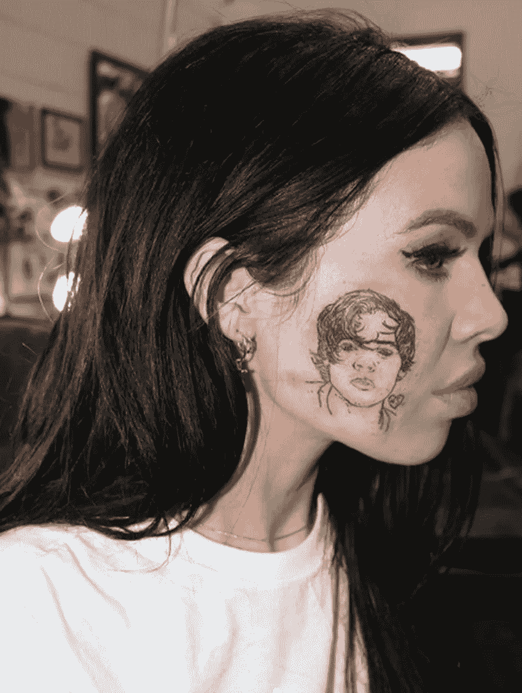
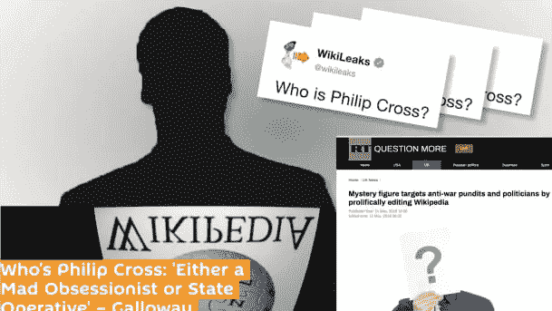
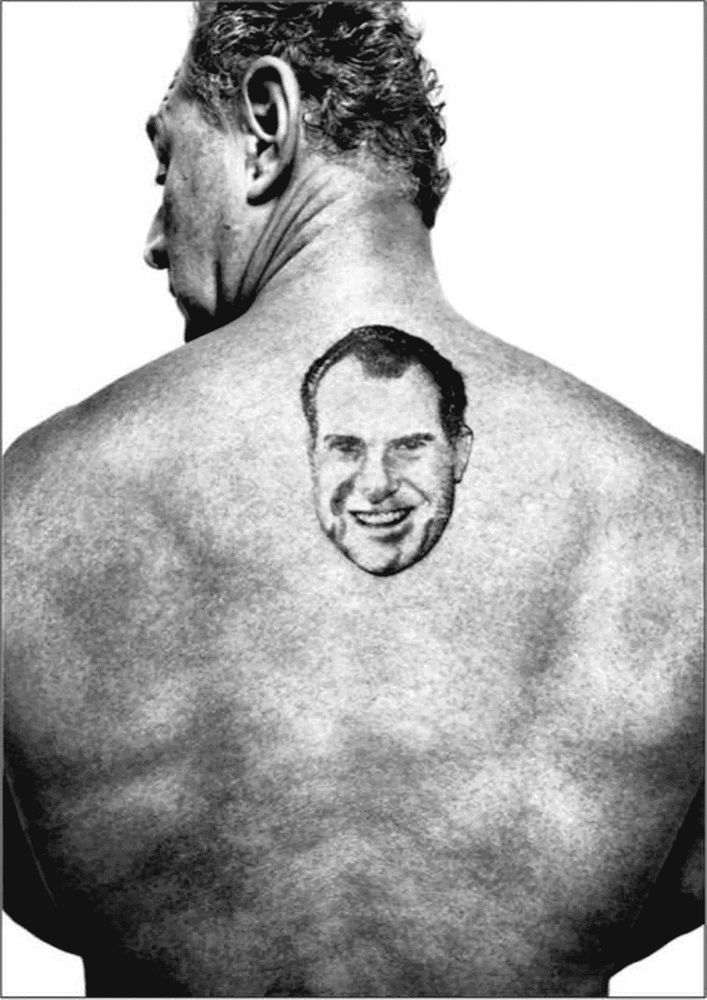
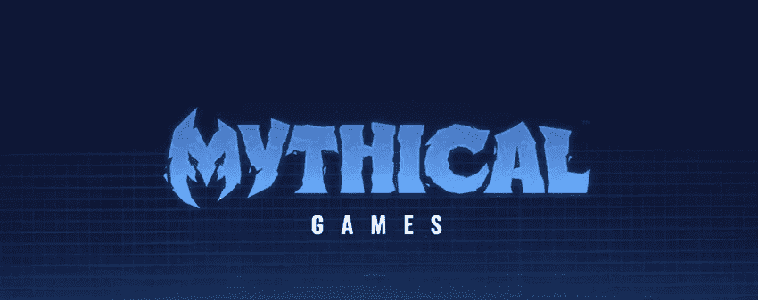

# Everipedia 网络文化综述#5:纹身是永恒的

> 原文：<https://medium.com/hackernoon/everipedia-internet-culture-roundup-5-tattoos-are-forever-fd850f7c5c68>

纹身是一种永久的标记，象征着你在某个时间点对某人或某事的感觉。它已经成为许多互动对话的开端。罗杰·斯通几年前纹上了理查德·尼克松的纹身，并把这位前总统的精神完全背在了背上。凯尔西·卡特据说本周在脸上纹了歌手哈里·斯泰尔斯的纹身，很多人都想知道她未来的另一半几年后会怎么想。臭名昭著的维基百科编辑菲利普·克罗斯(Philip Cross)并没有纹身，他的编辑活动让人质疑他到底是一个人，还是一群试图左右舆论的人。丹·里夫勒不在乎你有没有纹身，只在乎你是不是亿万富翁，因为他认为这是社会的经济弊病。还没有消息表明神话游戏是否允许你在即将到来的 MMO 游戏中定制角色是否有纹身。因此，没有进一步的纹身评论，这里是本周 Everipedia 上最有趣的页面。

Kelsy Karter and her Harry Styles’ face tattoo

## 凯尔西·卡特

奥克兰出生的洛杉矶灵魂乐歌手凯尔西·卡特让她对哈里·斯泰尔斯的崇拜广为人知；为了庆祝哈里·斯泰尔斯的生日，她在自己的脸上刺了纹身。人们仍在质疑这个纹身是真是假，但在一个娃娃脸纹身说唱歌手和社交媒体上短期引人注目的噱头的时代，卡特只是在聚光灯下扮演她的角色。在成长的过程中，她说她从来没有在任何地方真正有家的感觉，她一直是一个反叛者，而卡特肯定是用她的行动来实现这一点。

Who is Philip Cross?

## [菲利普·克罗斯](https://everipedia.org/wiki/lang_en/philip-cross-wikipedian/)

尽管菲利普·克罗斯被认为是维基百科最活跃的编辑，他也是最可疑的编辑之一。以至于一些人甚至认为菲利普·克罗斯不是一个个人，而是一个有组织的细胞，旨在通过逐步编辑来诋毁反战人士。还有什么可以解释 2013 年至 2018 年间连续 1721 天的 133706 次编辑？本周，有人发现他编辑了独立记者拉尼亚·哈利克的维基百科页面，称她为“支持阿萨德的反犹分子”。这些编辑已经被删除，但是关于她的页面的争议仍在继续。吉米·多纳尔·威尔士认为关于克罗斯的投诉是“可笑的”,但关于他的编辑和他是否是一个真实的人的争论肯定会继续下去。

## [罗杰·斯通的尼克森纹身](https://everipedia.org/wiki/lang_en/roger-stones-nixon-tattoo/)

罗杰·斯通的政治生涯长达 45 年，经历了七届总统任期。从他在乔治·华盛顿大学上学期间与理查德·尼克松的交往开始，斯通就被称为政治骗子，而本周他在佛罗里达州家中被电视直播的戏剧性逮捕事件又让他陷入争议。随着斯通重新出现在新闻中，他背上的理查德·尼克松纹身也被广泛报道。斯通表示，这个纹身代表着不断提醒尼克松面对逆境的韧性，这是斯通在面临说谎和篡改证人指控时需要的东西。从那以后，斯通提出了无罪抗辩，并将继续打这场官司。

A picture of Dan Riffle

## 丹·里夫

如果你在推特上看到过“每个亿万富翁都是政策的失败者”这个名字，那就是丹·里弗尔。这位前非瘾君子大麻游说者现在是 AOC 的“政策人”,并且毫不掩饰他对收入不平等的蔑视。他的 Twitter 账户充满了政策观点、快速双关语和迷因，最终试图传达实施更进步的经济举措的信息。随着关于货币和经济政策的辩论向前推进，里夫勒肯定会成为推特圈的话题避雷针之一。

Mythical Games logo

## [神话游戏](https://everipedia.org/wiki/lang_en/mythical-games-2/)

神话游戏是未来游戏的最前沿。该公司由动视暴雪(Activision Blizzard)前工作室负责人约翰林登(John Linden)创建，正在以区块链为技术基础创建一个游戏生态系统。他们的首款大型多人在线游戏 Blankos Block Party 设定在一个充满乐趣的环境中，计划于 2019 年第一季度发布。此外，神话游戏正在与其他几家区块链公司合作，在 EOS 区块链上创建名为 dGoods 的标准化数字商品。随着区块链技术的进一步发展，看看基于它开发的游戏将会如何成型将会是一件有趣的事情。我们离职业游戏玩家不再是唯一依靠电子游戏谋生的未来不远了。