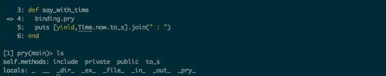
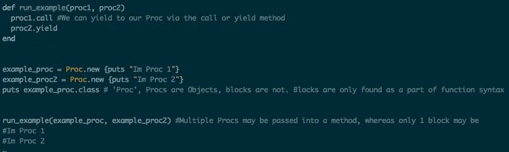
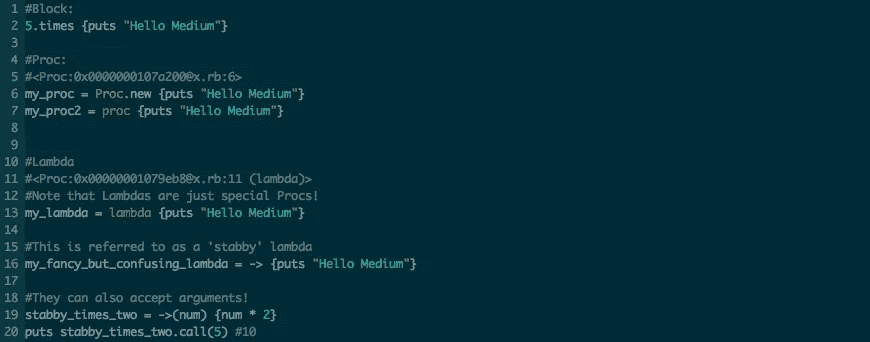
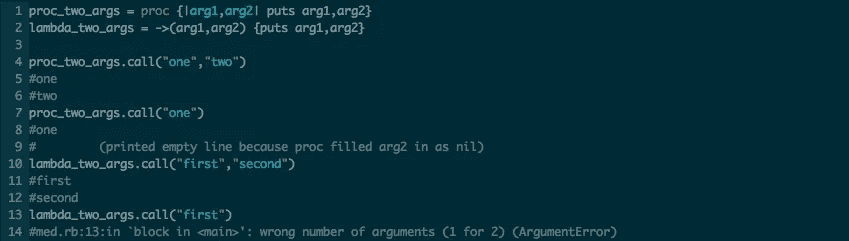
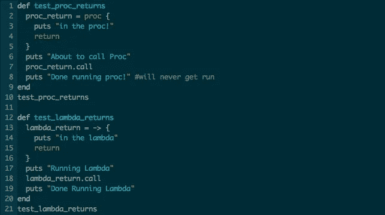
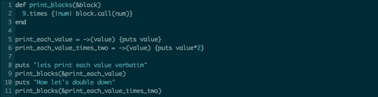
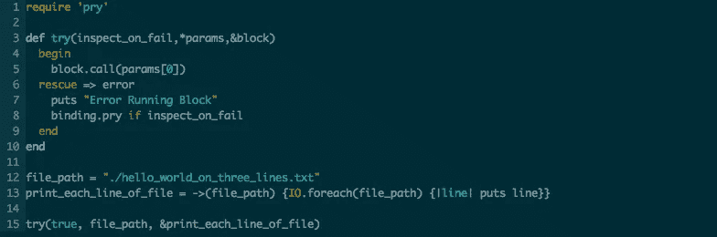
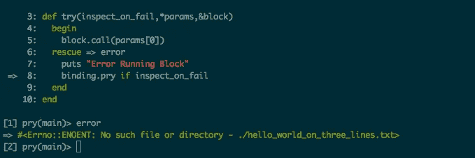

# 关于 Ruby 中的块，你需要知道的一切

> 原文：<https://medium.com/hackernoon/everything-you-need-to-know-about-blocks-in-ruby-2ad99352f855>

Ruby 最强大的特性之一的完整指南


Photo by [Susan Holt Simpson](https://unsplash.com/@shs521?utm_source=medium&utm_medium=referral) on [Unsplash](https://unsplash.com?utm_source=medium&utm_medium=referral)

块是 Ruby 中最常用的特性之一，大多数 Ruby 开发人员都没有意识到它们的存在——包括它们有多强大。积木一点也不复杂，但也不是小孩子的游戏。

让我们从一个经典的例子开始，为主人公揭露这个阻碍的真实面目:

Here we call the method ‘`times'` on the Integer `5`, and print `“Hello Medium”` with each iteration.

对于任何花时间用 Ruby 编写代码的人来说，这应该非常熟悉。几乎在我写过的所有 Ruby 脚本中都有一个家。虽然从技术上来说 Ruby 风格是使用`{}`如果这个块可以压缩成一行:

```
5.times { puts “Hello Medium" }
```

在后台，`puts “Hello World”`是一个**块**，作为匿名参数输入到函数`times`。如果我们在 API [文档中查找 times](https://ruby-doc.org/core-2.2.0/Integer.html#method-i-times) ，它会告诉我们！这些文件还告诉我们，如果我们愿意，我们的团队可以接受一个论点:

5.times {|value| puts “Hello Medium #{value}” } would be the one-liner

这会将以下内容打印到控制台:

```
Hello Medium 0
Hello Medium 1
Hello Medium 2
Hello Medium 3
Hello Medium 4
```

块的另一个常见用例是在文件 I/O 期间。不管你是否意识到，任何时候你用`IO.foreach`打开一个文件，你实际上都传递了一个块，该块为文件的每一行执行！

Blockception!

我们一直在使用积木，却几乎没有意识到它们的巨大潜力——让我们改变这一点。


[In Ruby, we ‘yield’ to blocks](https://www.pexels.com/photo/sign-yield-1467970/.)

块经常被称为“匿名方法”，因为它们可以隐式地传递给 Ruby 中的任何方法。执行(或调用)一个块所要做的就是对它进行`yield`:

“Hello Medium : 2019–04–28 08:23:45 -0400"

这里，我们将一个包含单个字符串的块:“Hello Medium”传递给我们的方法`say_with_time`。然后这个方法`yields`到它的块中，并打印当前时间。

尽管这种方法有一些奇怪的行为…如果我们用 pry 检查它:



Our dear block is nowhere to be found…

我们注意到的第一件事是，我们的块没有作为参数列在作用域中。我们可以屈服于它，并用`block_given?`检查它的布尔状态，但是我们不能作为参数调用它。

我们可以将块显式定义为方法的输入参数，而不是依赖于隐式传递块。以这种方式展示该块让我们对其起源有了有价值的了解:

`block`现在是一个局部变量，在检查它之后，我们终于揭开了我们亲爱的块 Object: Proc 的起源。

# 激活、触发

Procs 是 Procedures 的缩写，本质上是封装在 Ruby 对象中的块。Procs 为我们的块提供了额外的功能，并允许它们像普通对象一样被传递。

天真地说，我们可以像以前利用块一样使用进程:

Hello Medium : 2019–04–28 09:30:03 -0400

在这里，我们显式地定义了一个块，并将其传递给我们的`say_with_time`方法，相比之下，在我们的第一个例子中，块是隐式传递的。这里的好处和在变量中保存原语是一样的:重用。你不会在任何需要的地方硬编码“Hello Medium ”,你会将它保存为一个变量并使用它，同样的逻辑也可以应用于进程/块！

Procs 比这个简单的例子有更大的潜力。一个触发程序所能完成的极限仅仅受到你的想象力和创造力的限制。正如我提到的，你通过“调用”一个程序块来屈服于它。从这个意义上来说，我们实际上已经揭示了 Ruby 中的回调函数！

最多可以将一个块直接或间接地传递给一个方法，但是如果需要，可以将多个过程传递给一个方法:



# 兰姆达斯

术语“Lambda 表达式”与编程中的“匿名函数”同义，是从微积分模型中派生出来的同名函数。它的技术定义是“[一个被定义的、可能被调用的、不受标识符](https://en.wikipedia.org/wiki/Lambda_expression)约束的函数”。虽然格挡和触发也符合这个定义，但兰姆达斯有几个关键的区别，让他们在人群中脱颖而出。

首先，让我们探索 lambda 语法，与块和进程的语法形成对比:



How to use each type of Ruby closure

Lambdas 和 procs 有一些关键的区别，这取决于你如何看待它们。

*   Lambdas 强制执行传递给它们的参数数量
*   Lambdas 处理`return`关键字的方式不同于 Procs

如果您传入的参数数量不正确，Lambda 函数将抛出一个`ArgumentError`，而 Procs 将简单地用`nil`来填补空白。

对于 procs，`return`意味着“从周围方法返回”，而对于 lambdas `return`意味着“从 lambda 返回”。



Here we see that Lambdas correctly govern their expected arguments, whereas Procs do not



Examples of how Procs and Lambdas handle the ‘return’ keyword

以下是上述脚本的输出:

```
» ruby test_proc_lambda_returns.rb
About to call Proc
in the proc!
Running Lambda
in the lambda
Done Running Lambda
```

注意这里“完成运行过程！”第 8 行上的永远不会运行，因为我们的`proc_return`中的`return`跳出了整个`test_proc_returns`方法。

# 传递和执行块

既然我们几乎是街区专家，是时候把我们新学到的技能派上用场了。我们已经探索了将块隐式传递给 Ruby 方法，现在是时候让这篇文章变得显式了。在方法头中的变量前使用强大的`&`符号，我们可以将任何 Proc/Lambda 转换成一个块！



‘&’ converts a Proc/Lambda to an explicit Block

在这个例子中，我们已经开始探索作为回调函数的块的用例。`print_each_value`本质上是一个封装在 lambda 中的方法，我选择它而不是 Proc，因为我们想确保它有一个要打印的参数。在不改变`print_blocks`方法的情况下，我们可以创建新的 Lambdas 来改变它的功能。上面的代码片段输出了以下内容:

```
» ruby print_blocks.rb
lets print each value verbatim
0
1
2
3
4
5
6
7
8
Now let's double down
0
2
4
6
8
10
12
14
16
```

这个例子仍然很幼稚，但是现在我们理解了`&`，我们可以完全沉浸在基于块的回调中。

我之前说过，这里的可能性只是自限性的。鲁比的口头禅是永远不要问“为什么？”，功能是提供给你的，由你来决定用它创建什么。这里有几个有趣的例子让你动脑筋:

## 尝试

一种接受布尔值、可变参数数组和块的方法。 **Try** 然后执行该块，传入参数[0]，如果出现错误，则传入 prys。



A clear example of how powerful blocks can be

在我们的第一次尝试中，尝试已经证明了它的价值:



I forgot to create the needed file…

在修复了这个错误之后，我们可以重新运行我们的脚本:

```
» ruby try.rb
Hello World
HELLO WORLD
hello world
```

我喜欢这个例子，因为我的屎坏了很多，能够立即确定为什么失败，并看到所说的失败的范围，让我更快地解决我的问题。这个例子很容易扩展，因为`*params`可以包含任意数量的参数——只要记住我们的块必须在参数列表的末尾。

## 四处执行

将块传递给方法在 Ruby 中很常见，它有自己的名字:Execute Around(块)。在这个编程模型中，我们定义了一个方法，该方法接受一个块并围绕它执行一系列任务**，比如打印、记录、访问数据库，或者任何你的小编码者想要的。**

Our Block has finally reached its potential

```
» ruby execute_around.rb
86400
1
-1
```

以及 log_1556468836.txt 的日志输出:

```
Starting 'Calculate seconds in a day'
Completed 'Calculate seconds in a day'
Starting 'Open a file I know doesn't exist'
'Open a file I know doesn't exist' FAILED!
```

# 快速回顾

*   块是隐式传递给函数的匿名函数。它们是 Proc 类的实例，当它们被传递到一个方法中时，带着它们的作用域
*   Proc 有两种形式:Proc 和 Lambda，它们的区别仅在于参数执行和对`return`关键字的处理
*   Procs、Lambdas 和 blocks 都是 Ruby 中`closures`的例子
*   Procs/Lambdas 可以转换成带有`&`符号的块
*   当作为回调函数实现时，块的功能就实现了