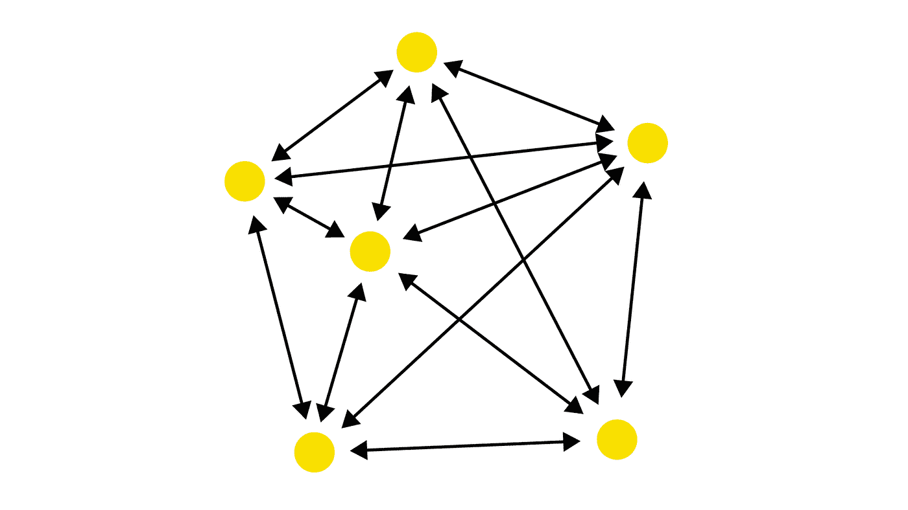
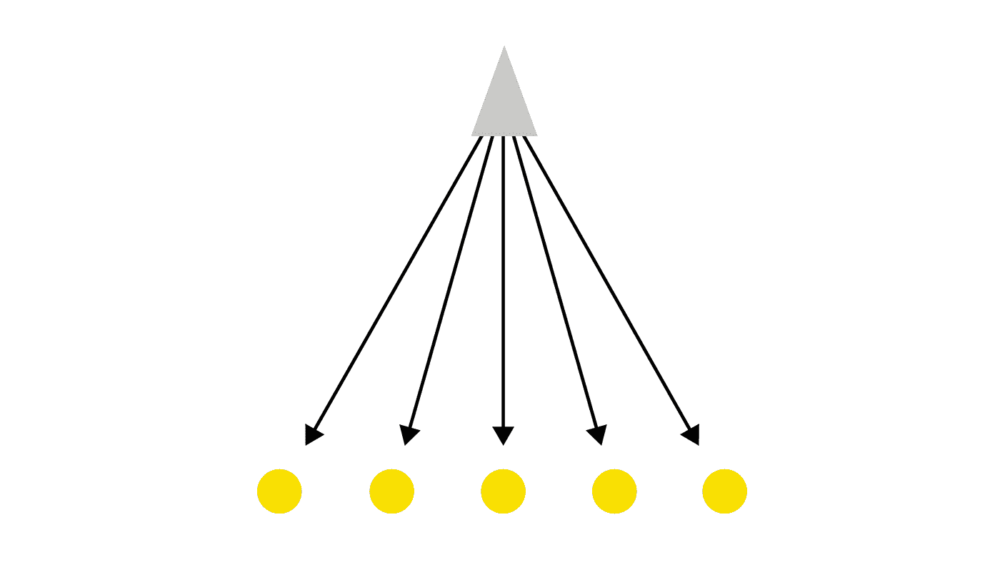
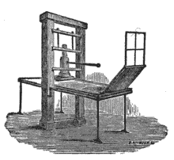

# 从分权到集权的演变

> 原文：<https://medium.com/hackernoon/evolving-from-decentralization-to-centralization-33e7db8aadd2>

## 回到去中心化的未来

信不信由你，权力下放并不是什么新鲜事。它首先从古代人类社会的社会组织开始。他们一起生活在不到 100 人的新石器时代分散的小社区里，每个人都要对彼此负责。人口少只是使管理更容易。这样的小社区很容易相互信任，个人维持的亲密关系使得群体中的任何人都很难逃脱不良或自私的行为。

*Decentralized (peer — to — peer)*

*(图片由* [*约翰·盖弗斯*](https://www.slideshare.net/johanngevers/johann-gevers-the-four-pillars-of-a-decentralized-society) *)*

因此，土地革命前存在的社会结构是一个分散的社会，生活在一个等级结构有限的社会中的个人之间相互作用。

基本上，没有必要让统治者来管理和控制互动，因为每个人都是自力更生的。

然而，随着社区开始更多地关注农业作为食物生产的一种手段，突然有了更多的食物，社区从 100 人的小团体发展到几百人的大团体。

# 新石器时代:土地革命的诞生

历史并不清楚是什么引发了土地革命。然而，随着社区变得越来越复杂，新石器时代标志着一个从狩猎和采集的小型游牧群体向早期农业文明的大型定居点过渡的时期。

历史也揭示了这一时期始于中东肥沃的新月地带。这是大约公元前 10，000 年，石器时代后不久，人类首次发明农具的地方。事实上，一些学者称这个时期为新石器时代。

这是因为在这个时期，即使人类刚刚开始从事农业，他们仍然依靠石器和锄头勉强维持生存。

即使在土地革命的早期阶段，社区也只能维持一小部分人口，他们从事狩猎和采集，以此作为对其农业实践的补贴。

动词 （verb 的缩写）戈登·蔡尔德(一位创造了“新石器革命”这个术语的澳大利亚考古学家)提到，这一时期正好是新石器时代的人从他们的旧石器时代的祖先那里分离出来的时候，他们的祖先以他们原始的打制石器工具而闻名。正如互联网等新技术(在当代)创造了从旧的社会规范到新的社会规范的转变一样，农业也是如此。

但是这些小社区是如何转变成依赖于中央集权政府的等级复杂社会的呢？

# 城镇的形成

*Centralized (Command & Control)*

统治者支配臣民日常生活的想法是寻求解决发展中问题的结果。土地革命导致了粮食产量的增加，随着社区的扩大，如果没有一个监督社会互动的中央权力机构，维持秩序就变得不切实际了。

根据传统观点，城市是在新石器时代之后开始形成的。尽管缺乏关于城镇形成条件的证据，理论家们推测，不断增长的人口和密集定居点带来的好处一定有助于早期城镇的形成。

根据蔡尔德的说法，正是在这个时期，人类开始在有组织的社区中生活在一起。事实上，大多数研究人员同意，没有单一的因素引发了新石器时代的革命；然而，科学家们推断，也许 14000 年前冰河时代的结束一定导致了气候变化，地球变暖，从而引发了土地革命。其后果是农业日益进步，其标志是人类之间的互动网络日益扩大，这就需要集中的社会结构。

人们认为，农业移民取代了觅食者，增加了粮食产量，导致了单位土地上更高的人口密度，从而促进了城镇的发展。保罗·拜罗奇的《城市与经济发展》一书为这一观点在[锦上添花。他认为农业似乎是城镇形成的必要前提。](https://en.wikipedia.org/wiki/History_of_the_city)

毕竟，在当时，与人口稀少的社区相比，居住在人口密集的社区有着明显的优势，包括:

*   降低运输成本
*   互动和思想交流
*   大型本地市场
*   轻松共享自然资源
*   便利的设施，如安全，自来水和污水处理

# 帝国是如何出现的？

嗯，随着社区逐渐变得越来越依赖农业，人们开始学习如何生产各种产品。例如，他们学会了如何通过使用动物来增加劳动强度。耕种增加了，他们开始生产羊毛、牛奶和其他产品。食物和资源的增加进一步增加了人口，从公元前 8000 年的大约 600 万增加到公元前 3000 年的大约 5000 万。

更大的社区导致必须解决的争端更加复杂。随着更多的互动，一些人找到了更好更快的交易和获取财富的方法。

因此，随着对更好的组织结构的需求的增加，酋长和村里的长老承担起了在不断增长的社区中促进信任和问责的责任。

最终，社会结构完全改变了，随着贸易的复杂性增加，一小部分人变得越来越富有和强大。随着人们发明了交换农产品的新方法，货币的概念越来越受欢迎。

# 货币体系的演变

作为土地革命的结果，最重要的现代发明之一是货币的概念。当时，历史表明，易货贸易是最常见的贸易方式。然而，最终以物易物作为交换媒介的弊端增加了，商人开始使用商品货币，如奶牛、盐、酒和宝石。

但是即使是商品货币也被证明是一个不可持续的想法。也有一段时间，金属货币作为一种货币形式在早期商人中变得流行，但由于信任、重量和纯度的问题，需要一种新的货币概念。

由于这个原因，王国以借据契约的形式出现在君主面前，成为赋予纸币合法性的一种方式。

# 政府的崛起

尚不清楚帝王蝶是如何形成的，但可以假设早期社区需要更好地管理灌溉和建造剩余食物储存设施等项目。事实上，[罗宾·邓巴](https://en.wikipedia.org/wiki/Dunbar%27s_number)，一位获奖的人类学家和进化心理学家，认为除了城市和城镇中可以获得的便利设施，从分散的社会向集中的社会转变的最大促成因素之一是需要武装保护以对抗邻近的群体。

# 邓巴数

在他的理论中，邓巴数限制了一个社区中我们可以与之保持稳定关系的个体数量。邓巴的数字理论认为 150 是任何人类群体维持和谐的最大数字。超过这个门槛，人们将很难保持彼此的联系，导致社会的崩溃。邓巴的数字解释了为什么社区成员越来越难以相互信任和进行健康的社会互动。

根据邓巴的理论，150 是人类健康公共关系的极限，原因是个人需要努力建立超过这个数字的网络。一个人必须承诺付出更多的时间来培养个人关系，通过礼物和恩惠来改善社区成员之间的相互依赖。

这些关系至关重要，因为它们使个人能够在贸易和其他社会交往中以实物回报。因此，根据邓巴的理论，建立信任感和安全感在一个小社区是可以实现的。然而，在 150 分以上，社区需要一个集中的权力机构来跟踪谁值得信任，谁不值得信任。为了解决这个问题，君主提供了一个值得信赖的借款人，用来支付军队保护臣民的费用。它还为臣民的利益提供了一个司法系统。

# 回到治理

因此，出于武装保护的需要，帝国出现了。以前由富人控制的权力变成了制度化的政治和宗教团体。政治团体为贸易和信息流动提供了保护和可靠的信任体系。

正如你所看到的，纵观历史，农业社会被打上了严格的社会流动性和社会阶级的极端标记[。尽管人类政府发展的具体时间点尚不清楚，但研究表明，农业项目灌溉技术的发展是治理需求发展的催化剂。](https://en.wikipedia.org/wiki/Agrarian_society)

[大卫·克里斯蒂安](https://en.wikipedia.org/wiki/Government)在他的书《时间地图》中生动地描述了这一点，他说“农业人口聚集在更大、更密集的社区中，不同群体之间的互动增加，社会压力上升，直到与恒星形成惊人地平行，新的结构突然出现，伴随着新的复杂性水平。就像恒星一样，城市和州重组了它们引力场中的小天体，并给它们注入了能量。”

最终，土地成为财富的主要来源；以土地所有权为基础的社会等级制度的发展是不可避免的。这就产生了统治阶级和群众。在一些地区，通过各种仪式选举部落酋长，这些仪式考验个人的领导能力和军事实力，而在其他情况下，一群长老充当社区的统治阶级。最终，地主阶层变成了宗教、政府和军队的结合体。这三个社会因素证明了所有权的实施是合理的，导致了社会的严格分层，正如在印度的种姓制度和其他例子中所看到的那样。

# 集权的利弊

显然，集权和分权有着明显的区别。我们已经看到了中央系统在创造秩序、可靠性和信任方面的重要性。

但是，随着社会变得越来越复杂，中央集权社会的结构也在演变。集中治理结构发展了更好的一致性，对所有人都更具成本效益和公平。浪费被消除，统治阶级能够专注于长期规划和决策，以造福整个社会。此外，确立了权力下放和权力集中的混合，以实现发展项目的灵活性和最佳绩效。

集中化的其他突出优势包括:

*   随着中央集权的建立，由于标准化的贸易和生产程序，生产成本最终降低了
*   由于中央政府的控制，也实现了行动的统一
*   工作质量也得到了提高
*   最后，在直接监督和控制下，中央集权使得社会能够更好地协调。

总的来说，采用集中式系统的主要优势过去是，现在仍然是效率。决策是在一个集中的系统中快速做出的，角色的重复很少甚至为零。此外，由于权力集中，社会可以变得相当稳定、一致和可预测，尤其是在涉及集体的项目上。此外，在事情没有按预期发展的情况下，建立控制和责任也很容易。

但是当然，这样的优势也不是没有缺点的。虽然有明显的积极因素，增加了中央系统的崛起和成功，但大多数也有许多陷阱，有时在很大程度上超过了好处。

集中化的一些缺点包括以下问题。

# 滥用权力

集权的最大缺点之一是它假设最高领导层总是把人民的利益放在心上。

纵观历史，事实证明，一个中央集权的体制会吸引最坏的人物，或者更确切地说，会把好人变成坏人。

一个臭名昭著的例子是希特勒如何设法维护他的独裁统治，导致了对犹太社区的大规模种族灭绝。尽管当时的德国有一个民主国家，但这个国家的特点是弱民主，很容易被希特勒的独裁统治所取代。

集权政治结构导致的专制的其他例子包括自称为神的罗马皇帝，更不用说掌权的拿破仑·波拿巴，他自称为皇帝。

现实是，在整个文明史中，中央集权的治理形式总是以专制的领导形式告终，正如约翰·艾默里奇·爱德华·达尔伯格·阿克顿(1834-1902)所说，“权力导致腐败，绝对的权力导致绝对的腐败。”

# 降低低效率

随着集中式系统的进一步发展，它们的效率水平会下降。首先，由于大部分决策是高层做出的，会影响金字塔底层的主体，因此必然会出现脱节，导致下属的不满。此外，由于高层领导的任务是做出决策，整个方法可能是压倒性的，因此仲裁的质量和速度最终会下降。

# 审查制度

除了权力的滥用和最终效率的降低，集权的另一个缺点是审查。在政治领域，中国拥有世界上最集中的政府形式。[中央集权于秦朝时首次引入中国。这个朝代需要不断努力将权力集中到秦朝政府。第一个皇帝，秦始皇，设法通过建立新的法律和法规来控制他的领土。然而，即使古代中国的军队和政府繁荣昌盛，这种情况也升级为高度的审查。](https://en.wikipedia.org/wiki/Centralisation)

目前，由于长期以来极度集中的政府形式，中国没有新闻自由，信息不断被政府过滤，以控制人们的看法和想法。

事实上，economist.com 报告称，中国的互联网是世界上最集中、审查最多的。此外，该报告显示，目前中国互联网行业有超过[200 万名内容控制者](https://www.economist.com/special-report/2018/06/28/china-has-the-worlds-most-centralised-internet-system)。此外，一些总部设在北京的科技公司正致力于引进区块链[科技](https://hackernoon.com/tagged/technology)，以便推出[一个科技统治世界的系统](https://www.economist.com/special-report/2018/06/28/china-has-the-worlds-most-centralised-internet-system)。

就像互联网被用作实施集中审查的工具一样，教育也是如此。虽然教育应该以智力辩论和辩论的形式教会儿童批判性思维和对信息的评估，但像伊朗这样的国家正在禁止英语教学，以限制西方文化入侵。

从上面的例子可以明显看出，任何形式的集权都会导致所有的权力集中在金字塔的中心顶点。[就像金字塔](https://www.youtube.com/watch?v=QlYgNH2t43U)一样，基数越大(即底层平民 **C** 的数量越多)，金字塔顶端集中的权力就越大，因此无政府状态的风险也就越大。你几乎可以肯定，如果没有对统治精英的制衡制度，统治精英就会成为制度中的坏角色，审查制度就会盛行。

# 为什么权力下放很重要

上述例子，以及其他证据，凸显了高度集中的系统所带来的问题。基本上，如果任其发展，中央集权制度将导致少数精英不平衡地行使控制权。因此，权力下放是一个将决策和规划从中央权力机构分散和委派出去的过程，这一点很重要。纵观历史，甚至在当代世界，分权的概念一直被应用于改善集权的缺点。从一开始，西方文明就以人类试图打破中央集权的例子为标志。一些主要的例子包括以下情况。

# 民主的诞生

民主通常被视为权力下放蓬勃发展的基石。事实上，整个西方文明都是建立在雅典将权力带给人民的最初尝试之上的。诚然，雅典的方式仍然是中央集权的，因为只有经过挑选的一群人可以投票选举领袖。然而，与将整个文明的命运寄托在一个人身上的制度相比，这是走向权力下放的一个重大进步。腐败和缺乏效率的问题损害了民主的概念。然而，自公元前 508 年在雅典发明以来，它仍然是人类文明中最崇高的努力之一。这种管理体制也带来了伟大的艺术和科学创新。

# 印刷机

早期出版社，蚀刻自威廉·斯基恩的早期印刷术

与中世纪的欧洲相比，今天的世界知识丰富得多，信息触手可及。情况并非总是如此。在印刷术发明之前，信息的流动被宗教领袖和政府领导的高度集中的系统所控制。例如，像《圣经》这样的宗教文本只能由宗教领袖阅读，人们相信他们会做出正确的解释。多亏了印刷机，包括《圣经》在内的以前由精英控制的信息终于可以轻易获得了。使用像鸽子邮政这样的技术，想法可以在世界范围内共享，对信息流的集中控制崩溃了。尽管当时为数不多的印刷机的所有者仍然能够控制信息，但图书馆的兴起使得信息和权力得以分散。

# 互联网

印刷机带来了印刷作为可消费媒体的开始；然而，它最终采取了中央集权的方式，报纸和出版社的所有者控制着信息的流动。看门人在相当长的一段时间里保持着他们的地位，直到互联网的出现。今天，互联网使每个人都有可能成为自己的出版商，在分享想法时几乎没有审查。事实上，除了可消费媒体，随着数字货币的发明，互联网已经分散了包括金融在内的许多行业。

# 分散分布式分类帐技术

分布式账本技术并不新鲜。它们构成了云计算的主干，为会计和记录提供了可靠的解决方案。DLT 是网络中互连机器的协议，该网络没有传播信息的中央服务器，相反，连接的机器彼此同意以达成共享和存储信息的共识。由于所有机器都同意的共识协议，一旦信息被存储在分类帐中，就需要所有机器的共识来改变该信息。这在不可信系统中提供了不变性、安全性和透明性。区块链等 DLT 让加密货币的运行和繁荣成为可能。现在，货币的概念也通过比特币等加密货币变得分散化。这是可能的，因为数字货币现在可以有一个不可变的数字身份，从而解决了重复消费的问题。尽管加密货币在成为通用法定货币之前还有很长的路要走，但不言而喻，这项新技术在未来[进一步去中心化方面有很大的潜力。](https://hackernoon.com/tagged/future)

# 最后的想法:未来是分散的

如你所见，权力下放对于文明的进步至关重要。此外，通过像区块链这样的技术进行分权可以带来治理、金融和通信方面的透明度和问责制。供应链管理、产权、合同协议和数字身份等部门可以从去中心化技术中受益匪浅。总体而言，区块链在善治、全球可持续发展和公平的经济发展方面可以发挥作用，这一点已经变得相当明显。事实上，联合国已经在区块链技术的帮助下寻求利用替代金融机制，以支持创业精神并推进其[可持续发展目标(SDGs](http://www.undp.org/content/dam/undp/library/innovation/The-Future-is-Decentralised.pdf) )。SDG 等全球性组织的计划可以为全球范围内更大程度的透明、合作和交流树立榜样。在下一章中，我们将更深入地探讨去中心化的原因以及它如何塑造未来。