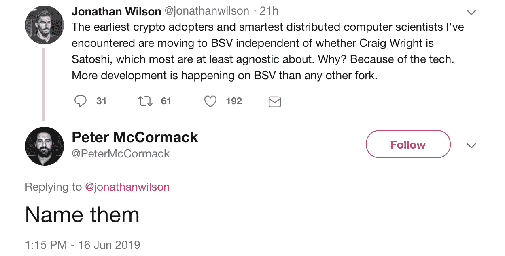
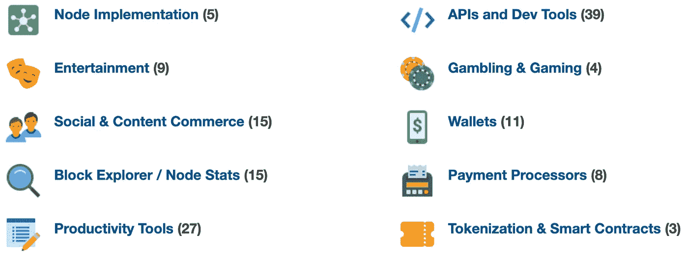
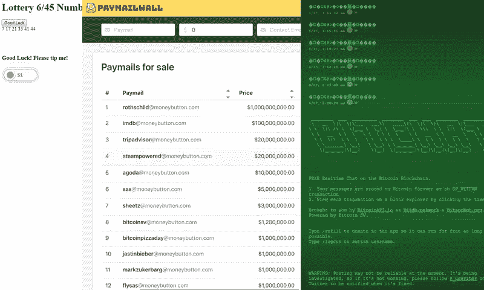

# 检查比特币 SV 的开发者生态系统声明

> 原文：<https://medium.com/hackernoon/examining-bitcoin-svs-developer-ecosystem-claims-830cbb6f12da>

比特币 SV 的支持者声称，正在建立一个繁荣的开发者生态系统。在看到最近关于这个话题的 [Twitter 帖子](https://twitter.com/PeterMcCormack/status/1140352170816090118)后，我决定仔细看看这到底有多真实。

# BSV/DEVS

比特币 SV 项目的最终目录保存在 [BSV/DEVS](https://bsvdevs.com/index.php) 上。这是一个简单的网站，目前有 136 个列表。我决定点击每一个链接，以便更好地了解实际情况。

# 令人印象深刻

有几个看起来出奇的好的项目。

## 金钱按钮

MoneyButton 是由 [Ryan X. Charles](https://twitter.com/ryanxcharles?lang=en) 创建的一项服务，为开发者提供了一种简单易行的方式来接受网站上的 BSV 支付。

用户体验和开发者体验都简单明了。用户界面是光滑和有吸引力的。它很好地完成了这项任务。

## 手推车卡什

Handcash 是广受好评的比特币 SV 手机钱包。它易于使用，并结合了一个很好的人可读的处理系统。

然而，并不是所有的 bug 都已经出来了。当我第一次尝试使用这个钱包时，它撞了我好几次。然后有人试图给我付款，但失败了。

## 比特通讯

Bitcom 是由知名的比特币 maximalist， [_unwriter](https://twitter.com/_unwriter?lang=en) 创建的“去中心化的比特币应用协议全球注册中心”。

这不是普通用户会与之交互的那种项目，但它是基于开放标准的未来应用程序的重要组成部分。

# 印象最差

也有许多项目不那么令人印象深刻。

## 付费邮件墙

一个出售 moneybutton.com 电子邮件地址的网站。以 100 万美元的低价，你就可以拥有“markzukerbarg@moneybutton.com”！

## 婊子

区块链上的实时聊天…但是为什么呢？看起来完全是浪费磁盘空间。

如果至少能看到它的运行就好了，但不幸的是，它不起作用。除了顶部一堆乱码的消息，我看不到任何其他消息，也不能发布任何东西。

## 彩票 6/45 号码发生器

我把最糟糕的留到了最后。这个应用程序仅由几个随机数和一个提示按钮组成。

# 总体印象

在我的检查中，我遇到了许多小东西，它们本身是无害的，但当把生态系统作为一个整体来看时，不应该被忽视。

*   复制和粘贴开源项目的克隆。
*   现有开源项目的分叉。
*   购买代码库(现成的解决方案)。
*   破碎或死亡的网站。
*   未完成或废弃的项目。

采用开源或购买的代码库没有错。但是它们的数量占所列数量的百分比似乎很高，而继续发展的程度很低。

破碎和废弃的项目一直都在发生，但它们往往在日益萎缩的生态系统中更为普遍，因为开发者表明他们不愿意投入更多的时间。

# 结论

有几个项目看起来很棒或者很有潜力，但是绝大多数都不尽如人意。

总体而言，生态系统似乎缺乏投资和创新。整个生态系统与其他一些行业领导者相比相形见绌。

它有什么优点吗？是的。会不会有一些尚未公布的隐藏宝石正在建造中？有可能，但我不指望它。

根据目前掌握的信息，我可以得出结论，这些说法是错误的，比特币 SV 生态系统无论如何都没有蓬勃发展。

如果你喜欢这个，请考虑为它鼓掌。

**通过在** [**Twitter**](https://twitter.com/jordan_mack) **上关注我来保持联系。**

