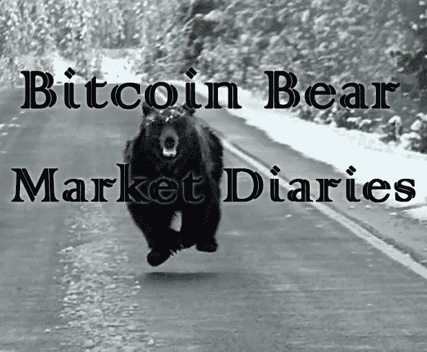

# 比特币熊市日记摘录

> 原文：<https://medium.com/hackernoon/excerpts-from-the-bitcoin-bear-market-diaries-2ccc213a74e6>

我希望你穿着最暖和的冬衣，因为比特币熊市已经漫长而寒冷。它给我们带来了一些令人敬畏的创新，也向我们展示了许多人的真实面目，有好有坏。

《黑客正午》独家报道的比特币熊市日记通过采访比特币生态系统中的各种重要声音和观点来探讨这一话题。敬请关注更多比特币熊市日记！

***编辑注:*** *今天就让你的比特币故事接受一位人类编辑的审核吧！*[*https://contribute.hackernoon.com/*](https://contribute.hackernoon.com/)

*“了解比特币的唯一途径就是通过霍德林。这就好像真正理解智能手机的唯一方法是打开它并使用它。比特币是数字黄金，这自然会让投资者长期持有它作为价值储存手段。”*[*-@*tuurdemester](https://twitter.com/TuurDemeester?ref_src=twsrc%5Egoogle%7Ctwcamp%5Eserp%7Ctwgr%5Eauthor)

[**《比特币熊市日记》第十一卷**](https://hackernoon.com/bitcoin-bear-market-diaries-volume-11-tuur-demeester-f5fc5ef740a2?source=your_stories_page---------------------------)

“我对 BTCPay 服务器将扮演的角色非常乐观，不仅是在转变电子商务方面，而且在为内容创作者开辟新的盈利方式方面。”—[***@****MattoshiN*](https://twitter.com/MattoshiN)

[**比特币熊市日记第 10 卷马特 B**](https://hackernoon.com/bitcoin-bear-market-diaries-volume-10-matt-b-be87437922a5?source=your_stories_page---------------------------)

*“这只是一种节约的形式。我知道美国社会不鼓励储蓄——人们被迫购买指数基金，我认为这是难以置信的不负责任——但这是美元贬值、拥有资产是唯一出路的 QE 社会的后果。”—*[***@****NIC _ _ 卡特*](https://twitter.com/nic__carter)

[**比特币熊市日记第九卷与 Nic 卡特**](https://hackernoon.com/bitcoin-bear-market-diary-volume-9-with-nic-carter-b7f27c0691ed?source=your_stories_page---------------------------)

*“在信息时代，现代人的任务是从哲学上理解权利和伦理。相对于理解什么是正确和公正，我们向机器和软件教授理性，这些努力的重要性不容低估。”—*[****@****BitcoinBlake**](http://twitter.com/@CarstenBKK)

*[**比特币熊市日记第八卷**与布莱克·安德森](https://hackernoon.com/bitcoin-bear-market-diaries-volume-8-with-blake-anderson-b3dccd3013f8?source=your_stories_page---------------------------)*

*大多数叉子只是无用的尝试，想从愿意为它们付钱的人那里赚点钱。叉子只是另一种替代硬币。BCH 引领了潮流，但如今福克斯似乎已经成为过去。”—[***@****CarstenBKK*](http://twitter.com/@CarstenBKK)*

*[**比特币熊市日记第七卷**](https://hackernoon.com/bitcoin-bear-market-diaries-volume-7-with-carsten-afbe3a0dd6a9?source=your_stories_page---------------------------)*

*开发人员、分层协议、隐私、健全的货币经济学和敌对的“有毒”文化。这是软件货币革命的秘诀。”—[***@****加布里埃尔·万*](https://twitter.com/GabrielDVine)*

*[**《比特币熊市日记》第六卷**](https://hackernoon.com/bitcoin-bear-market-diaries-volume-6-with-gabriel-d-vine-28f5b77abd17?source=your_stories_page---------------------------)*

*“我认为每一次比特币牛市都会让挑选赢家变得越来越难，人们最终会把比特币与赌博联系起来。”—[***@****bitcoinerrolog*](https://twitter.com/BitcoinErrorLog)*

*[**比特币熊市日记第 5 卷约翰·卡瓦略**](https://hackernoon.com/bitcoin-bear-market-diaries-volume-5-john-carvalho-bfd32fc6ae8f?source=your_stories_page---------------------------)*

**“比特币对社会最大的潜在附加值在于，它是一种不受审查的自由市场价格发现工具，可以制衡商业银行和央行不计后果的信贷扩张。”—*[***@****消音*](https://twitter.com/DeaterBob)*

*[**比特币熊市日记第四卷**](https://hackernoon.com/bitcoin-bear-market-diary-volume-4-with-deaterbob-c131a110cddd?source=your_stories_page---------------------------)*

**“每一次“负面”事件似乎都给比特币带来了更多的反脆弱性。我喜欢生存每一次都加强了比特币。”—*[***@****吉米松*](https://twitter.com/jimmysong)*

*[**比特币熊市日记第三卷与吉米·宋**](https://hackernoon.com/bitcoin-bear-market-diaries-volume-3-with-jimmy-song-24bfb9350b2c)*

*如果这个想法在 1990 年出现在今天，那些认为用 iPhone 打 Skype 电话没什么了不起的人也会嗤之以鼻。比特币也是如此。”—[*@ beauty on*](https://twitter.com/Beautyon_)*

*[**比特币熊市日记第二卷与阿金费尔南德斯**](https://hackernoon.com/bitcoin-bear-market-diaries-volume-2-with-akin-fernandez-9dd718bce35c)*

**“只需购买和 hodl 比特币。不要盲目追随任何人。要批判，要自己思考，要参与讨论！”—*[***@****hodlonaut*](https://twitter.com/hodlonaut)*

*[**比特币熊市日记第一卷**](https://hackernoon.com/bitcoin-bear-market-diaries-volume-1-with-hodlonaut-124c4467b05e)*

*希望你喜欢这些采访。我很想知道你希望我接下来采访谁？更多精彩的比特币熊市日记即将出炉，包括[马蒂·本特](https://twitter.com/MartyBent)、[漩涡](https://twitter.com/theonevortex)和 [Dhruv Bansil](https://twitter.com/dhruvbansal) 等等。*

*感谢您的支持！*

*[海盗海滩流浪汉](https://twitter.com/piratebeachbum)*

****编者注:*** *今天就让你的比特币故事接受人类编辑的审核吧！*[*https://contribute.hackernoon.com/*](https://contribute.hackernoon.com/)*

**

****P.S.*** *了解更多* [*黑客出没的地方。*](https://hackernoon.com/where-hackers-hang-out-c43eb09e175a)*