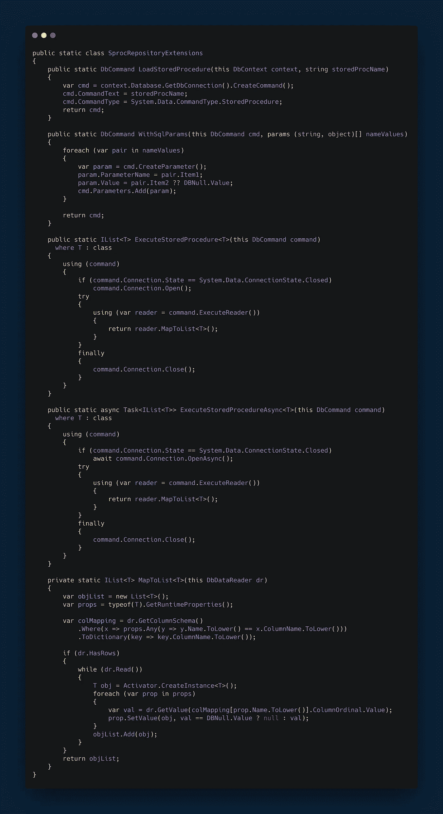

# 执行从 EF 核心中的多个表获取数据的存储过程

> 原文：<https://medium.com/hackernoon/execute-a-stored-procedure-that-gets-data-from-multiple-tables-in-ef-core-1638a7f010c>

在 EF Core 中，还没有一种优雅的方法可以通过存储过程从多个表中获取数据。让我们建造一个。


Photo by [Safar Safarov](https://unsplash.com/photos/LKsHwgzyk7c?utm_source=unsplash&utm_medium=referral&utm_content=creditCopyText) on [Unsplash](https://unsplash.com/search/photos/sql-server?utm_source=unsplash&utm_medium=referral&utm_content=creditCopyText)

# 我为什么要写这个。

[](https://github.com/aspnet/EntityFrameworkCore/issues/245) [## 存储过程映射支持问题#245 aspnet/EntityFrameworkCore

### 注意:本期跟踪的一些特性可能有助于在数据库视图中使用 EF Core。然而……

github.com](https://github.com/aspnet/EntityFrameworkCore/issues/245) 

以上问题是我觉得这篇文章有必要的原因。在撰写本文时，EF Core 规定的执行存储过程的方式是`context.Blogs.FromSql("EXEC Sp_YourSp")`，但是只有当存储过程从特定的数据库集合(一个表或一个实体)返回数据时，这才是可能的。

让我们看看如果一个存储过程从多个表中获取数据，如何解决这个问题。

# 设置

我们将重新创建一个场景，我们只需要做上面的事情。我们要写一个小的*‘Todo’*API。

这里是包含所有文件的 [*要点*](https://gist.github.com/saurabhpati/23ed20815545baebee01c601f6591e53) 链接，如下所示

## 实体/模型

## **User.cs**

```
public class User : EntityBase
{
    public User()
    {
        UserTeams = new HashSet<UserTeam>();
        TaskItems = new HashSet<TaskItem>();
    } public string FirstName { get; set; } public string LastName { get; set; } public string Email { get; set; } public string Username { get; set; } /// <summary>
    /// Gets or sets the tasks assigned to this user.
    /// </summary>
    public ICollection<TaskItem> TaskItems { get; set; } public ICollection<UserTeam> UserTeams { get; set; }
}
```

## Team.cs

```
public class Team : EntityBase
{
    public Team()
    {
        UserTeams = new HashSet<UserTeam>();
    } /// <summary>
    /// Gets or sets the name of the team.
    /// </summary>
    public string Name { get; set; } public ICollection<UserTeam> UserTeams { get; set; }
}
```

## *UserTeam.cs*

```
public class UserTeam : IEntityBase
{
    public int UserId { get; set; } public User User { get; set; } public int TeamId { get; set; } public Team Team { get; set; }
}
```

## *任务项. cs*

```
public class TaskItem : EntityBase
{
    public TaskItem()
    {
        Notes = new HashSet<Note>();
    } /// <summary>
    /// Gets or sets the name of the task.
    /// </summary>
    public string Name { get; set; } /// <summary>
    /// Gets or sets the description of the task.
    /// </summary>
    public string Description { get; set; } /// <summary>
    /// Gets or sets the status id of the task.
    /// </summary>
    public int StatusId { get; set; } /// <summary>
    /// Gets or sets the status of the task.
    /// </summary>
    public Status Status { get; set; } public int UserId { get; set; } /// <summary>
    /// Gets or sets the person this task is assigned to.
    /// </summary>
    public User User { get; set; }
}
```

## *Status.cs*

```
public class Status : EntityBase
{
    public Status()
    {
        TaskItems = new HashSet<TaskItem>();
    } /// <summary>
    /// Gets or sets the status name.
    /// </summary>
    public string Name { get; set; } /// <summary>
    /// Gets or sets the tasks currently in this status.
    /// </summary>
    public ICollection<TaskItem> TaskItems { get; set; }
}
```

## *Entity.cs*

```
/// <summary>
/// Will default the primary key of the entity to be int.
/// </summary>
public class EntityBase : EntityBase<int>
{
}/// <summary>
/// The base entity.
/// </summary>
/// <typeparam name="TKey">The primary key. </typeparam>
public class EntityBase<TKey> : IEntityBase 
    where TKey: IEquatable<TKey>
{
    /// <summary>
    /// Gets or sets the Id of the entity
    /// </summary>
    public int Id { get; set; }
}public interface IEntityBase
{
}
```

现在，假设我们需要看到一个进度报告，其中我们需要团队和用户的信息，以及所有任务和处于 *todo、in progress 和 done* 状态的任务的计数。一个存储过程接受可选的 teamId 和 userId 来获取所有/一个团队的进度报告，这个存储过程符合我们的需求。

# 存储过程

让我们如上所述创建一个存储过程。

## *Sp_ProgressReport.sql*

```
CREATE PROCEDURE [dbo].[Sp_ProgressReport]
[@teamId](http://twitter.com/teamId) INT NULL,
[@userId](http://twitter.com/userId) INT NULLAS
  SELECT ut.TeamId, ut.UserId, COUNT(t.Id) TotalTasks,
  SUM(CASE WHEN t.StatusId = 1 THEN 1 ELSE 0 END) Todo,
  SUM(CASE WHEN t.StatusId = 2 THEN 1 ELSE 0 END) InProgress,
  SUM(CASE WHEN t.StatusId = 3 THEN 1 ELSE 0 END) Done
  FROM [UserTeam] ut
  JOIN [TaskItem] t
  ON ut.UserId = t.UserId JOIN [Status] s
  ON t.StatusId = s.Id WHERE ut.TeamId = [@teamId](http://twitter.com/teamId) OR [@teamId](http://twitter.com/teamId) IS NULL
  AND 
  ut.UserId = [@userId](http://twitter.com/userId) OR [@userId](http://twitter.com/userId) IS NULL GROUP BY ut.TeamId, ut.UserId, s.Id
GO
```

# 解决方案

让我们创建一个实体，它是这个存储过程的响应。如果您愿意，可以省略创建实体，因为您可以直接将响应映射到一个`object`或`dynamic`，但是在以下情况下创建实体会有所帮助

*   您必须修改或处理响应以应用业务逻辑。
*   有几个这样的相关响应，你想使用一些面向对象的原则来重用你的实体。

## *progressreportentity . cs*

```
public class ProgressReportEntity
{
    public int TeamId { get; set; } public int UserId { get; set; } public int TotalTasks { get; set; } public int Todo { get; set; } public int InProgress { get; set; } public int Done { get; set; }
}
```

我们将为执行存储过程创建一个存储库。我不太喜欢存储库，但是很多开发人员发现它很有帮助，所以我现在坚持使用存储库模式。您可以创建任何您喜欢的数据访问抽象。

让我们创建一些扩展方法，不管我们遵循什么模式，这些方法都会对我们有所帮助。

## SprocRepositoryExtensions.cs



这样，存储库的实现变得非常简单。

## SprocRepository.cs

```
public class SprocRepository : ISprocRepository
{
    private readonly TaskPlannerDbContext _dbContext; public SprocRepository(TaskPlannerDbContext dbContext)
    {
        _dbContext = dbContext;    
    } public DbCommand GetStoredProcedure(
        string name, 
        params (string, object)[] nameValueParams)
    {
        return _dbContext
            .LoadStoredProcedure(name)
            .WithSqlParams(nameValueParams);
    } public DbCommand GetStoredProcedure(string name)
    {
        return _dbContext.LoadStoredProcedure(name);
    }
}
```

一旦我们从`GetStoredProcedure`得到了`DbCommand`，我们就可以从扩展方法中调用`ExecuteStoredProcedure`或`ExecuteStoredProcedureAsync`。现在，我将冒昧地将存储库直接注入到控制器中。如果您想要修改响应，例如，如果您想要计算未完成、正在进行和已完成任务的百分比，您可以使用业务层抽象。

## 报告控制器. cs

```
[Route("api/[controller]")]
[ApiController]
public class ReportsController : ControllerBase
{
    private readonly ISprocRepository _repository; public ReportsController(ISprocRepository repository)
    {
        _repository = repository;
    } [HttpGet("Progress")]
    public Task<IList<ProgressReportEntity>> GetProgressReport(
        [FromQuery] int? teamId, 
        [FromQuery] int? userId) 
    {
        (teamId, userId) = (teamId != 0 
                           ? teamId 
                           : null,                           userId != 0 
                           ? userId 
                           : null); return _repository
        .GetStoredProcedure("[dbo].[Sp_ProgressReport]")
        .WithSqlParams(
            (nameof(teamId), teamId), 
            (nameof(userId), userId))
        .ExecuteStoredProcedureAsync<ProgressReportEntity>();
    }
}
```

# 结果呢

现在，一旦我们通过在 teamId 和 userId 中传递`0`来执行这个控制器，它将为我们获取所有团队和所有用户的进度报告。

结果如下:


# 结论

如果您的需求或兴趣与本文一致，我希望这真的对您有所帮助。我做了一个相同的知识库，你可以参考这个应用程序。

[](https://gitlab.com/saurabhpati/TaskPlannerApi) [## Saurabh Pati / TaskPlannerApi

### Rest Api 上的赋值

gitlab.com](https://gitlab.com/saurabhpati/TaskPlannerApi) 

检查杰里米·辛克莱的仓库，以获得完全相同的抽象

[](https://github.com/snickler/EFCore-FluentStoredProcedure) [## snickler/EFCore-FluentStoredProcedure

### EFCore 扩展，允许一种方法将一个存储过程流畅地映射到一个类。…

github.com](https://github.com/snickler/EFCore-FluentStoredProcedure) 

最后，请务必关注 ef core 的 github repo 中的未决问题 [#245](https://github.com/aspnet/EntityFrameworkCore/issues/245) ，以寻求更好的解决方案。