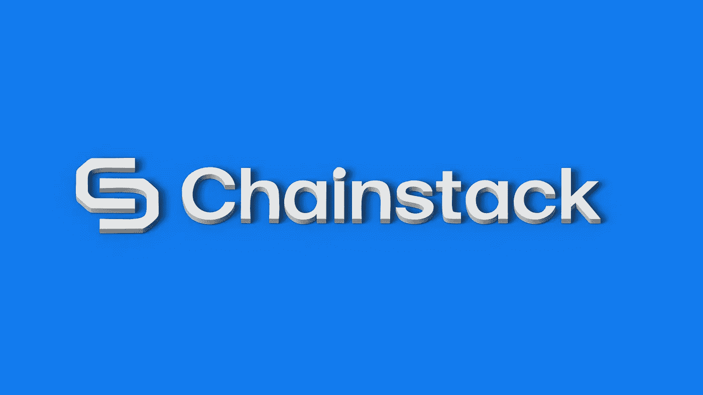
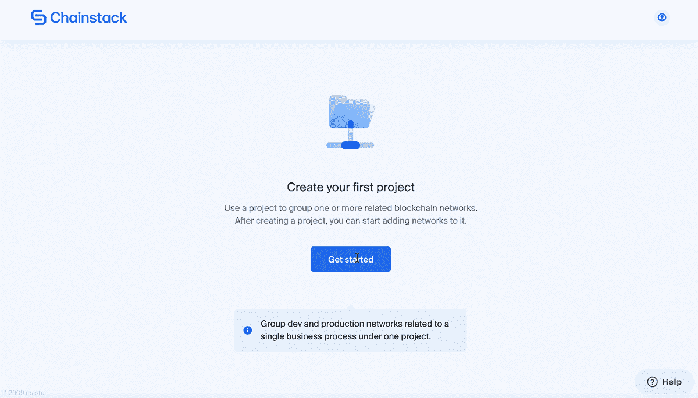
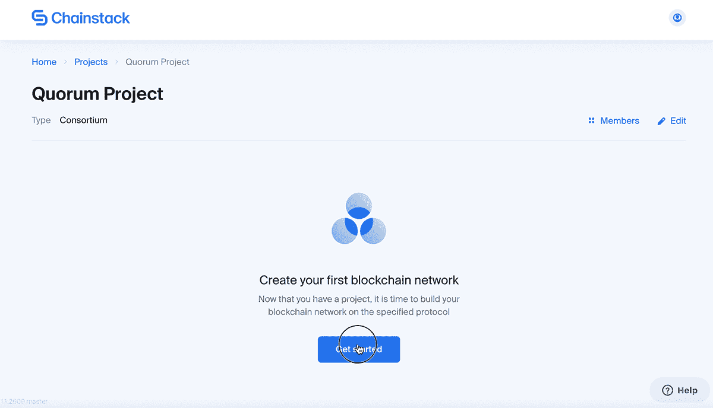
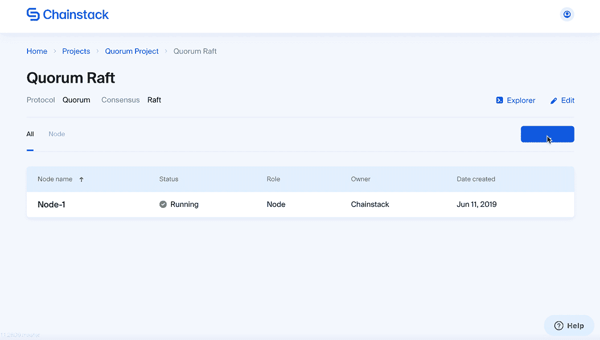
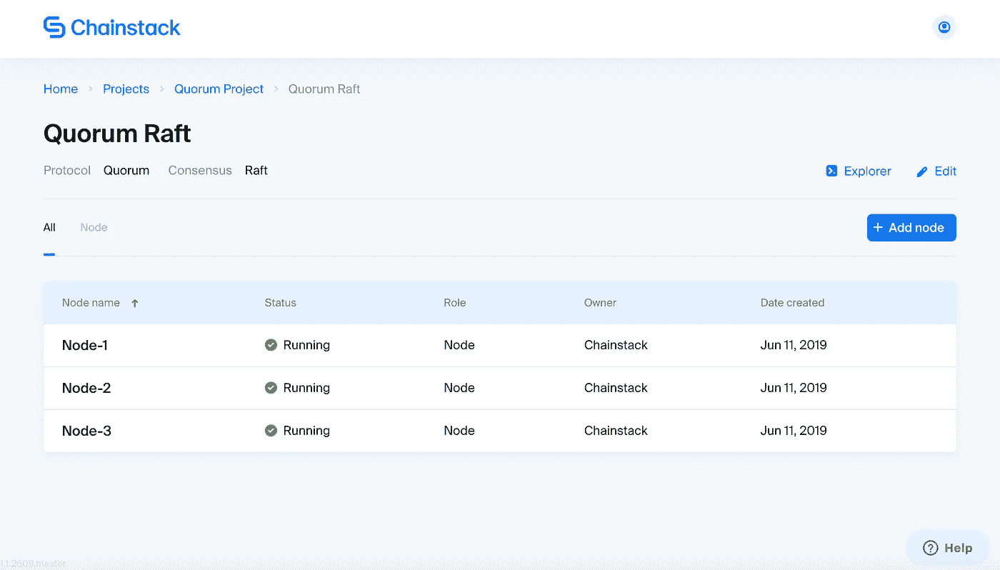
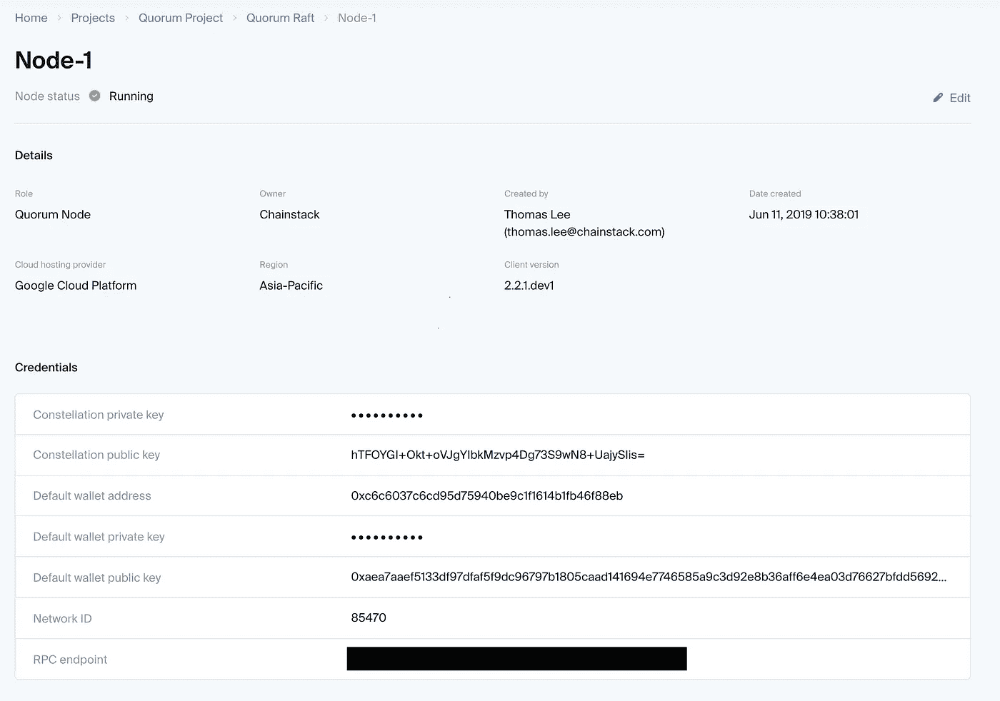
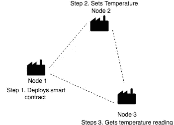
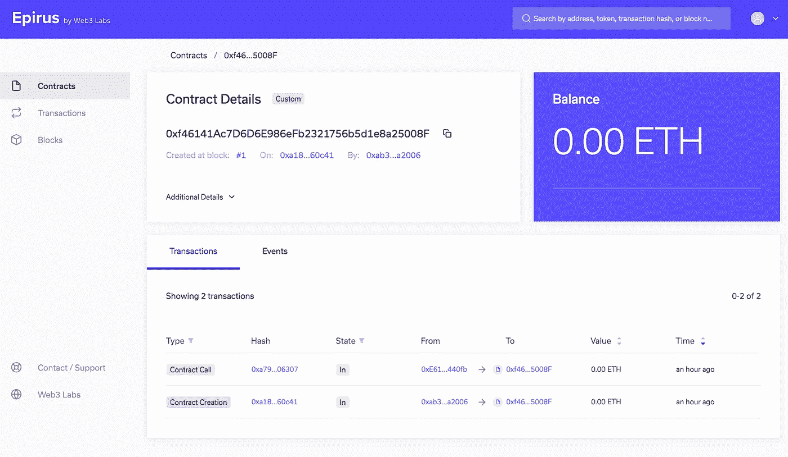
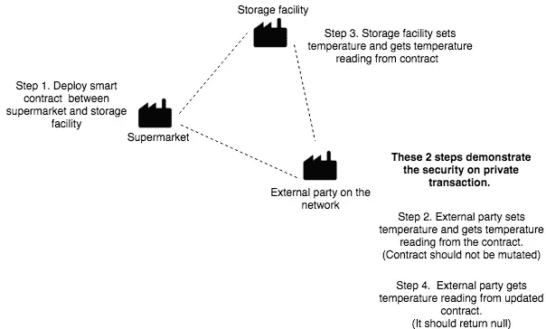
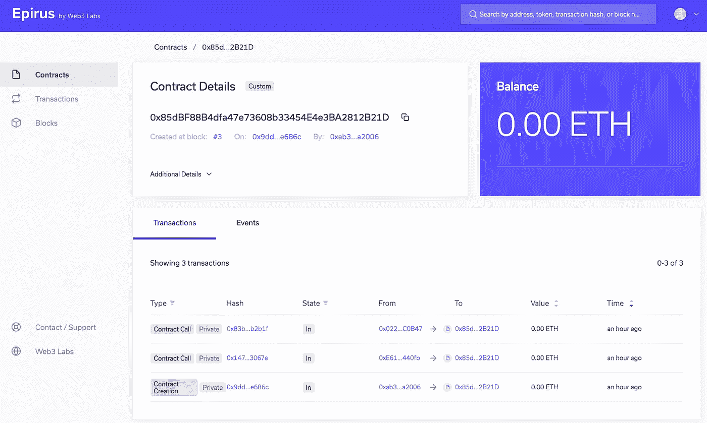

# 通过 Web3 在 JPMorgan 的 Quorum 上执行公共和私人交易

> 原文：<https://medium.com/hackernoon/executing-public-private-transactions-on-jpmorgans-quorum-with-web3-347190e3c35f>

本指南面向任何对 Quorum 感兴趣的人。这是对使用 [web3.js](https://github.com/ethereum/web3.js) 库部署契约和发送公共和私有仲裁事务的介绍。本指南中使用的代码也已上传至 [GitHub](https://github.com/ThomasRalee/quorum-iot-tutorial) 。建议您在实验之前克隆回购。

本文将涵盖:

*   格式化您的智能合同
*   使用[链板](https://chainstack.com/)设置您的网络/基础设施
*   法定公开交易
*   法定私下交易

为了更好地说明提到的功能，我们将介绍一个简化的用例，其中包括一个结合物联网和区块链的工作实施，以监控参与者的存储设施温度。

# 背景

一些存储公司决定组建一个存储联盟，在区块链上共享信息和自动化流程。在这种情况下，他们决定使用法定人数。在本教程中，我们将讨论两个用例:公共事务和私有事务。

事务由不同的参与方创建，以便在它们所属的联合体中相互交互，每个事务将部署一个契约或执行该契约中的功能，以便将数据上传到网络。然后，这些更新将在联盟中的所有节点上复制。

公开交易旨在让财团内的所有各方都能公开查看。另一方面，私人交易提供了另一层隐私。它使得交易和合同只能由获得许可的组织访问。

我们将对两种用例使用相同的智能契约，以更好地解释公共和私有事务是如何工作的。

# 智能合同

下面是我为这个用例创建的一个简单的智能契约。它有一个公共变量**温度**，可以使用`set`方法对其进行修改，并使用`get`方法对其进行获取。

```
pragma solidity ^0.4.25;contract TemperatureMonitor {
  int8 public temperature;function set(int8 temp) public {
    temperature = temp;
  }function get() view public returns (int8) {
    return temperature;
  }
}
```

对于与 [web3.js](https://github.com/ethereum/web3.js) 一起工作的契约，它必须首先被格式化成各自的 ABI 和字节码格式。使用下面的函数`formatContract`使用以太坊的 [solc-js](https://github.com/ethereum/solc-js#readme) 编译器编译合同。

```
function formatContract() {
  const path = './contracts/temperatureMonitor.sol';
  const source = fs.readFileSync(path,'UTF8');return solc.compile(source, 1).contracts[':TemperatureMonitor'];
}
```

格式化的合同应该如下所示:

```
// interace
[ 
  { 
    constant: true,
    inputs: [],
    name: ‘get’,
    outputs: [Array],
    payable: false,
    stateMutability: ‘view’,
    type: ‘function’ 
  },
  { 
    constant: true,
    inputs: [],
    name: ‘temperature’,
    outputs: [Array],
    payable: false,
    stateMutability: ‘view’,
    type: ‘function’ 
  },
  {
    constant: false,
    inputs: [Array],
    name: ‘set’,
    outputs: [],
    payable: false,
    stateMutability: ‘nonpayable’,
    type: ‘function’ 
  }
]// bytecode0x608060405234801561001057600080fd5b50610104806100206000396000f30060806040526004361060525763ffffffff7c01000000000000000000000000000000000000000000000000000000006000350416636d4ce63c81146057578063adccea12146082578063faee13b9146094575b600080fd5b348015606257600080fd5b50606960ae565b60408051600092830b90920b8252519081900360200190f35b348015608d57600080fd5b50606960b7565b348015609f57600080fd5b5060ac60043560000b60c0565b005b60008054900b90565b60008054900b81565b6000805491810b60ff1660ff199092169190911790555600a165627a7a72305820af0086d55a9a4e6d52cb6b3967afd764ca89df91b2f42d7bf3b30098d222e5c50029
```

既然合同已经格式化并准备好了，我们将继续设置区块链基础设施来部署合同。



# 部署节点

部署区块链节点需要深厚的技术专业知识，尤其是在通过命令行界面(CLI)同步网络中的节点时。我相信大多数人都有一个艰难的时间来建立，维护或故障排除自己的区块链网络。

对于没有经验、兴趣或时间来执行一长串依赖项和协议配置的人来说，手动部署是乏味的。对于这样的开发人员，我强烈推荐使用区块链平台即服务来设置、维护或排除他们自己的区块链。

我工作的公司， [**链家**](https://chainstack.com/) ，就是为你做这个的。chainstack 平台消除了学习如何快速建立分散网络和维护区块链节点的痛苦和挫折。该平台是云无关的和多协议的。它实际上是一个一站式解决方案，不仅可以帮助您试验多种云和协议配置，还可以启动和维护生产级区块链网络。

Chainstack 上的 Quorum explorer 功能可以更好地显示区块链和智能合同的工作方式。下面是我如何使用 Chainstack 为这个用例设置具有 3 个节点的 Quorum Raft 网络的截图。

首先，让我们创建我们的第一个项目。你可以随意命名。



Create a project



Create Quorum Raft Network

将与网络一起创建一个默认节点。然后，我们继续向网络中添加两个节点。



Create nodes



Voila! Here we have our very own network with three fully functional nodes.



The node details page shows the RPC, public key and other node-related information

现在基础设施已经准备好了，我们将深入解释这个[回购](https://github.com/ThomasRalee/quorum-iot-tutorial)中的代码，关于如何使用 [web3.js](https://github.com/ethereum/web3.js) 部署智能合约和执行交易。

# 公共交易

**背景:**局部温度对热敏储存设施的成本削减有巨大影响，尤其是对于零度以下的要求。通过使公司能够实时共享其地理位置的环境温度并将其记录在不变的分类账上，业务参与者能够决定哪个区域最适合热敏存储设施，而无需长时间的市场研究。



Infrastructure illustration

我们将执行 3 个不同的任务，如上图所示:

1.通过**节点 1** 部署智能合约

```
const contractAddress = await deployContract(raft1Node);
console.log(`Contract address after deployment: ${contractAddress}`);
```

2.在**节点 2** 上设置温度。这应该会将温度更新到 3 度。

```
const status = await setTemperature(raft2Node, contractAddress, 3);
console.log(`Transaction status: ${status}`);
```

3. **Node3** 从智能合约中检索温度；它应该返回 3 度。

```
const temp = await getTemperature(raft3Node, contractAddress);
console.log(‘Retrieved contract Temperature’, temp);
```

下面我们将详细介绍如何使用 web3.js 在 Quorum 节点上执行公共事务。

**使用 RPC 为 3 个节点启动 web3 实例:**

```
const raft1Node = new Web3(
 new Web3.providers.HttpProvider(process.env.RPC1), null, {
   transactionConfirmationBlocks: 1,
 },
);const raft2Node = new Web3(
 new Web3.providers.HttpProvider(process.env.RPC2), null, {
   transactionConfirmationBlocks: 1,
 },
);const raft3Node = new Web3(
 new Web3.providers.HttpProvider(process.env.RPC3), null, {
   transactionConfirmationBlocks: 1,
 },
);
```

**接下来我们将部署智能合约:**

```
// returns the default account from the Web3 instance initiated previouslyfunction getAddress(web3) {
  return web3.eth.getAccounts().then(accounts => accounts[0]);
}// Deploys the contract using contract's interface and node's default addressasync function deployContract(web3) {
  const address = await getAddress(web3);// initiate contract with contract's interface
  const contract = new web3.eth.Contract(
    temperatureMonitor.interface
  );return contract.deploy({
    // deploy contract with contract's bytecode
    data: temperatureMonitor.bytecode,
  })
  .send({
    from: address,
    gas: '0x2CD29C0',
  })
  .on('error', console.error)
  .then((newContractInstance) => {
    // returns deployed contract address
    return newContractInstance.options.address;
  });
}
```

[web3.js](https://github.com/ethereum/web3.js) 提供了两种与契约交互的方法:`call`和`send`。我们可以通过使用 web3 的`send`方法执行`set`方法来更新合同的温度。

```
// get contract deployed previously
async function getContract(web3, contractAddress) {
  const address = await getAddress(web3);return web3.eth.Contract(
    temperatureMonitor.interface,
    contractAddress, {
      defaultAccount: address,
    }
  );
}// calls contract set method to update contract's temperature
async function setTemperature(web3, contractAddress, temp) {
  const myContract = await getContract(web3, contractAddress);return myContract.methods.set(temp).send({}).then((receipt) => {
    return receipt.status;
  });
}
```

最后，我们将使用 web3 的`call`方法来获取合同的温度。注意，`call`方法在本地节点上运行，因此不会在区块链上创建任何事务。

```
// calls contract get method to retrieve contract's temperature
async function getTemperature(web3, contractAddress) {
  const myContract = await getContract(web3, contractAddress);return myContract.methods.get().call().then(result => result);
}
```

现在我们准备运行完整的 [public.js](https://github.com/ThomasRalee/quorumWeb3TransactionsSample/blob/master/public.js) ，它应该会显示如下结果。

```
// Execute public script
node public.jsContract address after deployment: 0xf46141Ac7D6D6E986eFb2321756b5d1e8a25008F
Transaction status: true
Retrieved contract Temperature 3
```

接下来，如下所示，我们可以通过 Chainstack 上的 Quorum explorer 访问记录。所有 3 个节点都与分类帐进行了交互，并且交易按预期进行了更新:

*   第一个事务部署了合同
*   第二个交易将合约的温度设置为 3 度。
*   获取温度读数仅与不更新网络的本地节点交互，因此没有创建块/事务。



Quorum Explorer

# 私人交易

**背景:**常见的业务需求是安全的数据加密。举个例子，一家超市从供应商那里租赁存储解决方案，用于存储海鲜等易腐食品:

*   供应商将每 30 秒从其物联网设备传输一次温度读数，供超市监控。
*   这些读数应该只能在联盟网络中的超市和供应商之间访问。



Infrastructure illustration

我们将执行 4 个不同的任务，如上图所示:

我将使用上一个场景(公共事务)中相同的 3 个节点来演示 Quorum 的私有事务特性:*超市*在*超市*和*存储设施之间部署一个私有的智能契约。外部方*将无权访问智能合同。

我们从*存储设备*和*外部方*调用`get`和`set`方法来演示 Quorum 的私有事务特性。

1.通过*超市*为*超市*和*仓储设施*部署私人合同

```
const contractAddress = await deployContract(
  raft1Node,
  process.env.PK2,
);console.log(`Contract address after deployment: ${contractAddress}`);
```

2.从**外部方**(外部节点)设置温度并获取温度:

尽管无法访问合同，但事务将会成功，但是 setTemperature 方法不会改变温度。

```
// Attempts to set Contract temperature to 10, this will not mutate contract's temperatureawait setTemperature(
  raft3Node,
  contractAddress,
  process.env.PK1,
  10,
);// This returns null
const temp = await getTemperature(raft3Node, contractAddress);console.log(`[Node3] temp retrieved after updating contract from external nodes: ${temp}`);
```

3.`Set`存储设施(内部节点)的温度和获取温度:

这个场景中智能合约的温度应该返回 *12。*请注意*存储设施*有权访问合同。

```
// Updated Contract temperature to 12 degrees
await setTemperature(
  raft2Node,
  contractAddress,
  process.env.PK1,
  12,
);// This returns 12
const temp2 = await getTemperature(raft2Node, contractAddress);console.log(`[Node2] temp retrieved after updating contract from internal nodes: ${temp2}`);
```

4.从*外部方*(外部节点)获取温度

在步骤 3，温度被设置为 *12* ，但是*外部方*无权访问合同。返回值应该还是 *null*

```
// This returns nullconst temp3 = await getTemperature(raft3Node, contractAddress);console.log(`[Node3] temp retrieved from external nodes after update ${temp}`);
```

下面我们将更详细地介绍如何使用 web3.js 在 Quorum 节点上执行**私有事务**，因为大部分代码都是相似的，所以我将只强调与执行公共事务不同的部分。

请注意，上传到分类帐的任何合同都是不可变的，因此必须通过在合同部署时(而不是之后)包含其公钥来授予对相应节点的许可访问。

```
async function deployContract(web3, publicKey) {
  const address = await getAddress(web3);
  const contract = new web3.eth.Contract(
    temperatureMonitor.interface,
  );return contract.deploy({
    data: temperatureMonitor.bytecode,
  })
  .send({
    from: address,
    gas: ‘0x2CD29C0’, 
    // Grant Permission to Contract by including nodes public keys
    **privateFor: [publicKey],** })
  .then((contract) => {
    return contract.options.address;
  });
}
```

类似于契约部署，通过在执行时包含网络参与者的公钥，使事务成为私有的。

```
async function setTemperature(web3, contractAddress, publicKey, temp) {
  const address = await getAddress(web3);
  const myContract = await getContract(web3, contractAddress);return myContract.methods.set(temp).send({
    from: address,
    // Grant Permission by including nodes public  keys
    **privateFor: [publicKey],** }).then((receipt) => {
    return receipt.status;
  });
}
```

现在我们准备运行完整的 [private.js](https://github.com/ThomasRalee/quorum-iot-tutorial) ，应该会显示如下结果。

```
node private.js
Contract address after deployment: 0x85dBF88B4dfa47e73608b33454E4e3BA2812B21D
[Node3] temp retrieved after updating contract from external nodes: null
[Node2] temp retrieved after updating contract from internal nodes: 12
[Node3] temp retrieved from external nodes after update null
```

查看下面的 Quorum explorer，可以看到创建了 3 个事务。

*   从*超市*调配合同
*   执行来自*外部方*的`SetTemperature`方法
*   从*存储设备*执行`SetTemperature`方法



Quorum Explorer

如您所见，两个事务都通过了，但只有从*存储设备*执行的事务成功更新了合同上的温度。因此，私有事务确保了内部各方数据的不变性，但不会将数据暴露给外部观察者。

我在新加坡参加了很多区块链的活动，但是大多数的演讲都不是以开发者为中心。在这些会议上与其他开发者交谈时，我意识到他们中的大多数人都在寻找一些更具技术性的东西，可以帮助他们开始编写自己的智能合同、在网络上部署它们、进行实验并从中学习的指南。

因此，我写了这篇文章来分享我在 [Chainstack](https://chainstack.com/) 学到的东西，希望能帮助其他开发者开始建立他们自己的沙箱。如果这篇文章对你有所帮助，请鼓掌并留下评论。