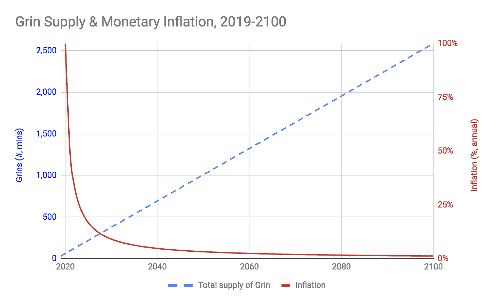

# expecto patron um——第一年露齿微笑和模仿秀指南

> 原文：<https://medium.com/hackernoon/expecto-patronum-a-starter-user-guide-to-grin-mimblewimble-34370c3f7cdb>

## 剥去隐形衣，揭示格林的魔法和区块链实现的魔法世界

Expecto patronum — go away bears!

# 期待守护神——咧嘴笑是被召唤出来的

Grin 于格林威治时间 8 日晚 11 点刚刚发布。我对这一事件感到非常兴奋，并选择将这一内容放在一起，以帮助纪念这一里程碑，并为新接触 Grin 的人制作一个易于阅读的作品。这应该会让你进入第一年，并让你有足够的资源去进入第二年甚至更久。

你可以把这篇文章作为指南，阅读链接，然后回来完成文章的其余部分。向前~

# 阅读白皮书，了解为什么 mimble 或 Grin

2016 年 7 月 19 日——一个昵称为“汤姆·埃尔维斯·杰杜索”的人或团体在一个私人 IRC 频道上扔下了 Mimblewimble 关于世界的白皮书，作为对 Grin 的介绍:[https://download . WP software . net/bit coin/wizardry/Mimblewimble . txt](https://download.wpsoftware.net/bitcoin/wizardry/mimblewimble.txt)

> *“我把我的作品叫做 Mimblewimble，因为它是用来防止区块链谈论所有用户信息的”——汤姆·埃尔维斯·杰杜索*

在 3 个月的时间内，Andrew Poelstra 提交了一份后续白皮书，解决了各种问题，从而使我们陷入了更深的困境。[https://download . WP software . net/bit coin/wizardry/mimble wimble . pdf](https://download.wpsoftware.net/bitcoin/wizardry/mimblewimble.pdf)

如果你对加密货币和区块链相对陌生，我建议 Beam 团队对 Mimblewimble 的好处进行如下解释:
[https://medium . com/Beam-MW/Mimblewimble-explained-like-you-12-d 779 a5 bb 483d](/beam-mw/mimblewimble-explained-like-youre-12-d779a5bb483d)

然后，您可以使用官方文档和 Grin 和 Mimblewimble 的介绍来补充这些信息:
[https://github . com/mimble wimble/Grin/blob/master/doc/intro . MD](https://github.com/mimblewimble/grin/blob/master/doc/intro.md)

请注意，Grin 和 Beam 都是可微区块链的实现。现在，您已经理解了什么是椭圆曲线加密、Pederson 承诺，以及它如何使节点永远不知道交易量是多少，您可以继续了。

# 古灵阁有多少格林币？

格林硬币的数量可以在下面的图表中建模。由于 Grin 被设计为平均每 60 秒有一个区块，每个区块中有 60 个格林币，因此任何时候的总供应量都可以由区块高度* 60 来确定。

可以看出，这与比特币非常相似。CryptoProfG 深入并详细分析了 Grincoins 的货币模型，他的观点是价值储存:[https://medium . com/@ CryptoProfG/grin-money-explained-4-exploring-grins-monetary-model-e48b 1761653](/@CryptoProfG/grin-money-explained-4-exploring-grins-monetary-model-e48b1761653)

# 我是不是又在给别人掏腰包了？

自去年以来，我们已经看到许多公司的团队获得了超额的报酬，却没有交付产品。Grin 不是在做 ICO，没有奖金，Grin 的发展完全由捐款和社区资助。不用说，这让我们非常兴奋能够成为社区的一员，为社区做出积极贡献。供给从 0 开始。

# 让唱诵(采矿)开始

由于盈利问题，以太坊矿工关闭了他们的矿工，我们看到了对 Grin 的巨大需求。大多数大型池现在都支持 Grin: f2pool、SparkPool、MWGrinpool、Grinmint 等等。

Grin Mainnet 将接受 Cuckaroo29 和 Cuckatoo31+,后者占开采区块的 10%。Cuckatoo31+旨在对 ASIC 友好，并可能在 2 年后达到 100%,让制造商有充足的时间提前计划和开发 ASIC。

> 主要工作证明旨在支持 ASIC，预计未来不会改变。ASICs 制造商被鼓励设计专门的机器来开采它。

对于现有的 GPU 持有者，可以在这里找到各种支持卡的估计 GPU 采矿统计:【https://github.com/mimblewimble/docs/wiki/GPU-Mining-Stats

如果你对网络的困难很好奇，请密切关注 BlockCypher 团队的资源。

 [## Grinmint - Grin 矿池|网络图

### 研磨采矿池

www.grinmint.com](https://www.grinmint.com/pages/network-charts.html) 

# 观看三强争霸赛

不是每个人都可以参与采矿，但如果你想只是看着块被创建，我建议你建立或使用一个 Grin 块浏览器(Grinscan 也许？我查了一下，是被一些狡猾的人买走的)。

 [## GrinExplorer

### GrinExplorer.net 由 GNU AGPL 发布的 grin-explorer 驱动。

grinexplorer.net](https://grinexplorer.net/)  [## GrinExplorer

### GrinMint/Explorer 是由 GNU AGPL 发布的 grin-explorer 驱动的。

www.grinmint.com](https://www.grinmint.com/explorer/) 

我们在 Counter.network 的朋友也做了这个:【https://grin.merklepath.com/ 

一旦 CoinMarketCap.com 和 CoinGecko.com 成功地整合了 API，你也可以去那里观察价格和其他信息。

# 贪婪是好事

正如任何令人惊叹的加密货币项目一样，我们都必须承认投机是乐趣的一部分。交易所、分散式交易所、场外交易网络和衍生品市场都服务于这一目的，甚至更多。我们还需要一个健康的市场和流动性，以确保所有参与者都有一个健康的游乐场。我们看到越来越多的交易所加入这场游戏。

*bisq . network
counter . network【bitmesh.com】galleon . exchange
grinpay.org
chainrift.com
HB . top
nexex . io
vinex . network
kkex . VIP
bit forex*

这些交易所可能是存放代币的地方。我还建议把它们放在你自己的钱包里，配有你自己的钥匙。你可以按照这个指南在你的 MacOS 或 Linux 设备上安装并运行一个 Grin node+wallet:[https://medium . com/luxor/how-to-install-and-run-a-Grin-node-wallet-32f 344591478](/luxor/how-to-install-and-run-a-grin-node-wallet-32f344591478)。

沃勒特 713 被沃勒特 713:[https://github.com/vault713/wallet713](https://github.com/vault713/wallet713)

我当然希望看到好的硬件钱包解决方案被开发出来。是时候让 Ledger、KeepKey、Cobo Vault、Trezor 和 imKey 团队开始工作了。

# 让派对继续下去

捐赠是确保 Grin 核心开发者继续让 Grin 变得更棒的关键部分。您可以购买 Grin 商品、组织活动、参加活动以及向普通基金捐款:[https://grin-tech.org/funding](https://grin-tech.org/funding)

# 认识其他巫师伙伴

没有对话、讨论和辩论的社区是什么样的？你们可以通过电报聊天、聚会、会议进行讨论

吉特:[https://gitter.im/grin_community/Lobby](https://gitter.im/grin_community/Lobby)
不和:[https://discordapp.com/invite/Z3sEfEU](https://discordapp.com/invite/Z3sEfEU)
格林哈勃电报集团:t.me/GrinCoin
格林范斯电报集团:t.me/grinfans
格林孔美国:[https://grincon.us/](https://grincon.us/)
格林亚洲会议:[https://meetup.com/grinasia/](https://meetup.com/grinasia/)

*斯潘塞杨灿被发现潜伏在电报@spenceryang 上。*

他是 Hashtag Capital 的合伙人。Hashtag Capital 是一个多策略电子交易基金。我们专门为 Grin 提供 OTC 服务。我们将把一定比例的利润捐给格林社区基金。我们将于 2019 年 1 月 23 日在新加坡联合举办 Grin Asia(meetup.com/grinasia)等活动。

Hashtag Capital 的合作伙伴支持了 CryptoAudiences、Counter Network、CryptoKitties、CoinMarketCap、Cobo、Chainrock、Akio Labs、PledgeCamp、EOSIO 等公司的发展。SG 和许多其他人在过去的两年里。