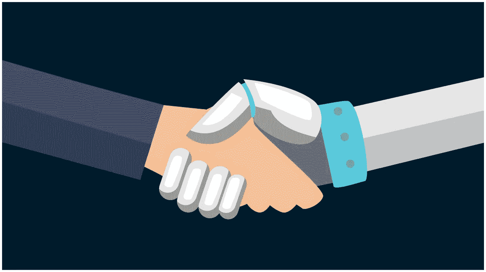
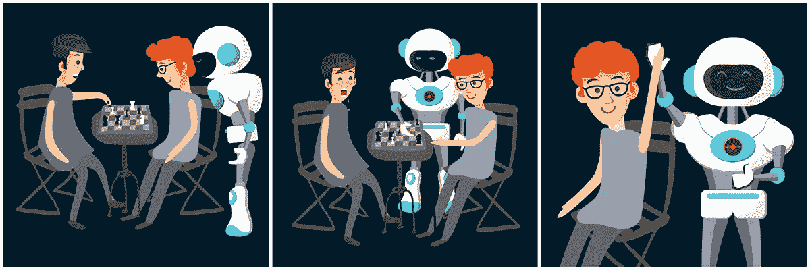

# 用简单的术语解释机器学习

> 原文：<https://medium.com/hackernoon/explaining-machine-learning-in-simple-terms-99aadd1b876a>

今天，我想谈谈机器学习(ML ),简单地说给你听。一言以蔽之，机器学习到底是什么；在实践中如何应用，有什么潜力。为了更容易理解，我将用简单的例子来说明这些观点。

很多人认为机器学习是关于图像识别的东西，但这种认知完全是狭隘的。机器学习是一个让行业变得更好并影响我们所有人生活的整个世界。

# **那么，机器学习到底是什么？**

M 机器学习是一种数据分析方法，可以识别模式和算法，从中学习，并在没有或只有最少人工指导的情况下做出准确的预测和更好的决策。

这里的关键词是**数据**。机器学习从模式中学习(这里我们无法避免同义反复)，预测可能的场景，并根据它已经看到和识别的模式提出解决方案。

# **机器学习的主要目的是什么？**

**机器学习促进了数据驱动的决策**，这是巨大的。无论在哪里应用，这种方法只会带来好处。

为了避免未经证实的陈述，让我们看看 ML 是如何应用于基本面的。

# **钱，钱，钱:金融中的机器学习**

在关于[金融软件](https://blog.sumatosoft.com/financial-software-why-necessary-for-businesses-present-online/)的文章中，我提到了机器学习如何在与金融相关的情况下应用于风险识别，在这些情况下，必须立即做出决策，如果由人做出决策，将会花费太多时间。

让我们看一个简单的例子，它说明了机器学习可能给金融机构及其客户带来的巨大价值。

银行信用:谁决定你是不是一个值得信任的人？如果你没有信用记录或者不能证明你有能力偿还，银行很可能会拒绝你的申请，即使他们错了。这不公平，你不觉得吗？

另一方面，设身处地为银行想想:他们如何决定贷款给一个人还是拒绝他们？这样的决策缺乏数据，出错的概率太高。

这就是机器学习的用武之地。它监控各种信用数据，评估风险，预测个人偿还贷款的概率。

实际上，这是一个双赢的局面。**银行保护自己免受不良事件的影响**和**以前被贴上不可信标签的普通人****现在有机会**洗清自己的名声**获得信贷**。

**机器学习也可以应用于投资决策**。如果你不确定在哪里投资，机器学习会考虑所有选项，选择最好的(不要把所有鸡蛋放在一个篮子里)给你。

# **正合我意:医疗保健领域的机器学习**

在医疗保健领域，准确的预测可以拯救人们的生命。机器学习是分析核磁共振、x 光等医学图像的好帮手。它辅助医生诊断各种疾病，正确的诊断是成功的一半。此外，机器学习允许卫生专业人员检测异常并降低用药错误的风险。

对异常或并发症的正确诊断和早期检测使医生能够及时采取措施，并使患者能够获得适当的治疗和战胜疾病。

有一项[研究](https://journals.plos.org/plosmedicine/article?id=10.1371/journal.pmed.1002701)认为机器学习是一种在手术后识别高风险患者的能力，有助于医生减少并发症和死亡率。

因此，毫不夸张地说，机器学习在诊断和异常检测方面具有巨大的潜力。它**有助于医生做出正确的决定，并将医疗保健提升到下一个层次**。

# **应用机器学习的非标准方式**

我们已经在两个主要行业的框架内讨论了机器学习:金融和医疗保健。然而，机器学习的特点是它**允许人们和企业超越并在最意想不到和非凡的领域应用它的力量**。毕竟机器学习是分析数据的，数据是一切的基础。

# **打击虚假评论**

每个人都希望只阅读公平和诚实的评论，无论是 Booking.com 或猫途鹰上的餐馆或酒店描述，还是 Play Store 中某个应用的评论。但是一些公司不怕使用不诚实的手段来吸引顾客的注意。他们从虚假的账户上为自己写虚假的赞美之词，有时甚至发布关于竞争对手的负面反馈。因此，企业和客户都受到不公平竞争行为的损害。

即使在这种情况下，机器学习也提供了一种解决方案。一个很好的例子是由谷歌开发的机器学习驱动的系统[，用于对抗 Play Store 中的付费评论和虚假评级。](https://android-developers.googleblog.com/2018/12/in-reviews-we-trust-making-google-play.html)

这个基于 ML 的系统设法在短短一周内消除了数百万条虚假评论。此外，它允许跟踪和消除大量来自 Play Store 的虚假评论的不可靠应用程序。

**如果**所有**在线评论和评级平台都开始利用机器学习**来区分小麦和谷壳**产品和服务的质量将会显著提高**每个人都会变得更好。

# **查找软件中的 Bugs】**

自动化测试已经为软件开发人员和 QA 工程师提供了很好的支持。它与手工测试和平共存，并有助于软件开发的质量。

然而，完美是没有边界的，机器学习可以让软件错误成为过去。机器学习能够了解软件解决方案中的缺陷并找到漏洞，从而使 IT 公司能够发布顶级产品。

这也可能解决信息安全问题:由于没有软件漏洞，公司和客户数据不会受到损害，企业将能够避免声誉和财务损失。

**机器学习完全有机会成为软件开发过程中必不可少的一部分，成为每个开发者的得力助手。它不仅会发现错误和漏洞，还会自动修复它们，而不会让软件工程师从代码编写中分心。**

# **帮助职业选择**

让我们做一个小小的梦:如果在选择学院或大学时，你已经获得了关于你会成功的职业的准确信息，会怎么样？有多少人想成为飞行员、外科医生、芭蕾舞演员或时装设计师，但不相信自己，害怕失败，最终成为一名对自己的工作不满意的普通工人？

**如果机器学习可以预测你的职业生涯和你在特定职业中的成功机会，会怎么样？**比如:有 63%的可能性你会成为一名受人尊敬的大学教授(绝对值得尝试)，或者有 77%的可能性你会成为一名音乐大师，而分子物理学作为一种爱好而不是一份工作是不错的——只有 5%的成功概率。

机器学习完全能够将人们与他们热爱的职业联系起来。最后，做你喜欢的事情已经是在战胜困难了。

**P.S.** 为了更好地理解机器学习的各种能力，看看它在 Kaggle 上解决的真正的[挑战](https://www.kaggle.com/competitions)，ka ggle 是一个数据科学竞赛平台。你不会失望的。