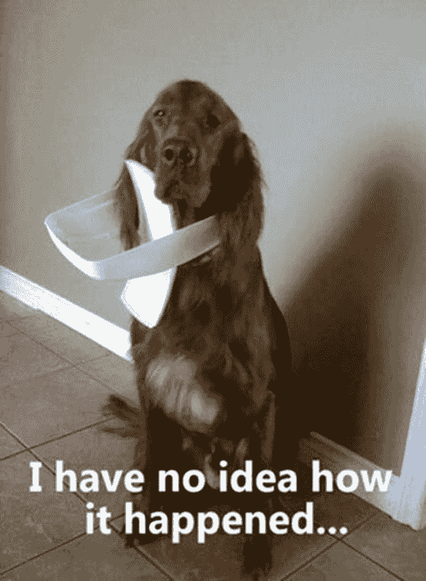
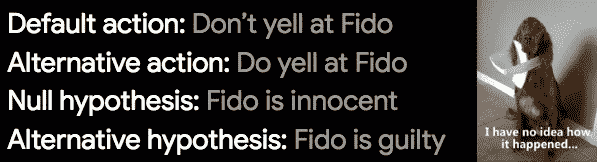
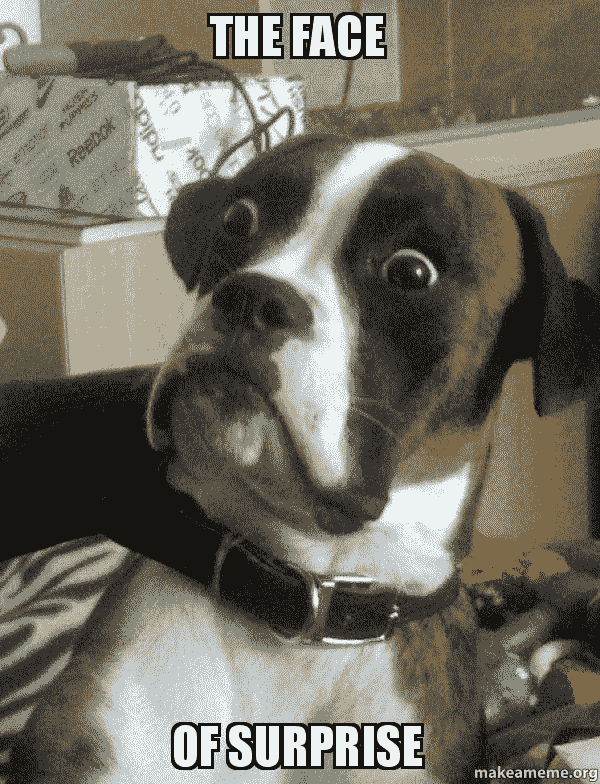

# 用小狗解释 p 值

> 原文：<https://medium.com/hackernoon/explaining-p-values-with-puppies-af63d68005d0>

你会发现 p 值隐藏在数据科学和其他科学中。如果你用 STAT101，你可能会听到这样的解释:*p 值是观察到一个* [*统计量*](http://bit.ly/quaesita_statistics) *至少和我们的一样极端的概率，以零假设为条件。*怪不得没粘住！不如用小狗试试吧…

*(如果你喜欢视频形式的学习，链接在底部。)*

Is p-value short for puppy-value?

# 设定(犯罪)现场

想象一下，回到家发现*这个*在你的厨房里:

Let’s assume this is your dog and your kitchen, otherwise the example just became much stranger. Also, as far as their owners are concerned, dogs are always puppies even when they’re too big to carry around.

让我们以把头伸进垃圾桶的罪名审判这个嫌疑犯吧！

我们先用一个[***默认动作***](http://bit.ly/quaesita_damnedlies)*不对 Fido* 大吼大叫以及一个对应的 [***无效假设***](http://bit.ly/quaesita_damnedlies)*Fido 是无辜的*如果你对这些概念不熟悉或者不确定如何建立假设，请阅读[这个](http://bit.ly/quaesita_damnedlies)。

Our setup for the [hypothesis test](http://bit.ly/quaesita_fisher). Big words explained [here](http://bit.ly/quaesita_damnedlies). Also, yelling at puppies is probably not the way to go through life, but bear with me for the sake of the example.

# 描述零世界

计算 p 值的第一步是深吸一口气，说:*“好吧，菲多，我要想象你是* ***无辜的*** *。”*

我们在这里做的是将零假设世界可视化，并弄清楚那里的事情是如何运作的，这样我们就可以制作一个玩具模型。这就是[计算关于](http://bit.ly/quaesita_statistics)的全部内容。

# 这个证据让你吃惊吗？

你刚刚想象完如果**狗不去找垃圾**你的世界会如何运转。

> "如果菲多是无辜的，这个证据会有多令人惊讶？"

是时候问一个大问题了:这个世界有多大可能会咳出一些东西，至少与我们在现实生活中看到的证据一样确凿？

当你用一个数字来回答这个问题时，那个数字*就是*p 值本身！

# 基于惊讶的裁决

如果你和一个八岁的孩子住在一起(那种特殊的恶作剧)，一个无辜的小狗时不时会被装饰上新的项圈(用垃圾桶盖做的),这似乎是合理的。你的 p 值可能不是一个小数字。既然菲多无罪的证据看起来可信，你就没有理由改变主意，不再称菲多为好狗。

如果你和 Fido 单独住在一起，你仍然可以想象出一种方法来获取证据，至少是这种该死的证据。也许你的疯狂邻居从你的窗户爬进来，在你的公寓里跑来跑去，把垃圾桶的盖子盖在狗的头上…然后又从窗户跳出去了！

这是可能的。这不太可能发生。当你眯着眼睛看这个概率时，你会发现 p 值非常小，以至于继续认为狗是无辜的会让*你*感到可笑。所以你说，“我拒绝零假设。我判你有罪。坏狗，菲多！”

> p 值不能证明任何事情。这只是一种利用惊喜作为做出合理决定的基础的方式。

你可能得出了错误的结论——不确定性就是这样一个混蛋。直到为时已晚，你才知道自己是否做对了。这就是生活。我们只能在一个不确定的世界里努力做到最好。p 值只是一种使用惊奇作为做出合理决策的基础的方法。如果你开始期待它为你做些别的事情，你将得到互联网对 p 值滥用者的所有蔑视[。](http://bit.ly/uglyp)

# 摘要

一个 p 值问道，*“如果我生活在一个我应该采取我的* [*默认动作*](http://bit.ly/quaesita_damnedlies) *的世界里，我的证据有多令人惊讶？”p 值越高，我对坚持计划行动的感觉就越不荒谬。如果 p 值足够低，我会改变主意，做点别的。*

*如果你想了解 p 值争议***并阅读我对 p 值引起的所有情绪的看法，请查看本系列的下一篇文章:* [*为什么 p 值像针一样？*](http://bit.ly/quaesita_needles)*

# *感谢阅读！人工智能课程怎么样？*

*如果你在这里玩得开心，并且你正在寻找一个为初学者和专家设计的有趣的应用人工智能课程，这里有一个我为你制作的娱乐课程:*

*Enjoy the entire course playlist here: [bit.ly/machinefriend](http://bit.ly/machinefriend)*