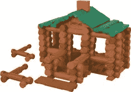

# 用林肯日志解释区块链

> 原文：<https://medium.com/hackernoon/explaining-the-blockchain-with-lincoln-logs-a896a540f5d2>

当学习区块链时，我发现如果解释它的人不是该主题的“专家”，而是能用日常语言和例子解释复杂概念的老师，会更容易理解基本前提。

因此，我不会在大学水平上解释区块链及其用途，而是希望能够唤起你对过去的记忆，并让你对我们共同的未来有所了解。

回想一下，想象一下我们年轻时广受喜爱的玩具——林肯圆木——你知道，那些连接的圆木以不同的方式组合在一起，建造小结构或小木屋。

在考虑 Lincoln 日志的功能时，最重要的是它们背后的逻辑以及它们所绑定的规则；区块链非常相似。

区块链就像一根林肯圆木，和其他圆木放在一起。当它们放在一起时会发生什么？它们联系在一起。现在想象一下，如果这些林肯原木的创造者弗兰克·劳埃德·赖特的名字和个人创作的日期印在每根原木上。

不管这些日志组成的顺序、模式或结构如何，您(或任何来查看您的日志的人)将能够准确地说出每个日志是谁在何时创建的。这带来的可验证性和可审计性，现在公开的信息，印在日志上，让我们可以确保我们使用的每一个部分都是原始游戏的一部分。

现在，一旦我们的结构被观看或摆弄，没有人会担心赝品或来自不同布景的作品——我们有完全可审计的真实性。

现在，记住可审计真实性的概念，让我们定义区块链；区块链是一个分布式的分类账，每一份(每一份林肯日志)都包含相同的信息，所有这些信息一次只能放在一起。区块链与我们的林肯圆木的区别在于，它能在每块木头上“刻”出比名字和日期更多的信息。

然而，为了效仿我们的林肯日志示例，区块链——就像我们铭刻的林肯日志一样——允许完全可审计的真实性。作为一个分布式的数字账本，所有写入链的信息都是完全公开的，不可改变的(不能更改)。此外，由于分类帐完全分布在所有使用或访问区块链的人中，真实性可以由多人确认，并且放在分类帐上的任何东西都不会“消失”或“丢失”，因此通过完全缺乏集中信任来确保信息的准确性。

现在我们对什么是区块链有了一个大致的了解，我们可以问这样一个问题“它能用来做什么？”

现在，我们都知道林肯原木对我们这些孩子来说是多么的珍贵和重要，但是让我们从林肯原木的著名创造者和爱好者弗兰克·劳埃德·赖特的角度来看一下。让我们想象一下，出于对创作的无限热爱，赖特先生决定画他最喜欢的林肯原木结构。

这幅画是表现主义艺术的杰作，被赖特视为他一生工作的理想表达。随着林肯纪念册越来越受欢迎，这幅画的价值迅速上升，到他生命的最后，赖特已经看到了许多复制品和赝品。由于这件作品已经积累了巨大的价值，赖特希望确保这幅画的真实性永远不会受到质疑。

为了做到这一点，赖特亲自为他的画写一份真迹证明；现在，不管这幅画去了哪里，只要有这个真迹证明，这幅画就永远不会被误认为是赝品。

这种形式的真品的问题在于，每笔交易(或所有权变更)都需要对卖方有一定程度的信任，以提供真品和/或绘画的非伪造证书。

区块链，正如我们前面提到的，消除了集中信任的要求，将是一个完美的作品认证机制。现在想象一下，每一件被授予真品证书的艺术品都被放在一个巨大的账本上，每个艺术品经销商、艺术家、买家或普通人都可以看到。

随着每一个细节(小到最微小的一滴墨水)在这本账簿中被分类和鉴定，伪造将变得几乎不可能——鉴定原画将变得极其容易。此外，有了刻在木块上的题字，我们就可以鉴定作为这幅画主题的林肯原木。

区块链的交易就是这样进行的。一旦一条信息被放入分类账，它就被完全认证，即使是最微小的、不明显的或无关紧要的变化都可能表明是伪造的。

例如，如果我要购买某个有价值的物品，这个有价值的物品会被写在区块链上，无论其他人如何努力试图伪造这个物品，除非它完美到原子级别，否则它永远不会被鉴定为原件。因此，没有人能够质疑物品的真实性、所有者或交易日期——一切都将是公开的，完全可审计的。

让我们举另一个例子，我们的林肯日志箱。如果我们将区块链和区块链的技术应用到每个盒子的制造和销售中，我们就可以跟踪特定的盒子(以及盒子中的每一件东西),从它被创建的时间，到我购买它的时间，以及中间的所有步骤。把它写在分布式分类账上，就不会有关于它的原创性，它是在哪里制造的，以及它是如何到达我手中的问题。因此，我的林肯日志可以在整个供应链中得到验证，每个人都可以看出它是原装的，没有被替换或伪造。

跟踪这些步骤的能力消除了信任商家实际上是在出售原创游戏而不是赝品的需要。这也可以让我确保我的购买是在我和我认为我正在购买的商家之间进行的。虽然有人可能会破坏账本的单个副本，但它的整体不受任何一个人的控制，因此，无论有人如何努力，我总能找到并验证原件。

除了分布式信息的通用存储，区块链还可以促进智能合同的执行。想象一下，在一份普通的合同中，两个人签署一张纸，如果发生任何争议，他们把他们签署的那张纸拿到法官面前说‘看！“他们签了字，这是可以执行的，”虽然在许多情况下，合同上的签名提供了所有必要的认证，但合同/签名伪造是一个巨大的法律问题，每年都会造成巨大的法律和金钱损失。

信任是合同的本质，它允许欺诈的发生。这些看似与生俱来的问题，通过巧妙的契约变得没有实际意义。智能合同以“如果，那么”的格式编写，是在区块链上完全可审计的有约束力的合同，仅在满足特定条件后执行。因此，服务、资产、资金或合同的任何其他功能的转移是完全可审计的，并且是在没有任何信任或人类行为(总是会受到误导或错误)的情况下执行的。举个例子，假设我想从全国各地购买一箱林肯原木。

通过智能合同的实施和使用，我不再只是支付费用并“相信”日志会到达我家，而是能够监控日志的每个步骤——从制造到交付——并在出现问题时随时停止交易。此外，我购买的公司也能够监控交易，以确保订单和付款的履行。

通过不可信的业务交易、可审计的身份验证以及绝对不会丢失或泄露数据的能力，区块链可以彻底改变包括金融、医疗服务、保险和房地产在内的无数行业。

此外，在消费者方面，区块链技术将使我们能够确保我们最重视的商品和服务的真实性和道德供应链。此外，由于在认证和供应链监控方面缺乏“猜测”，商品成本降低，消费品和服务的价格也会降低。

当我们走向一个新的、不信任的世界时，区块链为我们所有人提供了巨大的潜力——我们所要做的就是建立我们的社会结构，一次一个林肯日志。