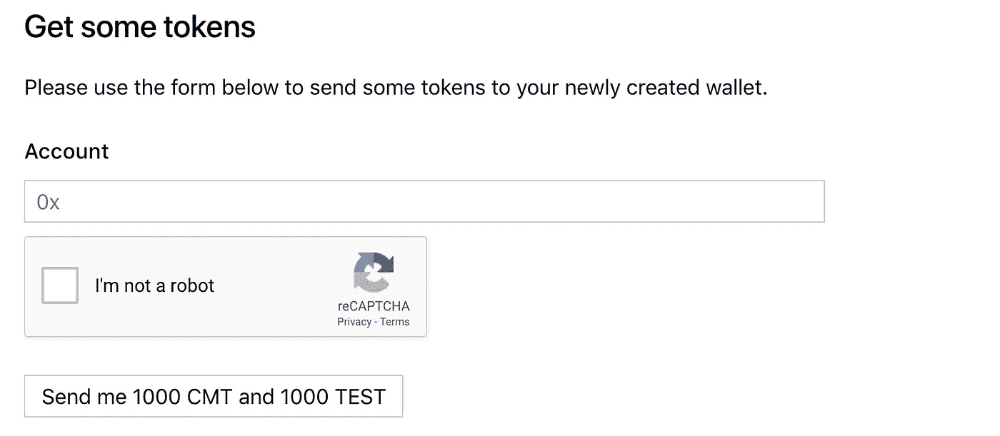
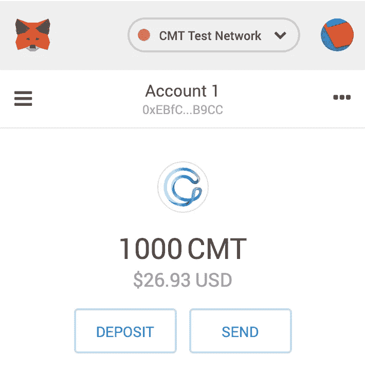
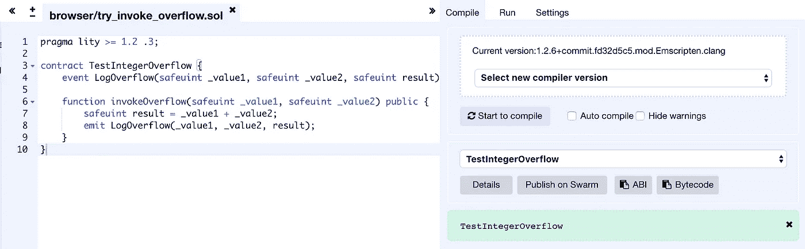
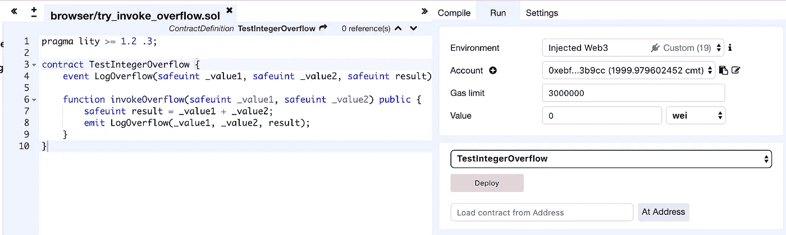
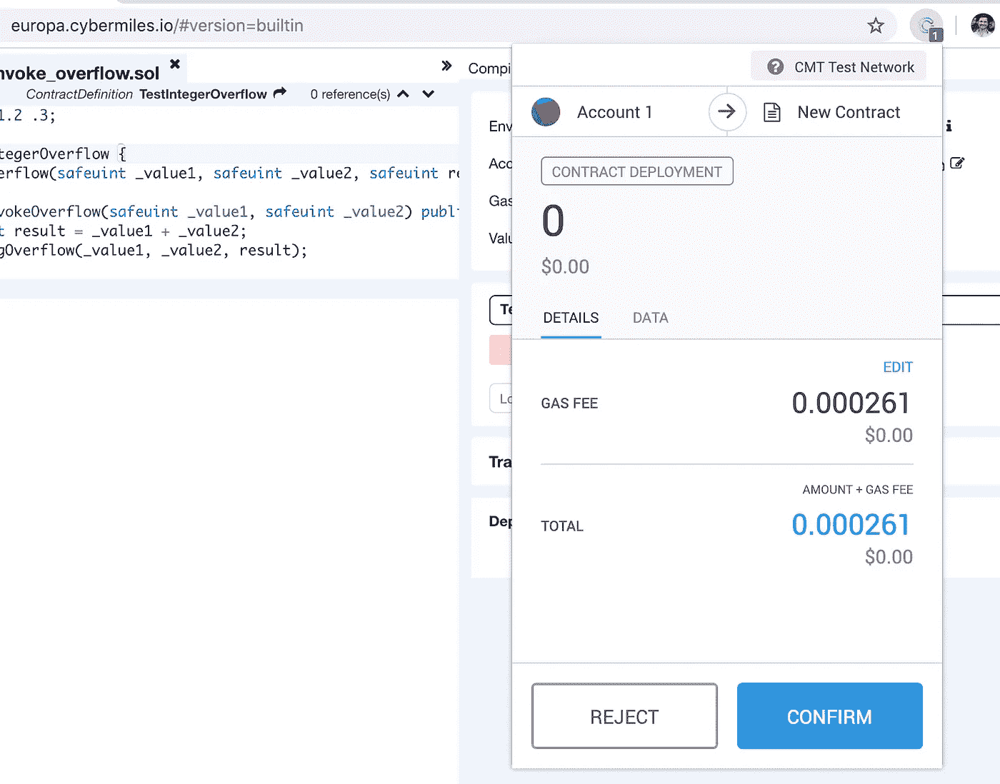
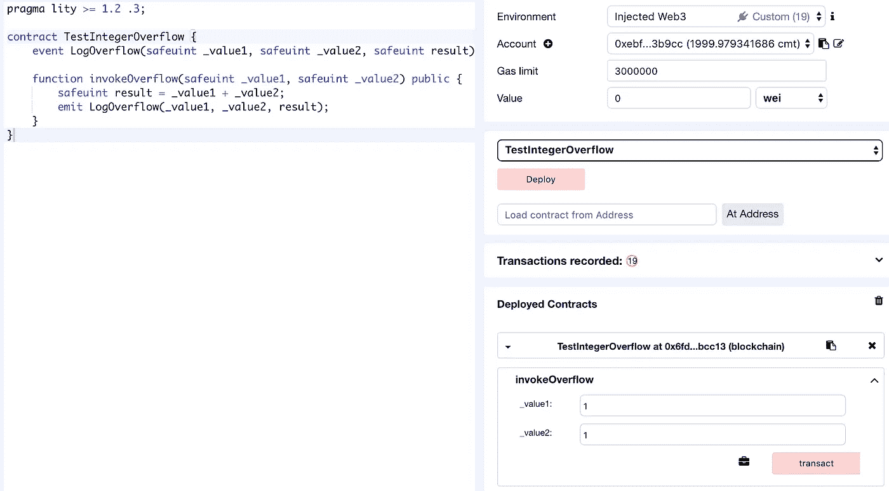
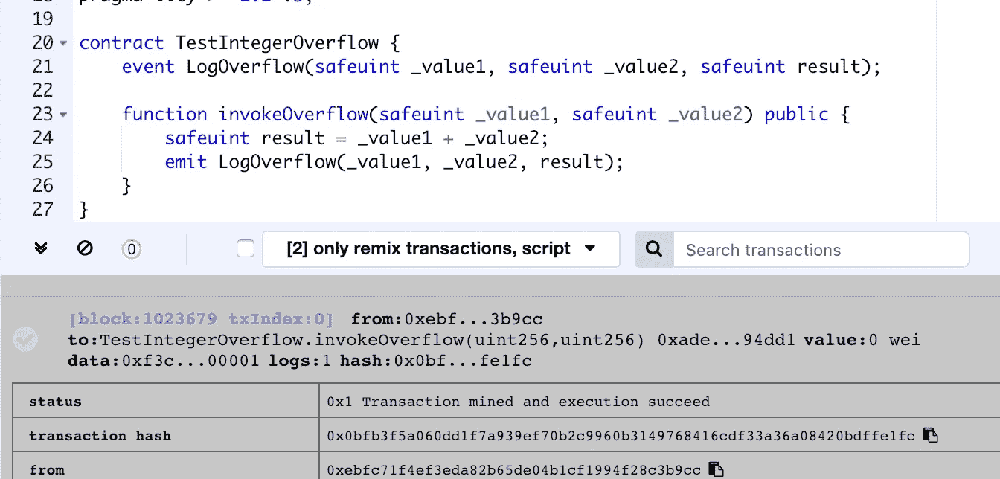
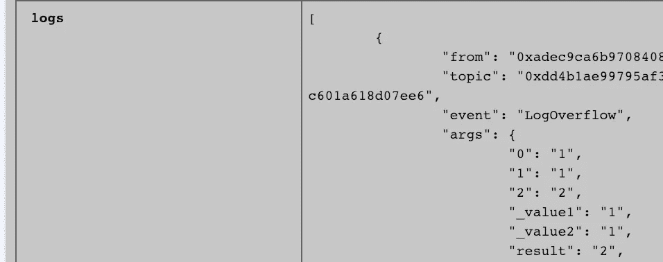
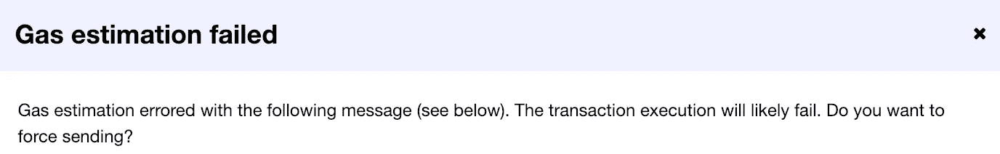

# 爆炸火箭&数百万免费区块链代币？—是时候我们好好研究一下整数溢出了。

> 原文：<https://medium.com/hackernoon/exploding-rockets-millions-of-free-tokens-lets-take-a-good-look-at-integer-overflows-2800794e48d9>

整数溢出是一种狡猾的野兽！这篇文章是你的免费入场券，不仅仅是为了理解整数溢出，也是为了发现新的预防措施。

如果你不是软件开发人员，请继续读下去，整数溢出是非常迷人的。此外，我已经非常努力地让这篇文章易于理解；数学和编码比较轻松，所以玩得开心点。

如果你**是**软件开发人员，坚持到最后，因为你将有机会**在区块链上部署你自己的智能合同**。又快又免费！

# 锈

我们将从为您提供一些简单易懂的演示开始这篇文章；用铁锈写的。使用 Rust 有两个很好的理由。

1-Rust 处理整数溢出的方式不同，具体取决于您是否:

*   在**调试**模式下编译程序，或者
*   为**版本**编译您的程序

这对于演示来说非常方便！

2——其次，在你意识到之前，你有可能正在 Rust 中编写一份区块链智能合同。

> 你知道以太坊的 Web Assembly (WASM)项目名为 [eWASM](https://ewasm.readthedocs.io/en/mkdocs/README/) 的目标之一是提供一个库和使用 Rust 编写智能合同的指令吗？

准备好了吗？让我们开始吧…

## Rust 的有符号整数 i8

这种 Rust 数据类型将接受从-(2 ⁸⁻)到 2⁸⁻ -1 的值。

这些值也可以表示为-(2⁷，一直到 2⁷ -1。

或者-(2 x2 x2 x2 x2 x2 x2 x2)一直到(2x2x2x2x2x2x2) -1。

或许，更简单地说，从-128 到 127。

有了这些知识，让我们创建一个溢出问题。在下面的代码中，我们首先声明一个名为 i_8_int 的 i8 变量。然后我们把数字 127 赋给变量 i_8_in。

127 是这个变量类型的上限。因此，如果我们将变量增加 1，我们将看到 i_8_in 的新值从 127 变为-128(负 128)！

当我们看这些例子时，想象一个模拟挂钟。

想象你正在增加时针。时钟永远不会先指向 12 点，然后指向 13 点。时钟将总是显示 12 点，然后回到 1 点左右(从头开始)。

现在想象一下-128 到 127 以一种循环的方式。一旦该值一路走完，它将从 127 前进到负的**128。这就是所谓的包装，或者返回一个包装的结果。**

> **有符号的**整数被称为**有符号的**，因为它们可以是负数，即-128，-127，-126 … 0 1，2，3 … 126，127。**无符号**整数只是正数。你也可以把这些数字想象成一个圆圈(就像一个钟面，除了一个(没有负值)，它从零开始，然后再次环绕，即 0，1，2，3 … 253，254，255，0，1，2)。

## Rust 的无符号整数 u8

该数据类型将接受从 0 到 2⁸ -1 的值。

这些值也可以表示为 0 到(2x2x2x2x2x2x2x2) -1。

更简单地说，从 0 到 255。

## 哪些整数会溢出/换行？

这种溢出问题将对所有的整数变量类型重复出现，正如您在下面的 i64(有符号整数)示例中看到的那样。

# 为什么整数溢出如此重要？—第一部分

## 封闭系统

无论您使用什么编程语言，确保代码的行为是您真正想要的是非常重要的。

## 爆炸的火箭

正如本文所解释的那样，整数溢出会在许多语言中发生，并带来灾难性的后果，下面的视频也展示了这一点。

> [阿丽亚娜 5 火箭](https://en.wikipedia.org/wiki/Ariane_5)因为一次数据转换自毁！原始 64 位浮点值太大，无法用 16 位有符号整数表示。

## 回到铁锈

我们在开始的时候提到过，Rust 会根据你是在调试模式下编译还是在发布模式下编译来不同地处理溢出错误。

## “释放”模式

下面的代码展示了我们第一次演示的整数溢出**如何使用 Rust 的**发布**模式成功地**编译。如果发生溢出，这段代码将返回包装的结果。需要注意的事情！

## “调试”模式

如果我们使用调试模式运行同一个程序，该程序将不会返回一个包装的结果，而是会“死机”，如下所示。

请注意，编译器的恐慌明确指出了上述源代码第 4 行的溢出(在这里，我们尝试增加 i_8_int 变量的值)。

# 为什么整数溢出如此重要？—第二部分

## 开放系统

开放系统的一个例子是在公共区块链上运行的智能合约。为什么？因为，在这种情况下，任何最终用户都可以将他们喜欢的几乎任何变量传递到您的智能合约的函数中。我们有一个例子，有人通过传入导致整数溢出的值创建了数百万个免费令牌。

为了演示“外部用户输入”，(与之前将溢出值静态地输入到源代码中相反)让我们探索一下程序容易受到来自外部来源的溢出攻击的可能性。

这里，我们让最终用户将他们自己的值传入 Rust 程序。正如您将看到的，任何人都可以引发溢出。

## 又是“释放”模式

正如我们从下面的执行输出中看到的，我们能够通过提交 i8 (127)的上限，然后提交 1 来创建一个溢出。注 127 + 1 = -128。在这种情况下，不会出现混乱，代码会返回包装的结果。

## 又是“调试模式”

有趣的是，即使这个程序中的数字是 100%由外部用户传入的，Rust 编译器在“ **debug** 模式下仍然会捕捉到这个溢出并出现恐慌。这太棒了！

# 分析区块链编程

# 区块链整数溢出的真实例子

以下是来自 BeautyChain (BEC)合同的[代码的演练。正如](https://etherscan.io/address/0xc5d105e63711398af9bbff092d4b6769c82f793d#code)[这篇 PeckShield 文章](/@peckshield/alert-new-batchoverflow-bug-in-multiple-erc20-smart-contracts-cve-2018-10299-511067db6536)所指出的，BeautyChain 契约中的一行代码导致了整数溢出。

结果真的很奇怪。而不是偷一些，或所有的 700000000000000000000000000 代币供应。攻击者能够在黑客拥有的两个独立(新)账户之间发送相当于 2 个⁵⁶令牌的信息。一遍又一遍。每次攻击实质上都是向黑客发送 11579208923731619542357098500868790785326998465640564039457584007913129639935 令牌。

这是怎么做到的？[源代码](https://etherscan.io/address/0xc5d105e63711398af9bbff092d4b6769c82f793d#code)，揭示了一切。但是，如果你不想看 299 行代码，没问题！这是一个非常“简短”的事件的简单英语版本。

## BEC 黑客的简短版本

BEC 令牌的源代码为黑客提供了输入一个乘以 2 等于 0 的值的机会(由于整数溢出)。

让我们快速看一下黑客是如何工作的。基本上，我们只需要传入一些值，这些值会使函数第二行的“数量”变成 0。

这里有一个方法。如果我们传入一个 _value，它是 2 ⁵⁶的一半，然后为 _receivers 输入两个帐户地址，在上面函数的前两行中将发生以下情况。

***uint cnt*** 将等于 2；

***uint256 金额*** 将等于 0；

…就这些了。如果“amount”等于零，那么下面的代码将把 _value 存入两个帐户，并从调用该函数的帐户(黑客帐户)中取零。

你听懂了吗？或者你想知道零是从哪里来的？

让我们把它拆开，记住，我们说过一个 8 位**无符号**整数是 2⁸ -1 或(2x2x2x2x2x2x2x2) -1，或 0 到 255。

我们也说过 255 + 1 = 0。再想一想，按照圆形排列的数字，就像挂钟上的表盘。我们有从 0 到 255 的值(256 个槽)。0 有一个空位，其他 255 个数字有更多空位。如果我们超过第 255 个槽，我们会回到数字 0(不是 256)。

256 的一半是 128，因此 128 * 2 = 0。这个 ***理论*** 对所有整数大小都有效。

## 关于区块链智能合约的思考

在智能契约的世界里，开发者可以利用库来执行安全的计算(防止整数溢出)。一个非常全面的安全智能合约开发库的例子是 [OpenZeppelin](https://github.com/OpenZeppelin/openzeppelin-solidity) 。

我借鉴了 OpenZeppelin 的书，创建了下面的“i8_safe_add”函数来演示开发人员如何通过编写更好的代码来防止整数溢出问题。

代码在发布模式下成功编译(在编译器级别没有任何调试或溢出检查)。

以下是用户输入**不会**导致溢出的值时的输出示例。

以下是用户输入值**导致**溢出时的输出示例。

正如你所看到的，程序使用新的 i8_safe_add 代码，一旦检测到溢出就正确地退出。

太棒了。

## 但是，代码从来都不是完美的！

我们可能永远不会看到软件开发人员写出完美代码的情况。在百万分之一的情况下，总会有某样东西被偶然忽略。开发人员很忙，编程很难，毕竟我们都是人。

> [最近的一项研究](https://arxiv.org/pdf/1802.06038.pdf)分析了近 100 万份已部署的以太坊智能合约，发现其中许多合约包含严重的漏洞……以太坊的最新编程语言 [Vyper](https://github.com/ethereum/vyper) 努力提供卓越的审计能力……Vyper 的开发原则是开发人员几乎不可能编写误导性代码[1]。

我们不能强迫自由和开源软件(FOSS)的开发者使用安全的软件库，甚至编写单元测试。也没有一个全球性的机构负责审计每一行代码。

那么我们如何解决这个问题呢？

# 终极解决方案

电子商务区块链对整数溢出采取了多管齐下的方法。CyberMiles 通过以下方式主动消除智能合约代码[2]中的( *safeuint* ，uint256 和 int256)整数溢出:

*   支持新的*安全*数据类型，由此所有*安全*操作被自动包装在安全数学函数中，
*   运行时检测整数溢出；发生整数溢出时暂停合同执行

CyberMiles [文档](https://lity.readthedocs.io/en/latest/overflow-protection.html#lity-s-ethereum-virtual-machine)展示了他们如何能够编译上述 BEC 合同，然后执行其有问题的 batchTransfer 函数，而没有任何整数溢出问题。这要归功于他们的虚拟机内置的整数溢出保护机制，该机制保护 CyberMiles 生态系统中的所有智能合同开发者和最终用户。

# 创建您自己的智能合同

让我们开始在网络里程测试网上部署一个快速智能合同。你所需要的只是一个 Chrome 网络浏览器。说真的！剩下的就简单了。

## 第一步

继续并获取 [CyberMiles MetaMask 插件](https://www.cybermiles.io/en-us/blockchain-infrastructure/metamask/)；该链接会将你带到谷歌 Chrome 官方商店。

## 第二步

去吧，从网络里程测试网的水龙头中获得你的 1000 个免费 CMT 代币。

几秒钟之内，您的 MetaMask 钱包将显示 1000 个新代币。

## 第三步

打开 [CyberMiles 免费在线智能合同编辑器](http://europa.cybermiles.io/#version=builtin)并粘贴一些原始代码(点击下图右下方的“查看原始代码”)。

代码会自动编译。如果没有，请单击免费在线代码编辑器的编译选项卡中的“开始编译”按钮。

Compile the contract

## 第四步

切换到运行选项卡(在编译和设置选项卡之间)，并单击红色的“部署”按钮。

Deploy the contract

请注意 CyberMiles MetaMask 弹出窗口，因为您需要通过单击鼠标来“确认”这些交易。如果您没有看到弹出窗口，请在 Chrome 浏览器的右上角查找通知(1)。

1 notification for you to click and accept

弹出窗口非常明显，所以您应该不会有任何问题。

## 第五步

通过传入两个安全变量来测试协定。在下面的例子中，我们将数字 **1** 和 **1** 相加。然后，我们单击红色的“transact”按钮。你会得到另一个弹出窗口“确认”。

Call the invokeOverflow function of the TestIntegerOverflow smart contract

## 第六步

要检查输出，请单击代码下方方框中的绿色勾号。这将打开最新的事务，并允许您查看日志。

Open transaction receipt

当您向下滚动到日志时，您会看到日志显示了正确的值。_value1 是 **1** ，_value2 是 **1** ，结果是 **2** 。是真的 1+1=2。

完美！

如果我们回想一下我们关于整数的理论，我们会记得(或者现在可以自己计算)一个**无符号** 256 位整数的最大值是 115792089237316195423570985008687907853269984665640394575840791312963935。

还记得上面 2x2x2x2x2x2x2x2x2x2 等等的理论吗？

如果您使用一个将推动 uint256 上限的数字再次重复上述测试，您将看到区块链网络里程公司将拒绝该交易。

例如，如果您尝试添加上述数字和数字 1(作为您的“TestIntegerOverflow”智能协定的“invokeOverflow”函数的两个参数)，您将得到以下警告。

本质上，这条消息告诉你的是，这个事务可能会失败。这条消息给了你一个优雅地退出的机会。但是，如果您仍然继续，虚拟机将被迫消耗您提供的所有气体。但是，由于涉及 uint256 整数的不正确操作，最终也会拒绝事务。

太棒了。

# 今后

我们在本文开头提到，Rust 编程语言可能会成为以太坊 2.0 智能合约的智能合约编程语言之一。更确切地说，是电子邮件。

正如我们在上面看到的，Rust 将允许整数溢出使用“释放”模式编译。**这完全正常**。

## 故意整数溢出

如果我现在提到绕回行为在一些软件实现中有它们的位置，那将是我的疏忽。研究表明，低级代码中的许多整数溢出是故意的，故意使用回绕行为实际上比普遍认为的更常见[3]。

## 不需要的整数溢出

然而，正如我们所看到的，区块链智能合约代码需要有意利用绕回行为的可能性极小。电子政务的实现可能会比我们想象的更快，这是一个需要尽快进行研究和开发的领域。我很想听听你对如何设计 eWASM 的想法，以允许开发人员自由编码，同时可能内置一些安全措施。任何超前的想法和设计肯定会对去中心化网络的未来及其所有用户产生积极的影响。

如果你喜欢这篇文章，请鼓掌。如果你有任何问题，请留言。很快再见！

# 参考

[1][https://github . com/ethereum book/ethereum book/blob/develop/08 smart-contracts-vyper . asciidoc](https://github.com/ethereumbook/ethereumbook/blob/develop/08smart-contracts-vyper.asciidoc)

[2]https://www.litylang.org/security/

[3][http://www.cs.utah.edu/~regehr/papers/overflow12.pdf](http://www.cs.utah.edu/~regehr/papers/overflow12.pdf)