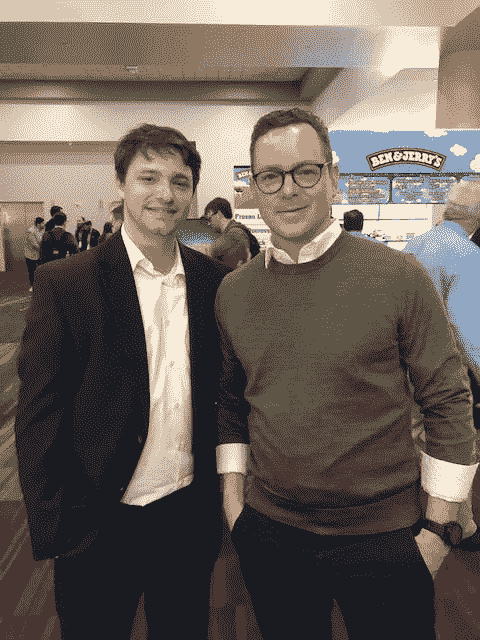

# 在 CES 2019 上与杰里米·卡普兰一起探索智能汽车技术的未来

> 原文：<https://medium.com/hackernoon/exploring-the-future-of-smart-car-technology-with-jeremy-kaplan-at-ces-2019-293d922eab55>

(L) Attorney Andrew Rossow and (R) Digital Trends Editor-In-Chief, Jeremy Kaplan

你还记得在电视上看着杰森一家长大吗？我知道当我第一次看到它时，飞行汽车甚至自动驾驶技术的概念是如此遥远，超出了当时可用技术的能力，以至于它是那个时代的未来动画秀。

但是，在 21 世纪的今天，我们有像消费电子展(ces)这样的会议，来自世界各地的公司飞往拉斯维加斯，向世界展示他们的新技术创新。

在过去的几年里，围绕谷歌和特斯拉自动驾驶汽车的问题向公众提出了许多问题。但是，最普遍的问题是，利用现有的技术，我们是否能够实现它，如果是，我们是否准备好了？

在拉斯维加斯举行的 2019 年 CES 上，我与技术未来学家兼《数字趋势》主编杰里米·卡普兰(Jeremy Kaplan)就智能汽车技术的未来进行了交谈。卡普兰上周的专题讨论会“汽车技术的下一件大事”非常受欢迎，所以我想就他从热烈讨论中获得的关键收获与他进行交流。卡普兰经常出现在电视和广播网络，如福克斯商业，英国广播公司，有线电视新闻网和 NPR。

**# 1——技术已经存在，并且会一直存在下去**

我很好奇科技未来主义者多久被问到一次关于自动驾驶汽车的问题，正如所料，他对这个问题肯定不陌生。

根据卡普兰的说法，无人驾驶汽车的现实是，这项技术今天确实存在:

> “我们现在就可以做。在国际消费电子展上，你可以在参展商的展位上走一圈，看到这项技术非常好。这就是为什么特斯拉拥有能够有效自动驾驶的自动驾驶汽车。”

但是，所有的技术当然都有进入的障碍和/或对其充分利用的限制。

根据卡普兰的说法，该小组“认识到，我们在无人驾驶汽车方面面临的最大挑战是政府法规和州政府，以及整个车队都没有无人驾驶汽车的事实。”

**# 2——车辆的“个性化”意味着什么？**

今天，当你去购买或租赁一辆汽车，你有一些方法来定制或个性化汽车。无论你是选择一个特定的包，装饰的类型，甚至是车辆的内部接口，你觉得好像你是按照你的口味塑造汽车。

然而，在我与 EIC 数字趋势的讨论中，这真的不是我们数字时代定义的“个性化”。

> 卡普兰解释说:“虽然你确实在一定程度上个性化了你的汽车，但事实是这根本不是个性化。”

其中一名小组成员是日立公司的一名高管，他向小组的其他成员介绍了他们目前正在实验室研究的一些高级概念，特别是与个性化相关的概念。

“在一个汽车内置生物识别系统的世界，指纹系统和用于数字认证的摄像机，技术人员可以非常准确地识别谁在驾驶汽车。突然之间，你的整个身份都在那辆车里了，这就产生了许多分支。

**# 3——欢迎来到黑暗面**

不，我们没有进入乔治·卢卡斯的星球大战世界，但即使是卢卡斯，在他第一次创造光剑、飞机和其他太空战技术的概念时，也远远领先于他的时代。

像网飞的*黑镜*这样的电视节目揭露了各种未来社会中技术的现实阴暗面，毫无疑问，今天的人们至少应该意识到他们已经变得多么依赖他们在日常生活中使用的技术。

*便利胜过隐私*

正如我告诉我的法律学生、同事和该领域的其他创新者的那样，当涉及到技术时，便利总是胜过隐私。消费者并没有完全意识到他们愿意多快地放弃自己的隐私权，以换取一个功能更好、效率更高的设备。

在我们的讨论中，卡普兰同意隐私是一个流动的概念，历史已经证明了这一点。在像卡特里娜飓风或最近的加州野火这样的紧急事件中，人们像水一样透明，让世界知道他们的确切位置以及如何联系他们寻求援助。

*乘电梯去智能科技*

当我们的社会朝着“更智能”生活的未来道路前进时，我很好奇我们是否真的准备好接受它，包括它的后果。

卡普兰的回答既发人深省又富有启发性:

“对你来说有趣的事实是——当按钮电梯进入市场时，人们对它感到恐惧，”他告诉我。

“事实上，人们根本不会进电梯，因为没有按钮操作员为你开门。制造电梯的公司打出整版广告，让人们相信他们可以安全登上电梯，安然无恙地走出电梯。

根据技术专家的说法，我不是唯一一个有这种想法的人。

> “CES 总是关于你今天可以买到的电视机和你 15 年后可以买到的未来技术之间的二元性。这就是为什么我们在这里有这些概念车，全新的 4K 电视将于 5 月上市。尤其是对于一些影响深远的未来科技，有一个两难的问题，那就是如何说服人们。”

*安全是生存的新关键*

卡普兰和我有自己的时间去参观一些展览摊位，有一件事很清楚——每家公司都实施了某种新的安全措施和/或机制，以帮助确保其生存。

“很多汽车技术，尤其是在过去三年里，都与安全有关——车道保持、盲点监视器和其他警报。这也是消费者一直积极追求它的原因。”

**道路，我们要去的地方，我们不需要道路**

那么，对于我最初提出的问题，即我们是否准备好接受技术的现实，就像它就在这里一样，专家组在哪里结束了？

> “技术是可怕的。我们准备好大规模的个性化了吗？我不这么认为。我们问小组成员。但是，我认为他们都愿意承认科技行业需要做些什么。”