# 快递 JS 与安全相关的重要 NPM 包裹

> 原文：<https://medium.com/hackernoon/express-js-important-npm-packages-related-to-security-2393466e18d5>

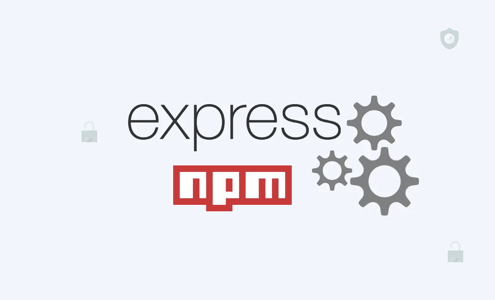

# 开始前说几句话

当你创建了一个网站或应用程序，这意味着你准备在互联网上向成千上万的人展示它。你的客户/观众可能是合法的，但他们中的一些人会试图篡改你的应用程序。所以你需要遵循以下黄金法则

1.  "**当涉及到应用程序的安全性时，千万不要相信你的观众**"
2.  在将用户输入放入服务器之前，一定要对其进行验证。
3.  在将用户输入打印到屏幕上之前，一定要对其进行编码。

## [头盔](https://helmetjs.github.io/)

头盔真的很像你的应用头盔。它通过设置各种 [HTTP 头](https://en.wikipedia.org/wiki/List_of_HTTP_header_fields)来保护你的应用程序。

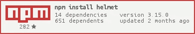

```
const express **=** require('express')
const helmet **=** require('helmet')
const app **=** express()
app.use(helmet())
```

## [快速会话](https://www.npmjs.com/package/express-session)

[快速会话](https://www.npmjs.com/package/express-session)中间件在服务器上存储会话数据；它只在 cookie 本身中保存会话 ID，而不保存会话数据。

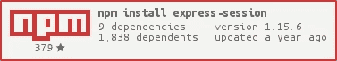

```
var app = express()
app.set('trust proxy', 1) // trust first proxy
app.use(session({
    secret: 'keyboard cat',
    resave: false,
    saveUninitialized: true,
    cookie: {
        secure: true
    }
}))
```

## [cookie 会话](https://www.npmjs.com/package/cookie-session)

一个简单的基于 cookie 的会话中间件，允许存储 cookie。它不需要服务器端的任何数据库/资源，尽管总会话数据不能超过浏览器的最大 cookie 大小。

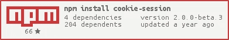

```
var cookieSession = require('cookie-session')
var express = require('express')
var app = express()
app.use(cookieSession({
    name: 'session',
    keys: [ /* secret keys */ ],
    // Cookie Options
    maxAge: 24 * 60 * 60 * 1000 // 24 hours
}))
```

## [JOI](https://www.npmjs.com/package/joi)

hapi 的 JavaScript 对象的对象模式描述语言和验证器。验证用户输入非常有用。

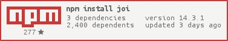

```
const Joi = require('joi');
const schema = Joi.object().keys({
    username: Joi.string().alphanum().min(3).max(30).required(),
    password: Joi.string().regex(/^[a-zA-Z0-9]{3,30}$/),
    access_token: [Joi.string(), Joi.number()],
    birthyear: Joi.number().integer().min(1900).max(2013),
    email: Joi.string().email({
        minDomainAtoms: 2
    })
}).with('username', 'birthyear').without('password', 'access_token');
// Return result.
const result = Joi.validate({
    username: 'abc',
    birthyear: 1994
}, schema);
// result.error === null -> valid
// You can also pass a callback which will be called synchronously with the validation result.
Joi.validate({
    username: 'abc',
    birthyear: 1994
}, schema, function(err, value) {}); // err === null -> valid
```

## [快速限速](https://www.npmjs.com/package/express-rate-limit)

你可能知道[暴力攻击](https://en.wikipedia.org/wiki/Brute-force_attack)。express-rate-limit 是一个用于 express routes 的中间件，它对传入的请求进行速率限制，以类似斐波那契数列的方式增加每个请求的延迟。

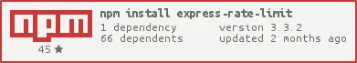

```
const rateLimit = require("express-rate-limit");app.enable("trust proxy");

const limiter = rateLimit({
    windowMs: 15 * 60 * 1000, 
    max: 100 
});//  apply to all requests
app.use(limiter);
```

## [express-jwt-permissions](https://www.npmjs.com/package/express-jwt-permissions)

检查 JWT 令牌权限的中间件。建立一个用户访问控制系统是非常有用的。

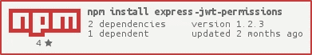

```
var guard **=** require('express-jwt-permissions')()app.use(guard.check('admin'))
```

## [快递-蒙哥-消毒](https://www.npmjs.com/package/express-mongo-sanitize)

清理用户提供的数据以防止 MongoDB 操作员注入的 Express 中间件。

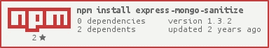

```
var express = require('express'),
    bodyParser = require('body-parser'),
    mongoSanitize = require('express-mongo-sanitize');
var app = express();
app.use(bodyParser.urlencoded({
    extended: true
}));
app.use(bodyParser.json());
// To remove data, use:
app.use(mongoSanitize());
// Or, to replace prohibited characters with _, use:
app.use(mongoSanitize({
    replaceWith: '_'
}))
```

## [hpp](https://www.npmjs.com/package/hpp)

[快递](http://expressjs.com/)中间件**防范 HTTP 参数污染攻击。**阅读[切坦·卡兰德的幻灯片](https://speakerdeck.com/ckarande/top-overlooked-security-threats-to-node-dot-js-web-applications?slide=48)

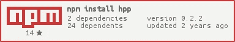

```
var express = require('express'),
    bodyParser = require('body-parser');
var app = express();
// ...
var hpp = require('hpp');
// ...
// Make sure the body is parsed beforehand.
app.use(bodyParser.urlencoded());app.use(hpp()); // <- THIS IS THE NEW LINE// Add your own middlewares afterwards, e.g.:
app.get('/search', function(req, res, next) { /* ... */ });
// They are safe from HTTP Parameter Pollution now.
```

## [dotenv](https://www.npmjs.com/package/dotenv)

Dotenv 是一个零依赖模块，它将环境变量从一个`.env`文件加载到`process.env.`中。在独立于代码的环境中存储配置基于[十二因素应用](http://12factor.net/config)方法。

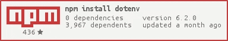

```
var express = require('express'),
    bodyParser = require('body-parser'),
    dotenv = require('dotenv');
var app = express();dotenv.config();
dotenv.config({
    path: "../.env"
});
```

# [csurf](https://www.npmjs.com/package/csurf)

csurf 是一个 [CSRF](https://en.wikipedia.org/wiki/Cross-site_request_forgery) 保护中间件。

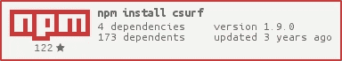

```
var cookieParser = require('cookie-parser')
var csrf = require('csurf')
var bodyParser = require('body-parser')
var express = require('express')
// setup route middlewares
var csrfProtection = csrf({
    cookie: true
})
var parseForm = bodyParser.urlencoded({
    extended: false
})
// create express app
var app = express()
// parse cookies
// we need this because "cookie" is true in csrfProtection
app.use(cookieParser())
app.get('/form', csrfProtection, function(req, res) {
    // pass the csrfToken to the view
    res.render('send', {
        csrfToken: req.csrfToken()
    })
})
app.post('/process', parseForm, csrfProtection, function(req, res) {
    res.send('data is being processed')
})
```

祝你编码愉快。

## 如果你喜欢这篇文章，请把它拍下来分享给别人，让别人也能找到它！