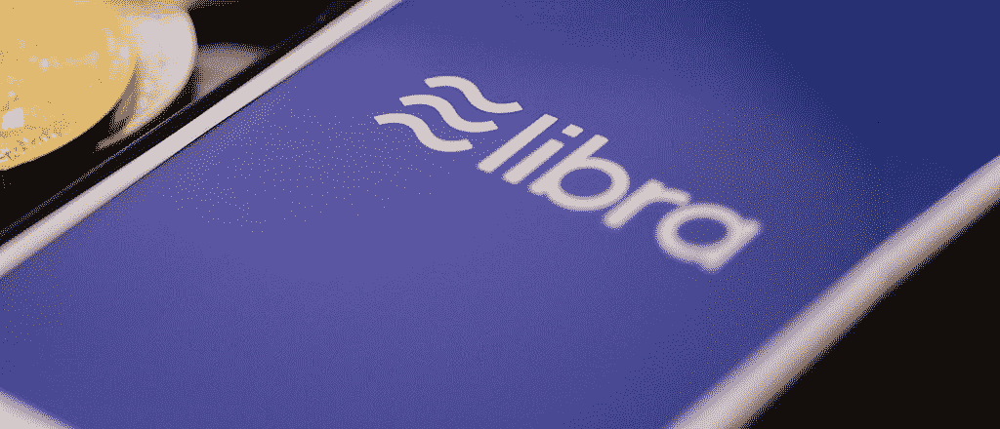
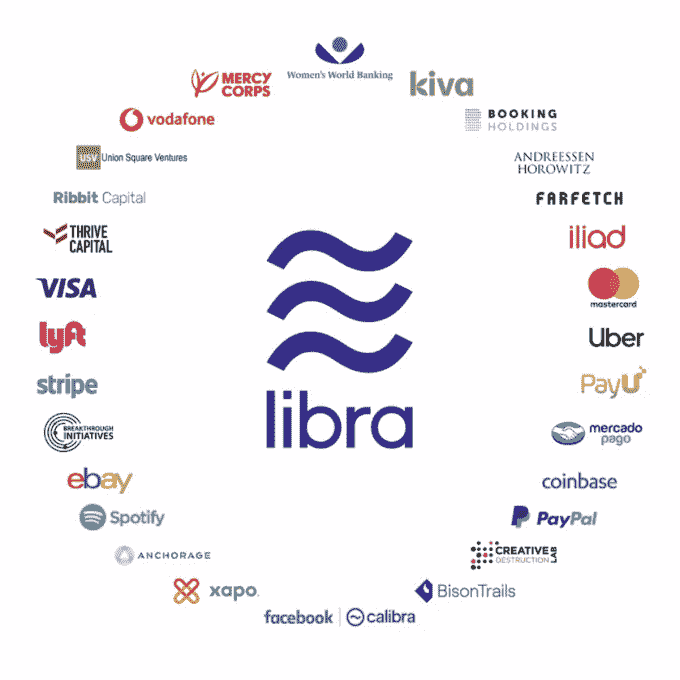

# 脸书和天秤座硬币——你需要知道的

> 原文：<https://medium.com/hackernoon/facebook-and-libra-coin-what-you-need-to-know-bc9296921d8f>

上个月，当脸书宣布他们的 Calibra 计划时，他们成了头条新闻。Calibra 是脸书的新子公司，专注于金融服务。他们的目标将围绕一种新的数字货币的使用，这种货币由区块链提供动力，名为 Libra。Calibra 将首先推出一款数字钱包，预计将于 2020 年推出。来自脸书的这一声明收到了来自加密和主流媒体的不同反应。

尽管意见不一，但似乎有一个共识，即脸书可以很好地为全球采用区块链技术铺平道路。这一共识背后的原因是，脸书拥有全世界 30%以上的人口，即 23.8 亿人。至于其他人，他们没有脸书账户的原因很简单，有两个关键因素:无法上网或选择自由。

让我们进一步探讨一下。

# 天秤座是什么？

Libra 首先是一种加密货币，旨在让人们访问和参与 Libra 网络。用户应该能够将法定货币兑换成这些数字货币，并在网上交易中使用它们。

数字硬币本质上是一种稳定的硬币，因为它与政府发行的货币挂钩，如美元、欧元、新加坡元等。许多去中心化的加密货币，如比特币或以太坊，其估值是不稳定的。脸书寻求创造一种更稳定的加密货币，以鼓励它作为促进普通在线消费者交易的一种手段。

传统上，要进行金融交易，人们必须通过银行或今天可用的在线资金转移，如 PayPal、Transferwise 等。然而，重要的是要注意，现有的金融系统今天是他们自己的技术。简单来说，与其他金融系统相比，Libra 的特别之处在于它是由区块链驱动的。

天秤座协会由著名的合作公司组成，如万事达卡、维萨卡、贝宝、优步等。这些公司将通过使用区块链技术，共同努力确保支付流程比现有的金融技术更快、更准确、更安全。

# 脸书如何计划大规模收养？

## 品牌识别

《连线》杂志的一篇文章讨论了现代人逃避接触脸书有多难。社交媒体网络已经变得如此占主导地位，直到它仍然影响那些没有账户的人。家长们透露，脸书是家庭生活中必不可少的一部分，是用来让远房亲戚了解情况的。所以，它无疑是一个已经融入到老百姓日常生活中的实体。

LendEDU 对 1000 名美国成年人进行了一项调查，并获得了有趣的结果。参与者被问及他们是否已经投资或正在投资加密货币，91%或 910 人回答“没有”。当被问及是否有兴趣投资脸书的加密货币时，这 910 人中有 18%的人回答“是”，其中 57%的人选择这样做，因为他们相信脸书这样的公司能够提供可靠的产品。

## 天秤座作为付款

起初，Libra 将只在脸书信使应用程序和 WhatsApp 上可用。与 Libra 协会的其他合作伙伴一起，人们认为这些公司会找到整合 Libra 支付的方法。

## 真实世界的菲亚特到密码转换

据 [The Verge](https://www.theverge.com/2019/6/6/18655366/facebook-cryptocurrency-libra-token-zuckerberg) 报道，脸书也计划安装类似 ATM 的终端，供人们外出时管理他们的天秤座硬币。最终，计划让购物商店接受 Libra 作为一种支付方式。在我们上一篇关于[脸书加密货币](https://moonwhale.io/facebook-whatsapp-remittance-crypto/)的文章中，我们讨论了全球采用加密货币的主要问题是将法定货币兑换成加密货币的容易性。

## 全球范围内脸书和 WhatsApp 的大量用户

最著名的加密货币比特币在世界上仍被有限地接受，为了让它作为一种货币蓬勃发展，它需要用于支付产品或服务。比特币目前只被世界上少数人使用和接触。另一方面，如果成功的话，天秤座将会立刻接触到世界上 30%的人口。仅此一点就为数字资产的大规模采用带来了巨大的加分。

## 大多数行业中成熟的技术公司作为合作伙伴

如上所述，Libra 协会的合作伙伴包括成功的、被广泛采用的服务，如 PayPal、优步、易贝、Spotify 和许多其他服务。每个都有自己的用户群。这些公司已经融入了大多数人的日常生活(通过互联网连接)，在它们之间建立一种共同的货币将确保高水平的渗透。

# 脸书和天秤将要面对的挑战是什么？

## 监管压力

在一条来自加密空间的可靠声音 Anthony Pompliano 的推文中，国会议员已经致信脸书，要求他们停止 Libra 的开发。他继续阐述了政府实体将无法像比特币那样行事的事实。

《卫报》也报道了这封信，信中称，在监管机构和国会有机会调查这些问题之前，脸书应该停止 Libra 的开发。

福布斯还报道称，33 个消费者、隐私、经济政策和其他组织呼吁国会和监管机构暂停脸书的 Libra。引用这封信，

> *“脸书创建一种新的加密货币作为其更广泛的 Libra 项目的一部分的提议，引发了关于国家主权、企业权力、消费者保护、竞争政策、货币政策、隐私等方面的深刻问题……我们呼吁国会和监管机构暂停脸书的 Libra 和相关计划，直到该提案提出的深刻问题得到解决。”*

## 转换真正的加密用户

比特币创立的主要目的是挑战银行，让人们能够控制自己的金融交易，实现真正的金融自由。比特币开发的开放性也是其长寿的一大优势，因为任何人都可以使用它的代码。去中心化也是加密货币的关键理念。Libra 显然不是分散的，当我们可以确定它来自一家总部设在美国的公司，在支付网络上拥有中央权力。

## 不为没有银行账户的人提供银行服务

虽然很容易假设脸书和天秤会为表面上没有银行账户的人提供银行服务，但事实是他们不会。为了能够获得天秤座硬币，用户必须进入银行，以促进法定货币的交换，这意味着，只有银行的人才能使用它。正如在[的对话](https://theconversation.com/libra-facebooks-cryptocurrency-will-not-help-the-billions-of-people-currently-excluded-from-banks-119502)中所讨论的，正确的文档对于不拥有它的人来说是一个障碍。尽管只需要一部手机，我们可以预计用户最终必须提交给 KYC 检查，这需要文件。对脸书来说，这没有什么革命性的，只是它有潜力进入一个巨大的市场。

# 稳定的增长

稳定货币是加密货币，其价值与美元或黄金等资产挂钩。它们是一种稳定、可扩展且安全的交易方式，旨在模仿传统的稳定货币。它是一种加密货币，以任何基础资产或商品的价值作为抵押。许多稳定货币与某些法定货币(如美元或欧元)以 1:1 的比率挂钩，这些法定货币可以在交易所交易。因此，稳定的货币不会像其他加密货币那样受到极端价格波动的影响。

脸书是最新宣布将 stablecoins 用于现实世界的计划的国家。

## 摩根大通发行的 JPM 硬币

2 月 14 日，Cointelegraph 报道摩根大通推出了他们的加密货币 JPM 币。与比特币一样，JPM 币加快了摩根大通客户之间的交易速度。更多关于 JPM 币的信息，请参考我的[博文](https://moonwhale.io/jpmorgan-jpm-coin/)。

## 高盛

[彭博报道](https://www.bloomberg.com/news/articles/2019-06-28/goldman-sachs-explores-creating-a-digital-coin-like-jpmorgan-s)高盛集团的首席执行官“绝对”关注数字货币，并正在进行广泛的令牌化研究。

## 国际商用机器公司

除了 Stellar Lumens 之外，IBM 目前正在开发一个据点 USD T7，并将开始尝试不同的方法，让金融机构在全球范围内实现更可靠、更安全的交易处理和资金转移。

## 极限

在加密货币的世界里，没有任何一种稳定货币比 Tether 更被广泛接受。尽管存在争议，但稳定的欧元可以在大多数交易所作为美元的替代品。

# 天秤座的下一步是什么？

如果这里的问题是关于全球“区块链”的采用，那么是的，脸书是一个在世界上广为人知的品牌。Libra 的成功可以成为普通大众采用区块链技术的主要驱动力。除此之外，他们的合作伙伴将在使区块链技术合法化方面发挥不可估量的作用，因为它是一项创新，将被大多数(如果不是所有的话)与中介打交道的企业所采用。

这是区块链的技术，但是比特币的应用呢？有趣的是，自 Libra 揭幕以来，比特币的价格从 9000 美元飙升至 12000 美元。在我看来，比特币背后的哲学牢不可破。比特币不像 Libra 那样有现金和政府债券支持。赋予比特币价值的是对其系统的信任。天秤座并不代表去中心化的真正本质——让比特币令人向往的意识形态。天秤座会不会也将比特币带入大众化？

# 关于我:

**Iliya Zaki 是总部位于美国的企业咨询公司—**[**moonwale Ventures**](https://moonwhale.io/)**的营销主管。**

在我们的各种社交媒体平台上关注我们—

[推特](https://twitter.com/MoonwhaleBV) | [领英](https://www.linkedin.com/company/moonwhalebv) | [脸书](https://www.facebook.com/MoonwhaleBV/) | [电报](https://t.me/moonwhaler)