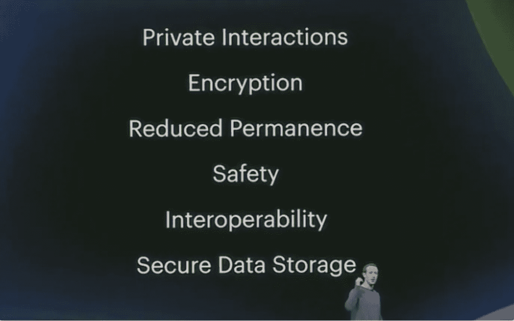
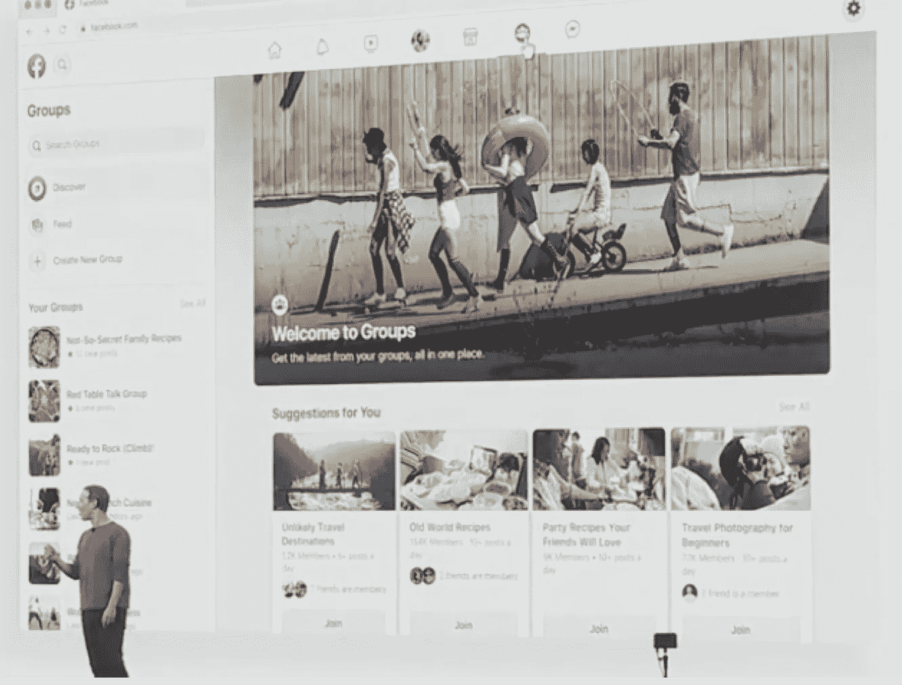
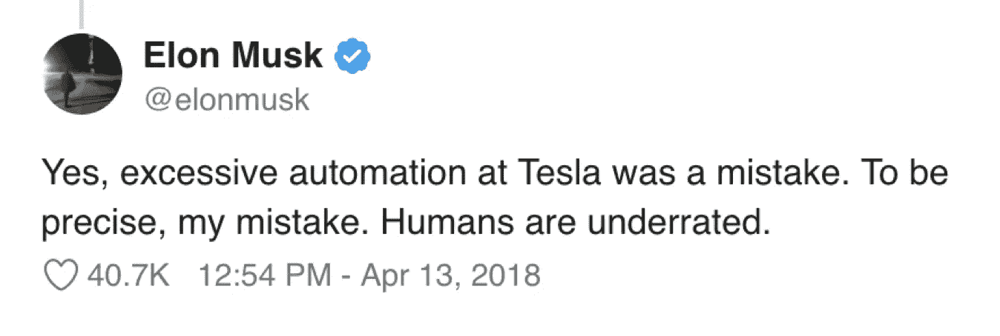
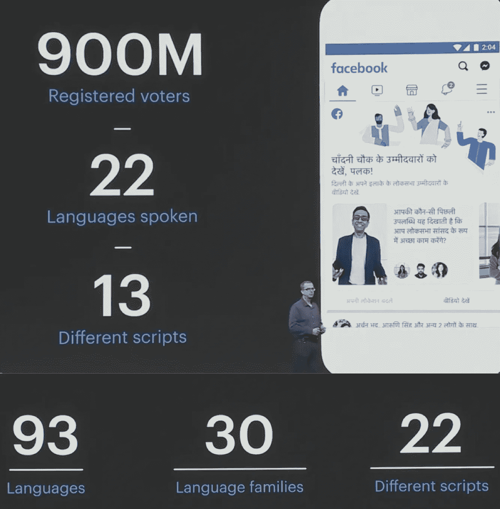

# 脸书 F8 2019-思考、学习和预测

> 原文：<https://medium.com/hackernoon/facebook-f8-2019-thoughts-learnings-and-predictions-394e03e033ba>

我今年参加了 F8，目的是了解脸书将如何重建用户的信任，因为该平台在过去 13 年中是多么粗心和鲁莽。

我将以下信息分为三个主题:

1.  **脸书整体更新**
2.  **F8 三大外卖店**
3.  **前三大预测**

我还想优先考虑 CNN/nytimes/TechCrunch/recode/等组织似乎没有充分讨论的想法。

# 脸书的全面更新

我参加了 2019 年 F8 奥运会，希望脸书能够展现出高度的责任感、透明度和彻底的变革。会议从承担平台核心问题的责任开始，但是根本的改变并没有完成。一个建立在虚荣心和超针对性广告基础上的新闻源，从根本上与内容质量和用户体验不一致。试图隐藏在机器学习的改进背后并不能从根本上解决欺诈、假新闻、滥用等问题。不幸的是，在 2 天的事件后，我的担忧只增不减。

重要的是以快速重新封顶开始，突出脸书的影响和过去 13 年的核心事件:

# 脸书对世界的影响:

1.  **全球 36%的人每月都会接触一款脸书应用**

*   每月有 27 亿人使用脸书的一款应用。
*   每天有 21 亿人使用一款脸书应用。

**2。如果脸书教是一种宗教，它将是世界上最大的宗教**

*   基督教= 24 亿人
*   伊斯兰= 18 亿人
*   不可知论者= 12 亿人
*   印度教= 11.4 亿
*   佛教= 5.21 亿

**3。脸书是世界第二大洲**

*   亚洲= 44 亿人口
*   非洲= 12 亿人
*   欧洲= 7.38 亿
*   北美= 5.79 亿

**4。普通用户一生中会在脸书的一处房产上花费近 2 年的时间**

**5。脸书全球每年每用户广告收入:**

*   北美用户= 84.41 美元
*   欧洲用户= 27.26 美元
*   亚洲用户= 7.61 美元

# 过去 13 年的首要问题

**2006 年**

*   脸书推出新闻订阅

**2007 年**

*   脸书推出 Beacon，让脸书可以在你的数字生活中追踪购物
*   脸书推出了“喜欢”按钮。发明者贾斯顿·罗森斯坦后来担心喜欢对人产生心理影响，于是删除了这个应用程序。[https://www . the verge . com/2018/3/28/17172404/贾斯汀-罗森斯坦-阿萨纳-社交-媒体-脸书-时间线-甘特](https://www.theverge.com/2018/3/28/17172404/justin-rosenstein-asana-social-media-facebook-timeline-gantt)

**2011 年**

*   联邦贸易委员会解决隐私费用。
*   脸书对用户撒谎，告诉他们会保密他们的信息，而事实上这些信息是公开的。[https://www . FTC . gov/news-events/press-releases/2011/11/Facebook-settles-FTC-charges-it-欺骗-消费者-失败-保持](https://www.ftc.gov/news-events/press-releases/2011/11/facebook-settles-ftc-charges-it-deceived-consumers-failing-keep)
*   脸书的创新不应该以牺牲消费者隐私为代价

**2012 年**

*   社交媒体的使用与自杀率的增加有关，如果错误的内容在平台上病毒式传播。【https://www.ncbi.nlm.nih.gov/pmc/articles/PMC3477910/ 

**2013 年**

*   脸书漏洞暴露了至少 600 万用户的隐私信息。当一个用户加入脸书，联系人名单被滥用和公开分享。

**2014 年**

*   脸书发起了一项情绪操纵实验。
*   社会传染是一种真实的现象。因此，用户的情绪/个性受到他们在脸书上所看/看/听的内容的影响。
*   [https://www . nytimes . com/2014/06/30/technology/Facebook-tinkers-with-users-emotions-in-news-feed-experiment-stigging-outhouse . html](https://www.nytimes.com/2014/06/30/technology/facebook-tinkers-with-users-emotions-in-news-feed-experiment-stirring-outcry.html)

**2015 年**

*   脸书切断了应用程序从任何脸书用户那里获取任何/所有数据的渠道

**2018**

*   欧洲发起 GDPR 保护互联网网站上的消费者数据，迫使脸书遵守
*   比利时法院命令脸书停止跟踪整个互联网上的人
*   脸书知道有大规模的数据泄露，却什么也没做。
*   所有移动电话制造商多年来都有用户数据访问权。脸书最终关闭了它
*   脸书披露 3000 万用户账户被攻破
*   脸书泄露了文件，显示他们如何将个人用户信息分享给微软、雅虎、亚马逊、网飞和 Spotify
*   剑桥分析公司(Cambridge Analytics)利用脸书的数据对川普大选期间使用的广告进行了超目标定位

**2019**

*   5.4 亿用户记录被曝光。[https://finance . Yahoo . com/news/Facebook-data-breach-2019-540-202405997 . html](https://finance.yahoo.com/news/facebook-data-breach-2019-540-202405997.html)
*   新西兰脸书现场大规模拍摄。[https://www . the verge . com/2019/3/17/18269453/Facebook-new Zealand-attack-removed-150 万-videos-content-moderation](https://www.theverge.com/2019/3/17/18269453/facebook-new-zealand-attack-removed-1-5-million-videos-content-moderation)
*   社交媒体是对民主的威胁。最新信息显示，脸书的确插手了英国退出欧盟事务。[https://blog . ted . com/social-media-is-a-threat-to-our-democracy-Carole-cadwalladr-speaks-at-ted 2019/](https://blog.ted.com/social-media-is-a-threat-to-our-democracy-carole-cadwalladr-speaks-at-ted2019/)
*   “自由民主坏了！”
*   脸书只受到 50 亿美元罚款的轻微处罚。

# 主旨

为全球 36%的人口提供内容服务的责任，不是人工智能和产品特性可以解决的。

阅读这张幻灯片时，我问自己一个基本问题:为什么脸书花了 13 年时间才关注用户隐私、加密和安全？

新的脸书手机和桌面应用程序已经更新，变得更加上瘾。这相当于进入一个赌场，这里的灯光被调好，这样你可以呆得更久。[https://io9 . gizmodo . com/how-casino-use-design-psychology-to-get-you-gamble-1667182023](https://io9.gizmodo.com/how-casinos-use-design-psychology-to-get-you-to-gamble-1667182023)

然后，我等待第二天的主题演讲，这是一个更侧重于技术的演讲。不幸的是，脸书的迈克·斯科洛普夫(CTO)基本上将人工智能的进步作为脸书未能阻止滥用、假新闻和平台上发生的所有其他核心问题的原因。下面的方框突出显示了人工智能发展到足以提供帮助的时候。

在 2019 年，人工智能绝对不可能理解地球上所说的 6000 种语言。我真的希望脸书会有他们的埃隆马斯克时刻，在那里埃隆意识到你不能完全自动化或使用 100%的人工智能。

# 现在这两天已经过去，脸书基本上说了以下的话:

1.  脸书为他们 14 年来犯下的错误感到抱歉。
2.  从 2018/2019 年开始，脸书将因这些错误被罚款 50 亿美元，约为其市值(5500 亿美元)的 1%
3.  人工智能的进步是平台上发生谩骂、假新闻、数据泄露的原因。

# 一些问题:

1.  **印度选举(4/11–5/23)世界上最大的民主国家。**

*   印度即将举行的选举有 9 亿人口，其中大多数人每天都接触脸书的房地产，人工智能不会拯救印度。
*   我们目前正在进行选举，我们只能希望像脸书、Instagram 和 WhatsApp 这样的社交网络应用程序不要让选举结果出现偏差。

*   我真的希望脸书能在保持他们的平台安全、可靠和值得信赖方面发挥更积极的作用。如果他们表明立场，减少你在 feed 中看到的信息量或可以推广 X 产品的广告商数量，情况就会不同，不幸的是，他们没有这样做。
*   [https://www . nytimes . com/2019/04/01/technology/India-elections-Facebook . html](https://www.nytimes.com/2019/04/01/technology/india-elections-facebook.html)

# 我希望脸书会说什么？

1.  **缩减广告**

*   雪莉·桑德伯格抄袭了谷歌的广告剧本，虽然它能赚钱，但却牺牲了用户的诚信。当消费者上 YouTube、亚马逊或谷歌时，他们是带着非常明确的目的在搜索。YouTube，你搜个东西看。亚马逊，你搜东西买。谷歌，你正在搜索的东西与互联网连接。脸书拥有的房产是不同的，你去那里是为了和其他人联系。这是脸书的人际关系方面，给了消费者一种虚假的信任感，脸书利用这一点来赚钱。
*   你可以说基于影响者的广告是脸书唯一应该允许的广告。如果消费者使用某个账户，这意味着用户应该被允许看到该账户的广告。因为脸书是金钱至上，他们允许任何人滥用消费者数据，任何品牌用假新闻、欺诈产品和服务污染饲料。

**2。民主执政@脸书**

*   鉴于脸书可以是一个宗教，也可以是一个大洲，仅仅基于纯粹的观众规模，他们需要消除马克·Z 的大量控制，并从更政治的角度出发，确保脸书的选民得到公平对待。答案不是人工智能，也不是让马克·扎克伯格当统治者。

**3。激进用户控制**

*   用户应该能够决定谁可以看到他们的信息，谁可以向他们投放广告。现在，脸书允许任何广告商根据你的兴趣来锁定你，而你可能并不赞同这一点。

# 从更积极的方面来看

1.  **社会联系增加**

*   我们都是努力寻求人际关系的人
*   随着来自脸书的更新，人们将能够在活动、照片、群组、市场和对话之间建立更多联系
*   如果以民主的方式进行，这将有望显示好的多于坏的

**2。公共 Feed 正在消失**

*   随着脸书继续强调短暂内容和私人对话的重要性(抄袭 SnapChat)，“feed”的重要性将随着时间的推移而消失，这对每个人来说都是好事

**3。脸书意识到创作者有多重要**

*   脸书和 Instagram 都专注于确保创作者受到公平对待，并有机会从他们的观众身上赚钱
*   脸书专注于手表和故事
*   Instagram 专注于商业

# 脸书的三大外卖

1.  区块链将是脸书整个平台和支付战略的核心。

*   在数据级构建基础设施，从根本上保证安全性。
*   将代码隐私和数据使用原则作为基础架构中的一级概念。这是使用基于区块链的网络的主要用例之一。
*   我没有看到任何人听到马克的这句话，但他基本上是说，他们正在重写脸书的所有后端代码，以更加以用户为中心，这是一个分布式账本和访问控制。

**2。商业就是一切。脸书正在复制蝙蝠的剧本。**

*   目前，百度、阿里巴巴和腾讯在对消费者日常生活的端到端控制方面正在击败脸书。通过脸书在 F8 期间所做的更新，你可以看到他们只是试图像英美烟草一样，而不是相反。
*   脸书不再是一个社交网络。这是一个完全重写的互联网，在这里，消费者花费他们的时间、金钱、注意力来购买他们日常生活所需的产品/服务，以及与人/团体联系等。
*   我强烈推荐你阅读这篇文章:[https://www . IBC . org/content-management/bat-vs-faang-the-battle-for-digital-dominance/3103 . article](https://www.ibc.org/content-management/bat-vs-faang-the-battle-for-digital-dominance/3103.article)

**3。增强现实将最终找到它的步伐。**

*   脸书在 2017 年收购了 Oculus，并在过去 3 年中投资了该平台。随着 Spark Ar 的公布。https://sparkar.facebook.com/ar-studio/它们让开发者开发增强现实并在脸书和 Instagram 上部署变得越来越容易
*   增强现实有很大的潜力，脸书希望 2019 年成为该技术的标志性一年。

# 前三大预测— 5 年范围

1.  **广告将不是脸书的主要收入来源，它将被淡化到第三或第四位。**

*   随着脸书复制英美烟草的剧本，我看到了以下创收形式:
*   付款/结账
*   约会
*   市场(易贝)
*   Instagram 购物(Shopify 竞争对手)
*   脸书 stable coin([https://www . the block crypto . com/tiny/project-Libra-Facebook-to-launch-stable coin-based-payments-network/](https://www.theblockcrypto.com/tiny/project-libra-facebook-to-launch-stablecoin-based-payments-network/)
*   汇款
*   脸书电视台(网飞、YouTube、迪士尼的竞争对手)

**2。脸书将公共新闻和公共赞一起移除**

*   如果脸书继续沿着复制 BAT 的轨迹走下去，并认真对待用户隐私和安全，那么公众反馈就会消失，人们会带着特定行动的意图联系脸书，而不是盯着腐败的新闻反馈。

**3。Instagram、脸书和 Whatsapp 将汇聚成一个应用。独立应用的商业案例没有任何意义。**

*   消息应用程序现在可以互操作，因此它们之间的差异现在微不足道。上面的截图显示了如何在所有 3 个应用程序之间传递消息。(Messenger，instagram，WhatsApp)。首先想到的是，为什么有 3 个消息应用程序？
*   这将会融合，脸书要么将它们作为一个应用程序推出，要么将所有应用程序的消息传递分开。
*   Instagram 不再是一个有趣的照片分享应用程序，它是一个商业驱动的应用程序，专注于如何让用户花更多的钱。

我希望我们都能表明立场，认识到脸书正在失去我们的人性，他们选择使用算法来管理 27 亿人。

-维沙尔

*似乎是一张合适的闭幕照片，显然这个人在这里玩得太开心了。*

1.  [https://www . investopedia . com/ask/answers/120114/how-does-Facebook-f b-make-money . ASP](https://www.investopedia.com/ask/answers/120114/how-does-facebook-fb-make-money.asp)↩︎