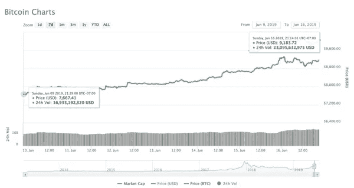
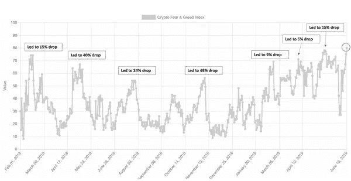
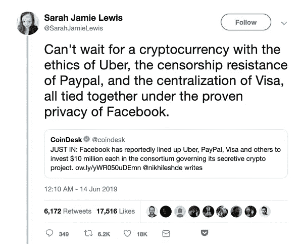

# 脸书是加密的引爆点

> 原文：<https://medium.com/hackernoon/facebook-is-the-tipping-point-for-crypto-e352fbd4b451>

## **比特币反弹，回顾过去**

全球股票和加密继续显示出接近零的相关性，但导致 5 月份股票回调的因素与引发加密看涨基调的因素相同，即贸易战和资本继续逃离亚洲。crypto 在 5 月份上涨了大约 50%,而股票下跌了 5 %- 10%,因此，当 6 月份的第一周开始时，股票上涨了 5 %, crypto 下跌了 10 %,这有点令人不安。不用说，我们开始密切关注。过去一周，股市温和上涨，因为股票投资者难以从贸易新闻和相互矛盾的经济报告中找到方向。一方面，5 月份商业乐观情绪攀升至 7 个月高点，零售额连续第三个月增长。另一方面，T2 的摩根士丹利商业状况指数在 6 月份下降了 32 点，从 5 月份的 45 下降到 13。这是有记录以来最大的单月跌幅。

尽管油价再次下跌，但股市仍勉强实现了每周上涨，因此上周比特币和其他加密市场上涨 15%时，人们感到非常惊讶。当然，所有的目光都集中在比特币(BTC)上，它在本周稳步上涨 18%，在周末的大幅反弹中达到高潮。

BTC Rose 18% Week-Over-Week, with a Huge Weekend Burst

来源:[货币市场基金](https://coinmarketcap.com/currencies/bitcoin/)

实际上，这种秘密集会很难预见。仅仅一周前，人们还在呼吁比特币有可能重新测试 6000 美元，现在市场上一片欢欣鼓舞，人们预计 10000 美元就在眼前。虽然我们不在乎猜测价格，但我们会说，回想起来，肯定有很多东西支持导致比特币突然逆转的马赛克理论。

*   资本继续从亚洲流入加密和其他地方。这种向高质量移民的趋势已经持续了一整年，但最近随着 200 多万香港居民抗议新的引渡法案，这种趋势又变得愈演愈烈。有报道称[资金正从香港流向新加坡](https://www.theblockcrypto.com/tiny/hong-kong-tycoons-start-shifting-their-wealth-outside-of-the-city-because-of-proposed-extradition-law/)，但有传闻称，大量资金也流入了加密领域。
*   币安宣布，他们将在 9 月对美国个人和实体关闭大门。虽然这对那些喜欢交易非比特币代币(被称为“替代币”)的人来说是负面的，但替代币的抛售压力最终可能会驱使投资者回到比特币和以太坊。
*   市场对脸书本周推出的大型加密产品欢欣鼓舞，尽管有些困惑。虽然这和比特币之间没有直接关联，但我们很可能会把本周视为加密的转折点(下文将有更多相关内容)。

我们以前见过许多像这样的爆发被证明是短暂的，尤其是那些发生在低流量周末的爆发。此外，[隐性恐惧&贪婪指数](https://alternative.me/crypto/fear-and-greed-index/)(衡量波动性、情绪、势头和趋势)处于历史高点，这通常是崩盘的领先指标。但即使市场从这些水平回调，长期趋势仍然对比特币和其他一些能够产生长期价值的代币非常有利。如下图所示，下降变得越来越快，越来越不明显，如果这种情况再次发生，我们预计会有类似的反应。

Fear & Greed Index is at All-Time Highs

来源:[隐密恐惧&贪婪指数](https://alternative.me/crypto/fear-and-greed-index/)

**800 磅的大猩猩，房间里的巨象——脸书**

脸书币
ZuckBucks
全球币

不管这些天我们叫它什么，它来了。[本周](https://www.theblockcrypto.com/2019/06/14/facebooks-cryptocurrency-partners-revealed-we-obtained-the-entire-list-of-inaugural-backers/)。脸书将很快拥有自己的数字货币。脸书白皮书将于周二发布，这是一个极具争议的话题。一些人认为，鉴于脸书的全球影响力，这将是加密史上最伟大的事情。考虑到脸书曲折的历史，其他人，尤其是比特币狂热分子，谴责这种代币。

正如我们几个月来一直在讨论的那样，我们认为这对数字资产来说是不可否认的利好，因为最好的发行方式总是胜过最好的技术。

密码世界非常擅长创造突破性的技术，但是没有分发的新技术经常失败。机器人顾问是一个很好的类比。Betterment 和 Wealthfront 拥有惊人的技术，但这种技术很容易被拥有更大分销能力的金融咨询公司复制。发生了什么事？每个主要的金融咨询公司现在都向他们的客户提供类似的技术服务。分销和品牌胜过了技术。

事实是，脸书的第一天将比任何其他数字资产的第 10 年都重要。脸书将在一夜之间将超过 20 亿人带入数字资产生态系统，这进一步支持了通信(通过互联网)和资产(通过区块链)可以无缝和无国界传输的概念。一旦一个新人通过脸书进入数字资产生态系统，他们也会开始发现其他数字资产。让我们面对它，当前加密生态系统的规模与非加密生态系统的规模相比相形见绌。因此，以一种迂回的方式，脸书的硬币与比特币和其他数字资产的竞争实际上将有助于刺激更多比特币的采用。例如，不管你是不是游戏玩家，2010 年的每一部 iPhone 上都有愤怒的小鸟。是什么让你进入生态系统其实并不重要；一旦到了那里，每一个区块链应用程序和每一个数字令牌都变得更加容易访问。

因此，最终这对于所有数字资产都是积极的，除了其他稳定的资产。GlobalCoin 最终可能会吃掉其他 stabletokens 的午餐，因为脸书实际上可以解决真正的问题——为数百万没有银行账户的消费者提供资产存储选项，并降低接受 GlobalCoin 作为支付的商家的银行成本。

正如 CoinShares 的 melt em de mirors 所说:

> (这将)允许脸书将支付引入其平台，而无需经历成为银行或创建金融服务公司的麻烦。我的预测是:每一个主要平台最终都将成为某种“银行”。进军企业硬币已经有一段时间了，但鉴于脸书、Whatsapp 和 Instagram 的 25 亿用户，GlobalCoin 无疑是最大的一个。暖气开了！每个董事会都将考虑这一举措。

我们可能会记得 6 月 18 日星期二是 crypto 的转折点。

**响当当的大佬**

如上所述，上周发生了一系列事件——币安宣布他们将[限制美国客户访问他们的交易平台](https://techcrunch.com/2019/06/14/binance-begins-to-restrict-us-customers/)，脸书宣布他们的 [GlobalCoin token 将于 6 月 18 日在测试网上推出](https://www.theblockcrypto.com/2019/06/14/facebook-to-launch-libra-blockchain-testnet-next-week-backed-by-libra-reserve/)(附有白皮书)，比特币本周上涨 18%。即使发生了这些大规模的事件，也有一些特殊的标志脱颖而出:

*   在 Google Cloud 周四发布新闻稿宣布他们的数据仓库解决方案 BigQuery 将使用 Chainlink 作为 oracle 解决方案之后，Chainlink (LINK)度过了令人印象深刻的一周(+55%)。市场也做出了同样的反应，LINK 的价格盘中涨幅高达 74%。这个声明对 Chainlink 和 Ethereum 都有积极的意义，这取决于 BigQuery 使用区块链解决方案的程度。
*   Zcash (ZEC)是最近市场情绪的受益者，本周上涨 22%。随着 7 月份 [Ycash hard fork](/@YcashFoundation/announcing-ycash-the-first-friendly-fork-of-the-zcash-blockchain-ac386ed6368c) 的临近，人们似乎对数字资产领域最知名的隐私硬币之一重拾信心。随着硬分叉越来越近，我们将看到更多的兴趣围绕 Zcash 旋转，因为上次 Zcash 硬分叉(ZClassic)时，双方都有大量交易。
*   格林(Grin)上周的涨幅令人印象深刻，收盘上涨 77%。与 Zcash 类似，GRIN 将在 7 月推出一个[网络硬分叉](https://cointelegraph.com/news/privacy-centric-coin-grin-sets-mid-july-target-date-for-first-ever-hard-fork)——然而，这个硬分叉不会导致新令牌的创建。这个硬分叉的主要目标是调整 Grin 的工作证明算法之一，以抵御 ASIC 矿工，以及提高 GRIN 钱包的灵活性和可用性。随着市场继续走强，硬分叉似乎吸引了相当多的投机兴趣。

本周我们要读的内容

[麦肯锡表示，区块链对零售银行的吸引力有限](https://www.bloomberg.com/news/articles/2019-06-07/blockchain-s-appeal-limited-for-retail-banks-mckinsey-says)

根据麦肯锡的一项研究，尽管区块链技术有诸多好处，但零售银行在采用该技术方面一直行动迟缓。他们指出消费者行为，解释说大规模改变和采用新技术是困难的。麦肯锡还估计，在跨境支付中使用区块链每年可以节省 40 亿美元，在运营支出中每年可以节省 10 亿美元。

币安终于走上正道了吗？

随着监管机构在过去几个月里灵活行使权力，交易量最大的加密交易所币安宣布了将对其客户产生重大影响的变革。他们首先宣布推出一个美国交易所，该交易所将由一个伙伴组织 BAM Trading Services Inc .经营。目前还不清楚这家交易所是否会与一级币安交易所分享相同的订单簿和流动性。几天后，币安正式宣布，从 9 月份开始，它将不再允许美国账户在其主要平台上交易。在多年标榜自己的不遵守行为后，币安可能最终会清理自己的行为。

[目标跳上区块链列车](https://www.coindesk.com/retail-giant-target-is-working-on-a-blockchain-for-supply-chains)

Target 上周悄悄发布了一篇博文，详细介绍了其将区块链技术用于供应链管理的计划。这家零售商正在建立自己的供应链区块链，同时也为 Hyperledger Grid 区块链项目贡献代码。这个名为 ConsenSource 的项目，最初是为了跟踪塔吉特造纸厂的供应商，现在已经开源了。塔吉特百货是一长串建立区块链技术的企业中最新的一个。具有讽刺意味的是，就在同一周，[塔吉特百货的所有收银机同时崩溃](https://www.buzzfeednews.com/article/davidmack/target-register-crash-check-out-register-software)，让一些人对没有收银机的未来发表意见。

[员工现在可以在 ETH 领取工资](https://www.coindesk.com/employers-can-now-pay-salaries-in-ether-via-crypto-startup-bitwage)

Bitwage 是一家帮助公司以加密方式支付员工工资的初创公司，除了比特币之外，它刚刚在其系统中添加了 ETH。自 2014 年以来，Bitwage 一直用比特币支付员工工资，目前其系统上有 3 万个人。他们提供直接存款或团队工资，这是整个公司的工资支付，主要用于分布式自由职业团队的项目。

[游戏巨头育碧探索区块链](https://www.theblockcrypto.com/tiny/video-game-giant-ubisoft-reportedly-exploring-blockchain-potential/)

据报道，总部位于法国的视频游戏制造商育碧正在探索使用区块链技术进行游戏内购买。用例是当玩家购买游戏中的物品时，这些物品的所有权可以在多个游戏中被跟踪，并且所有权是可证明的。如果这听起来很熟悉的话，世界资产交易所(WAX)的加密协议(T1)已经为这个问题制定了一个解决方案，预计在月底(T3)在 T2 发布。

***那就是我们的两只聪！***

*感谢大家的阅读！*

*问题或意见，请告诉我们。*

**Arca 投资组合管理团队**

*杰夫·多尔曼，CFA——首席投资官
凯蒂·塔拉蒂——研究主管
哈桑·巴西里，CFA——项目经理/分析师
萨沙·弗莱斯曼——交易员*

**要了解更多信息或与我们讨论投资数字资产和加密货币，请致电****(424)289–8068****。**

*原载于*[*https://www . ar . ca*](https://www.ar.ca/blog/crypto-market-recap-06-17-19)*。*

***免责声明:*** *本评论仅作为一般信息提供，绝不作为投资建议、投资研究、研究报告或建议。对本评论中讨论的证券进行投资或采取任何其他行动的任何决定可能涉及本文未讨论的风险，此类决定不应仅基于本文包含的信息。*

*本沟通中的陈述可能包括前瞻性信息和/或可能基于各种假设。此处表达的前瞻性陈述和其他观点或意见是在本出版物发布之日做出的。实际的未来结果或事件可能与预期的有很大不同，并且不能保证任何特定的结果会发生。本文中的陈述可能会随时更改。Arca 不承担更新或修改此处表达的任何声明或观点的任何义务。*

*在考虑本注释中包含的任何绩效信息时，应注意过去的绩效并不能保证将来的结果，也不能保证将来的结果会实现。此处提供的部分或全部信息可能是或基于观点陈述。此外，此处提供的某些信息可能基于第三方来源，这些信息虽然被认为是准确的，但尚未经过独立验证。Arca 和/或其某些关联公司和/或客户持有并且将来可能持有与本注释中讨论的证券相同或基本相似的证券的财务权益。对于此类金融权益的盈利性，无论是现在、过去还是将来，Arca 和/或其客户都不会做出任何声明，并且 Arca 和/或其客户可以随时出售此类金融权益。此处提供的信息无意也不应被解释为出售或购买任何证券的要约。本注释未经任何监管机构审核或批准，且在编制时未考虑可能收到本注释的个人的财务状况或目标。特定投资或策略的适当性将取决于投资者的个人情况和目标。*