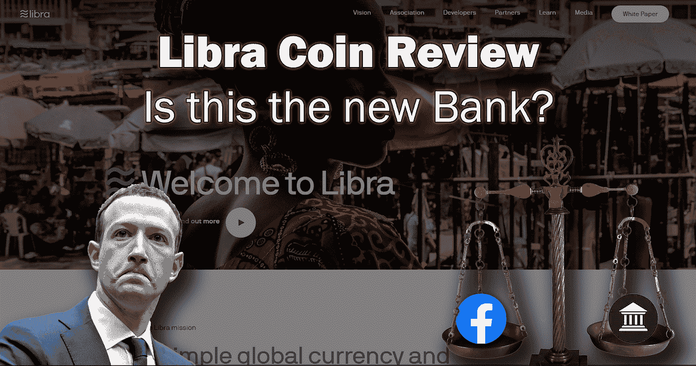
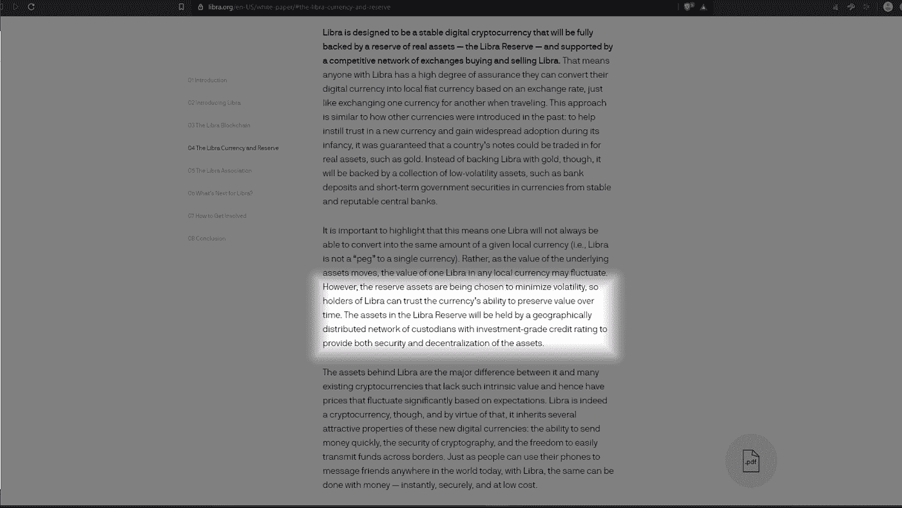
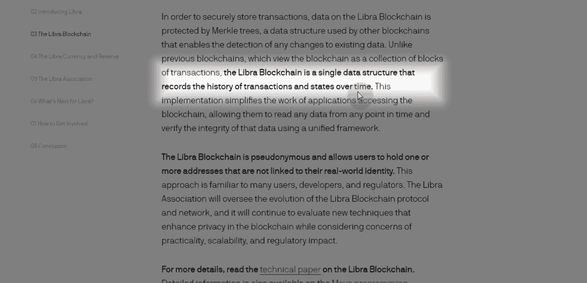
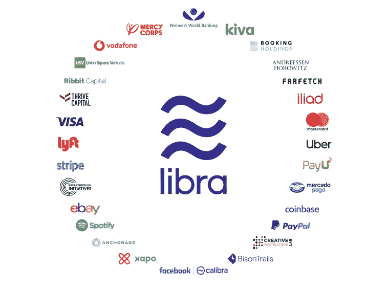
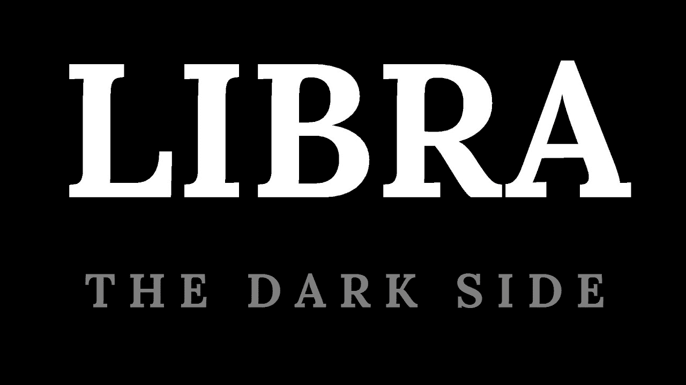

# 脸书的天秤座硬币——黑仔银行还是密码救星？

> 原文：<https://medium.com/hackernoon/facebooks-libra-coin-bank-killer-or-crypto-saviour-74e61b9e72af>

我相信你们都被关于 facebook 的 Libra 硬币的新闻淹没了，每个人都发表了自己的意见。所以我想我应该给你们一份这个项目实际上是什么以及这对我们所有人意味着什么的概述。我已经阅读了白皮书、技术论文和许多其他文档和文章，以便让您深入了解这个项目。

**什么事？**

脸书已经决定要解决一个世界难题，那就是把金融带给 30%无法获得金融的人口。这并不能完全解决世界贫困问题，但是看起来他们想解决大部分问题。他们想做一些联合国、世界强国和许多百万富翁和亿万富翁都做不到的事情。

他们正在创造一种名为 libra 的全球货币，这种货币“使用起来就像发短信一样简单便宜”。它将可以通过智能手机访问，并且在所有意图和目的上都将是一种新型的稳定硬币，我说新型是因为它将由现实世界的资产支持，但这些资产将是无数不同的银行存款和短期政府证券，所以它不会与一种特定的货币挂钩，而是与美元、欧元、日元和英镑挂钩。这将使其对大多数加密货币的波动性较低，但与当地货币相比，波动较小。任何资产都需要跨司法管辖区得到普遍认可，这意味着它不能只在一种货币或一个地点进行交易。

现在，它背后的区块链是由 Move 编写的，这是 facebook 设计的一种新语言，试图解决可伸缩性三难中的两个问题，即可伸缩性和安全性，并承诺在 5 年内完成第三个问题，即去中心化。

它将使用 BFT 共识，指出本质上，它将比战俘有更好的表现作为选择它的驱动因素。在我看来，最好的部分是他们选择的 BFT 的特定类型被称为“HotStuff”，尽管他们稍微改变了它。作为其中的一部分，这意味着验证器(节点)将能够加入网络并同步，而不必下载整个区块链历史。

有趣的一点是，他们不会建立传统意义上的区块链，因为“Libra 区块链是一个记录交易和状态历史的单一数据结构”。基本上，它可以做到这一点，因为它运行的是一个许可的网络，不需要分组交易和为认证目的给它们加时间戳。所以他们使用一个单独的 Merkle 树，而不是一个真正的区块链，所以很奇怪他们一直称它为区块链，因为没有连锁块…

因此，总而言之，Libra 区块链是来自不同现有区块链的技术的聚合。它需要比特币的匿名性，Hyperledger 这样的许可结构，Tezos 这样的链上治理，以太坊的气体，币安的燃烧，Coda 这样的一次性账本，以及 EOS 这样的启动结构，在这个过程中，它将解决许多核心问题。但最重要的是，区块链公司 Hedera 本周末在《华尔街日报》上刊登了一则广告，感谢 facebook 通过复制他们的治理模式来奉承他们！脸书也被指控从在线银行公司 Current 抄袭他们的商标。毫无疑问，一个独特的标志是最容易想出来的，我的意思是，相比创造一个完整的区块链全球货币解决方案。

但是我有很多问题和顾虑。我想知道 Move 语言有多强大，因为它是全新的，还没有被广泛采用。他们确实有一些未解决的问题，例如存储增长问题。

除了验证器、去中心化和链上治理的规则之外，他们甚至对根据这篇文章的解决方案没有信心。

仍然有很多模糊的承诺，如低费用，过渡到无许可网络和匿名，但 Calibra 钱包声明所有用户都将通过政府颁发的 ID 进行验证，听起来他们将是一段时间内唯一的钱包，所以…..

此外，他们确实创造了一种非常集中的全球货币，这种货币从银行和政府手中夺走了控制权，并将控制权交给了一些人，这些人在许多人看来甚至更不值得信任，这些人就是全球的科技巨头，他们公然受到利润的驱动。这个世界上有两种监狱，一种是你可以看到铁栏并触摸到它们，另一种是你看不到铁栏却不知道你在监狱里，这是最危险的。

有人提出了一个很好的观点，这整个项目可能是 facebook 将他们所有的巨额利润投入到他们控制的加密中的一个幌子，这意味着没有政府会控制它。

谁参与了？

Libra 区块链将于 2020 年推出，由 100 名验证者组成，他们将当前的声誉作为运行网络的信任基础。它们目前包括像万事达卡、维萨卡、贝宝、Stripe、Evay、脸书、优步、Spotify 和沃达丰这样组织。但其中也包括一些区块链公司，如比特币基地。

这些组织将组成位于瑞士的天秤座中立协会，本质上，这是唯一一个可以铸造和焚烧天秤座硬币的组织。就这一点而言，白皮书指出，每当向储备中存入一笔存款时，就会铸造新的硬币，每当从储备中提取一项资产时，就会烧掉相应的硬币，以保持 Libra 硬币的价值稳定。

因此，该协会也将能够做出任何他们想要的改变，只要他们获得 2/3 的多数。还有人表示，脸书将在不久的将来在该协会中发挥领导作用。

除了 Libra 硬币之外，还有第二种代币，称为“Libra 投资代币”，将出售给特定的受众，即创始成员，作为他们在网络中的股份。每个会员都至少投资了 1000 万美元成为会员，并获得这个代币。非营利组织是唯一不需要承诺至少 1000 万美元就可以参与治理的组织。

但是，任何一名代表最多可以拥有 1 票或总票数的 1%，以较大者为准。这样做是为了最小化任何一个成员拥有的控制权。现在，他们说 Libra 硬币抵押品的利息收入，储备将流向投资代币持有者。但是，如果这些资产被锁在储备金里，他们如何赚取利息呢？一般来说，只有当金融机构可以用这些资金投资于其他地方时，才能获得利息？

他们声称，通过确保所有资产都是政府发行的短期证券，可以最大限度地降低价值下跌或缺乏流动性的风险。

这场比赛谁赢/谁输？

显然，这将从银行和传统金融业手中夺走控制权。他们似乎也注意到了这一点，美国参议院银行委员会已经计划在 7 月就此举行听证会，美国立法者也呼吁停止这一做法，而欧洲政府则公开分享对此的担忧和恐惧，呼吁欧洲央行行长汇编对 facebook 的要求。

科技巨头和创始成员将成为这一新体系的最终赢家，在我看来，他们将成为未来的银行，或者正如一位德国官员所言，

“影子银行”。脸书在个人用户数据的使用和安全方面一直不受欢迎，所以这只是他们挖掘更多关于我们如何使用我们的钱的数据的一个幌子吗？

或者，他们只是想躲在一个分散的网络后面，没有人负责管理数据。

**这对区块链意味着什么？**

好吧，因为每个 facebook 和 whatsapp 用户很快就会有机会使用这个钱包和硬币，这本质上意味着所有那些不知道区块链和加密货币的人都将被迫使用它。

这不是一件坏事，事实上，这将把区块链技术带给全世界数十亿人。所以这应该会促进采用，但是采用什么类型呢？

这也将鼓励像 Libra 这样的密码通过 Ebay 这样的市场传播。一旦金融行业意识到他们不能关闭它，他们将被迫要么采用它，要么增加用户继续使用它们的动力，以保持他们在行业中的相关性。