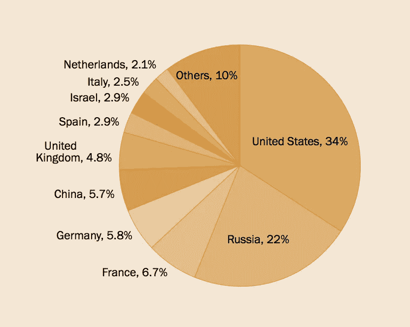

# 通过使用区块链技术促进打击非法武器销售

> 原文：<https://medium.com/hackernoon/facilitating-the-fight-against-illegal-arms-sales-through-the-use-of-blockchain-technology-dd8d1cbebf14>

全世界非法武器的采购和销售非常复杂，包括个人、犯罪组织和恐怖组织可以购买这些武器的多种渠道。我们今天知道，许多恐怖组织正在对无辜平民实施恐怖袭击，同时使用非法获得和无法追踪的武器。

由于松懈的安全措施、腐败的代理人和开放的边界，这些非法获得的武器一旦被购买，就很容易跨越国际边界进行交易，从而为这些武器的获得、销售和使用提供便利。无辜的平民。

在当今飞速发展的数字时代，更多的场所促进了黑市的发展，从而进一步推动了武器和非法违禁数字材料的销售。作为合法武器的最大出口国，美国也是最常见的暗网武器来源国。

根据兰德公司最近的一份研究报告，这些武器中大约有 60%来自美国。

众所周知，全世界的武器销售总额约为 600 亿美元。据武器控制协会称，美国控制着武器市场，占贸易的 33%。俄罗斯排名第二，落后美国 10%。

据估计，10 %- 20%的武器交易最终流入了非法武器黑市。今天，这个市场包括新的非法交易渠道，如暗网。

区块链技术的使用可以通过创建一个多国不变的数据库来帮助打击这些非法武器的贸易，该数据库将从武器诞生之时起跟踪任何武器。

这将允许建立一个可与加密货币所有者的数字钱包相媲美的数字保险箱。允许数字和分布式数据库将有助于防止任何一个系统被黑客入侵。这是必不可少的，因为这将减少甚至一个黑客用来掩盖非法销售和从一个单一的数据库采购武器的可能性。

> 我们知道这是真的，因为区块链技术和跨国公司的名单将被分发，而不是保存在一个单一的位置。

虽然区块链技术可以帮助打击非法贩运，但它只是利用这一斗争的一个工具。区块链不应该是终极目标，而是众多伙伴中的一员。

现在是政府开始考虑如何从技术上打击这种贸易的时候了，否则更多的流血将继续在国内外的道路上发生。