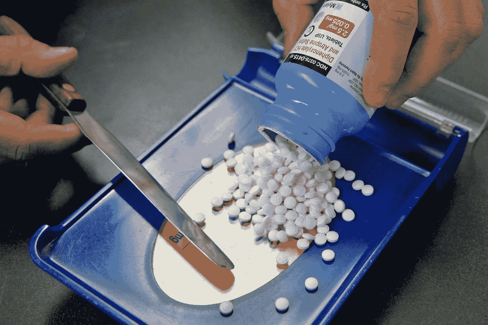

# FDA 将探索使用区块链跟踪处方药

> 原文：<https://medium.com/hackernoon/fda-explores-using-blockchain-to-track-prescription-medications-3267cf05fa23>

FDA mull using Blockchain

美国美国食品药品监督管理局希望确保粗制滥造的药物不会流入医院和药店，并正在考虑一种技术解决方案来确保药物安全。该机构启动了一个试点项目，让药品供应链探索跟踪处方药的方法。虽然 FDA 没有具体说明科技公司将使用什么，但它指出 T2 区块链 T3 是一个例子。同样的分散信任系统可以追踪你的生菜的来源，也可以验证你的药片来自合法的来源。

该机构正在寻求建立一个系统，提供一步一步的帐户，药物已售出，谁处理了它；确保药品合法性的产品验证机制；以及确保参与处理药物的任何一方有能力发现、隔离和调查任何可疑药物的方法。新系统旨在减少国内销售的药物的转移，并有助于将假药排除在供应链之外。

FDA 已经聘请沃尔玛前食品安全副总裁 Frank Yiannas 来领导这个试点项目。公司必须在 3 月 11 日之前向[申请参与试点](https://www.federalregister.gov/documents/2019/02/08/2019-01561/pilot-project-program-under-the-drug-supply-chain-security-act-program-announcement)。请注意，你必须等待一段时间才能看到这项技术的广泛应用。跟踪系统要到 2023 年才会生效，这是授权这项技术的法律(药品供应链安全法)生效 10 年后。

FDA 已经尝试使用[区块链技术](https://augustahitech.com/services/enterprise-blockchain-solutions.html)来共享肿瘤相关的健康数据，并促进 FDA、医疗保健提供商和医院之间的健康信息共享。

Augusta HiTech 在区块链医疗保健领域拥有丰富的经验，在 Hyerledger 和以太坊提供了 10 多个区块链医疗保健解决方案。如需快速咨询或免费咨询，请拨打电话(866)-962–1010联系我们，或点击此处联系我们[...我们的一些](https://augustahitech.com/contact.html)[成功故事](https://augustahitech.com/company/success-stories.html)如下:[https://augustahitech.com/company/success-stories.html](https://augustahitech.com/company/success-stories.html)