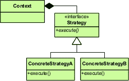

# 功能标志和测试驱动设计:一些实用技巧

> 原文：<https://medium.com/hackernoon/feature-flags-and-test-driven-design-practical-tips-ed7d76445a29>

*‘*[*Fork in the road*](https://www.flickr.com/photos/bs0u10e0/4000195795)*‘ by Bs0u10e0*

2018 年，我们的团队花了很多时间在功能标志和测试驱动设计(TDD)上。我们的目标是对我们的系统进行架构上的改变:改变一些数据的真实来源，并将其从一个遗留的整体数据库转移到一个由新的微服务控制的新数据库中。然而，大部分需要数据的代码将保留在 monolith 中。

我们标记的事物类型的一些例子是:

*   是否沿着重构的代码路径前进；
*   发生特定事件时是否将消息发布到消息队列；
*   如何发布那些消息(我们尝试了批处理和事务边界的多种变化，以达到可接受的性能)；
*   是仅在接收端删除消息还是实际处理它们；和
*   是使用本地数据源还是远程数据源。

我们正在开发一段非常重要的代码。这是一种业务功能，如果我们把它塞满了，有人可能不得不花几天时间做补救性的修复或打电话来追逐数百万美元。因此，我们放入的大多数特性标志是为了确保我们可以在产品中测试新的代码路径，并且安全快速地回滚。其中一些我们甚至故意打开 10 分钟，让新代码运行，然后再次关闭，然后离线查看结果。根据记忆，所有这些标志都是简单的开/关开关，尽管我们确实有能力在需要时为每个客户端/客户/类别设置标志。这些建议对任何一种类型都适用。

因为我们在相对较短的时间内使用了这么多不同的特性标志，所以我们尝试并观察了许多不同模式的效果，包括好的和坏的，并开发了下面的一组指南。

作为背景，在这个特殊的应用程序中，我们最古老和最大的模块，大多数类都有 1:1 的单元测试。这不再是我们目前的首选做法，但它是我们在这个应用程序中工作时的遗留问题。它还收集了大量的集成测试。

# 使用 TDD 的功能标志的目标

[*Archer*](https://pxhere.com/en/photo/748210) *by Unknown*

我们在做这项工作时有几个目标:

*   我们希望确保当前所有受标记影响的测试路径都在标记打开*和关闭*的情况下进行测试。
*   我们不希望我们的测试套件因为特性标志而变得太大和/或难以理解。
*   我们想要一个易于理解的 git 历史，尽管特性标志暂时很复杂。
*   理想情况下，删除特性标志是一项快速的任务，不需要深入阅读代码或测试。

# 特征标志和 TDD:我们的五个准则

## 1.复制每个受影响的测试

确保测试不会变得笨拙的第一步是不要试图在一个测试中测试所有的特性标志。所以:不要打开现有的测试文件，开始添加新的“特性 X ON”测试用例。相反，创建两个测试文件:一个用于标志打开，一个用于标志关闭。是的，我们可能会有一堆重复的测试用例，它们在两个文件中是完全相同的，甚至可能是大部分，但是这只是暂时的。

这种方法有三个好处:首先，我们避免了创建一个混淆的测试怪物，将标志打开、标志关闭和标志不可知的测试混合在一起。第二，一旦我们决定永久保留这个标志，我们可以删除整个“标志关闭”测试文件。“简单！”第三，我们可以在每个测试文件的顶部设置一次标志，而不是必须在每个测试用例的开始设置它，并希望人们在阅读测试时注意到这个细节。

## 2.将复制的文件作为“旧”功能的测试，将原始文件作为“新”功能的测试

当我们将现有的测试复制到一个新文件中时，我们想让新文件成为旧的功能的测试——在特性标志关闭的情况下(例如 CP FooTest foopefeaturestest)——并改变原来的测试文件*以包含标志打开时的测试用例。这有助于为持久的测试套件保持一个连续的 SCM 历史，显示功能是如何进展的。*

另一种方法是在新文件中放置“特性标志”,然后，当我们去掉特性标志时，删除原始测试并将“新”测试重命名为“普通”测试(例如，mv FooWithNewFeatureXTest FooTest)。当我们查看我们的 git 历史时，我们发现了后一种方法的问题:它经常显示整个测试被删除，然后被重新创建，这使得当引入新的变更时，检查对测试做了什么变更变得更加困难。

## 3.在任何启用特性标志的测试结束时，总是将标志设置回测试开始前的状态

这一点很重要，因为如果我们的标志是有状态的，在测试之间不会自动重置，那么我们可能会结束*没有*明确打开或关闭标志的测试，然后根据我们测试的执行顺序随机打开标志运行。对于大多数测试来说，这不会有什么不同，但对于某些测试来说，会有不同，我们可能会在构建中遇到没有意义的失败，因为我们无法从单个测试的代码中看出该标志在运行之前被另一个测试保留了。

还要注意这条规则的谨慎措辞:我们并不总是在测试结束时*禁用*标志；我们把它恢复到测试前的状态。在重置标志时遵守规则对于下一个技巧的工作至关重要。

## 4.在启用功能标志的情况下运行整个版本

一旦我们认为我们已经创建了我们认为受特性标志影响的所有测试套件的特性前和特性后版本，我们就需要在打开标志的情况下运行整个构建。这将会清除那些受我们还没有创建一个不同套件的标记影响的测试。如果我们的测试修改足够全面，应该不会失败，因为所有关心标志的路径测试应该已经在测试中显式地设置了标志。

在一个简单的微服务中，我们可能不太可能通过这一步找到任何东西，尽管它应该运行得很快，所以仍然值得一做。另一方面，在一个有许多组件的复杂整体中，很可能有一些我们已经忘记的系统部分依赖于我们刚刚改变的行为，并且它们的集成测试很可能会因为这些改变而失败。我们真的想在生产系统中打开特性标志之前找到这些可传递的中断。如果我们不这样做，我们实际上会在 prod 中运行该依赖组件的未测试版本。

## 5.尽快打开并删除特征标志

特性标志是一种在生产系统中帮助受控、可逆迁移的设备，但是它们也使代码变得复杂。我们希望我们的代码简单，所以当有特性标志时，我们优先考虑在生产中打开它们。如果我们不优先打开它们，我们就不能优先删除它们。如果我们发现需要在同一区域放置其他特征标志，并开始让特征标志相互作用，这就变得特别困难。

在 prod 中完成迁移的那一刻，我们很高兴功能应该保留，功能标志变成了[技术债务](https://en.wikipedia.org/wiki/Technical_debt)。我们希望之后尽快删除它们，这样我们的代码就能尽可能的简单。

# 哟，那战略模式呢？

*‘*[*Strategy pattern in UML*](https://commons.wikimedia.org/wiki/File:Strategy_Pattern_in_UML.png)*‘ by Jason S. McDonald*

当我在 Twitter 上分享上面的一些技巧时，一些人回应说他们在做特性标记时喜欢使用[策略模式](https://en.wikipedia.org/wiki/Strategy_pattern)。

虽然我是策略模式的忠实粉丝，但当特性标记时，我通常会避免使用它。我的理由是特性标记在理想情况下是一种临时的措施，而策略模式是一种支持多种实现的设计结构。虽然特性标记经常会在短时间内导致多个实现，但我认为不值得在这么短的时间内引入一个设计构造，只是在标记被移除后不久又将其删除。所以我们通常只在所有依赖标志的地方使用 if/else，知道‘else’分支将很快被移除。如果 feature 标志与几乎完全重写的大型或复杂代码段有关，我们可能会对此进行例外处理，很明显，将两个实现放在不同的类中会大大提高可读性。

# 你是如何实现特征标志和 TDD 的？

这些是我们的团队通过近一年的特性开发的主要指导方针，通过复杂的迁移工作为我们指明了道路。如果你有关于如何使用特性标志的其他建议，特别是在 TDD 环境中，我很乐意在回复中听到。

这篇文章是[最初发表在 Graham 的博客](https://www.grahamlea.com/2019/05/feature-flags-tdd-practical-tips/) [Evolvable Me](https://www.grahamlea.com/) 上的。访问博客获取更多关于[软件开发](https://www.grahamlea.com/tag/software/)的文章，并注册接收 Graham 的新文章通知。

你可以在推特上关注格雷厄姆，地址是 [@evolvable](https://twitter.com/evolvable) 。