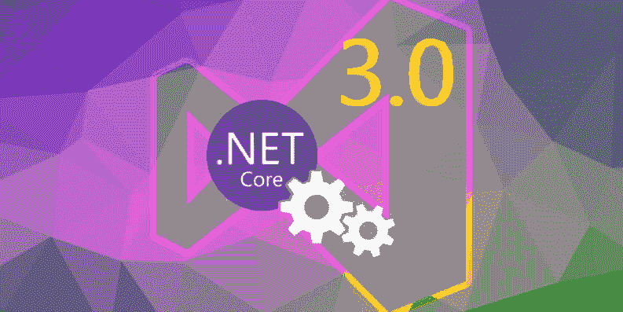
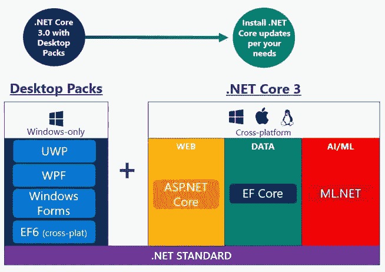
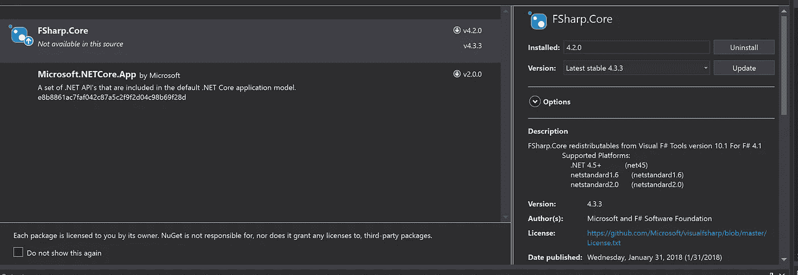
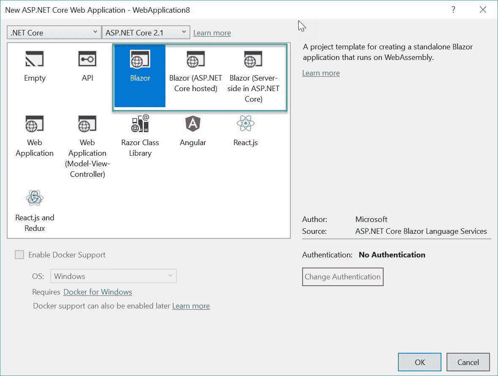

# 用于构建更好的应用程序的特性。网络核心 3

> 原文：<https://medium.com/hackernoon/features-to-build-better-applications-with-net-core-3-dc320740e0a9>

开发者很兴奋，你也应该如此。期待已久的 NET Core 3.0。第一次出现[是在五月份的构建期间，](https://www.theregister.co.uk/2018/05/07/microsoft_announces_net_core_30_including_windows_desktop_applications/)。NET Core 3.0 终于带来了对 Windows 桌面应用的支持。

事实上，开源。NET Core 3.0 将在 2019 年及以后备受关注。在微软 Ignite 大会上的发布会上，该公司强调了 Core 3.0 将带来的所有主要功能，它们将让您欣喜若狂。

**它为桌面应用提供了什么好处？**

。NET Core 3.0 为基于桌面的应用程序带来了许多好处。首先，它将提高应用程序的整体性能，并加快运行时更新的速度。第二，它是一个**开源平台**，提供创新的 BCL 和 API，不会导致兼容性问题。三、 [**还有其他重大好处。NET** **应用开发**](https://www.cmarix.com/how-to-accelerate-the-performance-of-asp-net-mvc-web-application/) 包括:

*   最新版本的测试。NET Core 只用于设备上的一个应用程序。
*   允许应用程序本地和机器全局部署的设计。
*   完全支持。NET 核心 CLI 工具和 SDK 风格的项目。
*   改进，如访问 Windows 10 的完整 API，能够在 Windows 窗体和 WPF 应用程序中托管 UMP XAML 控件。
*   能够托管媒体控件和 UWP 浏览器。

虽然。NET Core 在这次最新发布中本质上没有改变，它将继续提供基于云技术的**最出色的跨平台性能**。

**的主要特征是什么。网芯 3.0？**

的建筑环境。NET Core 包括定义对象实现的公共语言规范、收集可重用资源的框架类库和管理程序执行的公共语言运行时。

作为一个开源平台，它提供了如下特性:

# 一个方便的部署模型:

这是中嵌入的最重要的功能之一。网芯 3。开发基于 Windows 的应用程序的开发人员在部署这个平台时肯定会体验到极大的灵活性。

无论何时推出新版本的 Core，您都可以一次在一台机器上即时更新，而不会对其他应用程序造成任何影响。这是因为最新版本上传到新的目录中，不会影响现有的应用程序。也可以部署。NET Core 针对需要更多隔离的应用，使用集成在其中的 [**新应用捆绑工具**](https://www.area19delegate.org/9-tools-every-app-developer-should-know-about/) 。

# 现有应用的更好功能:

不可否认，开始更容易。NET 的新应用程序。然而，该平台的优势也延伸到了现有的应用程序。不需要大改动的 app 可以留在[T5。NET 框架](https://www.cmarix.com/interesting-facts-about-dotnet-framework/) 。

另一方面，当移动一个处于活跃开发过程中的应用程序时，有一个简单的过程可以遵循。它包括以下内容:

*   了解和分析在上运行时对第三方的依赖。网芯。
*   目标是。NET 标准库，可用于所有运行时。它支持构建一个跨平台的库来跨项目使用。
*   将项目重新定位到。NET Framework 4.6.2，用于确保 API 替代。
*   使用合适的框架移植测试代码。
*   根据框架结构执行计划。它包括识别库基、将库基复制到新项目中、进行修改以编译代码，以及复制其他编码层。

基本上，微软正在使**桌面应用**瞄准目标。NET Core 3.0 进行重新编译。此外，它需要针对 3.0 版本更新项目文件。新平台带有兼容的 API，可以在所有桌面应用上运行。

同时，Windows 窗体和 WPF 将能够并肩工作。网芯。因为在将现有应用程序迁移到。NET Core 3，该公司一直在努力增加更好的功能和测试应用程序。

# 项目文件更新变得简单:

。NET Core 3.0 采用使用包引用的 SDK 风格的项目。这种新的引用方式将取代 packages.config，并允许一次性引用整个组件区域。

对 SDK 风格项目的主要改进包括更干净和更小的项目文件、在 Visual Studio 中编辑项目文件、支持多目标和更简单地响应源代码控制。

领养的时候。NET Core 3，迁移到 SDK 风格的项目是必不可少的。因此，Visual Studio 中的迁移体验将在命令行中提供。

# 关注所有设备:

与。NET Core 3.0，微软的目标是专注于物联网设备、桌面设备和支持人工智能的设备。这一更新引发了人们对该公司是否计划更换的猜测。NET 框架与物联网(IoT)。

但是，那不是真的。微软已经澄清，它没有这样的计划。相反，它正在计划更慢的版本。NET framework 来维护其兼容性。另一方面，。NET 核心更新的发布速度更快，允许并行配置。

# 服务器端 Blazor 的实现:

除了其他功能，该公司还致力于在最新的核心版本 3.0 中实现服务器端 Blazor 或 Razor 组件。Blazor 将被整合到 ASP.NET 核心，并与。网芯。

由于这种集成，相同的代码将在不同的设备上运行，而不需要任何代码更改。这将增强 web 应用程序的兼容性。有一个客户端的 web 用户界面。NET Core，在开发中可以享受到一致性和稳定性的好处。它可以在所有浏览器上运行，不需要插件或代码翻译。

**前路:**

在新的更新之后，安装将继续在全球数百万台机器上运行。在这种情况下，实现。NET 框架才是真正的挑战。

因此，微软将进行测试。NET 框架应用程序。NET 核心而不接触源代码。它还计划实现依赖性数据的匿名共享，并向用户发布早期设计。

除了这些功能和更新，微软还在更新机器学习框架。网络应用。这个 0.5 版本将带有全新的 TensorFlow 转换，允许开发人员使用现有的 TensorFlow 模型。

如果你正在你的企业中寻找有效的 [**web 应用程序开发**](https://www.cmarix.com/) ，雇佣一个专业的开发人员是个不错的选择。的高级版本。NET Core 允许开发人员探索令人兴奋的新特性来构建桌面应用程序。