# Fescar:阿里巴巴开源的分布式交易解决方案

> 原文：<https://medium.com/hackernoon/fescar-a-distributed-transaction-solution-open-sourced-by-alibaba-f70c9b4c72a1>

## 为了支持基于微服务的开发，阿里巴巴现在已经推出了 Fescar，这是其全球交易服务解决方案的开源版本，用于解决分布式交易的问题。

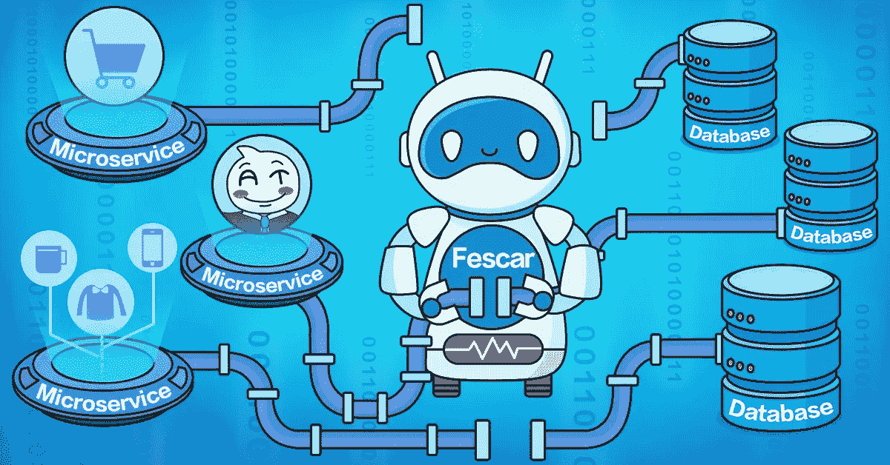

*本文是* [***阿里巴巴开源***](/@alitech_2017/alibaba-open-source-series-6ec06ca2a402) *系列的一部分。*

在在线系统中，微服务最近获得了开发人员的支持，作为一种通过将复杂的应用程序拆分为松散耦合的服务来降低难度、增强可伸缩性和促进敏捷开发的手段。然而，在微服务系统中实现一个看似简单的功能可能需要调用多个服务和操作多个数据库，这为服务调用引入了一个令人生畏的分布式事务问题。

目前，分布式事务是实现微服务的最大障碍，也是最具挑战性的相关技术问题。为了克服这些困难，阿里巴巴最初为其系统开发了全球交易服务(GTS)解决方案。现在，它通过推出名为 [Fescar](https://github.com/alibaba/fescar) 的开源版本扩展了这一解决方案，Fescar 是“快速轻松提交和回滚”的缩写。

为了纪念它最近在 GitHub 上的发布，本文详细介绍了 Fescar 的基础知识及其对基于微服务的开发的支持。

# 分布式事务问题的起源

为了理解微服务如何导致分布式事务问题，有必要考虑一个传统单片应用程序的示例，该应用程序通过三个模块更新单个数据源上的数据来完成业务流程。自然，本地事务保证了整个业务流程中的数据一致性。

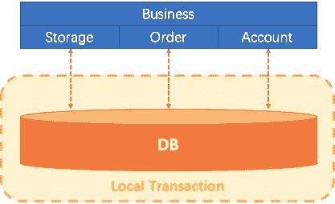

随着业务需求和架构的变化，单个应用被划分为微服务。最初的三个模块被分成三个独立的服务，每个服务使用不同的数据源(模式:每个服务一个数据库)。业务流程现在将通过调用这三个服务来完成。

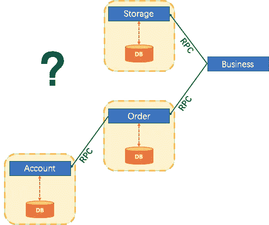

在这种情况下，本地事务仍然能够保证每个服务中的数据一致性。然而，为了确保整个业务级别的全局数据的一致性，分布式事务解决方案变得很有必要。

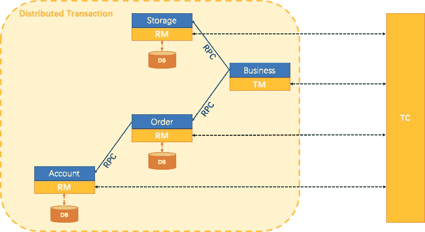

# 发展 Fescar

阿里巴巴是中国最早实现向分布式微服务过渡的企业之一，因此长期以来一直面临微服务架构下的分布式事务问题。

2014 年，阿里巴巴中间件团队发布了淘宝交易构造器(TXC)，为集团内应用提供分布式交易服务。

2016 年，TXC 作为继产品化之后的全球交易服务(GTS)在阿里云上实现，成为当时云上唯一的分布式交易产品。因此，它开始通过阿里巴巴的公共云和 Apsara 解决方案为许多外部客户提供服务。

进入 2019 年，基于 TXC 和 GTS 的技术积累，阿里巴巴的中间件团队启动了开源 Fescar 项目，与开发社区合作，进一步构建其分布式交易解决方案。

TXC、GTS 和 Fescar 都起源于相同的地方，他们一起为微服务架构下的分布式事务问题提供了独特的解决方案。

## 原始设计目标

在快速发展的互联网时代，快速试错的能力对企业来说至关重要。一方面，将微服务和分布式事务支持引入技术基础设施不应该在业务层面产生任何额外的研发负担。另一方面，引入分布式事务支持的业务应该保持基本相同的性能水平，并且不应该受到事务机制的显著阻碍。

基于这些标准，Fescar 的设计一开始就考虑了两个关键因素。首先，它不应该对业务造成任何干扰。这里的“入侵”是指由于分布式事务导致的技术问题，在业务层面对应用程序进行设计和修改。这种设计和修改通常会导致应用程序的高 R&D 和维护成本。阿里巴巴需要在中间件层面解决分布式交易问题，而不需要在业务层面对应用程序做额外的工作。

其次，设计需要确保高性能。分布式事务保证的引入不可避免地会带来额外的开销，导致性能下降。阿里巴巴需要将引入分布式事务导致的性能损失降低到尽可能低的水平，以便应用程序的可用性不会受到引入分布式事务的影响。

## 以前解决方案的缺点

以前的分布式事务解决方案可以分为对企业有干扰的解决方案和对企业无干扰的解决方案。

在主流解决方案中，只有基于 XA 的解决方案对业务是非侵入性的。然而，基于 XA 的解决方案存在三个问题。首先，它们要求数据库为 XA 提供支持；如果数据库不支持 XA 或者提供的支持很差，比如 5.7 之前的 MySQL 版本，就没有办法使用这些解决方案。其次，它们受到协议本身的约束，有了它们，事务资源就有了很长的锁定周期。从业务角度来看，长期的资源锁定通常是不必要的，但是因为事务资源管理器就是数据库本身，所以应用层无法干预。这导致性能差和优化困难。最后，已实现的基于 XA 的分布式解决方案依赖于 Tuxedo、WebLogic 或 WebSphere 等重型应用服务器，这使得它们不适用于微服务架构。

XA 实际上是早期开发中分布式事务的唯一解决方案。它是完整的，但是在实践中，由于各种原因，包括但不限于上面讨论的问题，它经常需要被放弃。例如，基于可靠消息的最终一致性解决方案、TCC 和 Saga 都属于这一类。由于互联网上的信息，本文不解释这些解决方案的机制。简而言之，它们要求在应用程序设计的业务级别考虑分布式事务技术约束。通常，每个服务都需要设计成实现正向和反向幂等接口；这种设计限制通常导致高 R&D 和维护成本。

## 理想溶液的品质

入侵式分布式事务解决方案已经在实践中得到广泛验证，能够有效解决问题，在各行各业的业务应用系统中发挥重要作用。尽管如此，采用这样的解决方案应该被视为一个遥远的第二选择。想象一下基于 XA 的解决方案可能更轻量级，并确保业务的性能需求，人们不太可能愿意将分布式事务问题带到业务级别。

因此，理想的解决方案应该像使用本地事务一样简单，业务逻辑只关注业务级别的需求，而不考虑对事务机制的约束。

# 解决方案原则和设计

将非侵入性 XA 解决方案视为业务级非侵入性解决方案的基础，需要解决的关键问题是如何调整 XA 以解决它所呈现的问题。以下部分详细讨论了这种适应所涉及的原理。

## 定义分布式事务

首先，分布式事务自然可以被视为包含几个分支事务的全局事务。全局事务的职责是协调其管辖下的分支事务，使它们一致，要么一起成功提交，要么一起失败和回滚。此外，分支事务本身通常是满足 ACID 原则的本地事务。这是对分布式事务结构的一个基本理解，和 XA 是一致的。

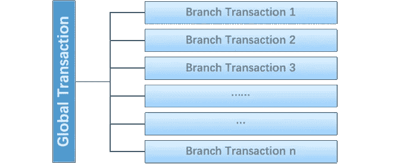

其次，与 XA 模型类似，定义了三个组件来协商分布式事务的处理:

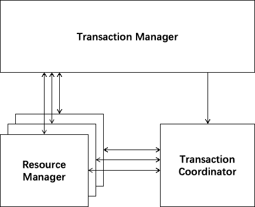

事务协调器(TC)维护全局事务的运行状态，并负责协调和驱动全局事务的提交或回滚。

事务管理器(TM)控制全局事务的边界，负责打开全局事务，并最终启动全局提交或全局回滚解决方案。

资源管理器(RM)控制分支事务，负责分支注册和状态报告，并从事务协调器接收指令以驱动分支(本地)事务的提交和回滚。

典型的分布式事务处理过程如下:

1.TM 请求 TC 打开一个全局事务，并且该全局事务被创建，成功地生成一个全局唯一的 XID。

2.XID 在微服务呼叫链路的环境中传播。

3.RM 向 TC 注册分支交易，并将其纳入与 XID 对应的全球交易的管辖范围。

4.TM 发起对 TC 的 XID 的全局提交或回滚解析。

5.TC 调度 XID 下的所有分支事务以完成提交或回滚请求。

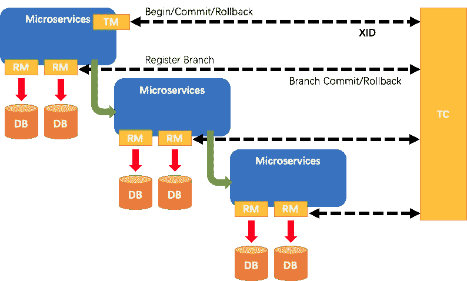

至此，Fescar 的协议机制与 XA 大体一致。

## Fescar 和 XA 的区别

Fescar 与 XA 的第一个主要区别是在架构层面。

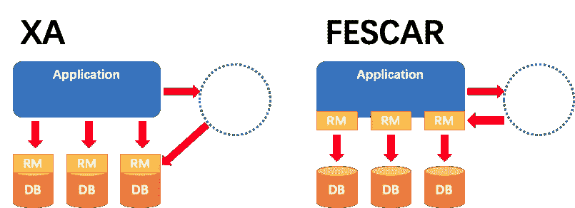

XA 解决方案的 RM 实际上是在数据库级别，RM 本质上是数据库本身(通过提供支持 XA 的驱动程序供应用程序使用)。

Fescar 的 RM 以第二方包的形式作为中间件层部署在应用端。它不依赖于数据库本身提供的对 XA 协议的支持，也不要求数据库支持该协议。这对于微服务架构来说非常重要:应用层不需要为本地事务和分布式事务这两种不同的场景采用两种不同的数据库驱动程序。这个设计原则去除了分布式事务解决方案对协议的数据库支持的要求。

Fescar 的第二个主要区别与两阶段提交有关。下面显示了 XA 的 2PC 流程:

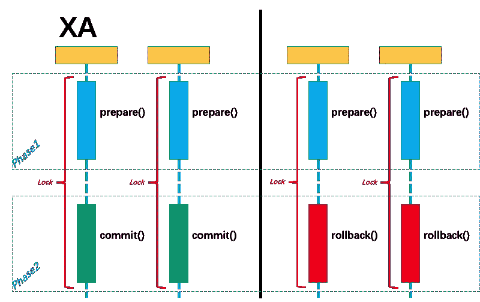

无论阶段 2 的解决方案是提交还是回滚，事务性资源锁都会一直保持到阶段 2 完成。

想象一个正常的业务，有很大的概率最终会成功提交 90%以上的交易。在阶段 1 中可以提交本地事务吗？90%以上的百分比，更早提交可以节省第二阶段的锁时间，提高整体效率。

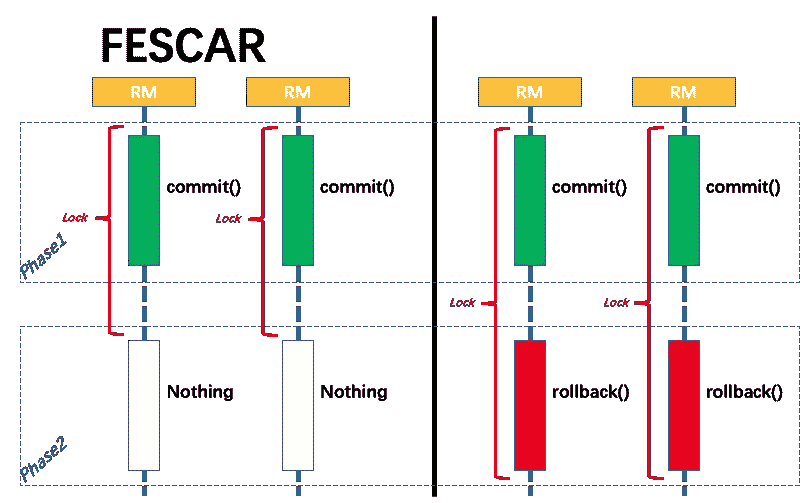

如上图所示，Fescar 的设计减少了大多数场景下的事务锁定时间，从而增加了事务的并发性。

下一个问题当然是，当阶段 1 被提交时，阶段 2 如何回滚？

## 分支事务如何提交和回滚

首先，应用程序需要使用 Fescar 的 JDBC 数据源代理，这是 Fescar 的 RM。

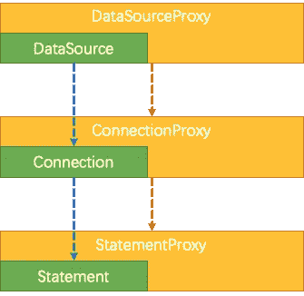

阶段 1 工作如下:通过解析业务 SQL，Fescar 的 JDBC 数据源代理将 SQL 执行前后的业务数据的数据映像组织到一个撤销日志中，并使用本地事务的 ACID 特性将业务数据的更新和撤销日志写入同一个本地事务中进行提交。通过这种方式，可以保证提交的业务数据的任何更新都有相应的撤销日志。

基于这种机制，分支的本地事务可以在全局事务的第 1 阶段提交，而被本地事务锁定的资源可以立即释放。

阶段 2 的工作方式如下:如果解决方案是全局提交，那么分支事务此时已经完成了提交，不需要同步协调。(只有回滚日志需要异步清理)。因此，第二阶段可以很快完成。

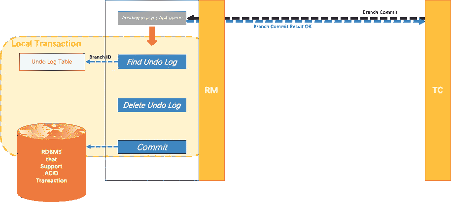

如果解决方案是全局回滚，RM 接收来自协调器的回滚请求，通过 XID 和分支 ID 找到相应的撤销日志记录，并生成反向更新 SQL，它通过回滚记录来执行该 SQL，以完成分支回滚。

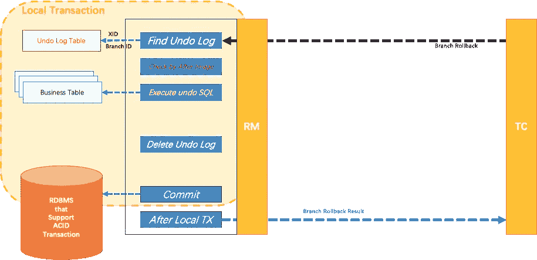

## 事务传播机制

XID 是全球交易的唯一标识符。事务传播机制需要通过服务调用链接传递 XID，并将其绑定到服务的事务上下文。这样，服务链接中的数据库更新操作被注册到由 XID 代表的全局事务中，并被包括在同一个全局事务的管辖范围内。

基于这种机制，Fescar 可以支持任何微服务 RPC 框架，前提是在特定框架中找到一种可以透明传播 XID 的机制，例如 Dubbo 的 Filter + RpcContext。

对应于 Java EE 规范和 Spring 定义的事务传播属性，Fescar 支持和不支持的传播如下:

PROPAGATION_REQUIRED:默认情况下支持

PROPAGATION_SUPPORTS:默认支持

PROPAGATION_MANDATORY:通过 API 支持

PROPAGATION_REQUIRES_NEW:通过 API 支持

PROPAGATION_NOT_SUPPORTED:通过 API 支持

PROPAGATION_NEVER:通过 API 支持

PROPAGATION_REQUIRED_NESTED:不支持

## 隔离

全局事务的隔离基于分支事务的本地隔离级别。

基于数据库本地隔离级别为“read committed”或以上的前提，Fescar 设计为使用事务协调器维护的全局写独占锁来保证事务之间的写隔离，全局事务默认定义在“read uncommitted”的隔离级别上。

关于隔离级别的共识是，大多数应用程序在“read committed”隔离级别下正常工作。事实上，在大多数情况下，应用程序在“未提交读取”隔离级别下工作也没有问题。

在极端的情况下，如果应用程序需要达到全局读提交，Fescar 还提供了一种实现这一目标的机制。默认情况下，Fescar 在“read uncommitted”隔离级别下工作，确保大多数场景的效率。

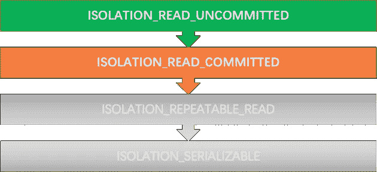

在 Fescar 中，事务的 ACID 属性是一个复杂的主题，将在以后的文章中深入解释。

# 应用场景分析

上面提到的 Fescar 核心原则的一个重要前提是，分支事务涉及的资源必须是支持 ACID 事务的关系数据库。分支提交和回滚机制依赖于本地事务的保证。因此，如果应用程序使用的数据库不支持事务，或者根本不是关系数据库，则 Fescar 不适用。

此外，Fescar 的实现还存在一定的局限性。例如，事务隔离级别最高支持读提交级别；SQL 解析没有涵盖所有语法；诸如此类。

为了弥补 Fescar 原生机制目前没有覆盖的不足，定义了另一种工作模式。上面描述的 Fescar-native 工作模式被称为 AT(自动事务)模式，它对业务没有干扰。与此相对应的另一种工作模式是 MT(手动交易)模式，在这种模式下，分行交易需要由业务来定义。

## 基本分支行为

作为全局事务一部分的分支事务，除了它自己的业务逻辑之外，还包括四个与协调器交互的操作:

分支注册:在执行分支事务的数据操作之前，分支事务需要向协调器注册，使即将到来的数据操作能够被包含在已打开的全局事务的管理中。分行注册成功后，即可进行数据操作。

状态报告:在其数据操作完成后，分支事务必须向事务协调器报告执行结果。

分支提交:分支事务完成分支提交，以响应协调器发出的这种请求。

分支回滚:分支事务响应协调器发出的请求，完成分支回滚。

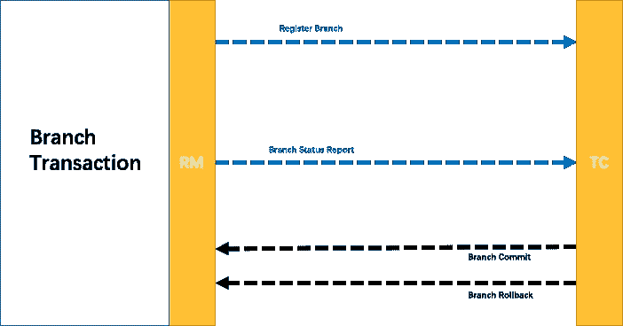

## AT 分支行为模式

业务逻辑不关注事务机制，分行与全局事务的交互过程是自动执行的。

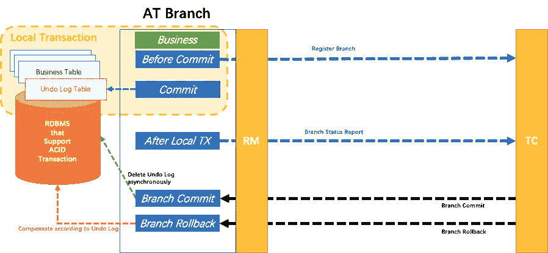

## MT 分支行为模式

业务逻辑需要分解成三个部分，以形成 MT 分支并加入全局事务:准备、提交和回滚。

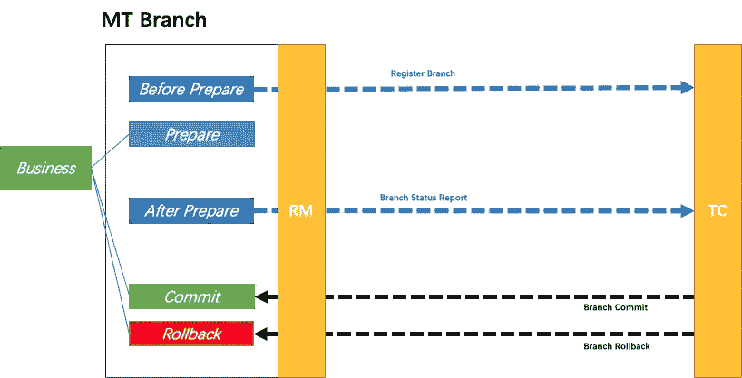

一方面，MT 模式与 AT 模式是互补的。另一方面，它更重要的价值在于，通过它可以将许多非事务性资源纳入全局事务的管理中。

## 混合模式

因为 AT 分支和 MT 分支在行为模式上基本一致，完全兼容；也就是说，在一个全局事务中，at 和 MT 分支都可以存在。这样就可以达到对业务场景全面覆盖的目的。对于支持 at 模式的，使用 AT 模式；对于目前不支持 at 模式的，则使用 MT 模式。此外，MT 管理的非事务性资源也可以与支持事务的关系数据库资源一起包含在同一分布式事务的管理中。

## 应用场景展望

从 Fescar 设计的初衷来看，一个理想的分布式事务解决方案在业务层面应该是非侵入性的。在 AT 模式不能完全覆盖所有场景的情况下，MT 模式是自然的补充。Fescar 团队希望通过 AT 模式的不断演进，逐步扩大支持的场景范围，而 MT 模式则逐步收敛。在未来，Fescar 将包括对 XA 的原生支持，并将 XA 作为一种非侵入性的方式来覆盖 at 模式无法覆盖的场景。

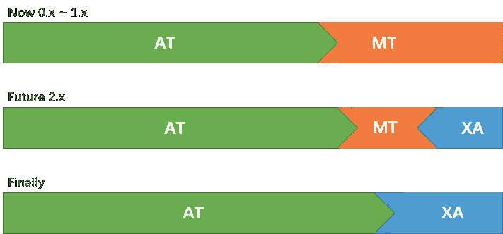

# 扩展点

## 微服务框架支持

事务上下文在微服务之间的传播需要基于微服务框架本身的机制定制对应用层透明的最佳解决方案。对这方面的构建感兴趣的开发者可以参考 Dubbo 内置的支持其他微服务框架。

## 支持的数据库类型

因为 AT 涉及到 SQL 的解析，所以有一些特定的适应工作在不同类型的数据库上。对这方面的构建感兴趣的开发者可以参考 MySQL 内置的对其他数据库的支持。

## 配置和服务注册发现

Fescar 支持访问不同配置和支持服务注册发现的解决方案，如 Nacos、Eureka 和 ZooKeeper。

## MT 模式下的场景扩展

MT 模式的一个重要功能是，通过 MT 分支的打包，例如 Redis、HBase 和 RocketMQ 事务消息，可以将非关系数据库的资源纳入全局事务的管辖范围。对这一领域的建设感兴趣的开发商可以提供一系列生态系统适应方案。

## 分布式协调器的高可用性解决方案

对于不同的场景，支持不同的方法作为事务协调器服务器端的高可用解决方案。例如，事务状态的持久性可以是基于数据库的实现的基于文件的实现；集群之间的状态同步可以基于 RPC 通信或高可用性 KV 存储。

# 路标

## 蓝图

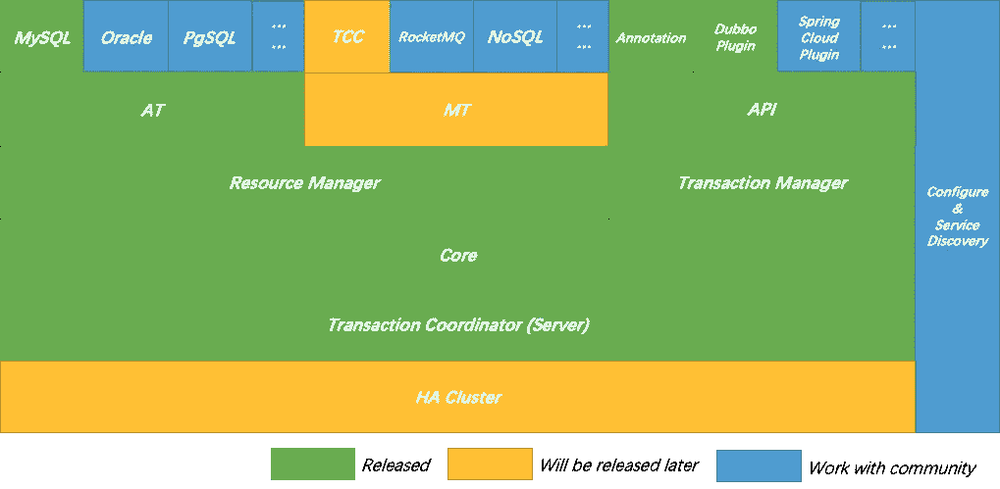

在上述蓝图中，绿色区域已经发布并开源，黄色区域将由阿里巴巴在后续版本中发布。蓝色区域是阿里巴巴和社区共同构建的生态系统部分。

对于不同数据库的支持，开发者可以参考 MySQL 的实现。

对于不同微服务框架的支持，开发者可以参考 Dubbo 的实现。

对于 MQ 和 NoSQL 的支持，开发者可以参考 TCC 的实现。

关于配置和服务注册发现，开发人员可以通过少量的工作访问任何能够提供这种服务的框架。

当然，也欢迎社区参与蓝色区域之外的部分，贡献更好的解决方案。

此外，XA 是分布式事务的标准，对于完整的分布式事务解决方案是不可或缺的。在规划的愿景中，Fescar 必须增加对 XA 的支持。

## 初步版本规划

以下是未来发布版本的计划细节。

v0.1.0:

微服务框架支持:Dubbo

数据库支持:MySQL

基于 Spring AOP 的注释

事务协调器:独立版本

v0.5.x:

微服务框架支持:Spring 云

MT 模式

支持 TCC 模式交易的调整

动态配置和服务发现

事务协调器:高可用性集群版本

v0.8.x:

韵律学

控制台:监控/部署/升级/扩展

1.0.0 版:

一般可用性:适用于生产环境

v1.5.x:

数据库支持:Oracle/PostgreSQL/OceanBase

不依赖于 Spring AOP 的注释

热点数据的优化处理机制

RocketMQ 事务消息包含在全局事务管理中

NoSQL 被纳入全球交易管理的适应机制

支持 HBase

支持 Redis

2.0.0 版:

支持 XA

在其发展过程中，Fescar 团队将大力强调社区中提出的优先事项，并将相应地传达其路线图。读者可以在 [GitHub](https://github.com/alibaba/fescar) 或通过[阿里云](https://help.aliyun.com/product/48444.html)了解更多信息。