# 最后，您正在寻找的 TypeScript + Redux/Hooks/Events 博客。

> 原文：<https://medium.com/hackernoon/finally-the-typescript-redux-hooks-events-blog-you-were-looking-for-c4663d823b01>

> 只想要密码？[https://codesandbox.io/s/jpj18xoo85](https://codesandbox.io/s/jpj18xoo85)

我们编写事件驱动的应用程序，即使我们一开始没有意识到，任何适当规模的应用程序都会倾向于由事件驱动，这是不可避免的。无论是大规模的 Redux 架构，像‘useReducer’这样的 React hooks，Angular world 中的 NgRx，web sockets，custom-rolled systems 等等等。这个清单可以一直列下去。

虽然基于事件的架构可以使您的程序以超解耦和组合的形式拥有惊人的特性，但它也有自己的隐藏成本——事件本质上是抽象的，因此当涉及到创建、消费和过滤它们的流时，我们通常无法从我们的 IDE 获得最佳水平的帮助。

# 那么，有什么问题呢？

为了在一个由事件驱动的大型代码库中高效工作，你需要“类型”信息。没有什么比使用一个字符串标识符监听一个事件更令人愤怒的了，3 个小时后才发现事件名称中有一个拼写错误，或者事件的预期有效负载与您在调试器中实际看到的不匹配！😖

我们需要开始想办法，尤其是在这些动态语言中，规划出我们的应用程序可能产生的每一个事件，以便我们
能够安全地处理它们。

这是至关重要的，您绝对需要能够验证事件是正确创建的，具有有效的标识符，并且如果它们接受一个有效的负载。

# 现有技术将事件作为单独的接口。

我尝试过许多不同的方法，也见过无数其他方法，但其中最常见的似乎是以下方法的变体:

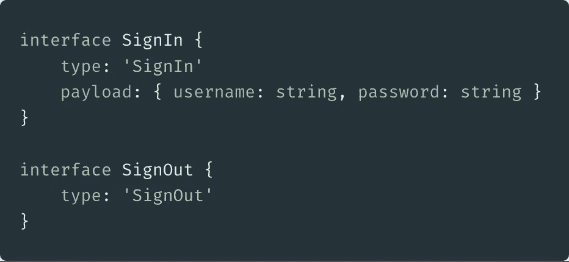

这种方法非常适合放在它自己的文件中，如果你愿意，可以放在一个很小的“events.ts”中。现在，最初我同意它看起来很优雅，但是因为类型是与使用/消费它们的代码分开编写的，所以它需要一个人来保持它是最新的，并确保不存在打字错误。

此外，在处理事件流时，您将如何使用它们？例如，如果您有一个 switch 语句，您如何知道在每个“case”语句中您正在处理哪个有效负载呢？对于像这样的单个接口，唯一的选择是导出一个单独的类型，它是所有可能的事件形状的联合。


Such niceness… so tempting…

但是现在你已经创建了另一个需要维护的东西！GRRR！当有 20 个事件，而你正在向下滚动文件以将下一个事件添加到这个列表中时，你可能正准备将你的监视器扔到窗外。📺

还有太多的重复——“登录”和“注销”在接口命名方案中以某种方式重复，必需的“类型”字段似乎过多——一定有更好的方法？

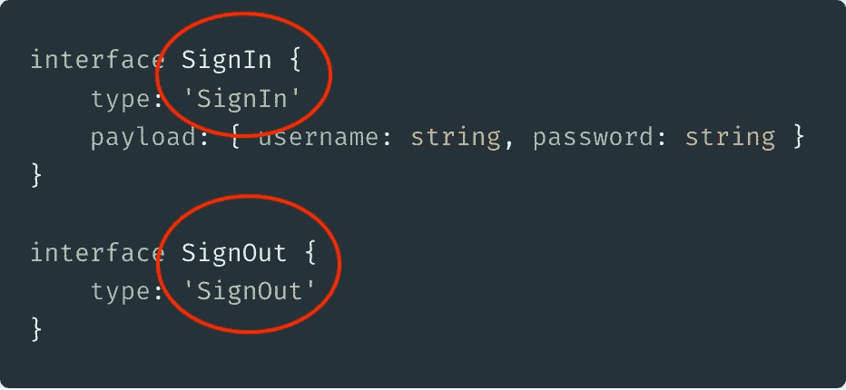

Such cry :(

但是更糟糕的是，因为这些是*只是*‘类型’，我们需要或者为每一个创建函数来创建类型安全的方式来引发这些事件，或者在发出事件时注释对象。下面显示的是前者，为了我自己的理智，我省略了后者。

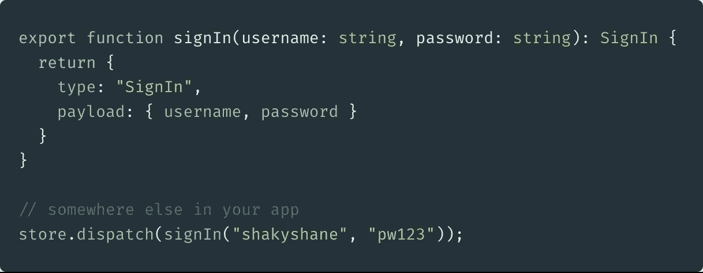

这个例子在类型安全的意义上是好的。你可以保证函数的参数，因为函数有一个返回类型的注释，所以类型检查器将确保这里的“有效负载”不仅有正确的成员，而且参数在上下文中使用是有效的(例如:应该是字符串的字符串)

但这远远不够好，我们现在还复制了参数名！

我们必须消除一些噪音。类型安全很好，但是这是以牺牲开发人员的理智为代价的！我也相信像这样的例子是某些经验丰富的 JS 开发者如此直言不讳地反对类型的主要原因——谁能责怪他们呢？

# 向前一步，从返回类型推断接口。

看了上面的代码后，你会正确地认为你根本不需要这个接口…


2.5 billions times better. But still not good

由于在 2.8 中向 TypeScript 添加了条件类型，我们现在有了像`ReturnType<T>`这样有用的助手，它完全按照 tin 上所说的那样做——如果可以的话，它推断函数的返回类型。

如果你对类型系统感兴趣(你不感兴趣？你是怎么走到这一步的？)那么值得快速看一下`ReturnType<T>`

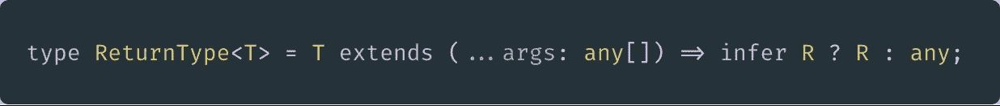

它只是一个三元运算符，但是对于类型来说，它是多么的简洁！稍加练习，你就能很好地可视化“解析”这种类型的代码:)

因此，这种*比用一个单独的接口+一个函数来创建事件要好。现在，类型是由实现驱动的，而不是相反——这意味着您可以更改函数参数&返回有效负载，并且您使用该类型的任何地方都将获得新的类型检查信息。*

但是，一个主要的缺点是，您仍然需要维护它们的列表，并将它们联合在一起，以获得类型安全事件的完整功能集。

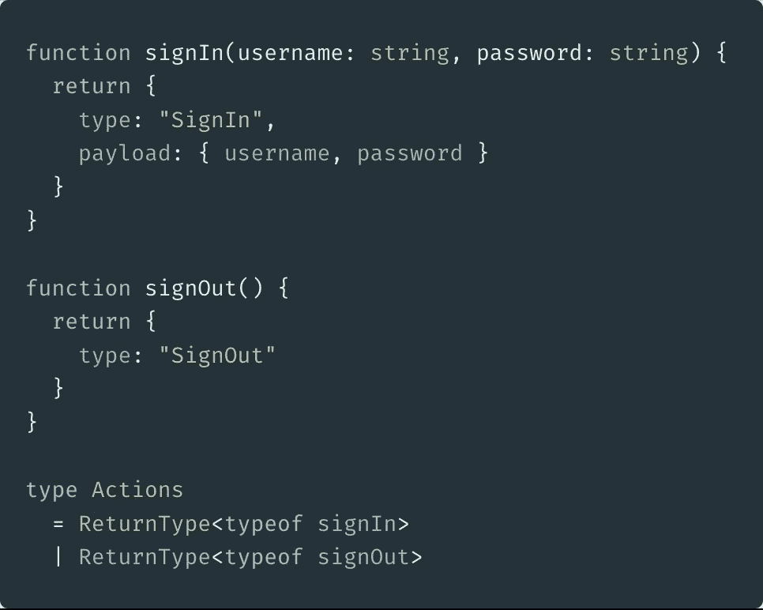

Getting better, but you still need to union the inferred types together.

眼尖的人可能会注意到，我刚刚在这些屏幕截图中使用了字符串文字，类型缩小可能实际上无法正确工作——这是为了简单起见，以防止在这些示例中引入枚举/常量，我实际上鼓励您不要使用它们。😂

# 走上正轨，让 Typescript 事半功倍。

因此，我在不同大小的应用程序中试验了前一个例子的许多变体，总体来说还不错。然而，让我要求更多的是我在 Rust & Elm 等其他语言中所做的工作。

有一天，我突然想到，在 Typescript 中键入事件的更好方法的答案在于它对 ADT(代数数据类型)建模的能力。

让我们看看如何为 Elm &中的`SignIn` + `SignOut`事件提供类型信息，以及如何创建它们的联合。

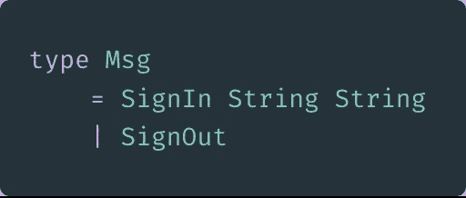

Erm, is that it?

说真的，这有多酷？它只是单个标识符`SignIn` & `SignOut`(它们是 Elm 中的类型构造函数)和一些相关数据——在`SignIn`的例子中，它是两个字符串来表示用户名和密码(还有其他更具描述性的方法，但这不是 Elm 教程😝).

在 Rust 中，这是一个类似的故事，有更多一点的语法干扰，但最终是一样的。

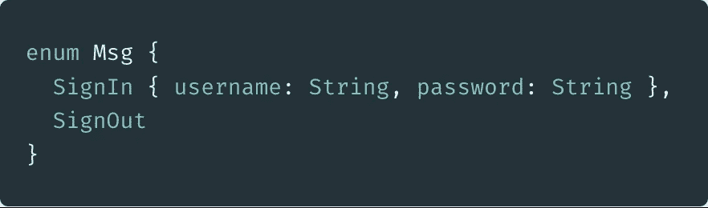

Rust enums are the biz

是完美。它只是标识符和可选的关联数据。不多不少。我需要把这个打印出来。

# 接受挑战

目标很明确，一种建模事件标识符+可选有效负载的方法，占用空间尽可能小。这应该像打代码高尔夫，但目标是更好的类型安全和开发人员生产率。

看看 rust 实现(因为它有花括号，所以这是一个更公平的比较🤣)我想知道我能离它多近。

最初的一些尝试包括使用一个实际的 JS 对象，并将“事件创建者”函数作为每个标识符的值。

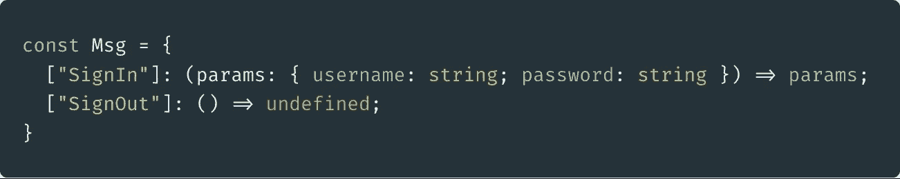

decided it was an anti-pattern after all

很长一段时间，我都坚信这是一个伟大的方法。这个想法是，定义这个对象，然后用它调用另一个函数来增加返回值，以确保它们完成了`type` + `payload`约定(因此它们返回了`{type: …, payload:…}`)

我付出了相当大的努力，使这种方法在所有方面都有安全保证，但当我审查我工作过的一些充满事件的大型代码库时，我有了另一种认识——我使用的 90%以上的函数只是在参数上转发到有效载荷——它们没有其他用途。事实上，在我发现自己在这些函数中“工作”的少数情况下，它可以很容易地被提取出来。

## 转向仅使用类型的方法

由于 Typescript 支持对象文字类型，我们可以用下面的代码更接近 Rust & Elm 的美丽世界:

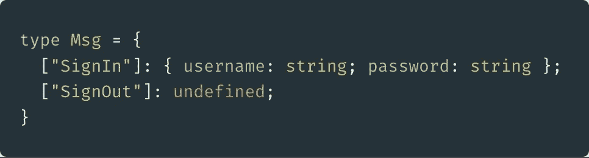

Pretty damn close to the Rust equivalent

如果你眯着眼睛看，你会发现我们已经把所有东西都简化到了最基本的部分——标识符和相关数据。现在，我花了令人尴尬的很长时间才找到这个解决方案，主要是因为我完全被事件需要一个“创造”功能的想法所阻碍。

尽管这还没有任何作用，但我知道这是一个惊人的想法。

## 使其可用

当然，现在这只是一个类型定义，它还没有准备好部署在一个巨大的 Redux 应用程序中，不是吗？

但是等一下，有了一些漂亮的 Typescript 特性和一个 JS 函数，您将见证在 Typescript 中处理事件的圣杯。

## #1 切换到标识符的枚举

这是显而易见的，只是为了减少概念而从前面的例子中省略了——但是因为我们想要一个**单一的**方式来创建和消费事件，我们将想要为一个枚举切换出字符串键——这也是命名空间事件的一个很好的方式。

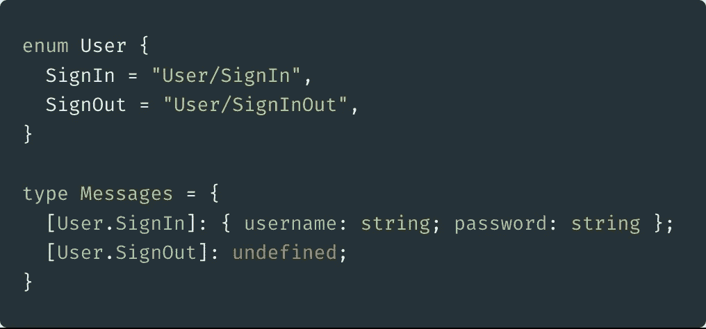

Starting to look like something useable

在这里使用字符串枚举是我们的“标识符”问题的完美解决方案，因为我们可以使用枚举成员作为判别式(公共属性)，而且如果我们愿意的话，它还为我们提供了在字符串值(或后缀/前缀等)中实现伪名称空间的灵活性。

这种方法还有一个奇怪的好的连锁效应，它将确保字符串值不会冲突(这在枚举中可能发生)，尽管只有当“rhs”上的类型不同时才发生冲突，所以不能完全依赖它😀

不过，这里的要点是，在整个应用程序中，我们只使用 enum 来引用这个事件——看不到额外的函数或单独的接口。

## #2 创建类型安全事件的方法

因此，我们已经确定了标识符和相关的数据部分，现在我们只需要一个包装函数，这样我们就可以应用一些 Typescript 魔法了。我们将创建一个函数，将枚举成员作为第一个参数，将相关数据作为第二个参数。非常简单。

让我们回头看一个 Rust 的例子。这个代码片段将创建带有所需数据的`SignIn`变体(为了简洁，我在这里跳过了一些 rust 细节),请注意它的创建与它的定义几乎是一样的。


this.is.the.goal

我们能用打字稿来做吗？带全类型安全？这是我想出来的…😂

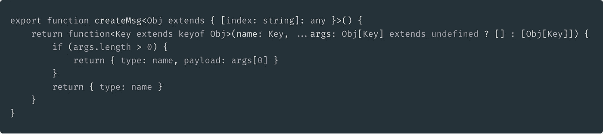

Hidden away in your types folder

嗯，现在你在想，漂亮或简单的部分在哪里呢…嗯，这实际上只是为了创建这个 elm/rust 克隆而采用了一些较新的 Typescript 功能。这段代码只需编写一次，然后隐藏在一个您永远不会接触到的文件中，目的是实现以下功能:

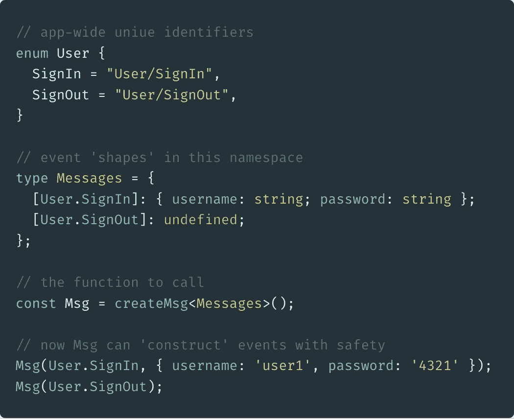

elm/rust/ts 💜

最后两行展示了如何在这个系统中创建事件，美妙之处在于您不需要为每个事件设计函数名，而只需使用标识符及其数据。

`Msg`这里将只接受来自用户名称空间的事件(作为第一个参数给出，类似于类型构造函数),第二个参数将是基于类型对象中的枚举成员值的类型安全的。

## #3 有区别的联合/代数数据类型的好处

如果不能根据公共属性缩小传入事件的类型，所有这些类型的东西都是毫无用处的。在我们的例子中，我们使用枚举成员作为“类型”属性，所以这应该足够简单——我们希望在像这样的`case`块中实现完全的类型安全:

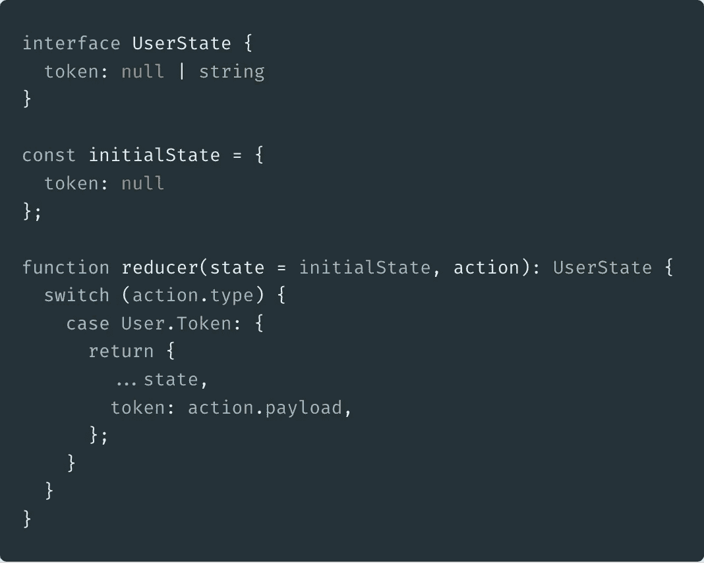

在这个例子中，我们需要知道当一个`User.Token`事件被引发时，它的有效载荷是一个字符串。同样，我们需要知道什么时候缺少有效载荷，或者复杂类型等等。

这就是 Typescript 的歧视性联合发挥作用的地方——因为我们在事件创建时已经有了类型安全，如果我们能让类型保护像这样工作，我们将会有所成就。

在上面的截图中，我们没有得到任何类型的帮助。如果您还记得我们事件的类型定义，我们没有包括`type`或`payload`属性——而且这个 reducer 函数也没有动作的类型注释——我们现在将修复它。


total type nerdery

对于那些不熟悉的人来说，上面的内容很难读懂，只是被称为映射类型——这是一种基于原始类型的转换来创建新类型的方法。在我们的例子中，我们有`{identifier: value}`，所以这个映射类型除了为每个键创建新的类型之外什么也不做

```
// before
{identifier: value}// after 
{identifier: {type: identifier, payload: value }
```

我们为什么要这样做？因为它允许我们创建所有可能的 enum + value 组合的联合类型，这样当给 switch 语句这样的语句时，就会发生预期的类型收缩。

您可以添加下面的单行代码，这里的`Messages`只是具有 enum +关联值的对象类型。

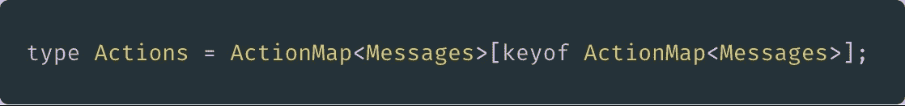

Type magic — indexing in a object literal type with a union of it’s own keys

方括号给出了答案，你是在索引一个类型，但是因为`keyof`产生了所有键的并集，所以你得到了一个并集。实际上，您是在用一个对象文字类型自己的键的联合来索引它。我知道，这有点疯狂，但是很棒。

结果是上面的`Actions`现在有了完全正确的类型，可以实现超级强大的类型缩小——如果您在我们的编辑器中将鼠标悬停在它上面，该类型将如下所示:

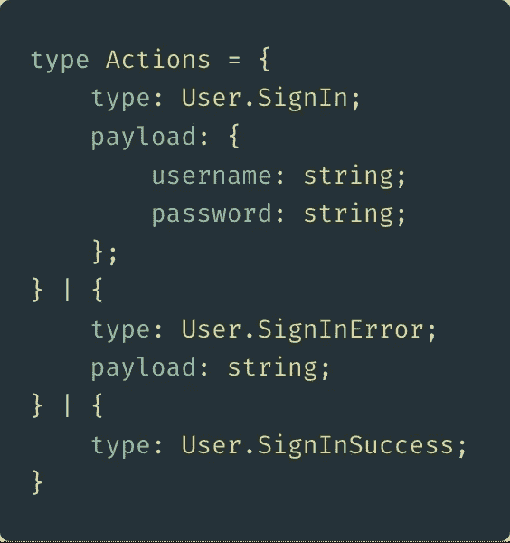

差不多就是这样——如果您能生成这种类型，您将在整个应用程序中获得令人敬畏的类型安全性。

# 结论

这具有难以置信的类型安全性，一个很好的 api，将语言与类型构造函数相匹配，没有重复，使用单一标识符进行事件定义/创建/消费，基本上可以更好地满足所有基于事件的需求。

如果有兴趣深入研究更高级的类型脚本，请提出要求，我可能会为像我这样的类型书呆子写一篇文章:)

看看这里的例子[https://codesandbox.io/embed/jpj18xoo85](https://codesandbox.io/embed/jpj18xoo85)——这应该会让事情变得更清楚些:)

— -

像这样？如果你做了，并且你发现自己在做任何前端工作，也许你会喜欢我在 https://egghead.io/instructors/shane-osbourn 上的一些课——很多都是免费的，我涵盖了普通 JS、Typescript、RxJS 等等。