# FindCollabs:共享您的项目并寻找合作者

> 原文：<https://medium.com/hackernoon/findcollabs-share-your-open-source-projects-and-find-collaborators-d0a2bb0fc931>

每个有创造力的人都有一个项目——或者至少是一个项目想法。

FindCollabs 是一个分享你的项目的地方，无论这些项目是新的还是旧的。你的[项目](https://hackernoon.com/tagged/project)甚至还不需要相关的代码——它可能只是一个想法，就像天气预报系统一样。

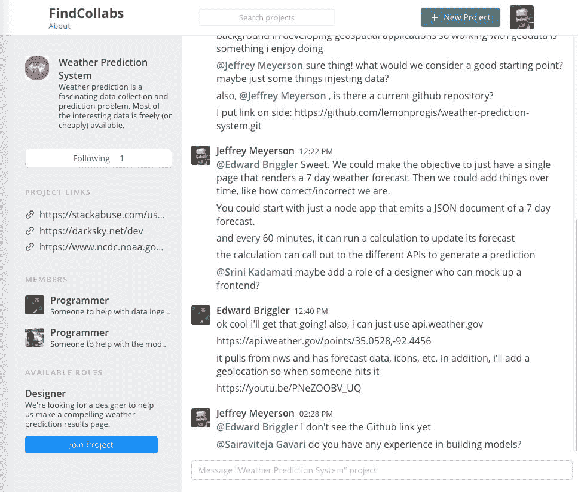

你的项目可以是任何有创意的东西——一个游戏，一部动画，或者一首歌。

我正在做的一个项目是 [FindCollabs 主题曲](https://findcollabs.com/project/bTbebHdRQjWaeYHh931n)。两个合作者参与了这个项目，Adam 和 AJ。我已经[给了亚当一个评价](https://findcollabs.com/profile/3FDftAsLZXarys00RHO01X4cU4N2)(他做得很好)。AJ 的审查正在进行中。

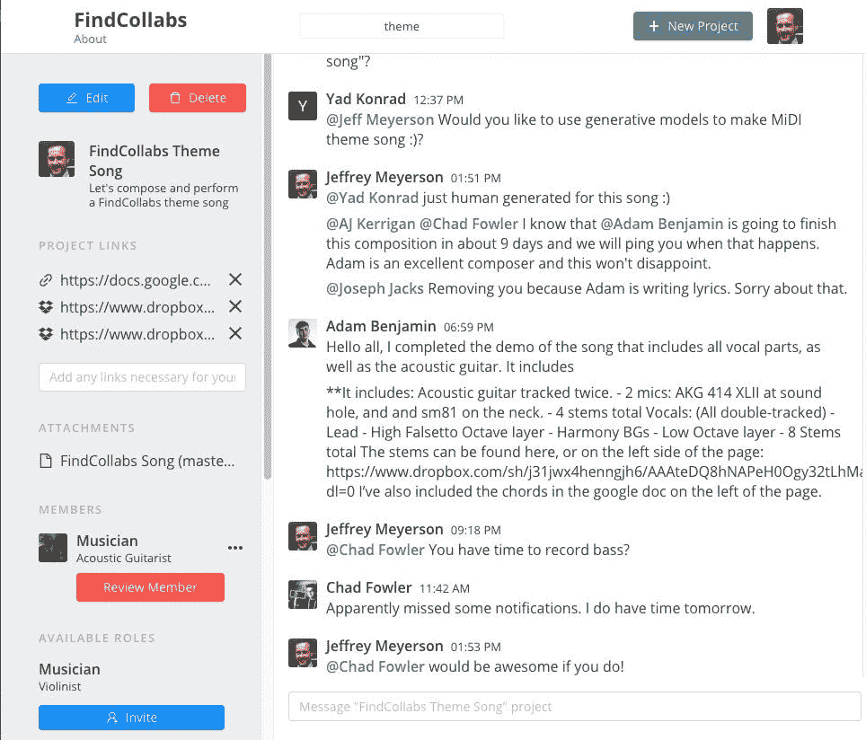

提交项目的工作流程很简单。作为一个例子，我将介绍一个我想与 FindCollabs 社区分享的项目。

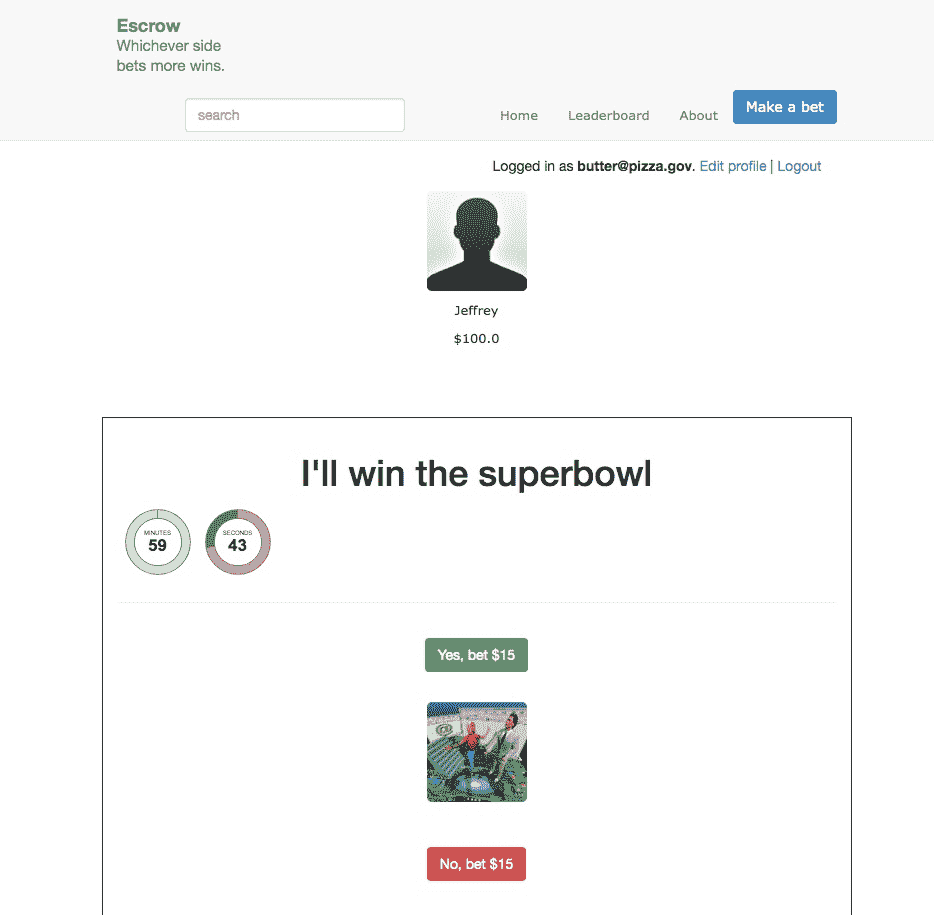

这是托管，我发明的社交博彩游戏。这不是世界上最漂亮的游戏，但它有一些很酷的想法。也许其他人会想为它做出贡献。

让我们把它添加到 FindCollabs！

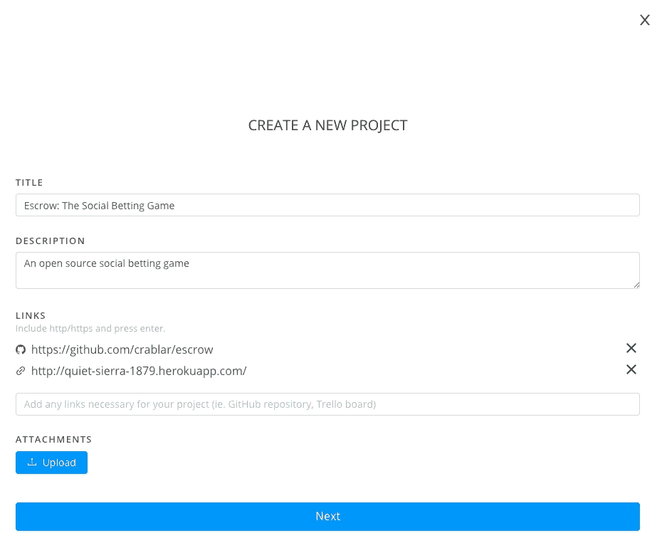

我添加了我的 GitHub 知识库的链接和一个应用的实时版本，这样人们就可以测试它了。现在，我将创建一些角色，以便人们知道他们如何为游戏做出贡献。

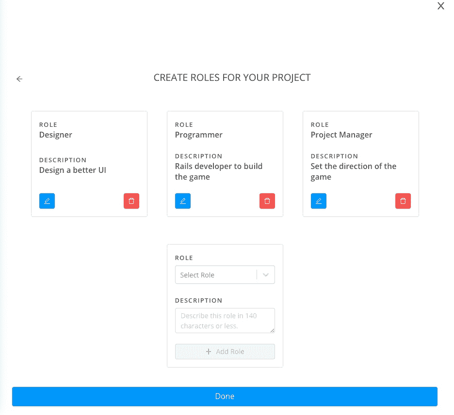

就是这样！现在我的项目是在 FindCollabs 上创建的。来 FindCollabs 的人会在 feed 里看到。

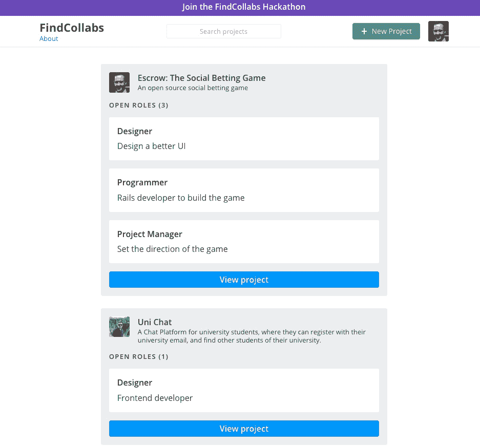

当你点击一个项目时，你会被带到一个允许你与项目聊天和互动的界面。我已经从文斯那里得到了一些反馈。

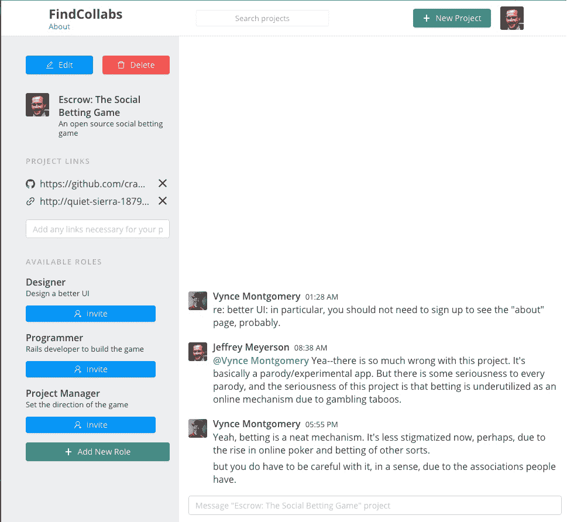

FindCollabs 是一个分享项目和寻找合作者的地方。

这些项目可以是任何创意。当人们在网上合作时，很酷的东西就产生了。

FindCollabs 上的一个项目是[SoftwareDaily.com](http://softwaredaily.com)，这个网站是为[SoftwareEngineeringDaily.com](http://softwareengineeringdaily.com)设计的更好、更灵活的皮肤。我们有一个受欢迎的播客，但是内容很难索引、搜索和发现。我们已经超越了 WordPress 和播客播放器。

几年来，社区一直在构建软件日常平台，FindCollabs 为我们提供了一个工作平台。

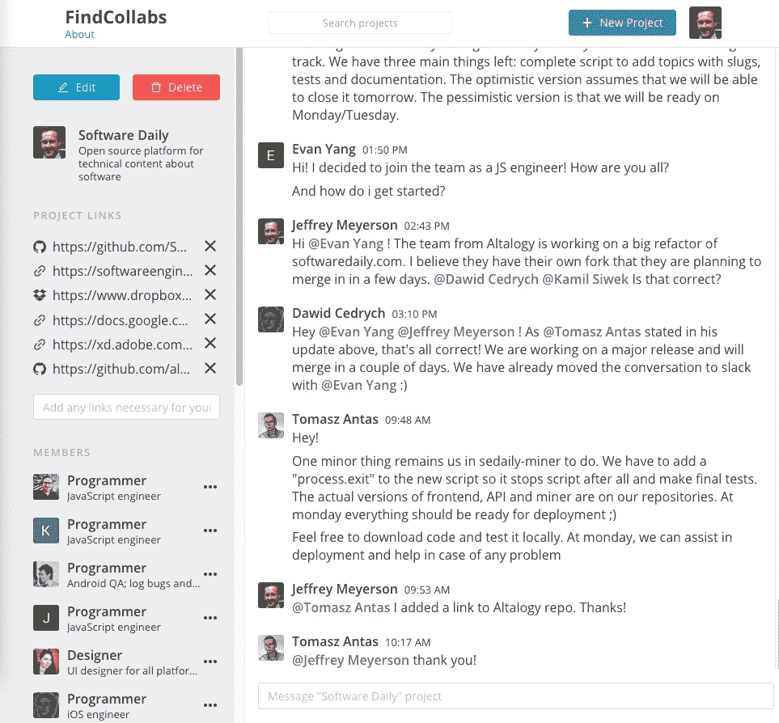

在 FindCollabs 上，你可以发布新项目和旧项目。你可以张贴一个粗略的想法或详细的产品规格。

当你分享你的项目时，其他人可以感觉到你是谁，你喜欢怎样工作。这是我的简介。

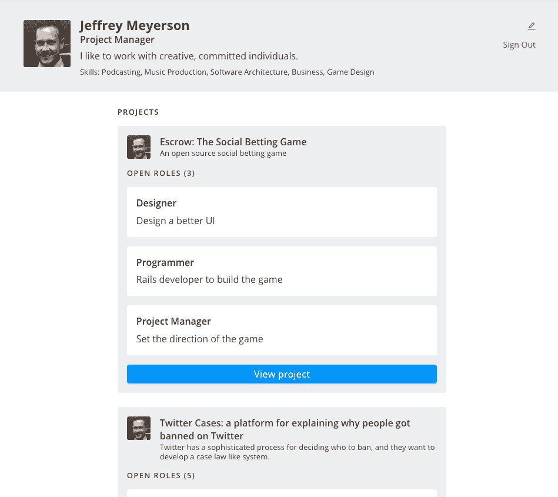

[FindCollabs 正在举办一场在线黑客马拉松，奖金为 5000 美元。](http://findcollabs.com/hackathon)如果你正在做一些很酷的项目，把它们放在 FindCollabs 上，就有机会赢得比赛。

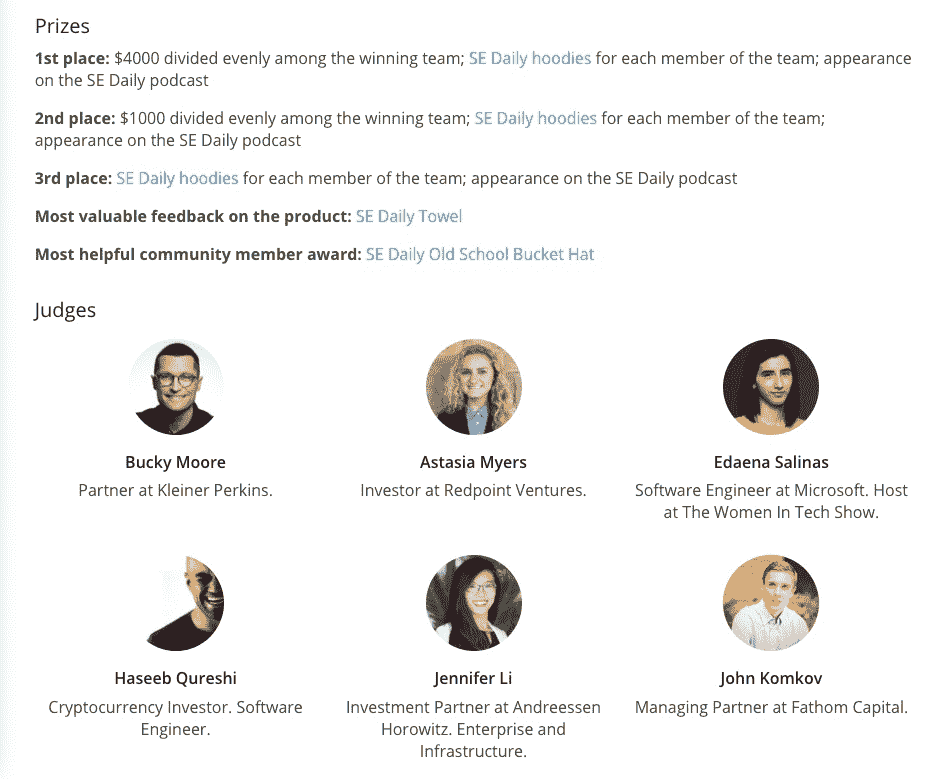

评委是投资者、艺术家和工程师。他们理解创作过程。黑客马拉松的参赛资格将根据愿景、执行力、[、创造力和团队合作来评判。](https://hackernoon.com/tagged/creativity)

如果您没有要发布的项目，您可以加入现有项目。

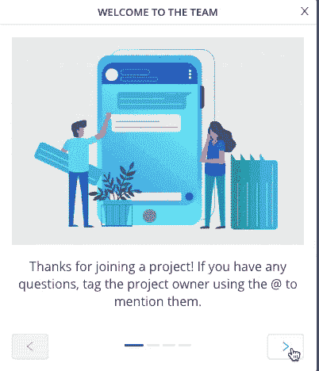

我们期待在 FindCollabs 上看到你！

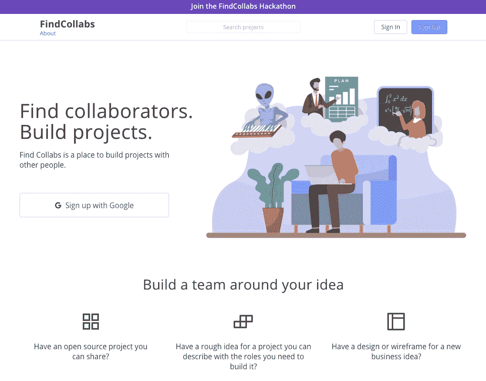