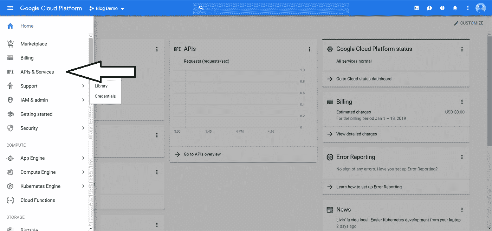
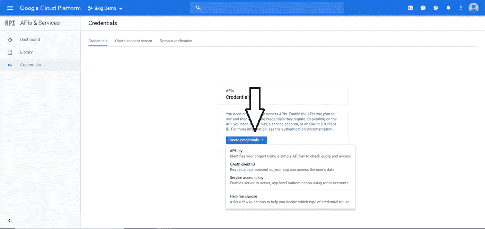

# 通过在 Android 中集成谷歌地图 SDK 来查找区域

> 原文：<https://medium.com/hackernoon/finding-area-by-integrating-google-maps-sdk-in-android-db5ead49458c>

> 本文原帖[此处](https://ayusch.com/integrating-google-maps-in-android/)

在本教程中，我们将看到如何通过在 Android 应用程序中集成谷歌地图来计算一个地区的面积。

**在谷歌地图上计算一个地区的面积**对于像测量员、建筑师、99 acres 等网站这样的人和组织来说可能是一个非常现实的需求。用任何测量仪器来计算诸如地理位置、纪念碑、平房等非常大的区域的面积实际上是不可能的。

虽然有很多方法可以做到这一点，但它们可能很麻烦，如果有人只需要对该区域进行粗略的估计，这种麻烦是不值得的。

在这种情况下，**这个应用可以证明是非常有用的**。它使用谷歌地图来加载位置，然后通过一些定制，用户能够标记他们想要估计面积的区域的边界，应用程序将根据地球上的坐标标准化这些点，并计算出该区域的近似面积。

我们将在这个 android 应用中使用 [MVP 架构](https://ayusch.com/mvp-architecture-android/)。如果你不熟悉 Android 的 MVP 架构，我强烈推荐 [**查看这个资源**](https://ayusch.com/mvp-architecture-android/) **。**

这个 **Android 应用**的整个开发过程将分为 4 个主要步骤:

*   在 Google 云平台上创建一个项目&启用地图 API。
*   获取 API 密钥
*   将地图 SDK 集成到新的 Android 应用程序中
*   添加用于计算区域面积的自定义设置

**那么，我们开始吧！！**

# 在谷歌云平台上创建项目

为了使用谷歌的任何 API，你需要在谷歌云平台上创建一个项目。它有图像识别的视觉 API、Youtube 数据 API、**谷歌地图 API** 等等 API。

在本教程中，我们将使用谷歌地图 API。所以，为了创建一个新项目，去 https://cloud.google.com/[T21](https://cloud.google.com/)

*   登录您的 google 帐户。
*   转到“控制台”
*   在左上角的汉堡包图标附近，点击下拉箭头。


*   然后点击“新建项目”。给它起个名字，然后点击“创建”。
*   然后从同一个下拉箭头中，单击新创建的项目来选择它。
*   现在我们需要启用 maps API。为此，点击左上角的汉堡图标，然后**进入 API&服务**。
*   点击**启用 API 和服务**。



*   选择 Android 版地图软件开发套件，然后点击启用。
*   您的地图 API 已经可以在您的 android 应用程序中使用了！！

# 获取 API 密钥

Google 需要验证请求来自一个经过验证的来源，为此，它向授权用户提供一个 API 密钥来验证请求。我们需要将这个 API 密钥添加到我们的 **Android 应用程序**中。

因此，让我们继续为我们的应用程序创建一个 API 密钥。

*   在谷歌云平台，进入控制台，然后选择你的项目，点击 APIs & Services。
*   在左侧，点击“**凭证**
*   然后点击屏幕中间的“创建凭证”按钮。您将有 4 个选项:
*   API 密钥
*   OAuth 客户端 ID
*   服务帐户密钥
*   帮我选择



*   点击 API 键。
*   现在，谷歌将为您创建一个 API 密钥，您将在弹出窗口中看到。复制 API 密钥。当我们开始将地图 SDK 添加到我们的应用程序时，我们会将它添加到我们的 android 应用程序中。

> **注意:为了本教程的简单性，我没有对 API 密钥添加任何限制，但是当将应用程序发布到生产环境中时，强烈建议将 API 密钥限制到您的特定用途，如 Android 应用程序、iOS 应用程序或 web 应用程序。**

# 将 SDK 集成到新的 Android 应用中

现在我们将开始在 Android Studio 中编写我们的应用程序。

# 创建新的 Android 应用程序项目

*   像往常一样，首先在 Android Studio 中创建一个新的 Android 应用程序。
*   打开应用程序级别的 build.gradle 文件，并添加以下依赖项

```
implementation 'com.google.android.gms:play-services-maps:16.0.0'
```

*   现在点击同步项目，等待 Android Studio 下载依赖项并完成构建。
*   一旦 Android Studio 完成构建，我们就可以将 API 密钥添加到我们的应用程序中了。
*   打开 AndroidManifest.xml 并在<application>标签中添加以下标签。**记住，这些元标签应该放在任何<活动>标签之外。**</application>

```
<meta-data
    android:name="com.google.android.gms.version"
    android:value="@integer/google_play_services_version" />
<meta-data
    android:name="com.google.android.geo.API_KEY"
    android:value="YOUR API KEY GOES HERE" />
```

*   我们已经在应用程序中添加了 API 密钥。

设置工作已经基本完成，现在我们可以专注于创建实际的应用程序了。首先，我们需要将 **Google Maps SDK** 提供的地图片段添加到我们的主活动布局文件中。因此，转到您的布局文件，在我的例子中是 activity_main.xml，并将以下内容添加到您的代码中:

```
<?xml version="1.0" encoding="utf-8"?>
<FrameLayout xmlns:android="http://schemas.android.com/apk/res/android"
    xmlns:app="http://schemas.android.com/apk/res-auto"
    xmlns:tools="http://schemas.android.com/tools"
    android:layout_width="match_parent"
    android:layout_height="match_parent"
    tools:context=".activities.MainActivity">
 <LinearLayout
        android:layout_width="match_parent"
        android:layout_height="match_parent"
        android:orientation="vertical"> <TextView
            android:layout_width="match_parent"
            android:layout_height="wrap_content"
            android:background="@android:color/white"
            android:padding="4dp"
            android:text="Area:"
            android:textSize="16sp" /> <TextView
            android:id="@+id/tv_area"
            android:layout_width="match_parent"
            android:layout_height="wrap_content"
            android:background="@android:color/white"
            android:padding="4dp"
            android:text="18 m^2"
            android:textSize="16sp" /> <fragment xmlns:android="http://schemas.android.com/apk/res/android"
            xmlns:tools="http://schemas.android.com/tools"
            android:id="@+id/map"
            android:name="com.google.android.gms.maps.SupportMapFragment"
            android:layout_width="match_parent"
            android:layout_height="match_parent"
            tools:context=".MapsActivity" />
    </LinearLayout> <android.support.design.widget.FloatingActionButton
        android:layout_width="wrap_content"
        android:id="@+id/fab_undo"
        android:layout_height="wrap_content"
        android:layout_gravity="bottom|end"
        android:layout_margin="16dp"
        app:backgroundTint="@android:color/white"
        app:elevation="2dp"
        app:fabSize="normal"
        app:rippleColor="@android:color/darker_gray"
        app:srcCompat="@drawable/ic_undo_black_24dp" /></FrameLayout>
```

这将把一个**地图片段**添加到您的布局中。在地图片段的顶部，我们还添加了一个浮动的动作按钮来撤销我们最后标记的点。随着我们继续学习教程，这个按钮的用法将会很清楚。

# 设置 MVP 架构

虽然你可以在一个单独的活动中编写所有的代码，但是随着你的应用程序变得越来越大，管理它是不可能的，你最终会放弃这个应用程序(就像我几年前做的那样:P)。

所以，我建议你[通读本教程，理解 MVP 架构](https://ayusch.com/mvp-architecture-android/)，一旦你理解了演示者、视图和模型是如何工作的，你就可以继续了。

下面是**视图和演示者**界面的代码:

```
public interface MapsContract {
    interface View extends BaseView<Presenter> { void loadMap(); void showLocationPermissionNeeded(); void addMarkerToMap(MarkerOptions options, LatLng latLng);
    } interface Presenter extends BasePresenter{ void locationPermissionGranted();
        void locationPermissionRefused(); void requestGps(); void addMarker(LatLng latLng);
    }}
```

下面是 **BasePresenter 和 Base View** :

```
public interface BasePresenter {
    void start();
}public interface BaseView <T>{
    void setPresenter(T presenter);
    Activity getViewActivity();
}
```

**** *注意:这些放在单独的文件中*****

现在实现 MapsContract。查看您的 MainActivity.java 并覆盖它的方法。

另外，创建一个 MapsPresenter.java 并实现 MapsContract。演示者并重写其方法。

这是我们的 **MainActivity 和 maps present**目前的样子:

```
public class MainActivity extends AppCompatActivity implements MapsContract.View, OnMapReadyCallback { MapsContract.Presenter mPresenter;
    private TextView areaTextView; @Override
    protected void onCreate(Bundle savedInstanceState) {
        super.onCreate(savedInstanceState);
        setContentView(R.layout.activity_main);
        mPresenter = new MapsPresenter(this);
        areaTextView = findViewById(R.id.tv_area);
    } @Override
    public void setPresenter(MapsContract.Presenter presenter) {
        mPresenter = presenter;
        mPresenter.start();
    } @Override
    public Activity getViewActivity() {
        return this;
    } @Override
    public void loadMap() { } @Override
    public void showLocationPermissionNeeded() {
    } @Override
    public void addMarkerToMap(MarkerOptions options, LatLng latLng) { }}public class MapsPresenter implements MapsContract.Presenter, GoogleApiClient.ConnectionCallbacks, GoogleApiClient.OnConnectionFailedListener {
    MapsContract.View mView; MapsPresenter(MapsContract.View view) {
        mView = view;
        view.setPresenter(this);
    } @Override
    public void start() {

    } @Override
    public void locationPermissionGranted() {

    } @Override
    public void locationPermissionRefused() {
    } @Override
    public void requestGps() {

    } @Override
    public void addMarker(LatLng latLng) { }}
```

# 设置地图

现在我们需要在 MainActivity.java 找到碎片并加载地图。要做到这一点，前往 MainActivity.java，找到地图碎片的 id 如下:

```
@Override
public void loadMap() {
    SupportMapFragment fragment = (SupportMapFragment) getSupportFragmentManager().findFragmentById(R.id.map);
    fragment.getMapAsync(this);
}
```

我们也异步加载地图。

要实现回调，请在“this”下的红色曲线行上按 alt+enter，然后选择“实现方法”。

现在，尝试在您的设备/模拟器上运行该应用程序。你会发现我们的地图还没起作用！！

# 许可

您会注意到片段已经成功添加，您会看到 google 徽标，但您还看不到地图。这是因为我们没有要求用户允许他们的位置。

从 Android M 开始，在运行时向用户询问许可是强制性的，而不是在下载应用程序时只询问一次。

因此，我们现在将添加一些运行时权限。

首先，我们将在 AndroidManifest.xml 中为 Android M 以下的用户添加权限。

```
<uses-permission android:name="android.permission.ACCESS_FINE_LOCATION" />
```

现在，在我们的演示者中，我们将检查权限是否已经被授予:

```
@Override
public void start() {
    checkPermission();
}private void checkPermission() {
    if (Build.VERSION.SDK_INT >= Build.VERSION_CODES.M) { if (mView.getViewActivity().checkSelfPermission(android.Manifest.permission.ACCESS_FINE_LOCATION) != PackageManager.PERMISSION_GRANTED) {
            if (mView.getViewActivity().shouldShowRequestPermissionRationale(android.Manifest.permission.ACCESS_FINE_LOCATION)) {
                Toast.makeText(mView.getViewActivity(), "Please grant location permission", Toast.LENGTH_SHORT).show();
                mView.getViewActivity().requestPermissions(new String[]{android.Manifest.permission.ACCESS_FINE_LOCATION}, Config.PERMISSION_LOCATION);
            } else {
                mView.getViewActivity().requestPermissions(new String[]{android.Manifest.permission.ACCESS_FINE_LOCATION}, Config.PERMISSION_LOCATION);
            }
        } else {
            mView.loadMap();
        } } else {
        mView.loadMap();
    }
}
```

如果没有，那么我们将检查我们之前是否已经请求了该权限，为此我们使用**shouldshowrequestpermissionrational()**方法。

如果我们之前没有请求这个权限，那么我们可以直接转到 **requestPermissions()** 方法。

> ** *注意:由于只有 Android M 以上才需要这个，我们放置了一个包装器来检查版本是否在 M 以上，如果不是，那么我们直接加载地图***

如果用户先前选择了“不再询问”选项，我们将不能再请求许可，这个方法将返回 false，否则，我们将显示一个解释并再次请求许可。

我们请求权限的结果在**onRequestPermissionResult**方法中获得，我们将在活动中覆盖该方法。

```
@Override
public void onRequestPermissionsResult(int requestCode, @NonNull String[] permissions, @NonNull int[] grantResults) {
    switch (requestCode) {
        case Config.PERMISSION_LOCATION: {
            if (grantResults.length > 0
                    && grantResults[0] == PackageManager.PERMISSION_GRANTED) {
                mPresenter.locationPermissionGranted();
            } else {
                mPresenter.locationPermissionRefused();
            }
            return;
        }
    }
}
```

如果用户已经授予了权限，我们就可以开始了，否则，我们需要禁用这个特性。

# 请求在 Android 应用程序中启用 GPS

撇开运行时权限不谈，我们现在需要用户启用他们的 GPS，这样我们就可以访问他们的当前位置并相应地放大地图。

为此，我们需要在应用程序级 build.gradle 文件中添加另一个依赖项:

```
implementation 'com.google.android.gms:play-services-location:16.0.0'
```

现在将项目与 gradle 文件同步，等待 gradle 构建完成。一旦完成，我们将开始向用户请求 GPS。将以下代码添加到演示者:

```
@Override
public void requestGps() {
    GoogleApiClient mGoogleApiClient = new GoogleApiClient.Builder(mView.getViewActivity())
            .addApi(LocationServices.API)
            .addConnectionCallbacks(this)
            .addOnConnectionFailedListener(this).build();
    mGoogleApiClient.connect(); LocationRequest locationRequest = LocationRequest.create()
            .setPriority(LocationRequest.PRIORITY_HIGH_ACCURACY)
            .setNumUpdates(5)
            .setInterval(100); LocationSettingsRequest.Builder builder = new LocationSettingsRequest.Builder()
            .addLocationRequest(locationRequest).setAlwaysShow(true);
    PendingResult<LocationSettingsResult> result =
            LocationServices.SettingsApi.checkLocationSettings(mGoogleApiClient, builder.build());
    result.setResultCallback(new ResultCallback<LocationSettingsResult>() {
        @Override
        public void onResult(@NonNull LocationSettingsResult locationSettingsResult) {
            final Status status = locationSettingsResult.getStatus();
            switch (status.getStatusCode()) {
                case LocationSettingsStatusCodes.SUCCESS: break;
                case LocationSettingsStatusCodes.RESOLUTION_REQUIRED:
                    try {
                        // Show the dialog by calling startResolutionForResult(),
                        // and check the result in onActivityResult().
                        status.startResolutionForResult(mView.getViewActivity(),
                                Config.CHECK_GPS_ON_SETTING);
                    } catch (IntentSender.SendIntentException e) {
                        e.printStackTrace();
                    }
                    break;
                case LocationSettingsStatusCodes.SETTINGS_CHANGE_UNAVAILABLE:
                    break;
            }
        }
    });
}
```

**我来解释一下这是怎么回事！！**

**GoogleApiClient** 用于访问 google play 服务，如 **Google Sign-In** 、 **Google Drive** 等。在这种情况下，我们将访问 google play 服务下提供的定位服务。

事情是这样的:

*   首先，创建一个**客户端**来建立与定位服务的连接。
*   其次，我们配置**位置服务**的更新频率和服务质量。
*   第三，我们检查我们是否能够从播放服务接收位置更新。如果没有，那么 GPS 就没有启用，我们就相应地计划下一步行动。
*   通常，如果用户的 **GPS 未启用**，我们会带他们去设置活动，并要求他们启用位置。如果用户启用了位置，我们返回到 onActivityResult 方法，并获得**成功**，否则我们需要继续，而不进行位置更新。

**因此，为了检查用户是否最终启用了该位置，请前往 MainActivity.java 并添加以下代码:**

```
@Override
protected void onActivityResult(int requestCode, int resultCode, @Nullable Intent data) {
    switch (requestCode) {
        case Config.CHECK_GPS_ON_SETTING: {
            switch (resultCode) {
                case RESULT_OK: case RESULT_CANCELED: break;
                default:
                    break;
            }
            break;
        }
    }
}
```

如果权限被授予，我们调用 mpresenter . locationpermissiongranted()，否则调用 mpresenter . locationpermissiondenied()。

# 添加用于计算区域面积的自定义设置

不，这是最简单的部分。一旦我们有了**许可**、 **GPS 设置**和我们的**地图加载**，我们现在可以继续更多令人兴奋的功能，例如当用户在屏幕上放置标记时绘制一个多边形并计算面积。

# 添加/移除标记

现在，当用户触摸地图上的任何位置时，我们将开始在屏幕上添加标记。要做到这一点，请使用 onMapReady 回调并将 onMapClickListener 添加到地图中:

```
@SuppressLint("MissingPermission")
@Override
public void onMapReady(GoogleMap googleMap) {
    mMap = googleMap;
    mMap.setMyLocationEnabled(true);
    mMap.setOnMapClickListener(new GoogleMap.OnMapClickListener() {
        @Override
        public void onMapClick(LatLng latLng) {
            mPresenter.addMarker(latLng);
        }
    });}
```

每当用户**在地图上点击**时，我们要求演示者添加标记，它配置标记并返回配置的标记选项，这些选项可用于在屏幕上放置标记。转到 MapsPresenter 并添加以下代码:

```
@Override
public void addMarker(LatLng latLng) {
    Activity activity = mView.getViewActivity();
    @IdRes int icon = R.drawable.ic_add_location_light_green_500_36dp;
    BitmapDescriptor bitmap = BitmapDescriptorFactory.fromBitmap(getBitmapFromDrawable(activity, icon));
    MarkerOptions options = new MarkerOptions().position(latLng).icon(bitmap).draggable(true);
    mView.addMarkerToMap(options,latLng);
}private static Bitmap getBitmapFromDrawable(Context context, int icon) {
    Drawable drawable = ContextCompat.getDrawable(context, icon);
    Bitmap obm = Bitmap.createBitmap(drawable.getIntrinsicWidth(), drawable.getIntrinsicHeight(), Bitmap.Config.ARGB_8888);
    Canvas canvas = new Canvas(obm);
    drawable.setBounds(0, 0, canvas.getWidth(), canvas.getHeight());
    drawable.draw(canvas);
    return obm;
}
```

要添加标记，我们使用 map 对象提供的 addMarker 方法。然后我们添加标记并指向它们各自的列表，最后在屏幕上画出多边形。

```
@Override
public void addMarkerToMap(MarkerOptions options, LatLng latLng) {
    Marker marker = mMap.addMarker(options);
    marker.setTag(latLng);
    markerList.add(marker);
    points.add(latLng);
    drawPolygon();
}private void drawPolygon() {
    if (polygon != null) {
        polygon.remove();
    }
    PolygonOptions polygonOptions = new PolygonOptions();
    polygonOptions.fillColor(Color.argb(0, 0, 0, 0));
    polygonOptions.strokeColor(Color.argb(255, 0, 0, 0));
    polygonOptions.strokeWidth(10);
    polygonOptions.addAll(points);
    polygon = mMap.addPolygon(polygonOptions);
}
```

现在我们添加一个**拖拽监听器**到标记中，以防用户改变主意，决定改变已经放置的标记的位置。为了更新位置，我们在列表中找到标记，并在点列表中更新它的 lat long。

```
@SuppressLint("MissingPermission")
@Override
public void onMapReady(GoogleMap googleMap) {
    mMap = googleMap;
    mMap.setMyLocationEnabled(true);
    mMap.setOnMapClickListener(new GoogleMap.OnMapClickListener() {
        @Override
        public void onMapClick(LatLng latLng) {
            mPresenter.addMarker(latLng);
        }
    }); mMap.setOnMarkerDragListener(new GoogleMap.OnMarkerDragListener() {
        @Override
        public void onMarkerDragStart(Marker marker) { } @Override
        public void onMarkerDrag(Marker marker) {
            updateMarkerLocation(marker,false);
        } @Override
        public void onMarkerDragEnd(Marker marker) {
            updateMarkerLocation(marker,true);
        }
    });}private void updateMarkerLocation(Marker marker, boolean calculate) {
    LatLng latLng = (LatLng) marker.getTag();
    int position = points.indexOf(latLng);
    points.set(position, marker.getPosition());
    marker.setTag(marker.getPosition());
    drawPolygon();
    if (calculate)
        setAreaLength(points);
}
```

**最后，我们给用户一个选项来移除他们最后放置的标记**。我们在浮动动作按钮上放置一个点击监听器，点击它时，从标记列表中删除标记，并更新点列表。

```
@Override
protected void onCreate(Bundle savedInstanceState) {
    super.onCreate(savedInstanceState);
    setContentView(R.layout.activity_main);
    mPresenter = new MapsPresenter(this);
    areaTextView = findViewById(R.id.tv_area);
    FloatingActionButton fabundo = findViewById(R.id.fab_undo);
    fabundo.setOnClickListener(new View.OnClickListener() {
        @Override
        public void onClick(View view) {
            if (points.size() > 0) {
                Marker marker = markerList.get(markerList.size() - 1);
                marker.remove();
                markerList.remove(marker);
                points.remove(points.size() - 1);
                if (points.size() > 0) {
                    drawPolygon();
                }
            }
        }
    });
}
```

# 计算面积

这一部分相当简单，我们创建一个名为 **SphericalUtil** 和 **MathUtil** 的实用程序类。这是它们的代码。

```
public class SphericalUtil { private SphericalUtil() {} /**
     * Returns the heading from one LatLng to another LatLng. Headings are
     * expressed in degrees clockwise from North within the range [-180,180).
     * @return The heading in degrees clockwise from north.
     */
    public static double computeHeading(LatLng from, LatLng to) {
        // [http://williams.best.vwh.net/avform.htm#Crs](http://williams.best.vwh.net/avform.htm#Crs)
        double fromLat = toRadians(from.latitude);
        double fromLng = toRadians(from.longitude);
        double toLat = toRadians(to.latitude);
        double toLng = toRadians(to.longitude);
        double dLng = toLng - fromLng;
        double heading = atan2(
                sin(dLng) * cos(toLat),
                cos(fromLat) * sin(toLat) - sin(fromLat) * cos(toLat) * cos(dLng));
        return wrap(toDegrees(heading), -180, 180);
    } /**
     * Returns the LatLng resulting from moving a distance from an origin
     * in the specified heading (expressed in degrees clockwise from north).
     * @param from     The LatLng from which to start.
     * @param distance The distance to travel.
     * @param heading  The heading in degrees clockwise from north.
     */
    public static LatLng computeOffset(LatLng from, double distance, double heading) {
        distance /= EARTH_RADIUS;
        heading = toRadians(heading);
        // [http://williams.best.vwh.net/avform.htm#LL](http://williams.best.vwh.net/avform.htm#LL)
        double fromLat = toRadians(from.latitude);
        double fromLng = toRadians(from.longitude);
        double cosDistance = cos(distance);
        double sinDistance = sin(distance);
        double sinFromLat = sin(fromLat);
        double cosFromLat = cos(fromLat);
        double sinLat = cosDistance * sinFromLat + sinDistance * cosFromLat * cos(heading);
        double dLng = atan2(
                sinDistance * cosFromLat * sin(heading),
                cosDistance - sinFromLat * sinLat);
        return new LatLng(toDegrees(asin(sinLat)), toDegrees(fromLng + dLng));
    } /**
     * Returns the location of origin when provided with a LatLng destination,
     * meters travelled and original heading. Headings are expressed in degrees
     * clockwise from North. This function returns null when no solution is
     * available.
     * @param to       The destination LatLng.
     * @param distance The distance travelled, in meters.
     * @param heading  The heading in degrees clockwise from north.
     */
    public static LatLng computeOffsetOrigin(LatLng to, double distance, double heading) {
        heading = toRadians(heading);
        distance /= EARTH_RADIUS;
        // [http://lists.maptools.org/pipermail/proj/2008-October/003939.html](http://lists.maptools.org/pipermail/proj/2008-October/003939.html)
        double n1 = cos(distance);
        double n2 = sin(distance) * cos(heading);
        double n3 = sin(distance) * sin(heading);
        double n4 = sin(toRadians(to.latitude));
        // There are two solutions for b. b = n2 * n4 +/- sqrt(), one solution results
        // in the latitude outside the [-90, 90] range. We first try one solution and
        // back off to the other if we are outside that range.
        double n12 = n1 * n1;
        double discriminant = n2 * n2 * n12 + n12 * n12 - n12 * n4 * n4;
        if (discriminant < 0) {
            // No real solution which would make sense in LatLng-space.
            return null;
        }
        double b = n2 * n4 + sqrt(discriminant);
        b /= n1 * n1 + n2 * n2;
        double a = (n4 - n2 * b) / n1;
        double fromLatRadians = atan2(a, b);
        if (fromLatRadians < -PI / 2 || fromLatRadians > PI / 2) {
            b = n2 * n4 - sqrt(discriminant);
            b /= n1 * n1 + n2 * n2;
            fromLatRadians = atan2(a, b);
        }
        if (fromLatRadians < -PI / 2 || fromLatRadians > PI / 2) {
            // No solution which would make sense in LatLng-space.
            return null;
        }
        double fromLngRadians = toRadians(to.longitude) -
                atan2(n3, n1 * cos(fromLatRadians) - n2 * sin(fromLatRadians));
        return new LatLng(toDegrees(fromLatRadians), toDegrees(fromLngRadians));
    } /**
     * Returns the LatLng which lies the given fraction of the way between the
     * origin LatLng and the destination LatLng.
     * @param from     The LatLng from which to start.
     * @param to       The LatLng toward which to travel.
     * @param fraction A fraction of the distance to travel.
     * @return The interpolated LatLng.
     */
    public static LatLng interpolate(LatLng from, LatLng to, double fraction) {
        // [http://en.wikipedia.org/wiki/Slerp](http://en.wikipedia.org/wiki/Slerp)
        double fromLat = toRadians(from.latitude);
        double fromLng = toRadians(from.longitude);
        double toLat = toRadians(to.latitude);
        double toLng = toRadians(to.longitude);
        double cosFromLat = cos(fromLat);
        double cosToLat = cos(toLat); // Computes Spherical interpolation coefficients.
        double angle = computeAngleBetween(from, to);
        double sinAngle = sin(angle);
        if (sinAngle < 1E-6) {
            return new LatLng(
                    from.latitude + fraction * (to.latitude - from.latitude),
                    from.longitude + fraction * (to.longitude - from.longitude));
        }
        double a = sin((1 - fraction) * angle) / sinAngle;
        double b = sin(fraction * angle) / sinAngle; // Converts from polar to vector and interpolate.
        double x = a * cosFromLat * cos(fromLng) + b * cosToLat * cos(toLng);
        double y = a * cosFromLat * sin(fromLng) + b * cosToLat * sin(toLng);
        double z = a * sin(fromLat) + b * sin(toLat); // Converts interpolated vector back to polar.
        double lat = atan2(z, sqrt(x * x + y * y));
        double lng = atan2(y, x);
        return new LatLng(toDegrees(lat), toDegrees(lng));
    } /**
     * Returns distance on the unit sphere; the arguments are in radians.
     */
    private static double distanceRadians(double lat1, double lng1, double lat2, double lng2) {
        return arcHav(havDistance(lat1, lat2, lng1 - lng2));
    } /**
     * Returns the angle between two LatLngs, in radians. This is the same as the distance
     * on the unit sphere.
     */
    static double computeAngleBetween(LatLng from, LatLng to) {
        return distanceRadians(toRadians(from.latitude), toRadians(from.longitude),
                toRadians(to.latitude), toRadians(to.longitude));
    } /**
     * Returns the distance between two LatLngs, in meters.
     */
    public static double computeDistanceBetween(LatLng from, LatLng to) {
        return computeAngleBetween(from, to) * EARTH_RADIUS;
    } /**
     * Returns the length of the given path, in meters, on Earth.
     */
    public static double computeLength(List<LatLng> path) {
        if (path.size() < 2) {
            return 0;
        }
        double length = 0;
        LatLng prev = path.get(0);
        double prevLat = toRadians(prev.latitude);
        double prevLng = toRadians(prev.longitude);
        for (LatLng point : path) {
            double lat = toRadians(point.latitude);
            double lng = toRadians(point.longitude);
            length += distanceRadians(prevLat, prevLng, lat, lng);
            prevLat = lat;
            prevLng = lng;
        }
        return length * EARTH_RADIUS;
    } /**
     * Returns the area of a closed path on Earth.
     * @param path A closed path.
     * @return The path's area in square meters.
     */
    public static double computeArea(List<LatLng> path) {
        return abs(computeSignedArea(path));
    } /**
     * Returns the signed area of a closed path on Earth. The sign of the area may be used to
     * determine the orientation of the path.
     * "inside" is the surface that does not contain the South Pole.
     * @param path A closed path.
     * @return The loop's area in square meters.
     */
    public static double computeSignedArea(List<LatLng> path) {
        return computeSignedArea(path, EARTH_RADIUS);
    } /**
     * Returns the signed area of a closed path on a sphere of given radius.
     * The computed area uses the same units as the radius squared.
     * Used by SphericalUtilTest.
     */
    static double computeSignedArea(List<LatLng> path, double radius) {
        int size = path.size();
        if (size < 3) { return 0; }
        double total = 0;
        LatLng prev = path.get(size - 1);
        double prevTanLat = tan((PI / 2 - toRadians(prev.latitude)) / 2);
        double prevLng = toRadians(prev.longitude);
        // For each edge, accumulate the signed area of the triangle formed by the North Pole
        // and that edge ("polar triangle").
        for (LatLng point : path) {
            double tanLat = tan((PI / 2 - toRadians(point.latitude)) / 2);
            double lng = toRadians(point.longitude);
            total += polarTriangleArea(tanLat, lng, prevTanLat, prevLng);
            prevTanLat = tanLat;
            prevLng = lng;
        }
        return total * (radius * radius);
    } /**
     * Returns the signed area of a triangle which has North Pole as a vertex.
     * Formula derived from "Area of a spherical triangle given two edges and the included angle"
     * as per "Spherical Trigonometry" by Todhunter, page 71, section 103, point 2.
     * See [http://books.google.com/books?id=3uBHAAAAIAAJ&pg=PA71](http://books.google.com/books?id=3uBHAAAAIAAJ&pg=PA71)
     * The arguments named "tan" are tan((pi/2 - latitude)/2).
     */
    private static double polarTriangleArea(double tan1, double lng1, double tan2, double lng2) {
        double deltaLng = lng1 - lng2;
        double t = tan1 * tan2;
        return 2 * atan2(t * sin(deltaLng), 1 + t * cos(deltaLng));
    }
}class MathUtil {
    /**
     * The earth's radius, in meters.
     * Mean radius as defined by IUGG.
     */
    static final double EARTH_RADIUS = 6371009; /**
     * Restrict x to the range [low, high].
     */
    static double clamp(double x, double low, double high) {
        return x < low ? low : (x > high ? high : x);
    } /**
     * Wraps the given value into the inclusive-exclusive interval between min and max.
     * @param n   The value to wrap.
     * @param min The minimum.
     * @param max The maximum.
     */
    static double wrap(double n, double min, double max) {
        return (n >= min && n < max) ? n : (mod(n - min, max - min) + min);
    } /**
     * Returns the non-negative remainder of x / m.
     * @param x The operand.
     * @param m The modulus.
     */
    static double mod(double x, double m) {
        return ((x % m) + m) % m;
    } /**
     * Returns mercator Y corresponding to latitude.
     * See [http://en.wikipedia.org/wiki/Mercator_projection](http://en.wikipedia.org/wiki/Mercator_projection) .
     */
    static double mercator(double lat) {
        return log(tan(lat * 0.5 + PI/4));
    } /**
     * Returns latitude from mercator Y.
     */
    static double inverseMercator(double y) {
        return 2 * atan(exp(y)) - PI / 2;
    } /**
     * Returns haversine(angle-in-radians).
     * hav(x) == (1 - cos(x)) / 2 == sin(x / 2)^2.
     */
    static double hav(double x) {
        double sinHalf = sin(x * 0.5);
        return sinHalf * sinHalf;
    } /**
     * Computes inverse haversine. Has good numerical stability around 0.
     * arcHav(x) == acos(1 - 2 * x) == 2 * asin(sqrt(x)).
     * The argument must be in [0, 1], and the result is positive.
     */
    static double arcHav(double x) {
        return 2 * asin(sqrt(x));
    } // Given h==hav(x), returns sin(abs(x)).
    static double sinFromHav(double h) {
        return 2 * sqrt(h * (1 - h));
    } // Returns hav(asin(x)).
    static double havFromSin(double x) {
        double x2 = x * x;
        return x2 / (1 + sqrt(1 - x2)) * .5;
    } // Returns sin(arcHav(x) + arcHav(y)).
    static double sinSumFromHav(double x, double y) {
        double a = sqrt(x * (1 - x));
        double b = sqrt(y * (1 - y));
        return 2 * (a + b - 2 * (a * y + b * x));
    } /**
     * Returns hav() of distance from (lat1, lng1) to (lat2, lng2) on the unit sphere.
     */
    static double havDistance(double lat1, double lat2, double dLng) {
        return hav(lat1 - lat2) + hav(dLng) * cos(lat1) * cos(lat2);
    }
}
```

这些类实际上是 Goolge 的另一个库的一部分:[https://github.com/googlemaps/android-maps-utils](https://github.com/googlemaps/android-maps-utils)

这是谷歌定制的一个实用程序库，可以和谷歌地图一起使用。但是由于它包含了许多我们不需要的特性，我们只从库中复制了我们需要的两个文件。导入整个库并膨胀应用程序是没有意义的。

最后，在我们的 MainActivity.java 中，我们根据存储在数组列表中的 lat-long 来更新区域。

# 结论

我们的应用程序已经启动并运行。它可以用来计算谷歌地图上显示的任何地区的面积。

**作为该项目的扩展，我把添加手绘等功能来标记该区域的任务留给了你，因为多次点击会很难标记复杂的形状。**

让我知道我是否应该作为一个独立的图书馆出版这😉

另外，[看看我的旅程](https://ayusch.com/my-journey-to-become-an-expert-android-developer/)，我会告诉你我是如何开始 Android 开发的，以及我在这里参考了哪些在线资源和[在线学校](http://www.microverse.org)。

[](http://www.microverse.org)

Microverse.org

*喜欢你读的东西？别忘了把这个帖子分享在*[](https://www.facebook.com/AndroidVille)*****Whatsapp*******LinkedIn****上。****

***可以关注我上* [*LinkedIn*](https://www.linkedin.com/in/ayuschjain) *，* [*Quora*](https://www.quora.com/profile/Ayusch-Jain) *，*[*Twitter*](https://twitter.com/ayuschjain)*，*[*insta gram*](https://www.instagram.com/androidville/)*哪里我* ***回答*** *问题相关***

***如果您想了解所有最新文章，请在本页右上角的表格中输入您的电子邮件地址，订阅每周时事通讯。***