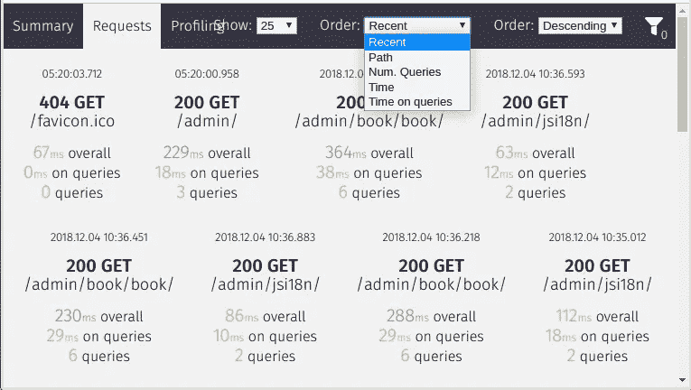

# 寻找高影响性能瓶颈— Django 提示

> 原文：<https://medium.com/hackernoon/finding-high-impact-performance-bottlenecks-django-tips-237a896e0f91>


Photo from Pexels.com

## 如何在 Django 中找到对应用程序性能有很大影响的瓶颈？

原载于[https://avilpage . com/2018/12/django-through-performance-scaling . html](https://avilpage.com/2018/12/django-bottleneck-performance-scaling.html)

## 介绍

在优化 web 应用程序的性能时，一个常见的错误是从优化最慢的页面(或 API)开始。除了考虑响应时间，我们还应该考虑它正在接收的流量，以确定优化顺序的优先级。

在本文中，我们将分析一个 Django web 应用程序，找到影响较大的性能瓶颈，然后开始优化它们以获得更好的性能。

## 压型

django-silk 是一个开源的分析工具，它拦截并存储 HTTP 请求数据。用 pip 安装。

```
pip install django-silk
```

将`silk`添加到已安装的应用程序中，并将 silk 中间件包含在 django 设置中。

```
MIDDLEWARE = [
    ...
    'silk.middleware.SilkyMiddleware',
    ...
]INSTALLED_APPS = (
    ...
    'silk'
)
```

运行迁移，以便 Silk 可以创建所需的数据库表来存储配置文件数据。

```
$ python manage.py makemigrations
$ python manage.py migrate
$ python manage.py collectstatic
```

在根 urlconf 中包含 silk urls 以查看配置文件数据。

```
urlpatterns += [url(r'^silk/', include('silk.urls', namespace='silk'))]
```

在 silk requests 页面上([http://localhost:8000/silk/requests/](https://avilpage.com/2018/12/django-bottleneck-performance-scaling.html#))，我们可以看到所有的请求，并按照总时间或在数据库中花费的时间对它们进行排序。



## 高影响瓶颈

Silk 创建了一个`silk_request`表，其中包含了 Django 处理的请求的信息。

```
$ pgclilibrary> \d silk_request;+--------------------+--------------------------+-------------+
| Column             | Type                     | Modifiers   |
|--------------------+--------------------------+-------------|
| id                 | character varying(36)    |  not null   |
| path               | character varying(190)   |  not null   |
| time_taken         | double precision         |  not null   |
...
```

我们可以通过`path`对这些请求数据进行分组，计算每条路径的请求数量、平均耗时和影响因子。由于我们考虑的是响应时间和流量，影响因子将是该路径的平均响应时间和请求数量的乘积。

```
library> SELECT
     s.*, round((s.avg_time * s.count)/max(s.avg_time*s.count) over ()::NUMERIC,2) as impact
 FROM
     (select path, round(avg(time_taken)::numeric,2) as avg_time, count(path) as count from silk_request group by PATH)
     s
 ORDER BY impact DESC;+-------------------------+------------+---------+----------+
| path                    | avg_time   | count   | impact   |
|-------------------------+------------+---------+----------|
| /point/book/book/       | 239.90     | 1400    | 1.00     |
| /point/book/data/       | 94.81      | 1900    | 0.54     |
| /point/                 | 152.49     | 900     | 0.41     |
| /point/login/           | 307.03     | 400     | 0.37     |
| /                       | 106.51     | 1000    | 0.32     |
| /point/auth/user/       | 494.11     | 200     | 0.29     |
...
```

我们可以看到`/point/book/book/`具有最高的影响力，尽管它既不是访问量最大的视图，也不是最慢的视图。优化这个视图首先会提高 web 应用程序的整体性能。

## 结论

在本文中，我们学习了如何分析 Django web 应用程序并识别瓶颈以提高性能。在下一篇文章中，我们将深入了解如何优化这些瓶颈。

更多关于 Django 的提示和技巧可以在 https://avilpage.com/tags/django-tips-tricks.html[找到](https://avilpage.com/tags/django-tips-tricks.html)